# Machine Learning by NG

### 1. Introduction

* Machine Learing
	- Grew out of work in AI
	- New capability for computers

* Examples:
	- Database mining
		- large datasets from growth of automation/web
		- E.g., Web click data, medical records, biology, engineering
	- Application can't program by hand
		- E.g., Autonomous helicopter, handwriting recignition, Natural Language Processing(NLP), Computer Vision
	- Self-customizing programs
		- E.g., Amazon, Netflix product recommendations
	- Understanding hunman learning(brain, real AI) 

* Machine Learning definition
	- Arthur Samuel (1959). Machine Learning: Field of study that gives computers the ability to learn without being explicitly programmed.
	- Tom Mitchell (1998). Well-posed Learning Problem: A computer program is said to learn from experience E with respect to some task T and some performance measure P, if its performance on T, as measured by P, improves with experience E.
	- E.g.
		- T: classifying emails as spam or not
		- E: watching you label emails as spam or not
		- P: the number of fraction of emails correctly classified as spam/not spam

* Machine learning algorithms
	- Supervised learning
	- Unsupervised learning
	- Others: reinforcement learning, recommender systems

* Supervised learning
	- "right answers" given
	- Regression: predict **continuous** valued output; e.g., housing price prediction
	- Classification: predict **discrete** valued output (0 or 1); e.g., cancer detection: malignant or benign

* Unsupervised learning
	- Clustering

### 2. Linear Regression with One Variable

* Model representation

	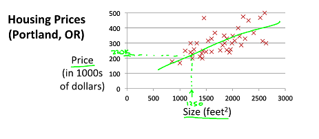

	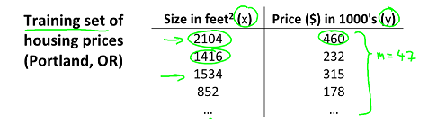

	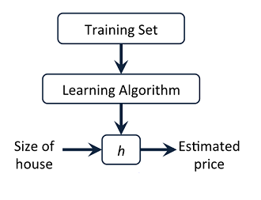

* Cost function

	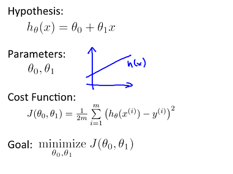
	
	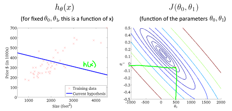

	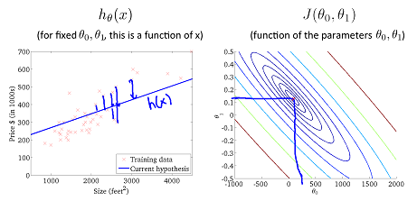

* Gradient descent

	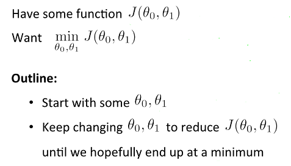

	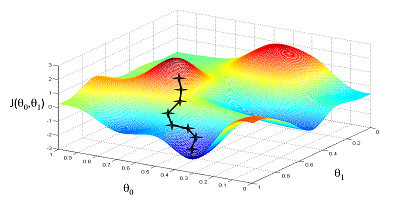

	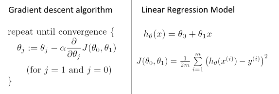
	
	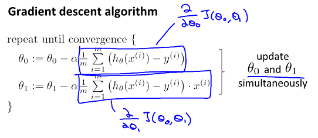

* Learning rate

	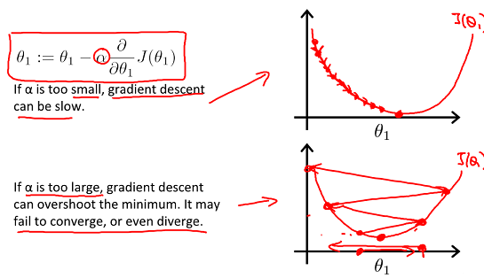

	- Gradient descent can converge to a local minimum, even with the learning rate fixed

### 3. Linear Algebra Review

...

### 4. Linear Regression with Multiple Variables 

##### Multiple Variables

* Gradient descent for multiple variables

	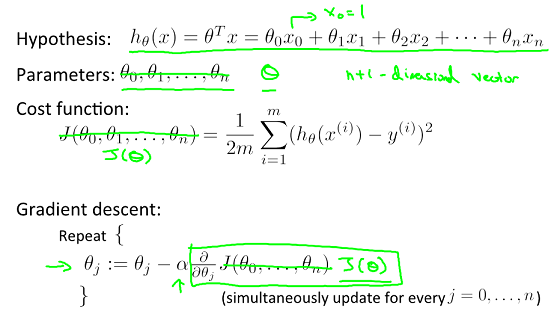

##### Gradient descent in practice

* Feature scaling

	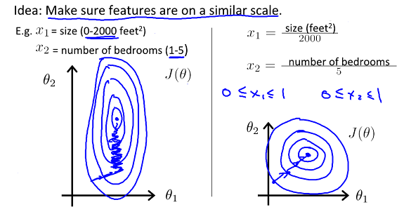

	- get every feature into approximately a [-1, 1] range

	- Mean normalization
	
	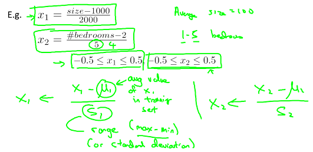
	

* Learning rate: making sure gradient desent is working correctly

	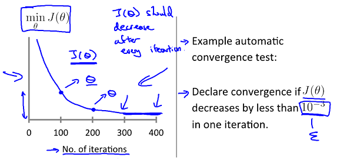

	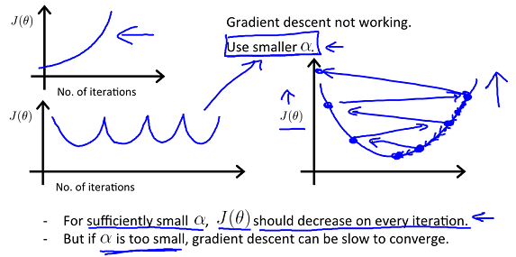
	
	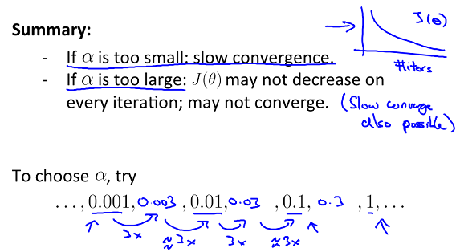
	

* Features and polynomial regression
	
	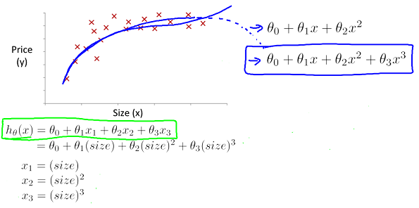

##### Normal equation

* Normal equation
	
	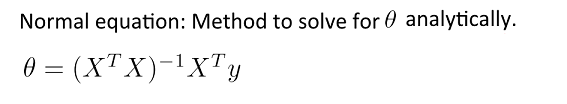

* Intuition
	
	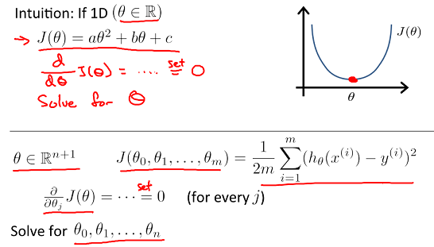

* Compared with gradient descent

	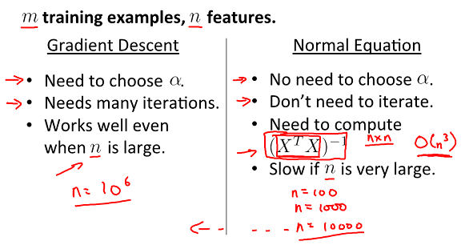
	
	
### 5. Octave Turorial

...

### 6. Logistic Regression

* Hypothesis representation

	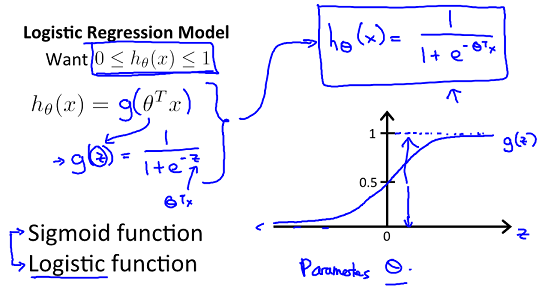

	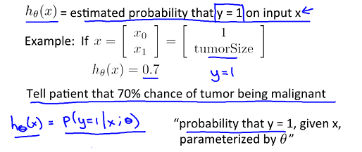

	
* Decision boundary

	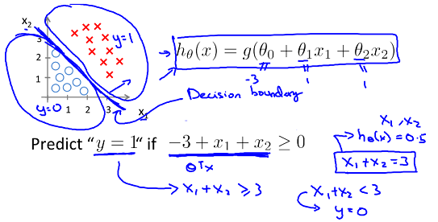

	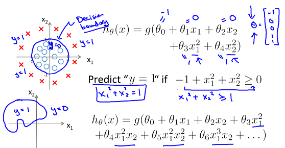

* Cost function

	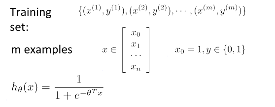

	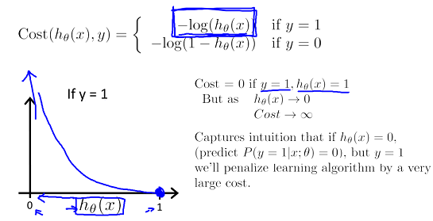

	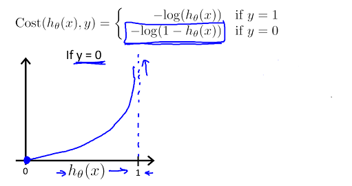

	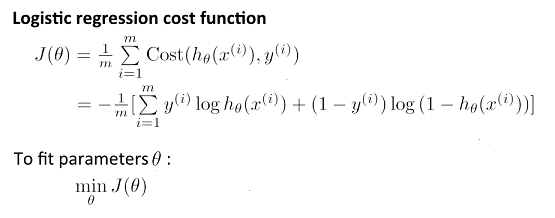

* Gradient descent

	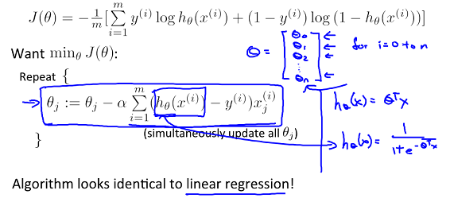
	

* Optimization algorithm

	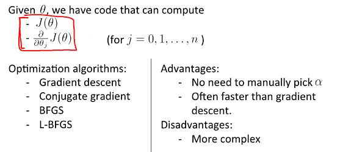

* Multi-class classification
	
	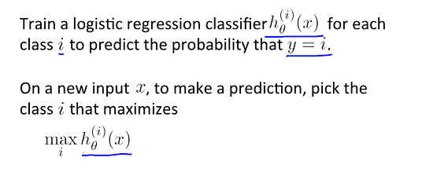
	
	

### 7. Regularization

* The problem of overfitting

	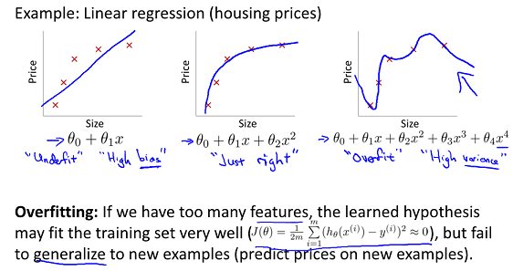

	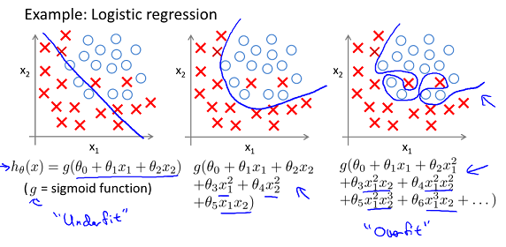

* Addressing overfitting

	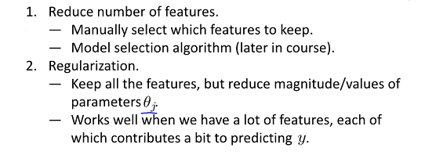

	
* Regularization 

	- Cost function

	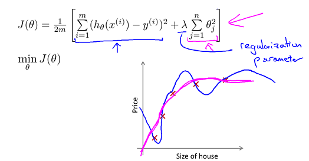

	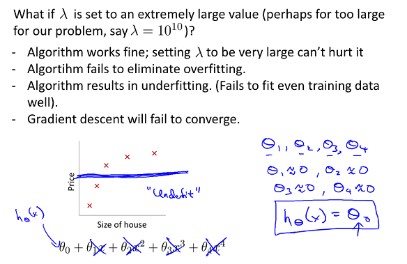

	- gradient descent

	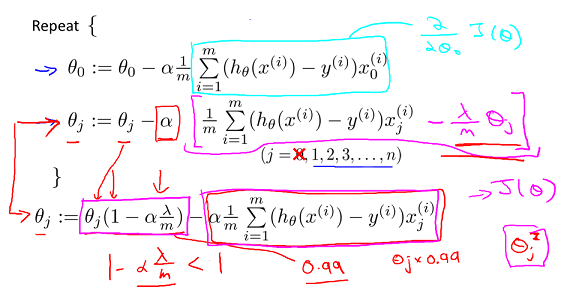

	- Regularized logistic regression

	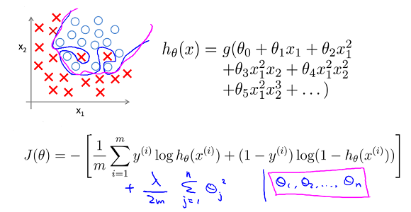
	
	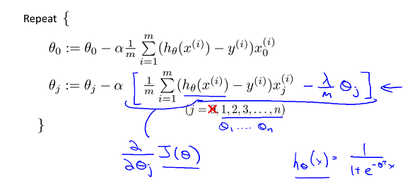

### 8. Neural Networks: Representation

* Non-linear hypotheses
	- Non-linear classification

* Neural Networks
	- Origins: algorihtms that try to mimic the brain
	- Was very widely used in 80s and early 90s; popularity diminished in late 90s
	- Recent resurgence: state-of-the-art technique for many applications

* Model representation

	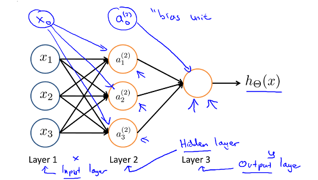

	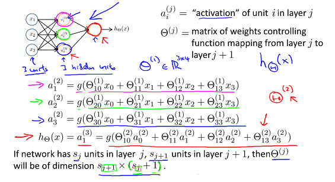

* Forward propagation

	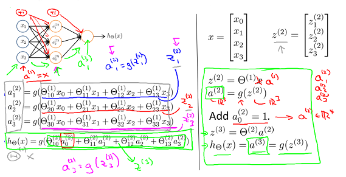

* Example and intuition

	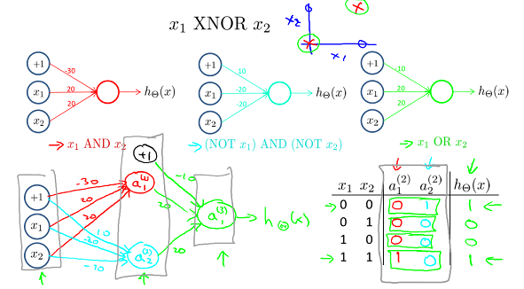

* Multi-class classification

	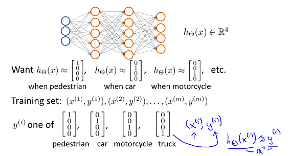

### 9. Nural Networks: Learning

* Cost function
	
	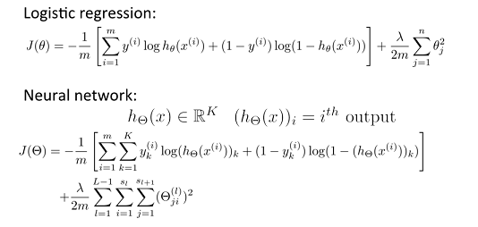

* Backpropagation algorithm

	- Forward propagation

	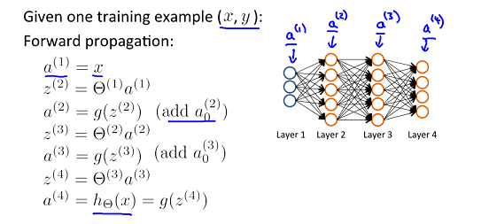

	- Backpropagation
	
	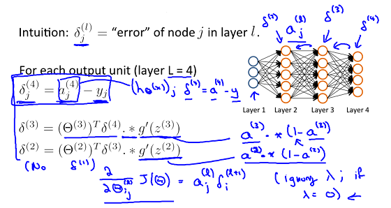

	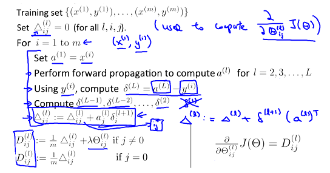

* Gradient checking

	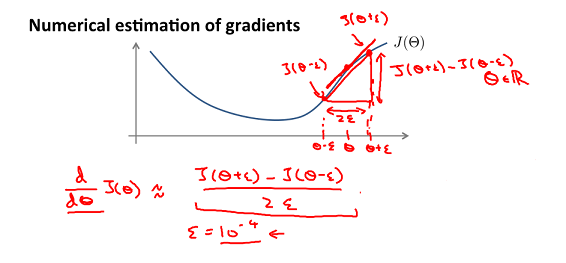

	

	

* Random initialization
	- Zero initialization: after each update, parameters corresponding to inputs going into each hidden units are identical
	- Random initialization: symmetry breaking

* Training a neural network

	- Pick a network architecture

	

	- Training a nerual network 
	
	

	
### 10. Advice for Applying Machine Learning

* Machine learning diagnostic
	- Diagnostic: a test that you can run to gain insight what is/isn't working with a learning algorithm, and gain guidance as to how best to improve its performance
	- Diagnostics can take time to implement, but doing so can be a very good use of your time

* Evaluating a hypothesis
	- training set & test set 

* Model selection and training/validation/test sets
	
	

	

	
	

* Diagnosing bias vs variance

	
	
	

	

* Regularization and bias/variance

	

	

	

	

	
* Learning curves

	

	

	
	

* Summary: deciding what to do next

	

	
* Neural networks and overfitting

	

### 11. Machine Learning System Design

* Error analysis
	- Recommended approach
		- Start with a simple algorithm that you can implement quickly. Implement it and test it on your cross-validation data
		- Plot learning curves to decide if more data, more feature, etc. are likely to help
		- Error analysis: Manually examine the examples in cross validation set that your algorithm made errors on. See if you spot any systematic trend in what type of examples it is making errors on
	- Error analysis may not be helpful for deciding if this is likely to improve performance. Only solution is to try it and see if it works; Need numerical evaluation of algorithm's performance

* Error metrics for skewed classes
	
	

	
* Trading off precision and recall
	
	

	

* Data for machine learning

	

	

### 12. Support Vector Machines

* Optimization objective
	
	

* Large margin intuition
	
	
	
	

* Kernels

	- Non-linear decision boundary

	

	

	

	

	

	

	

	

* Using an SVM

	

### 13. Clustering

* K-means algorithm

	

* Optimization objective

	

	
	

* Random initialization

	

	

	

* choosing the number of clusters

	

	

### 14. Dimensionality Reduction

* Motivation I: Data Compression

	

	
	

* Motivation II: Data Visualization

	
* Principal Component Analysis problem formulation
	
	

	
* Principal Component Analysis algorithm

	- Data preprocessing
	
	

	- PCA algorithm

	

	- Summary

	
	

* Reconstruction from compressed representation

	

* Choosing the number of principal components

	

### 15. Anomaly Detection

### 16. Recommender Systems

### 17. Large Scale Machine Learning

### 18. Application Example: Photo OCR

### 19. Conclusion

