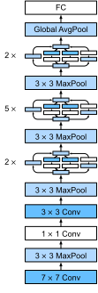

# Dive into Deep Learning

### 1. Introduction

### 2. Preliminaries

#### 2.1 Data Manipulation

#### 2.2 Data Preprocessing

#### 2.3 Linear Algebra

#### 2.4 Calculas

#### 2.5 AUtomatic Differentiation

#### 2.6 Probability and Statistics

### 3. Linear Neural Network for Regression

### 4. Linear Neural Networks for Classification

### 5. Multilayer Preceptions

### 6. Builder's Guide

#### 6.1 Layers and Modules

- Multiple **layers** are combined into **modules**, forming repeating patterns of larger models

  - Layers are modules
  - layers can comprise a module, modules can comprise a module

- basic functionality of module

  - Ingest input data as arguments to its forward propagation method
  - Generate output by the forward propagation method
  - Calculate the gradient via backpropagation
  - Store and provide access to the parameters
  - Initialize model parameters

  ```python
  class MLP(nn.Module):
    	def __init__(self):
      	super().__init__()
    		self.hidden = nn.LazyLinear(256)
    		self.out = nn.LazyLinear(10)
    	def forward(self, X):
        return self.out(F.relu(self.hidden(X)))
      
  net = MLP()
  ```

  ```python
  class MySequential(nn.Module):
  	def __init__(self, *args):
      super().__init__()
      for idx, module in enumerate(args):
        self.add_module(str(idx), module)
  	def forward(self, X):
      for module in self.children():
        X = module(X)
       return X
    
  net = MySequential(nn.LazyLayer(256), nn.ReLU(), nn.LazyLinear(10))
  ```

- nn.Module
  - add_module()
  - children()

#### 6.2 Parameter Management

- Parameter Access

  - targeted parameters 

  ```python
  net = nn.Sequential(nn.LazyLinear(8), 
                      nn.ReLU(),
                      nn.LazyLinear(1))
  # access layer by index
  net[2].state_dict()
  type(net[2].bias) # torch.nn.parameter.Parameter
  net[2].bias.data
  net[2].weight.grad
  ```

  - all parameters at once

  ```python
  [(name, param.shape) for name, param in net.named_parameters()]
  net.parameters()
  ```

- Tied Parameters

  - Share parameters across multiple layers

  ```python
  shared_linear_8 = nn.LazyLinear(8)
  net = nn.Sequential(nn.LazyLinear(8), nn.ReLU(),
                      shared_linear_8, nn.ReLU(),
                      shared_linear_8, nn.ReLU(),
                      nn.LazyLinear(1))
  net(X) # need run the forward propagation net(X) before accessing the parameters
  net[2].weight.data[0] == net[4].weight.data[0]
  net[2].weight.data[0, 0] = 100
  net[2].weight.data[0] == net[4].weight.data[0]
  ```

#### 6.3 Parameter Initialization

- Built-in initialization

  - nn.init

  ```python
  net = nn.Sequential(nn.LazyLinear(8), nn.ReLU(), nn.LazyLinear(1))
  def init_normal(module):
    if type(module) == nn.Linear:
      nn.init.normal_(module.weight, mean=0, std=0.01)
      nn.init.zeros_(module.bias)
  net.apply(init_normal)
  ```

  ```python
  # apply different initializers for certain blocks
  def init_xavier(module):
    if type(module) == nn.Linear:
      nn.init.xavier_uniform_(module.weight)
      nn.init.zeros_(module.bias)
  net[0].apply(init_xavier)
  net[1].apply(init_normal)
  ```

- Custom initialization

#### 6.4 Lazy Initialization

- define the network architecture without specifying the input dimensionality

- defers initialization

- Convenient and making it easy to modify model architectures  

  ```python
  net = nn.Sequential(nn.lazyLinear(256), nn.ReLU(), nn.LazyLinear(10))
  net[0].weight # output: <UninitializedParameter>
  x = torch.rand(2, 20)
  net(X)
  net[0].weight.shape #output: torch.size([256, 20])
  ```

  ```python
  @d2l.add_to_class(dl2.Module)
  def apply_init(self, inputs, init=None):
    '''passes in dummy inputs to infer all parameter shapes
       and subsequently initializer the parameters.'''
    self.forward(*inputs)
    if init is not None:
      self.net.apply(init)
  ```

#### 6.5 Custom Layers

- Layers without parameters

  - Inherit from the base layer and implement the forward propagation function

  ```python
  class CenteredLayer(nn.Module):
  	def __init__(self):
      super().__init__()
    def foeword(self, X):
      return X - X.mean()
  ```

- Layers with Parameters

  - use built-in functions to create parameters
  - govern access, initialization, sharing, and loading model parameters 

  ```python
  class MyLinear(nn.Module):
    def __init__(self, in_units, units):
      super().__init__()
      self.weight = nn.Parameter(torch.randn(in_units, units))
      self.bias = nn.Parameter(torch.randn(units,))
    def forward(self, X):
      linear = torch.matmul(X, self.weight.data) + self.bias.data
      return F.relu(linear)
  ```

#### 6.6 File I/O

- loading and saving tensors

  - torch.save(tensors, file_path)
  - torch.load(file_path)

  ```python
  x1 = torch.arange(4)
  torch.save(x1, 'x-file')
  x2 = torch.load('x-file')
  y1 = torch.zeros(4)
  torch.save([x1, y1], 'xy-file')
  x2, y2 = torch.load('xy-file')
  my_dic_1 = {'x': x1, 'y': y1}
  torch.save(my_dic_1, 'dict-file')
  my_dic_2 = torch.load('dict-file')
  ```

- Loading and saving model parameters

  - torch.save(model.state_dict(), file_path)
  - model.load_state_dict(torch.load(file_path))

  ```python
  class MLP(nn.Module):
    def __init__():
      super().__init__()
      self.hidden = nn.LazyLinear(256)
      self.output = nn.LazyLinear(10)
    def forward(self, x):
      return self.output(F.relu(self.hidden(x)))
    
  net = MLP()
  X = torch.randn(2, 20)
  Y = net(X)
  torch.save(net.state_dict(), 'mlp.params')
  
  clone = MLP()
  clone.load_state_dict(torch.load('mlp.params'))
  #clone.eval()
  ```

#### 6.7 GPUs

- Computing devices

  ```python
  torch.cuda.device_count() # get number of available GPUs
  torch.device('cpu')
  torch.device('cuda:0')
  torch.device('cuda:1')
  
  def try_gpu(i=0):
    if torch.cuda.device_count() >= i + 1:
      return torch.device(f'cuda:{i}')
  	return torch.device('cpu')
  
  def try_all_gpus():
    return [torch.device(f'cuda:{i}') 
            for i in range(torch.cuda.device_count())]
  ```

- Tensors and GPUs

  ```python
  x1 = torch.tensor([1, 2, 3])
  x1.device # device(type='cpu')
  # 1. specify a storage device when creating a tensor
  x2 = torch.ones(2, 3, device=try_gpu())
  x2 # tensor([...], device='cuda:0')
  x3 = torch.rand(2, 3, device=try_gpu(1))
  x3 # tensor([...], device='cuda:1')
  # 2. copy data to perform operation on the same device
  x4 = x2.cuda(1)
  x5 = x3 + x4
  ```

- Note: transfering variables between devices is slow!

  - when we print tensors or convert tensors to the NumPy format, the framework will copy it to the main memory first

- Neural Networks and GPUs

  ```python
  net = nn.Sequential(nn.LazyLinear(1))
  net = net.to(device=try_gpu())
  net(X)
  ```

  ```python
  @d2l.add_to_class(d2l.Trainer)
  def __init__(self, max_epochs, num_gpus, gradient_clip_val=0):
  	self.save_hyperparameters()
    self.gpus = [d2l.gpu(i) for i in range(min(num_gpus, d2l.num_gpus()))]
  
  @d2l.add_to_class(d2l.Trainer)
  def prepare_batch(self, batch):
    if self.gpus:
      batch = [a.to(self.gpus[0] for a in batch)]
  	return batch
  
  @d2l.add_to_class(d2l.Trainer)
  def prepare_model(self, model):
    model.trainer = self
    model.board.xlim = [0, self.max_epochs]
    if self.gpus:
      model.to(self.gpus[0])
  	self.model = model
  ```

  

### 7. Convolutional Neural Networks

- From Fully Connected Layers to Convolutions
  - 对全连接层使用**平移不变性**和**局部性**得到卷积层

- Convolutions for Images

- Paddings and Stride

  - Paddings：控制输出形状的减少量
  - Stride：每次滑动核窗口的行/列的步长，可成倍的减少输出形状

- Multiple Input and Multiple Output Channels

  - 每个通道都有一个卷积核，结果是所有通道卷积核结果的和

  

  - 可以有多个三维卷积核，每个核生成一个输出通道
  - Input X shape：ci * nh * nw
  - Kernel shape: co * ci * kh * kw
  - Output Y shape:  co * mh * mw

- 1 x 1 Conv

  - 1x1 卷积不识别空间模式，只是融合通道

- Pooling

  - Max pooling，Average pooling
  - 缓解卷积层对位置的敏感性
  - 超参数：窗口大小，padding，stride

- LeNet：Convolutional Neural Networks

  

  - LeNet 是早期成功的神经网络
  - 先使用卷积来学习图片空间信息，然后使用全连接层来转换到类别空间

### 8. Modern Convolutional Neural Networks

#### 8.1 AlexNet: Deep Convolutional Neural Networks


```python
class AlexNet(d2l.Classifier):
    def __init__(self, lr=0.1, num_classes=10):
        super().__init__()
        self.save_hyperparameters()
        self.net = nn.Sequential(
            nn.LazyConv2d(96, kernel_size=11, stride=4, padding=1),
            nn.ReLU(), nn.MaxPool2d(kernel_size=3, stride=2),
            nn.LazyConv2d(256, kernel_size=5, padding=2), nn.ReLU(),
            nn.MaxPool2d(kernel_size=3, stride=2),
            nn.LazyConv2d(384, kernel_size=3, padding=1), nn.ReLU(),
            nn.LazyConv2d(384, kernel_size=3, padding=1), nn.ReLU(),
            nn.LazyConv2d(256, kernel_size=3, padding=1), nn.ReLU(),
            nn.MaxPool2d(kernel_size=3, stride=2), nn.Flatten(),
            nn.LazyLinear(4096), nn.ReLU(), nn.Dropout(p=0.5),
            nn.LazyLinear(4096), nn.ReLU(),nn.Dropout(p=0.5),
            nn.LazyLinear(num_classes))
        self.net.apply(d2l.init_cnn)
```

```
AlexNet().layer_summary((1, 1, 224, 224)):

Conv2d output shape:	 torch.Size([1, 96, 54, 54])
ReLU output shape:	 torch.Size([1, 96, 54, 54])
MaxPool2d output shape:	 torch.Size([1, 96, 26, 26])
Conv2d output shape:	 torch.Size([1, 256, 26, 26])
ReLU output shape:	 torch.Size([1, 256, 26, 26])
MaxPool2d output shape:	 torch.Size([1, 256, 12, 12])
Conv2d output shape:	 torch.Size([1, 384, 12, 12])
ReLU output shape:	 torch.Size([1, 384, 12, 12])
Conv2d output shape:	 torch.Size([1, 384, 12, 12])
ReLU output shape:	 torch.Size([1, 384, 12, 12])
Conv2d output shape:	 torch.Size([1, 256, 12, 12])
ReLU output shape:	 torch.Size([1, 256, 12, 12])
MaxPool2d output shape:	 torch.Size([1, 256, 5, 5])
Flatten output shape:	 torch.Size([1, 6400])
Linear output shape:	 torch.Size([1, 4096])
ReLU output shape:	 torch.Size([1, 4096])
Dropout output shape:	 torch.Size([1, 4096])
Linear output shape:	 torch.Size([1, 4096])
ReLU output shape:	 torch.Size([1, 4096])
Dropout output shape:	 torch.Size([1, 4096])
Linear output shape:	 torch.Size([1, 10])
```

- Summary
  - 更大更深的LeNet，10x参数个数，260x计算复杂度
  - 引入 dropout，ReLU，MaxPooling，和 Data Augmentation
  - Win 2012 ImageNet，标志新一轮神经网络热潮开始
  - 计算机视觉方法论的改变

#### 8.2 VGG: Networks Using Blocks


```python
def vgg_block(num_convs, out_channels):
    layers = []
    for _ in range(num_convs):
        layers.append(nn.LazyConv2d(out_channels, kernel_size=3, padding=1))
        layers.append(nn.ReLU())
    layers.append(nn.MaxPool2d(kernel_size=2,stride=2))
    return nn.Sequential(*layers)
  
class VGG(d2l.Classifier):
    def __init__(self, arch, lr=0.1, num_classes=10):
        super().__init__()
        self.save_hyperparameters()
        conv_blks = []
        for (num_convs, out_channels) in arch:
            conv_blks.append(vgg_block(num_convs, out_channels))
        self.net = nn.Sequential(
            *conv_blks, 
          	nn.Flatten(),
            nn.LazyLinear(4096), nn.ReLU(), nn.Dropout(0.5),
            nn.LazyLinear(4096), nn.ReLU(), nn.Dropout(0.5),
            nn.LazyLinear(num_classes))
        self.net.apply(d2l.init_cnn)
```

```
VGG(arch=((1, 64), (1, 128), (2, 256), (2, 512), (2, 512))).layer_summary((1, 1, 224, 224)):

Sequential output shape:	 torch.Size([1, 64, 112, 112])
Sequential output shape:	 torch.Size([1, 128, 56, 56])
Sequential output shape:	 torch.Size([1, 256, 28, 28])
Sequential output shape:	 torch.Size([1, 512, 14, 14])
Sequential output shape:	 torch.Size([1, 512, 7, 7])
Flatten output shape:	 torch.Size([1, 25088])
Linear output shape:	 torch.Size([1, 4096])
ReLU output shape:	 torch.Size([1, 4096])
Dropout output shape:	 torch.Size([1, 4096])
Linear output shape:	 torch.Size([1, 4096])
ReLU output shape:	 torch.Size([1, 4096])
Dropout output shape:	 torch.Size([1, 4096])
Linear output shape:	 torch.Size([1, 10])
```

- 更大更深的AlexNet，重复的 VGG 块

#### 8.3 NiN: Network in Network


```python
def nin_block(out_channels, kernel_size, strides, padding):
    return nn.Sequential(
        nn.LazyConv2d(out_channels, kernel_size, strides, padding), nn.ReLU(),
        nn.LazyConv2d(out_channels, kernel_size=1), nn.ReLU(),
        nn.LazyConv2d(out_channels, kernel_size=1), nn.ReLU())
    
class NiN(d2l.Classifier):
    def __init__(self, lr=0.1, num_classes=10):
        super().__init__()
        self.save_hyperparameters()
        self.net = nn.Sequential(
            nin_block(96, kernel_size=11, strides=4, padding=0),
            nn.MaxPool2d(3, stride=2),
            nin_block(256, kernel_size=5, strides=1, padding=2),
            nn.MaxPool2d(3, stride=2),
            nin_block(384, kernel_size=3, strides=1, padding=1),
            nn.MaxPool2d(3, stride=2),
            nn.Dropout(0.5),
            nin_block(num_classes, kernel_size=3, strides=1, padding=1),
            nn.AdaptiveAvgPool2d((1, 1)),
            nn.Flatten())
        self.net.apply(d2l.init_cnn)
```

```
NiN().layer_summary((1, 1, 224, 224)):

Sequential output shape:	 torch.Size([1, 96, 54, 54])
MaxPool2d output shape:	 torch.Size([1, 96, 26, 26])
Sequential output shape:	 torch.Size([1, 256, 26, 26])
MaxPool2d output shape:	 torch.Size([1, 256, 12, 12])
Sequential output shape:	 torch.Size([1, 384, 12, 12])
MaxPool2d output shape:	 torch.Size([1, 384, 5, 5])
Dropout output shape:	 torch.Size([1, 384, 5, 5])
Sequential output shape:	 torch.Size([1, 10, 5, 5])
AdaptiveAvgPool2d output shape:	 torch.Size([1, 10, 1, 1])
Flatten output shape:	 torch.Size([1, 10])
```

- NiN 块
  - 一个卷积层 + 两个 1x1卷积层
  - 1x1 卷积层：输出形状跟卷积层输出一样，起到全连接层的作用；对像素增加了非线性性
- NiN 架构
  - 无全连接层
  - 交替使用 NiN 块和步幅为2的最大池化层：逐步减小高宽和增大通道数
  - 最后使用全局平均池化层得到输出
    - 通道数为类别个数
    - 代替全连接层：不容易过拟合，更少参数个数 

#### 8.4 GoogLeNet: Multi-Branch Networks




```python
class Inception(nn.Module):
    # c1--c4 are the number of output channels for each branch
    def __init__(self, c1, c2, c3, c4, **kwargs): 
        super(Inception, self).__init__(**kwargs)
        # Branch 1
        self.b1_1 = nn.LazyConv2d(c1, kernel_size=1)
        # Branch 2
        self.b2_1 = nn.LazyConv2d(c2[0], kernel_size=1)
        self.b2_2 = nn.LazyConv2d(c2[1], kernel_size=3, padding=1)
        # Branch 3
        self.b3_1 = nn.LazyConv2d(c3[0], kernel_size=1)
        self.b3_2 = nn.LazyConv2d(c3[1], kernel_size=5, padding=2)
        # Branch 4
        self.b4_1 = nn.MaxPool2d(kernel_size=3, stride=1, padding=1)
        self.b4_2 = nn.LazyConv2d(c4, kernel_size=1)
    def forward(self, x):
        b1 = F.relu(self.b1_1(x))
        b2 = F.relu(self.b2_2(F.relu(self.b2_1(x))))
        b3 = F.relu(self.b3_2(F.relu(self.b3_1(x))))
        b4 = F.relu(self.b4_2(self.b4_1(x)))
        return torch.cat((b1, b2, b3, b4), dim=1)
      
class GoogleNet(d2l.Classifier):
    def b1(self):
        return nn.Sequential(
            nn.LazyConv2d(64, kernel_size=7, stride=2, padding=3),
            nn.ReLU(), nn.MaxPool2d(kernel_size=3, stride=2, padding=1))
    def b2(self):
        return nn.Sequential(
            nn.LazyConv2d(64, kernel_size=1), nn.ReLU(),
            nn.LazyConv2d(192, kernel_size=3, padding=1), nn.ReLU(),
            nn.MaxPool2d(kernel_size=3, stride=2, padding=1))
    def b3(self):
        return nn.Sequential(
            Inception(64, (96, 128), (16, 32), 32),
            Inception(128, (128, 192), (32, 96), 64),
            nn.MaxPool2d(kernel_size=3, stride=2, padding=1))
    def b4(self):
        return nn.Sequential(
            Inception(192, (96, 208), (16, 48), 64),
            Inception(160, (112, 224), (24, 64), 64),
            Inception(128, (128, 256), (24, 64), 64),
            Inception(112, (144, 288), (32, 64), 64),
            Inception(256, (160, 320), (32, 128), 128),
            nn.MaxPool2d(kernel_size=3, stride=2, padding=1))
    def b5(self):
        return nn.Sequential(
            Inception(256, (160, 320), (32, 128), 128),
            Inception(384, (192, 384), (48, 128), 128),
            nn.AdaptiveAvgPool2d((1,1)), nn.Flatten())
    def __init__(self, lr=0.1, num_classes=10):
        super(GoogleNet, self).__init__()
        self.save_hyperparameters()
        self.net = nn.Sequential(
            self.b1(), self.b2(), self.b3(), self.b4(), self.b5(), 
            nn.LazyLinear(num_classes))
        self.net.apply(d2l.init_cnn)
```

```
model = GoogleNet().layer_summary((1, 1, 96, 96)):

Sequential output shape:	 torch.Size([1, 64, 24, 24])
Sequential output shape:	 torch.Size([1, 192, 12, 12])
Sequential output shape:	 torch.Size([1, 480, 6, 6])
Sequential output shape:	 torch.Size([1, 832, 3, 3])
Sequential output shape:	 torch.Size([1, 1024])
Linear output shape:	 torch.Size([1, 10])
```

- Inception 块
  - 用4条有不同超参数的卷积层和池化层来抽取不同的信息
  - 使用 1x1 Conv 降低通道数来控制模型复杂度
  - 模型参数小，计算复杂度低
- GoogLeNet
  - 使用了5段，9个 Inception 块，第一个达到上百层的网络

- 后续变种
  - Inception-BN (V2)：使用 batch normalization
  - Inception-V3：
    - 替换 5x5 为多个 3x3 卷积层
    - 替换 5x5 为 1x7 和 7x1 卷积层
    - 替换 3x3 为 1x3 和 3x1 卷积层
    - 更深
  - Inception-V4：使用残差连接

#### 8.5 Batch Normalization

- Batch Normalization
  - 固定小批量中的均值和方差，学习出适合的偏移 ( gamma ) 和缩放 ( beta )
  - 可以加快收敛速度，一般不改变模型精度
  - 通过在每个小批量里加入噪音来控制模型复杂度
  - 没必要和 Dropout 混合使用
- BN 层
  - 可学习参数：gamma，beta
  - 作用在
    - 全连接层和卷积层输出上，激活函数前
    - 全连接层和卷积层输入上
  - 对全连接层，作用在特征维
  - 对卷积层，作用在通道维

```python
def batch_norm(X, gamma, beta, moving_mean, moving_var, eps, momentum):
    # Use is_grad_enabled to determine whether we are in training mode
    if not torch.is_grad_enabled():
        # In prediction mode, use mean and variance obtained by moving average
        X_hat = (X - moving_mean) / torch.sqrt(moving_var + eps)
    else:
        assert len(X.shape) in (2, 4)
        if len(X.shape) == 2:
            # When using a fully connected layer, calculate the mean and
            # variance on the feature dimension
            mean = X.mean(dim=0)
            var = ((X - mean) ** 2).mean(dim=0)
        else:
            # When using a two-dimensional convolutional layer, calculate the
            # mean and variance on the channel dimension (axis=1). Here we
            # need to maintain the shape of X, so that the broadcasting
            # operation can be carried out later
            mean = X.mean(dim=(0, 2, 3), keepdim=True)
            var = ((X - mean) ** 2).mean(dim=(0, 2, 3), keepdim=True)
        # In training mode, the current mean and variance are used
        X_hat = (X - mean) / torch.sqrt(var + eps)
        # Update the mean and variance using moving average
        moving_mean = (1.0 - momentum) * moving_mean + momentum * mean
        moving_var = (1.0 - momentum) * moving_var + momentum * var
    Y = gamma * X_hat + beta  # Scale and shift
    return Y, moving_mean.data, moving_var.data
  
class BatchNorm(nn.Module):
    # num_features: the number of outputs for a fully connected layer or the
    # number of output channels for a convolutional layer. num_dims: 2 for a
    # fully connected layer and 4 for a convolutional layer
    def __init__(self, num_features, num_dims):
        super().__init__()
        if num_dims == 2:
            shape = (1, num_features)
        else:
            shape = (1, num_features, 1, 1)
        # The scale parameter and the shift parameter (model parameters) are
        # initialized to 1 and 0, respectively
        self.gamma = nn.Parameter(torch.ones(shape))
        self.beta = nn.Parameter(torch.zeros(shape))
        # The variables that are not model parameters are initialized to 0 and
        # 1
        self.moving_mean = torch.zeros(shape)
        self.moving_var = torch.ones(shape)

    def forward(self, X):
        # If X is not on the main memory, copy moving_mean and moving_var to
        # the device where X is located
        if self.moving_mean.device != X.device:
            self.moving_mean = self.moving_mean.to(X.device)
            self.moving_var = self.moving_var.to(X.device)
        # Save the updated moving_mean and moving_var
        Y, self.moving_mean, self.moving_var = batch_norm(
            X, self.gamma, self.beta, self.moving_mean,
            self.moving_var, eps=1e-5, momentum=0.1)
        return Y
```

#### 8.6 ResNet: Residual Networks

- Residual Block
  - 加入快速通道来得到：f(x) = g(x) + x
- ResNet
  - 架构：类似 VGG 和 GoogLeNet 的总体架构哦，但替换成了 ResNet 块
  - 残差块使得很深的网络更加容易训练，甚至可以训练一千层的网络
  - 对随后的深层神经网络设计产生了深远影响


```python
class Residual(nn.Module):
    def __init__(self, num_channels, use_1x1conv=False, strides=1):
        super().__init__()
        self.conv1 = nn.LazyConv2d(num_channels, kernel_size=3, padding=1,
                                   stride=strides)
        self.conv2 = nn.LazyConv2d(num_channels, kernel_size=3, padding=1)
        if use_1x1conv:
            self.conv3 = nn.LazyConv2d(num_channels, kernel_size=1,
                                       stride=strides)
        else:
            self.conv3 = None
        self.bn1 = nn.LazyBatchNorm2d()
        self.bn2 = nn.LazyBatchNorm2d()
    def forward(self, X):
        Y = F.relu(self.bn1(self.conv1(X)))
        Y = self.bn2(self.conv2(Y))
        if self.conv3:
            X = self.conv3(X)
        Y += X
        return F.relu(Y)
      
class ResNet(d2l.Classifier):
    def b1(self):
        return nn.Sequential(
            nn.LazyConv2d(64, kernel_size=7, stride=2, padding=3),
            nn.LazyBatchNorm2d(), nn.ReLU(),
            nn.MaxPool2d(kernel_size=3, stride=2, padding=1))
    def block(self, num_residuals, num_channels, first_block=False):
        blk = []
        for i in range(num_residuals):
            if i == 0 and not first_block:
                blk.append(Residual(num_channels, use_1x1conv=True, strides=2))
            else:
                blk.append(Residual(num_channels))
        return nn.Sequential(*blk)
    def __init__(self, arch, lr=0.1, num_classes=10):
        super(ResNet, self).__init__()
        self.save_hyperparameters()
        self.net = nn.Sequential(self.b1())
        for i, b in enumerate(arch):
            self.net.add_module(f'b{i+2}', self.block(*b, first_block=(i==0)))
        self.net.add_module('last', nn.Sequential(
            nn.AdaptiveAvgPool2d((1, 1)), nn.Flatten(),
            nn.LazyLinear(num_classes)))
        self.net.apply(d2l.init_cnn)

class ResNet18(ResNet):
    def __init__(self, lr=0.1, num_classes=10):
        super().__init__(
            ((2, 64), (2, 128), (2, 256), (2, 512)),
            lr, num_classes)
```

```
ResNet18().layer_summary((1, 1, 96, 96)):

Sequential output shape:	 torch.Size([1, 64, 24, 24])
Sequential output shape:	 torch.Size([1, 64, 24, 24])
Sequential output shape:	 torch.Size([1, 128, 12, 12])
Sequential output shape:	 torch.Size([1, 256, 6, 6])
Sequential output shape:	 torch.Size([1, 512, 3, 3])
Sequential output shape:	 torch.Size([1, 10])
```

#### 8.7 DenseNet: Densely Connected Networks

 

### 9. Recurrent Neural Networks

#### Outlines

- Working with Sequences
- Converting raw text into sequence data
- Language models
- Recurrent Nerual Network
- Recurrent Nerual Network implementation from scratch 
- Concise implementation of Recurrent Nerual Networks
- Backpropagation through time

#### 序列数据

- 序列数据
  - 时序模型中，当前数据跟之前观察到的数据相关
  - 自回归模型使用自身过去数据来预测未来
  - 马尔科夫模型假设当前只跟最近少数数据相关，从而简化模型
  - 潜变量模型使用潜变量来概括历史信息
- 统计工具
  - 在时间 t 观察到 xt，那么得到 T 个不独立随机变量 （x1, x2, ... xt）~ p(X)
  - 条件概率展开：p(a, b) = p(a)p(b|a) = p(b)p(a|b)
  - P(X) = P(x1) * p(x2|x1) * p(x3|x1,x2) ... p(xT|x1, ..., xt-1)
- 方案A：马尔科夫假设
  - 假设当前数据只跟tao个过去数据点相关
  - P(xt|x1,...xt-1) = p(xt|xt-tao, ... xt-1)
- 方案B：潜变量模型
  - 引入潜变量ht来表示过去信息 ht = f(x1, ..., xt-1)
  - xt = p(xt|ht)

#### 语言模型

- 语言模型
  - 语言模型估计文本序列的联合概率
  - 给定文本序列x1, x2, ..., xt，语言模型的目标是估计联合概率p(x1, ..., xt)
  - 使用统计方法时，常采用 n 元语法
- 应用场景
  - 预训练模型，e.g.，BERT，GPT
  - 生产文本，给定前几个词，使用xt ～ p(xt | x1, .., xt-1) 来生成后续文本
  - 判断多个序列中哪个更常见
- 使用计数建模
  - N元语法

#### 循环神经网络

- 循环神经网络
  - 循环神经网络的输出取决于当前输入和前一时间的隐变量
  - 应用到语言模型中时，循环神经网络根据当前词预测下一时刻词
  - 通常使用困惑度（perplexity）来衡量语言模型的好坏
    - 1 表示完美，无穷大 是最差情况

### 10. Modern Recurrent Neural Networks

#### Outlines

- LSTM: Long Short-Term Memory
- GRU: Gated Recurrent Units
- Deep Recurrent Neural Networks
- Bidirectional Recurrent Neural Networks
- Machine Translation and the Dataset
- The Encoder-Decoder Architecture
- Encoder-Decoder Seq2Seq for Machine Translation
- Beam search

#### GRU

#### LSTM

#### 深层循环神经网络

#### 双向循环神经网络

#### 编码器-解码器架构

- 使用编码器-解码器架构的模型，编码器负责表示输入，解码器负责输出

  

#### 序列到序列学习

- Seq2Seq

  - Seq2Seq 从一个句子生成另一个句子

  - 编码器和解码器都是 RNN

  - 将编码器最后时刻的隐状态来初始解码器隐状态来完成信息传递

  - 常用 BLEU 来衡量生产序列的好坏

#### 束搜索

### 11. Attention Mechanisms and Transformers

#### 11.1 Queries, Keys and Values


#### 11.2 Attention Pooling by Similarity

- Kernels

  

```python
def gaussin(x):
    return torch.exp(-x**2 / 2)

def boxcar(x):
    return torch.abs(x) < 1.0
  
def constant(x):
    return 1.0 + 0 * x
  
def epanechikov():
    return torch.max(1 - torch.abs(x), torch.zeros_like(x))
```


#### 11.3 Attention Scoring Functions


- Masked softmax
- Batch matrix multiplication

- Scaled dot-product attention

- Additive Attention


#### 11.4 The Bahdanau Attention Mechanism


#### 11.5 Multi-head Attention

- Multi-head attention
  - combines knowledge of the same attention pooling via different representation subspaces of queries, keys, and values

#### 11.6 Self-Attention and Positional Encoding

#### 11.7 The Transformer Architect

#### 11.8 Large-Scale Pretraining with Transformers

#### 注意力机制

- 随意线索
  - 卷积，全连接，池化层只考虑不随意线索
  - 注意力机制考虑随意线索
    - 随意线索被称为：查询（query）
    - 每个输入是一个值（value）和不随意线索（key）的对
    - 通过注意力池化层来**有偏向性**的选择某些输入
- 非参注意力池化层
  - Nadaraya-Watson 核回归
- 参数化注意力机制

#### 注意力分数

- 注意力分数是 query 和 key 的相似度，注意力权重是分数的 softmax 结果
- 两种常见的分数计算
  - Scaled Dot-Product Attention
    - query 和 key 做内积
  - Additive Attention
    - 将 query 和 key 合并起来，进入一个单输出单隐藏层的 MLP

#### 使用注意力机制的Seq2Seq

- 动机
  - 机器翻译中，每个生成的词可能相关于句子中不同的词
  - Seq2Seq 模型中不能对此直接建模
- 加入注意力
  - 编码器对每次词的输出作为 key 和 value
  - 解码器 RNN 对上一个词的输出是 query
  - 注意力的输出和下一个词的词嵌入合并进入
- 注意力机制可以根据解码器 RNN 的输出来匹配到合适的编码器 RNN 的输出来更有效的传递信息

#### 自注意力

- 自注意力池化层将 Xi 当作key，value，query来对序列抽取特征

- 完全并行，最长序列为1，但对长序列计算复杂度高

  

  

- 位置编码

  - 在输入中加入位置信息，使得自注意力能够记忆位置信息
  - 相对位置信息 

#### Transformer

#### BERT 预训练

#### BERT 微调

### 12. Optimization Algorithms

### 13. Computational Performance

### 14. Computer Vision

### 15. Natural Language Processing: Pretraining

#### 15.1 Word Embedding (word2vec)

- One-Hot vectors are bas choice
- Self-supervised word2vec
  - Word vectors: feature vectors or representations of words
  - Word Embedding: technique of mapping words to real vectors 
- The Skip-Gram Model
  - Assumes that a word can be used to generate its surrounding words in a text sequence
- The Continuous Bag of Words (CBOW) Model
  - Assumes that a center word is generated based on its surrounding context words

#### 15.2 Approximate Training

- Negative Sampling
- Hierarchical Softmax

#### 15.3 The Dataset for Pretraining Word Embeddings

- High-frequency words may not be so useful in training. we can subsample them for speedup in training

#### 15.4 Pretraining word2vec

- train a skip-gram model with negative sampling using embedding layers and the binary cross-entropy loss

#### 15.5 Word Embedding with Global Vectors (GloVe)

- GloVe can be interpreted from the ratio of word-word co-occurrence probalilities
- The center word vector and the context word vector are mathematically equivalent for any word in GloVe
- GloVe uses squared loss to fit precomputed global corpus statistics, while the cross-entropy loss may not be a good choice for measuring the difference of two probability distributions, especially for a larger corpus

#### 15.6 Subword Embedding

- The fastText model proposes a subword embedding appoach
- Byte pair encoding performs a statistical analysis of the train dataset to discover common symbols within a word
- Subword embedding may improve t he quality of representations of rare words and out-of-dictionary words

#### 15.7 Word Similarity and Analogy

- Word vectors that are pretrained on large corpora can be applied to downstream natural language processing tasks

#### 15.8 Bidirectional Encoder Representation from Transformer (BERT)

- Word2vec and GloVe are context-independent
- Context-sensitive word representations represents words depend on their context
  - ELMo encodes context bidirectionally, but uses task-specific architecture
  - GPT is task-agnostic, but encodes context left-to-right
  - BERT encodes context bidirectionally, but not task-specific

- Embeddings of BERT input sequence are the sum of:
  - token embedding, segment embeddings, and positional embeddings

- Pretraining BERT is composed of two tasks: 
  - Masked language modeling: encode bidirectional context for representing words 
  - next sequence prediction: models the logical relationship between pairs


#### 15.9 The Dataset for Pretraining BERT


### 16. Natural Language Processing: Applications

### 17. Reinforcement Learning

### 18. Gaussian Processes

### 19. Hyperparameter Optimization

### 20. Generative Adverbial Networks

### 21. Recommender Systems

### 22. Appendix: Mathematics for Deep Learning

### 23. Appendix: Tools for Deep Learning

### 24. Others

#### 24.1 Data Augmentation

- 增加一个已有数据集，使得有更多的多样性，从而使模型泛化性能更好
  - 在语言里面加入不同背景噪音
  - 改变图片的颜色和形状
- 使用图像增强数据训练，**在线生成**
  - 翻转：左右翻转，上下翻转（不总是可行）
  - 切割：从图片中切割一块，然后变形到固定形状
    - 随机高宽比
    - 随机大小
    - 随机位置
  - 颜色：色调，饱和度，明亮度

#### 24.2 GPU

- CPU vs GPU
  - 可以处理通用计算；性能优化考虑数据读写效率和多线程
  - GPU：使用更多的小核和更好的内存带宽，适合能大规模并行的计算任务
- 提升 GPU 利用率
  - 并行：使用数千个线程
  - 内存本地性：缓存更小，架构更加简单
  - 少用控制语句：支持有限，同步开销大
  - 不要频繁在 CPU 和 GPU 之间传数据：带宽限制，同步开销
- GPU 高性能计算编程
  - Nvidia 上用 CUDA：编译器和驱动成熟
  - 其他用 OpenCL：质量取决于硬件厂商

#### 24.3 多 GPU 训练

- 单机多卡并行
  - 一台机器可以安装多个 GPU （1-16）
  - 在训练和预测时，我们将一个小批量计算切分到多个 GPU 上来达到加速的目的
  - 常用的切分方案有
    - 数据并行
    - 模型并行
    - 通道并行 （数据 + 模型并行）
  - 数据并行 vs 模型并行
    - 数据并行：将小批量分成 n 块，每个 GPU 拿到完整参数计算一块数据的梯度
      - 性能更好
    - 模型并行：将模型分成 n 块，每个 GPU 拿到一块模型计算它的前向和反向结果
      - 用于模型大到单 GPU 放不下

- 分布式计算

  - 分布式同步数据并行
    - 多 GPU 数据并行在多机器上的拓展
      - 同步 SGD：每个 Worker 都是同步计算一个批量
    - 网络通讯是瓶颈
    - 需要注意使用特别大的批量大小时收敛效率
    - 更复杂的分布式有异步，模型并行

  - 实践建议

    - 使用一个大数据集

    - 需要好的 GPU-GPU 和 机器-机器 带宽

    - 高效的数据读取和预处理

    - 模型需要有好的计算（FLOP）通讯（model size）

    - 使用足够大的批量大小来得倒好的系统性能

    - 使用高效的优化算法来应对大批量大小

      

  

  

  

#### 24.4 微调 -- 迁移学习/预训练模型

- 微调

  - 通过使用在大数据上得到的预训练好的模型来初始化模型权重来完成提升精度
  - 预训练模型质量很重要
  - 微调通常速度更快，精度更高
  - 原数据集远复杂于目标数据，通常微调效果更好

- 网络架构：一个神经网络一般可以分成两块

  - 特征抽取将原始像素变成容易线性分割的特征
  - 线性分类器做分类

- 权重初始化

  

- 训练

  - 使用更强的正则化
  - 使用更小的学习率
  - 使用更少的数据迭代

- 重用分类器权重
  - 原数据集可能也有目标数据中的部分标号
  - 可以使用预训练好模型分类器中对应标号的向量来做初始化
- 固定层
  - 神经网络通常学习有层次的特征表示
    - 低层次的特征更加通用
    - 高层次的特征则更跟数据集相关
  - 可以固定底部一些层的参数，不参与更新
    - 更强的正则