### Outline

* Neural Networks and Deep Learning
* Improving Deep Neural Networks: Hyperparametere tuning, Regularization and Optimization
* Structuring your Machine Learning project
* Convolutional Neural Networks
* Natural Language Processing: Building sequence models

### 1. Introduction to Deep Learning

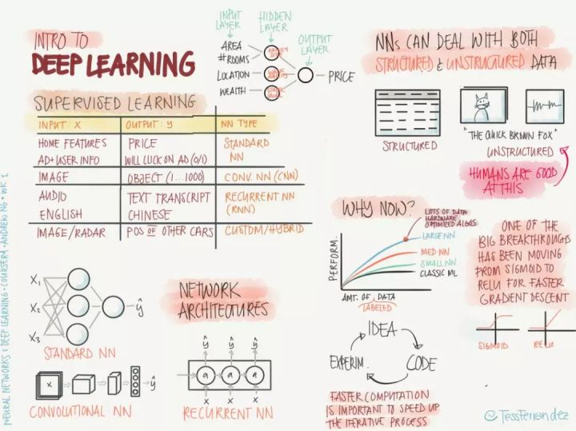

* Supervised Learning
* Network Architectures
* Structure & Unstructured data
* Data versus Performance
* Big breakthroug: Sigmoid -> relu
* Iterative Process

### 2. Logistic Regression as a Neural Network

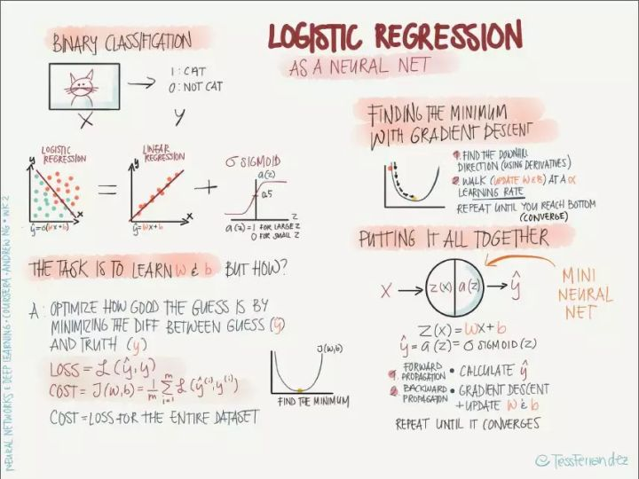

* Binary classification
* Linear regression + sigmoid
* Loss function
* Gradient descent
* Mini Nerual Net 

### 3. Shallow Neural Networks

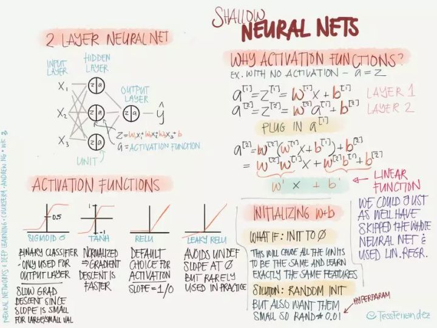

* 2 layer neural network
* Activation function and why
* Initializing parameters randomly

### 4. Deep Neural Networks

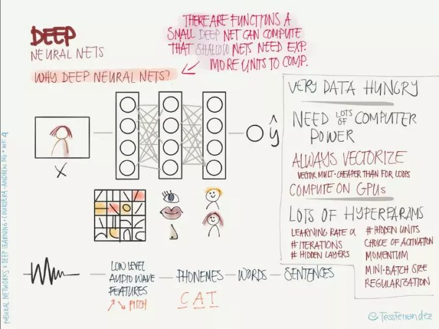

* Why deep Neural networks?
* Features

### 5. Setting up your ML App

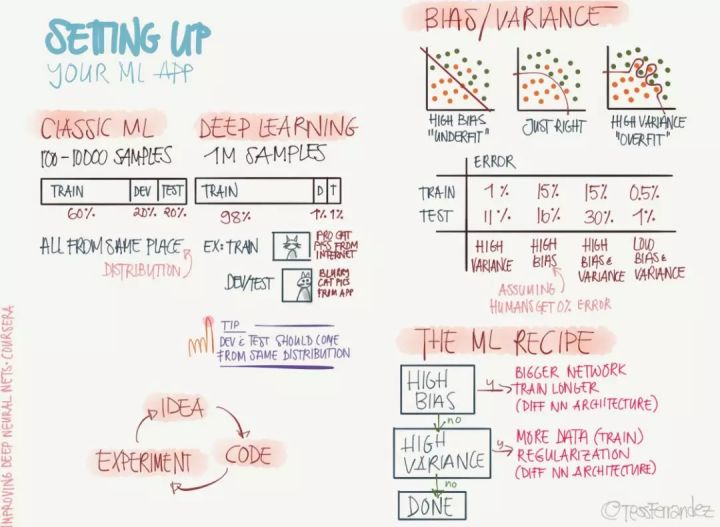

* Data splits & Distribution
* Bias &  Variance
* The ML recipe

### 6. Regularization Preventing overfitting

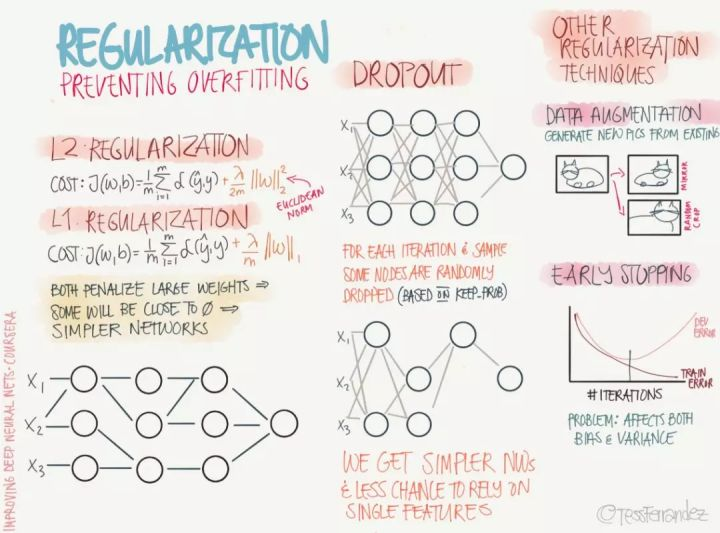

* L1 & L2 regularization
* Dropout
* Data augmentation
* Early stopping

### 7. Optimizing Training

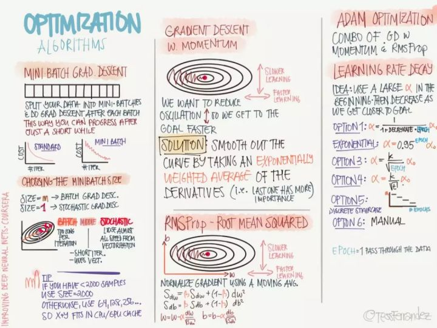

* Normalizing inputs
* Vanishing / Exploding gradients
* Gradient checking

### 8. Optimization Algorithms

* Mini-batch gradient descent
* Momentum
* RMSProp
* Adam
* Learning rate decay

### 9. Hyper-Parameter Tuning

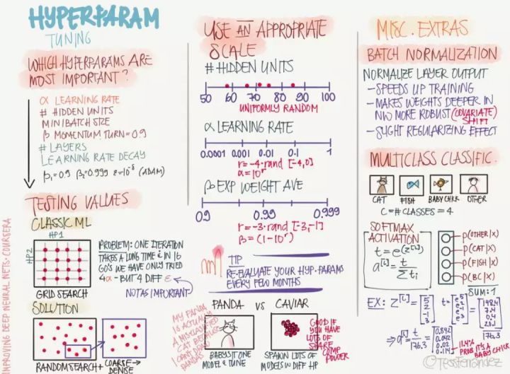

* Hyper-params
* Grid search vs. Random search
* Scales
* Batch normalization
* Multi-class classification

### 10. Structuring your Machine Learning Porjects

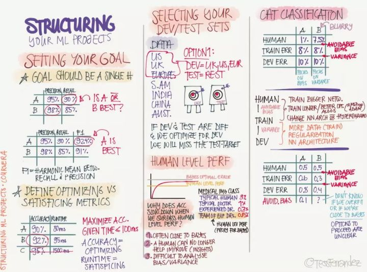

* Set goals
* Select dev/test sets
* Human level performance
* Guides to optimization

### 11. Error Analysis

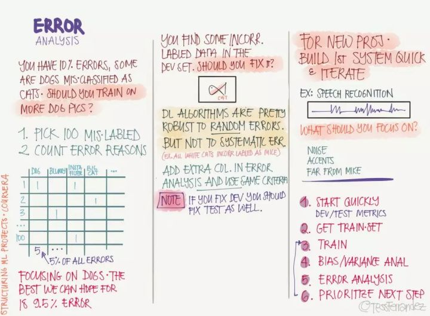

* Analysis mislabeled data
* Random errors vs. Systemic errors

### 12. Train vs. Dev/Test Mismatch

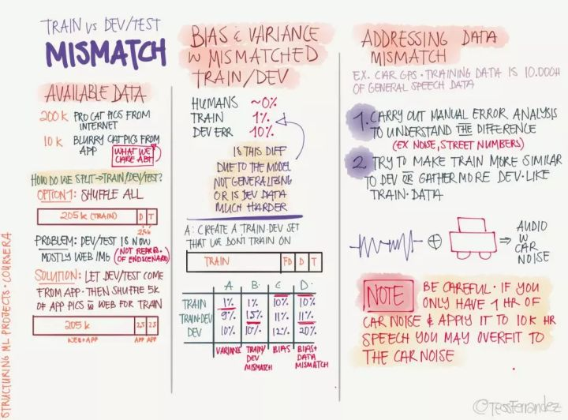

* Available data
* Train-dev set
* Addressing data mismatch

### 13. Extended Learning

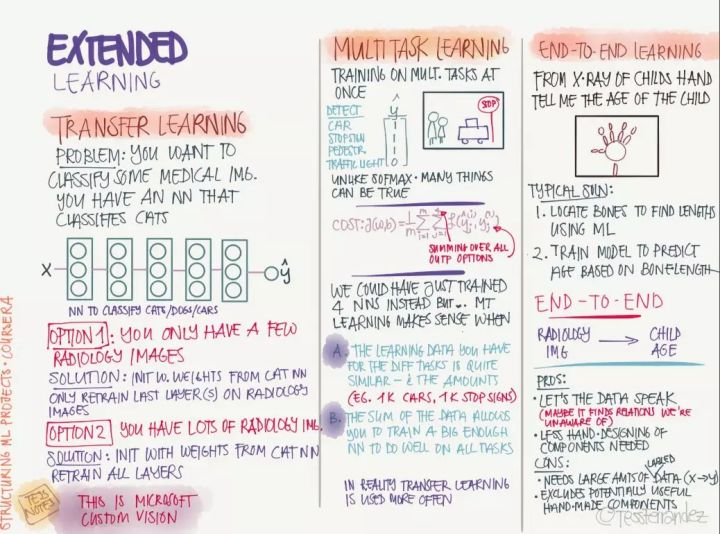

* Transfer learning
* Multi-task learning
* End-to-end learning

### 14. Convolution Fundamentals

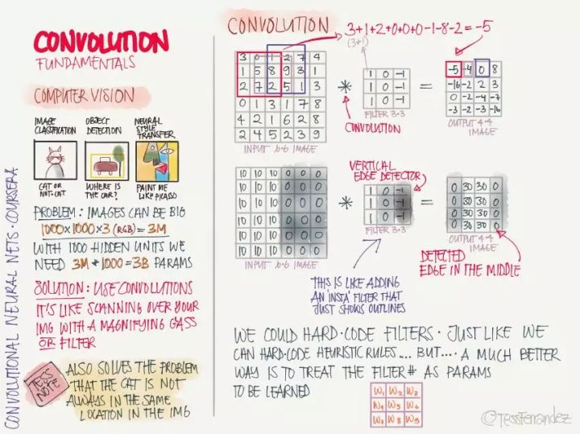

- Computer vision
- Why Convolutions?
- Convolution

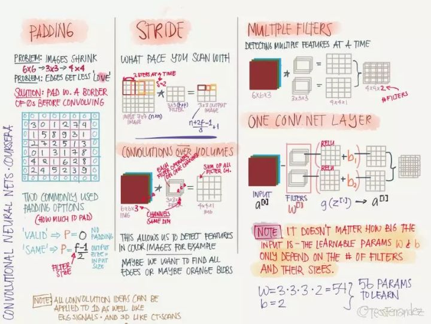

- Padding
- Stride
- Filter
- One CONV. Net layer

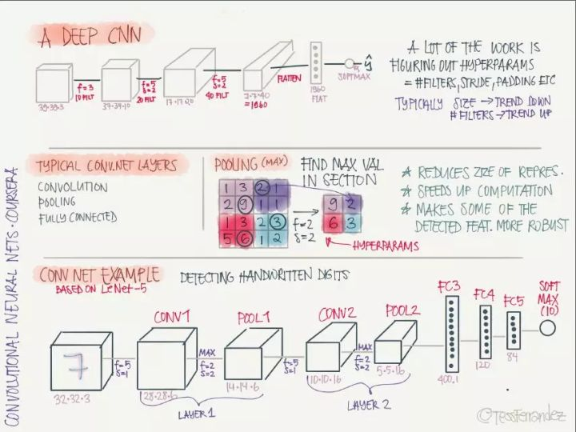

- A Deep CNN
- Typical CONV. Net layers
- CONV net example (LeNet-5)

### 15. Classic Convolutional Networks 

### 16. Special Networks

### 17. Practical Advice

### 18. Detection Algorithms

### 19. Face Recognition

### 20. Neural Style Transfer

### 21. Recurrent Neural Networks

### 22. NLP Word Embeddings

### 23. Sequence to Sequence

### Reference

* https://zhuanlan.zhihu.com/p/34346816