### Outline

* Neural Networks and Deep Learning
* Improving Deep Neural Networks: Hyperparametere tuning, Regularization and Optimization
* Structuring your Machine Learning project
* Convolutional Neural Networks
* Natural Language Processing: Building sequence models

### 1. Introduction to Deep Learning

* Supervised Learning
* Network Architectures
* Structure & Unstructured data
* Data versus Performance
* Big breakthroug: Sigmoid -> relu
* Iterative Process

### 2. Logistic Regression as a Neural Network

* Binary classification
* Linear regression + sigmoid
* Loss function
* Gradient descent
* Mini Nerual Net 

### 3. Shallow Neural Networks

* 2 layer neural network
* Activation function and why
* Initializing parameters randomly

### 4. Deep Neural Networks

* Why deep Neural networks?
* Features

### 5. Setting up your ML App

* Data splits & Distribution
* Bias &  Variance
* The ML recipe

### 6. Regularization Preventing overfitting

* L1 & L2 regularization
* Dropout
* Data augmentation
* Early stopping

### 7. Optimizing Training

* Normalizing inputs
* Vanishing / Exploding gradients
* Gradient checking

### 8. Optimization Algorithms

* Mini-batch gradient descent
* Momentum
* RMSProp
* Adam
* Learning rate decay

### 9. Hyper-Parameter Tuning

* Hyper-params
* Grid search vs. Random search
* Scales
* Batch normalization
* Multi-class classification

### 10. Structuring your Machine Learning Porjects

* Set goals
* Select dev/test sets
* Human level performance
* Guides to optimization

### 11. Error Analysis

* Analysis mislabeled data
* Random errors vs. Systemic errors

### 12. Train vs. Dev/Test Mismatch

* Available data
* Train-dev set
* Addressing data mismatch

### 13. Extended Learning

* Transfer learning
* Multi-task learning
* End-to-end learning

### 14. Convolution Fundamentals

- Computer vision
- Why Convolutions?
- Convolution

- Padding
- Stride
- Filter
- One CONV. Net layer

- A Deep CNN
- Typical CONV. Net layers
- CONV net example (LeNet-5)

### 15. Classic Convolutional Networks 

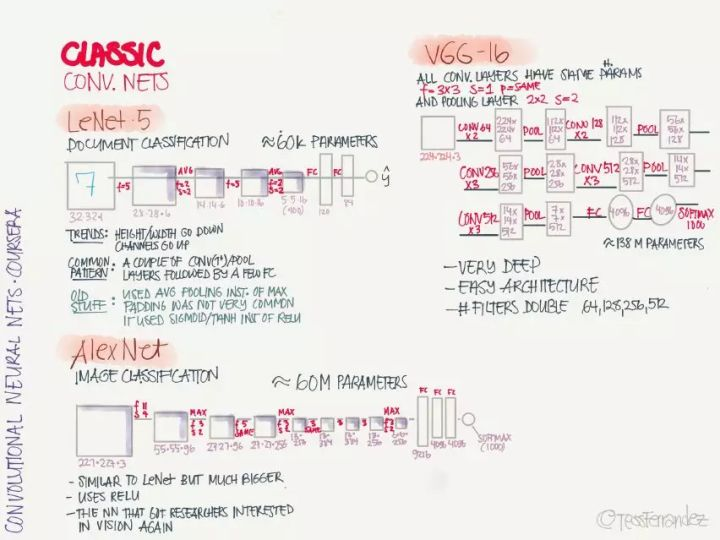

- LeNet-5
- AlexNet (Relu)
- VGG-16

### 16. Special Networks

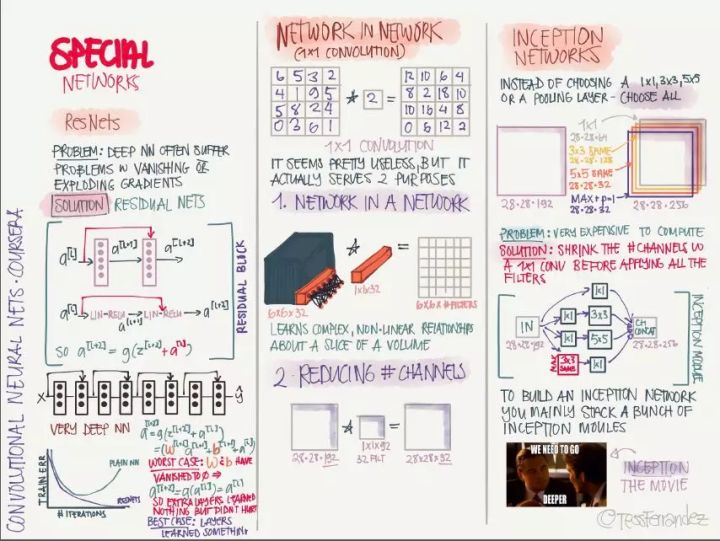

- ResNets
- Network in Network
- Inception Networks

### 17. Practical Advices

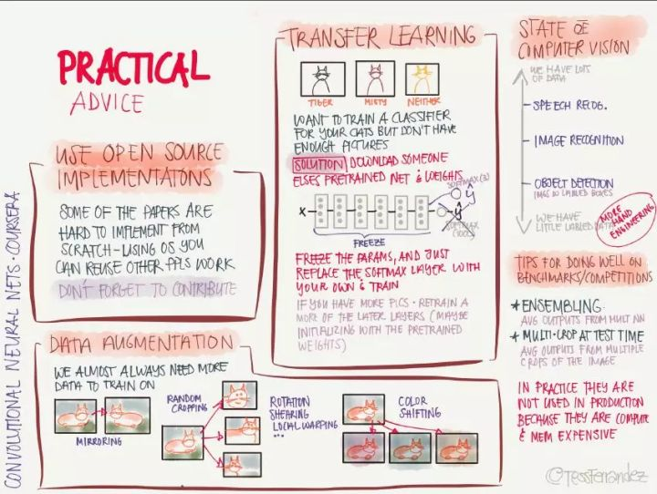

- Use open source implementations
- Data Augmentation
- Transfer Learning
- Tips for doing well on benchmarks/competitions
	- Ensembling
	- Multi-crop at test time

### 18. Detection Algorithms

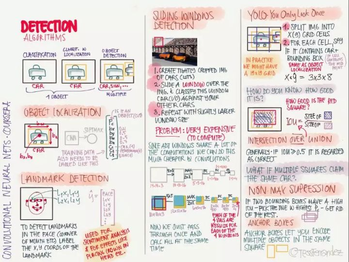

- Object detection
- Landmark detection
- Sliding Windows
- YOLO: You Only Look Once
- IOU: Intersection Over Union
- Non Max Suppression
- Anchor Boxes

### 19. Face Recognition

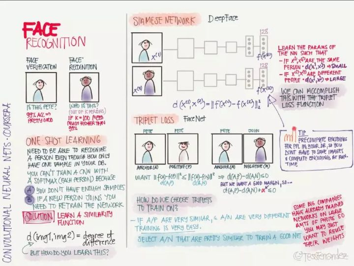

- One-shot learning
- Siamese Network - DeepFace
- Triple Loss

### 20. Neural Style Transfer

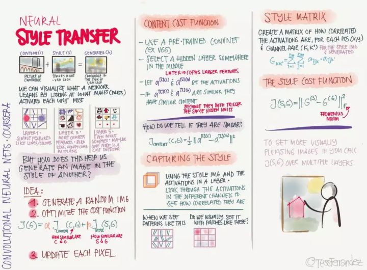

- Content Cost Function
- Style Const Function

### 21. Recurrent Neural Networks

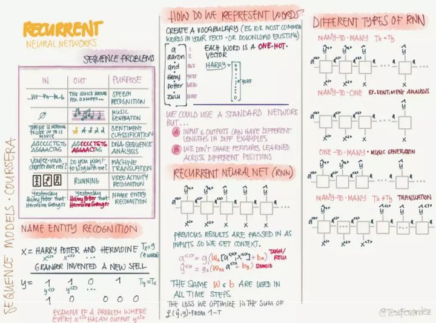

- Sequence Problems
- Recurrent Neural Networks
- Types of RNN
- Language Modeling
- Sampling Sentences
- Vanishing Gradients
- GRU: Gated Recurrent Unit
- LSTM: Long Short Term Memory
- BRNN: Bi-Directional RNN
 

### 22. NLP Word Embeddings

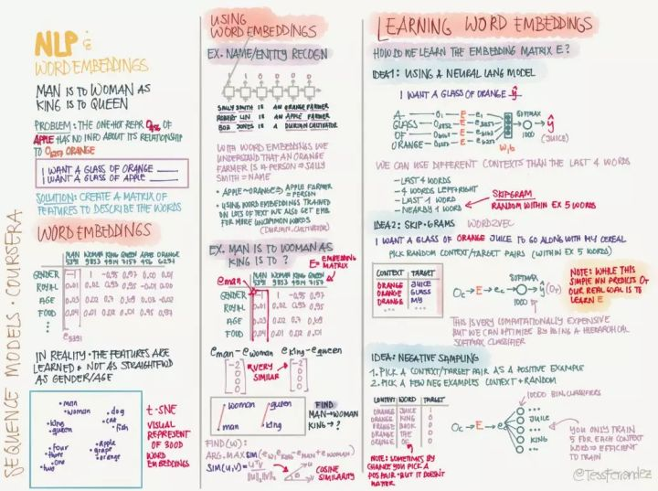

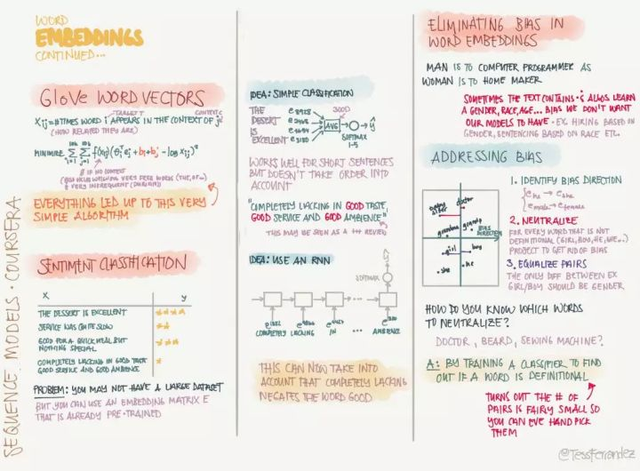

- Word embeddings
- Using word embeddings
- Learning word embeddings
	- Using a neural language model
	- Skip-grams
	- Negative sampling
	- GloVe word vectors
- Sentiment classification
- Eliminating bias in word embeddings
	- Identify bias direction
	- Neutralize
	- Equalize pairs

### 23. Sequence to Sequence

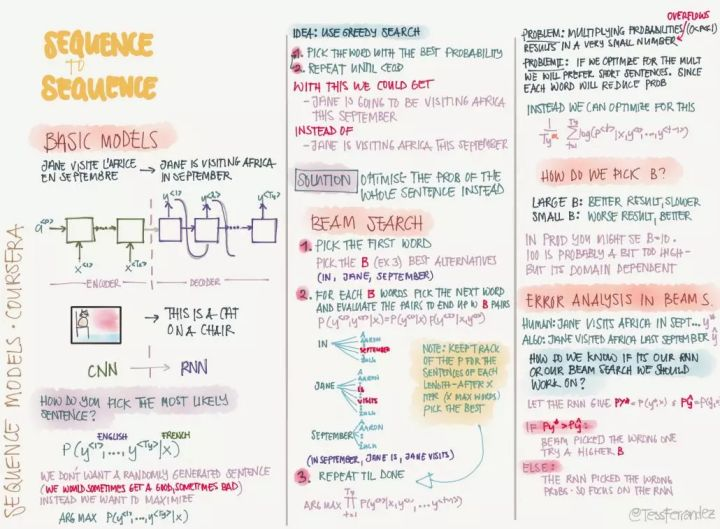

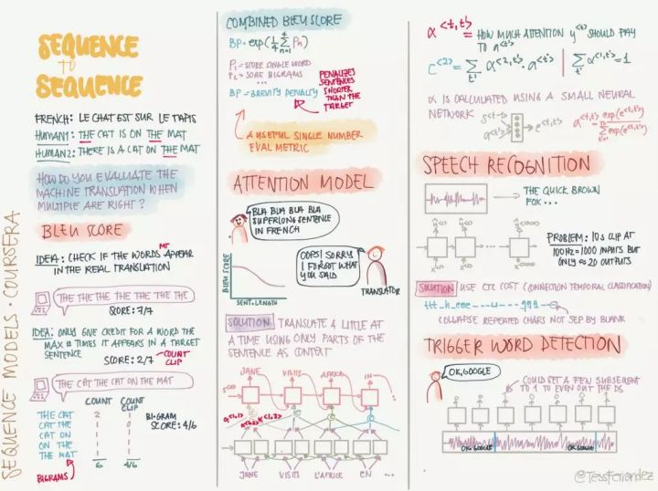

- Basic Models
- Beam search
	- How do we pick B
	- Error analysis in Beam Search
- BLEU score
- Attention Model
- Speech Recognition
- Trigger Word detection

### Reference

* https://zhuanlan.zhihu.com/p/34346816