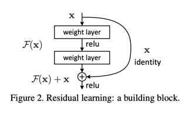
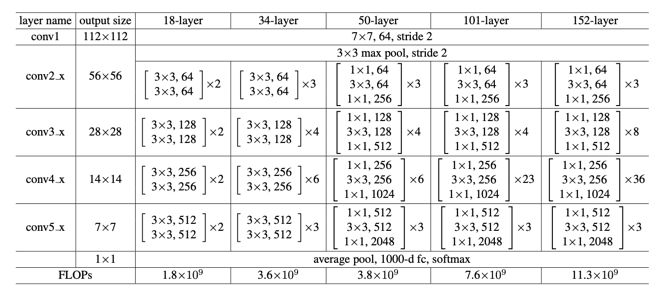
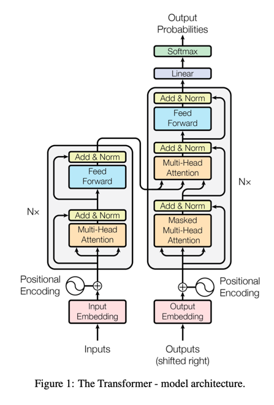
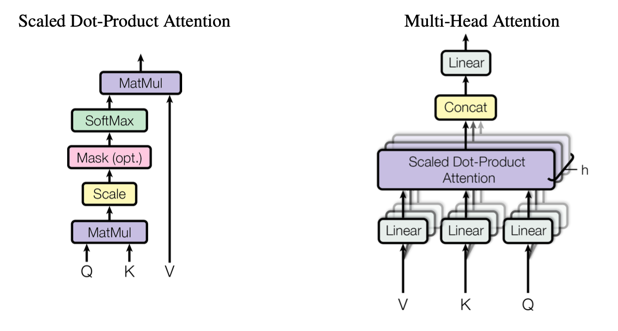
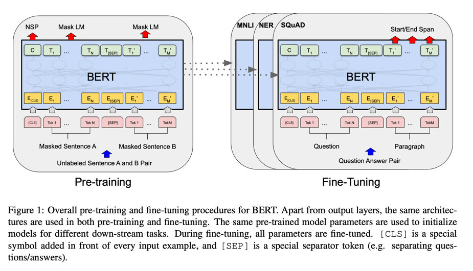
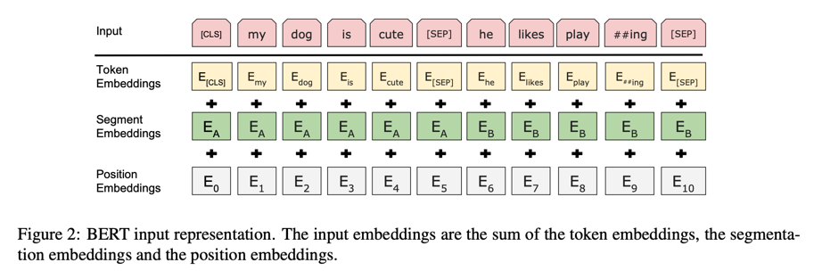

### Paper Reading Notes

##### AlexNet

- ImageNet classification with deep convolutional neuron network
  * It shows that a large, deep convolutional neural network (without any unsupervised pre-training) is capable of achieving record-breaking result
  * larger dataset, more powerful model, better techniques for preventing overfitting
  * End-to-end, no pre-process or pre-training
- CNN
  * 5 convolutional layers + 3 fully connected layers
- Main tricks:
  * ReLU Nonlinearity - several times faster
  * Data augmentation - increase training set -> reduce overfitting, 256x256 -> random 224x224
  * Dropout
- Others:
  * Training on multiple GPUs
  * Local Response Normalization
  * Overlapping Pooling
  * weight decay - l2 regularization
  * Momentum
  

##### ResNet

- Deep Residual Learning for Image Recognition
  * shows that residual networks are easier to optimize, and can gain accuracy from considerably increased depth
  * 152 layers, but lower complexity
  * also powerful on object detection

- Degradation problem
  * deep model leads to high training error -> not overfitting
- deep residual learning framework
  * F(x) = H(x) - x
  * Hypothesis: it's easier to optimize the residual mapping than optimize the original, unreferenced mapping 
  * shortcut connection: skip one or more layers, perform identity mapping
  * no extra parameters to learn, easy to implement

  

- Network Architecture
  - Plain network - inspired by VGG
    - 3x3 filters
    - feature map size halved, number of filters doubled
  - Residual network
    - when same dimension: directly used
    - when dimension increased: a. zero padding, b. projection
  - Deeper Bottleneck Architecture
    - use 1x1 convolution layers to reduce and then restoring dimensions
    - reduce model parameters/computation -> reduce training time

  

- Other Implementation details
  - Image augmentation: 224x224 crop, horizontal flip, color augmentation
  - Batch normalization
  - sgd, min-batch, learning rate decay
  - weight decay, momentum
  - do not use dropout
  

##### Transformer

- Attension is all you need
  - Simple network architecture, based solely on attention mechanism
  - more parallelizable and need less time to train
  - allow modelling of dependencies of long distances
  - draw global dependencies between input and output 

- Architecture
  - encoder-decoder structure
    - Encoder: a stack of N=6 identical layers, each layer has 2 sub-layers:
      - multi-head self-attention
      - simple, position-wise fully connected feed-forward networks
    - Decoder: also a stack of N=6 identical layers, each has 3 sub-layers:
      - masked multi-head self-attention
      - multi-head attention with the encoder
      - simple, position-wise fully connected feed-forward networks
       
  

- Technical Details
  - Attention
    - mapping a query and a key-value pairs to an output
    - Scaled dot-product attention
    - Multi-head attention
      - linearly project the (Q,K,V) h times
      - allow attending the information from different representation subspaces at different positions
      - compute cose is similar
    - applications of attention in this model
      - encoder self-attention
      - decoder masked self-attention
      - encoder-decoder attention
    
  

  - Position-wise fully connected feed-forward networks
    - applied to each position separately and identically
    - consists of two linear transformation and a RELU in between
    - FFN(x) = max(0, W1x + b1)W2 + b2
  - Embeddings and softmax
    - use learned embeddings to convert input and output token to vectors
    - use learned linear transformation and softmax to convert the decoder output to predict the next-token probabilities
  - Positional Encoding
    - inject the position information to the input
    - add positional encoding to input embedding of encoder and decoder
  - residual connection and layer normalization
    - each sublayer output = LayerNorm(x + sublayer(x))
  - Regularization
    - residual dropout
    - label smoothing
  

##### BERT

- BERT: Pre-training of deep bidirectional transformers for language understanding
  - Bidirectional Encoder Representations from Transformers
      - ELMo: bidirectional (independent l-r, r-l), RNN, unidirectional language model
      - GPT: uni-directional, transformer decoder, unidirectional language model
      - BERT: bidirectional, transformer encoder, masked language model
  - pretrain: deep bidirectional representations from unlabeled text
  - fine-tune: just one additional output layer 
  - fine-tune based representation model: reduce the need of many heavily-engineered task-specific architectures

- BERT detailed implementation
  - pretrain & fine-tune
  
  - unified architecture across different tasks: minimal difference between the pre-trained architecture and final downstream architecture
  - Model Architecture
    - BERT-BASE: L(layer): 12, H(hidden size): 768, A(attention head): 12, total parameters: 110M
    - BERT-LARGE: L: 24, H: 1024, A: 16, total parameters: 340M
  - Input and Output Representation
    - A single sequence or A pair of sentences
    - WordPiece embeddings
    - first token: [CLS], final hidden state embeddings for classification
    - separate token for sentences: [SEP]
    - add learning embeddings to indicate which sentences the token belongs
  
  

- Pretraining BERT
  - Task #1: Masked LM
    - mask 15% of tokens in each sentence at random, then predict the masked words
      - the [MASK] token, 80%
      - random token, 10%
      - unchanged, 10%
  - Task #2: Next Sentence Prediction
    - To predict whether sentence B is the next sentence of A
    - Training data:
      - 50% of time, B is actual next sentenec of A
      - 50% is a random sentence
    - [CLS] is used for prediction
    

- Fine-tuning BERT
  - simply plug in the task specific inputs and outputs into BERT, and fine-tune all the parameters end-to-end
    - sentence pairs -> paraphrasing
    - hypothesis-premise pairs -> entailment
    - question-passage pairs -> question answering 
    - single text -> text classification or sequence tagging

##### GPT

##### GPT-2

##### GPT-3

##### GAN

##### GNN
......