# CTR Models

### LR

* Logistic Regression

	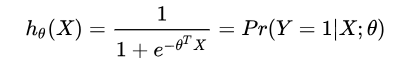

* 优点
	- 简单，可解释性强

* 缺点
	- 线性模型本身局限，不能处理特征和目标之间的非线性关系
	- 严重依赖特征工程

### GBDT + LR

* GBDT + LR
	- Facebook 2014，解决LR的特征组合问题
	- GBDT的思想使其具有天然优势，可以发现多种有区分性的特征以及特征组合，决策树的路径可以直接作为LR输入特征使用，省去了人工寻找特征、特征组合的步骤
	- 通常把一些连续特征，值空间不大的categorical特征都丢给GBDT模型；空间很大的ID特征留在LR模型中训练，既能做高阶特征组合又能利用线性模型易于处理大规模稀疏数据的优势

	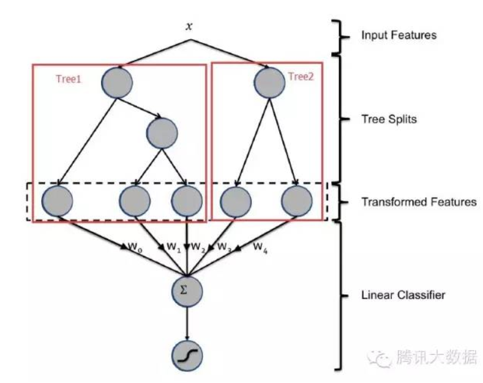

* GBDT：Gradient Boost Decision Tree
	- Boosting算法族一部分，通过集成多个弱学习器，构建最终的预测模型
	- 属于集成学习（ensemble learning）范畴：boosting，bagging，stacking
	- ...

 
* 优点
	- 简化人工特征工程
	- 能够学习高级非线性特征组合

### FM

* FM: Factorization Machine; 因子分解机
	- 解决数据稀疏的情况下，特征组合的问题
	- 通过特征之间的隐变量内积来提取特征组合
	
	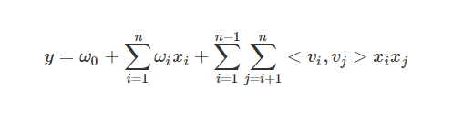

	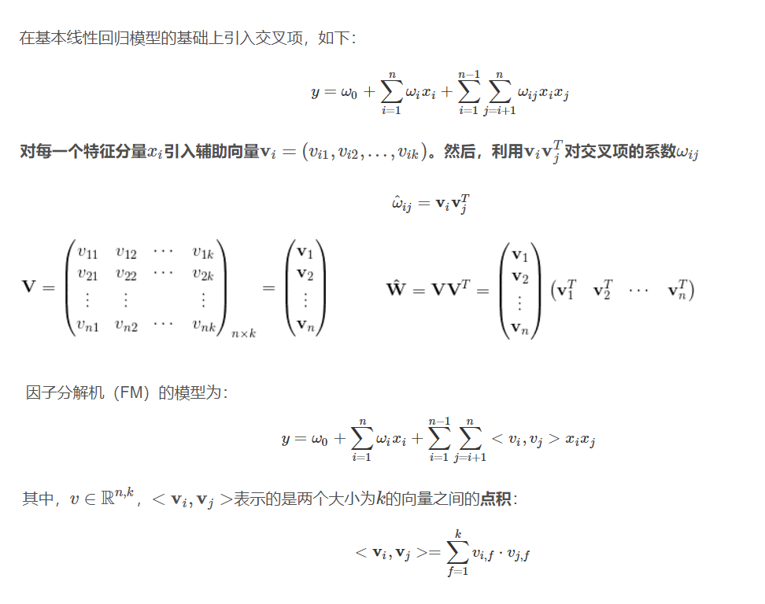

	
* 优点
	- 通过隐向量的内积来提取特征组合，对于训练数据中很少或没有出现的特征组合也能够学习到	
	- 在非常稀疏的数据中进行合理的参数估计, 线性复杂度, 通用模型
	

### FFM

* FFM: Field-aware Factorization Machines
	- 在FM特征组合的基础上给特征加上了field属性
	- FFM把相同性质的特征归于同一个field, 同一个categorical特征经过One-Hot编码生成的数值特征都可以放到同一个field
	- 在FFM中，每一维特征x(i)，针对其它特征的每一种field f(j)，都会学习一个隐向量v(i,fj)。 因此，隐向量不仅与特征相关，也与field相关
	- FM可以看作FFM的特例，在FM模型中，每一维特征的隐向量只有一个，即FM是把所有特征都归属到一个field时的FFM模型
	- 由于FFM加入field，使得训练和预测过程参数计算不能简化，复杂度为O(kn^2)

	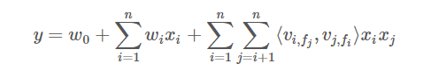	

### FNN

* FNN: Factorization-machine supported Nerural Network
	- FNN模型就是用FM模型学习到的embedding向量初始化MLP，再由MLP完成最终学习
	- 整个学习过程分为两个阶段：
		- 第一个阶段先用一个模型做特征工程
		- 第二个阶段用第一个阶段学习到新特征训练最终的模型
	
	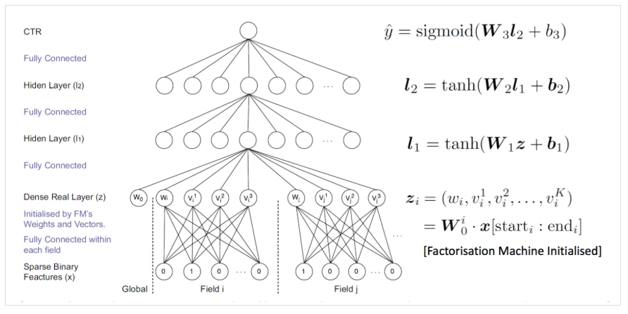

	

### PNN

* PNN: Product-based Neural Networks
	- 在深度学习网络中增加了一个inner/outer product layer，用来建模特征之间的关系

	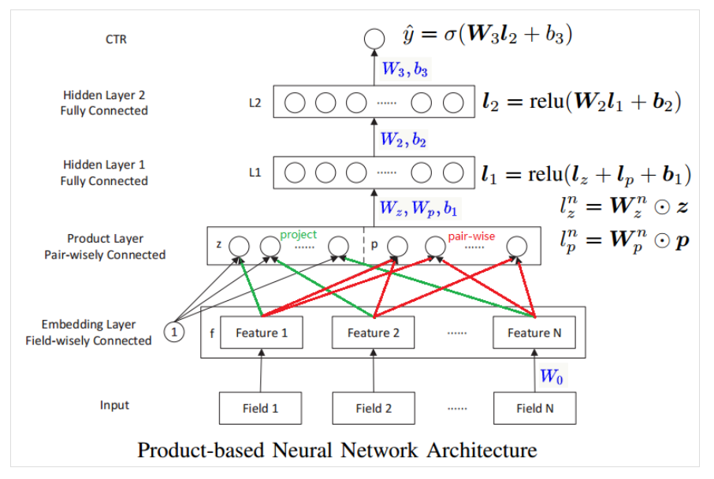

### DeepFM

* DeepFM
	- PNN和FNN与其他已有的深度学习模型类似，都很难有效地提取出低阶特征组合。WDL模型混合了宽度模型与深度模型，但是宽度模型的输入依旧依赖于特征工程
	- DeepFM模型可以以端对端的方式来学习不同阶的组合特征关系，并且不需要其他特征工程
	- DeepFM的结构中包含了因子分解机部分以及深度神经网络部分，分别负责低阶特征的提取和高阶特征的提取

	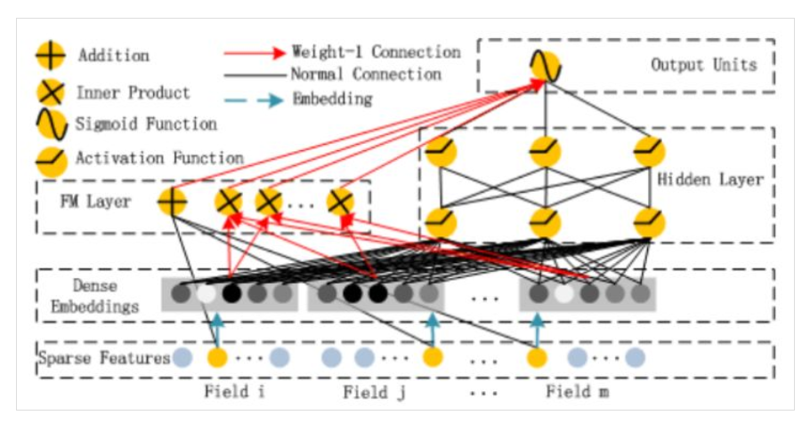

	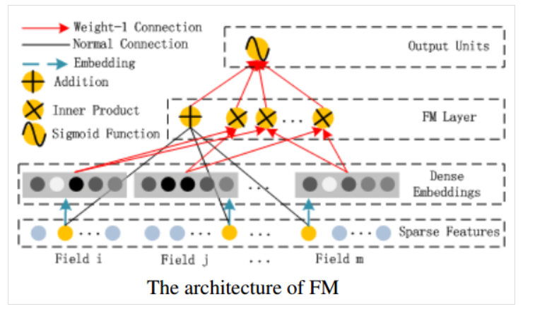

	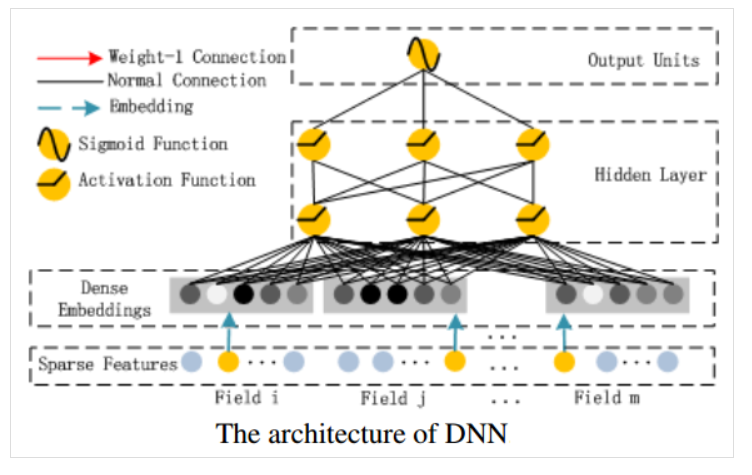

	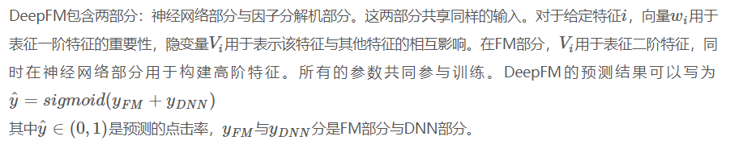

### Wide & Deep
* Wide & Deep
	- Google 2016
	
	Generalized linear models with nonlinear feature transformations are widely used for large-scale regression and classification problems with sparse inputs. Memorization of feature interactions through a wide set of cross-product feature transformations are effective and interpretable, while generalization requires more feature engineering effort. With less feature engineering, deep neural networks can generalize better to unseen feature combinations through low-dimensional dense embeddings learned for the sparse features. However, deep neural networks with embeddings can over-generalize and recommend less relevant items when the user-item interactions are sparse and high-rank. In this paper, we present Wide & Deep learning---jointly trained wide linear models and deep neural networks---to combine the benefits of memorization and generalization for recommender systems. We productionized and evaluated the system on Google Play, a commercial mobile app store with over one billion active users and over one million apps. Online experiment results show that Wide & Deep significantly increased app acquisitions compared with wide-only and deep-only models. We have also open-sourced our implementation in TensorFlow

	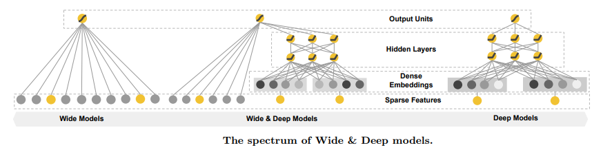

* 优点
	- combine the benefits of memorization and generalization

### MLR
* MLR: 混合逻辑回归，分片线性模型；
	- alibaba，2012提出，2017发表
	- 对线性LR模型的推广，它利用分片线性方式对数据进行拟合
	- 基本思路是采用分而治之的策略：如果分类空间本身是非线性的，则按照合适的方式把空间分为多个区域，每个区域里面可以用线性的方式进行拟合，最后MLR的输出就变为了多个子区域预测值的加权平均

	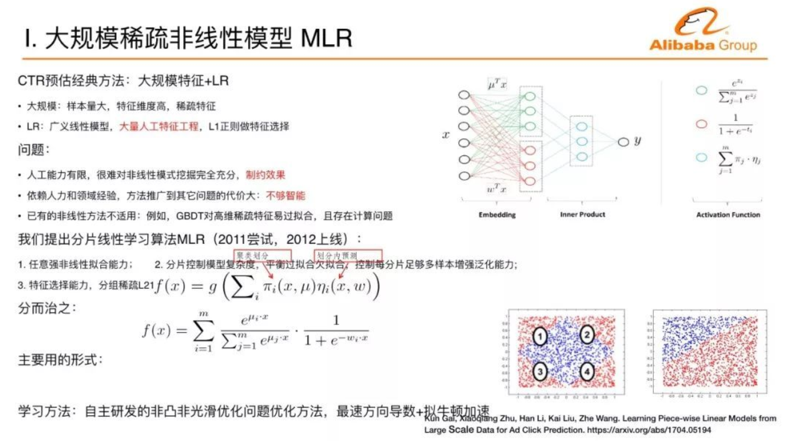

	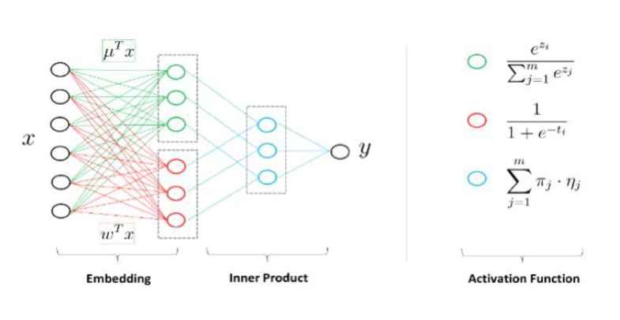

### DIN
* DIN: Deep Interest Network; 深层用户兴趣分布网络
	- alibaba，2016 - 2017
	- 针对电子商务领域的CTR预估, 重点在于充分利用/挖掘用户历史行为数据中的信息
	- 互联网电子商务领域，数据特点：Diversity、Local Activation
		- Diversity: 用户在访问电商网站时会对多种商品都感兴趣。也就是用户的兴趣非常的广泛
		- Local Activation: 用户是否会点击推荐给他的商品，仅仅取决于历史行为数据中的一小部分，而不是全部
	- DIN解决方案：同时对Diversity和Local Activation进行建模
		- 使用用户兴趣分布来表示用户多种多样的兴趣爱好
		- 使用Attention机制来实现Local Activation
		- 针对模型训练，提出了Dice激活函数，自适应正则，显著提升了模型性能与收敛速度
	

	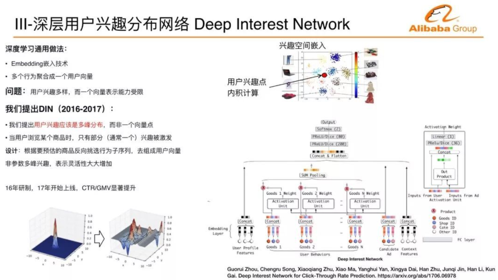

### FTRL
* FTRL: Follow-the-regularized-Leader
* LR -> SGD -> TG -> FOBOS -> RDA -> FTRL

### References

- https://yangxudong.github.io/ctr-models/
- https://en.wikipedia.org/wiki/Logistic_regression
- https://blog.csdn.net/dengxing1234/article/details/73739481
- https://yangxudong.github.io/gbdt/
- https://blog.csdn.net/g11d111/article/details/77430095
- https://blog.csdn.net/wyisfish/article/details/79998959
- https://www.sohu.com/a/227652096_473283
- https://blog.csdn.net/u010352603/article/details/80590152