# CTR Models

### Overview

* Before Deep Learning

	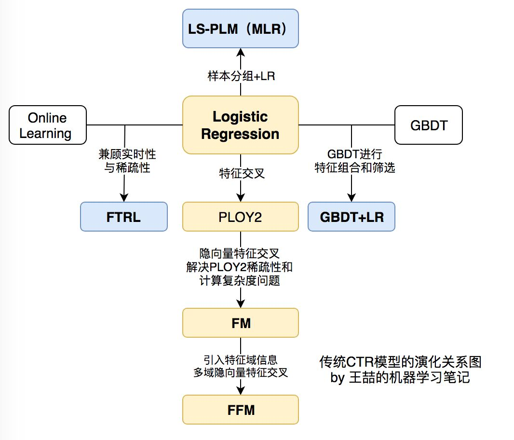

* Deep Learning Models

	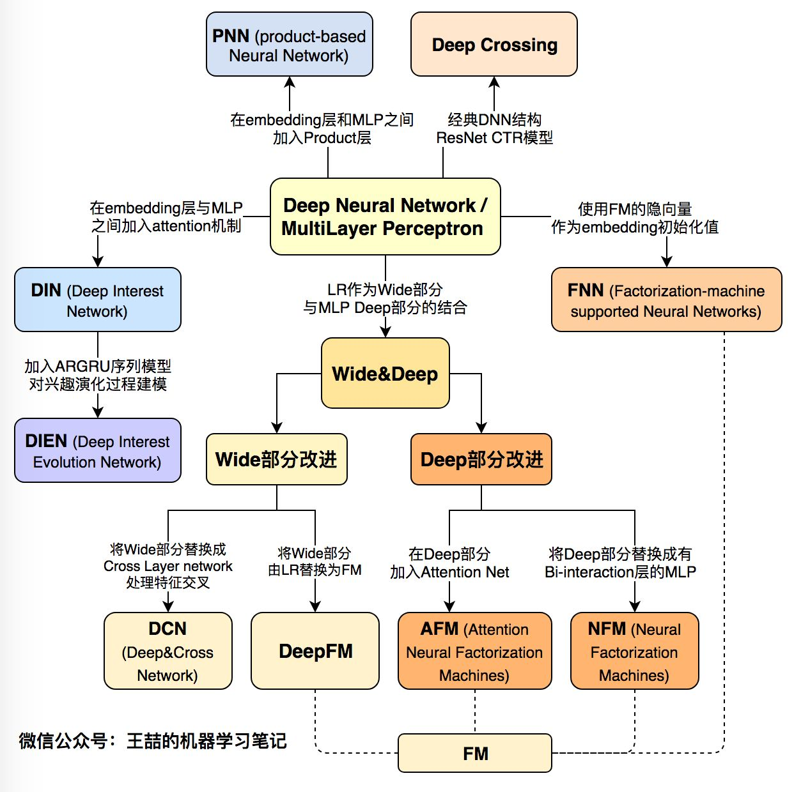

* Alibaba 

	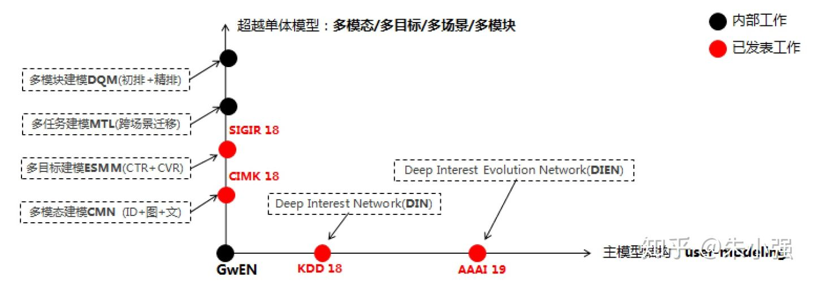

* Data Example
 
 	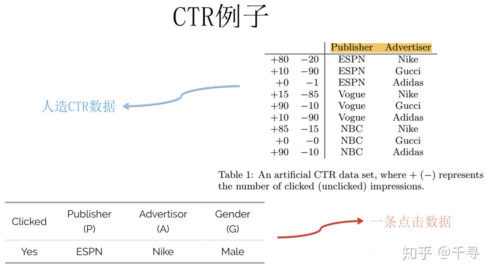

### LR

* Logistic Regression

	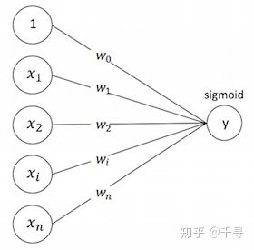
	

* 优点
	- 简单，可解释性强

* 缺点
	- 线性模型本身局限，不能处理特征和目标之间的非线性关系
	- 严重依赖特征工程

### POLY2
* 特征交叉
	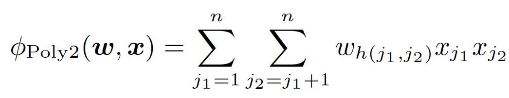
	
*  优点
	- 一定程度上解决了特征组合的问题
	
*  缺点
	- 无选择的特征交叉使特征向量更加稀疏，大部分交叉特征的权重缺乏有效的数据进行训练，无法收敛
	- 参数的数量由n直接上升到n^2，增加了训练复杂度

### FM

* Factorization Machine: 因子分解机
	- 解决数据稀疏的情况下，特征组合的问题
	- 通过特征之间的隐变量内积来提取特征组合
	
	

	

	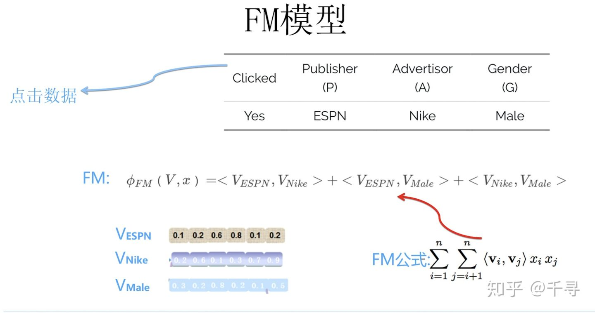
	
* 优点
	- 通过隐向量的内积来提取特征组合，对于训练数据中很少或没有出现的特征组合也能够学习到	
	- 在非常稀疏的数据中进行合理的参数估计, 线性复杂度, 通用模型
	

### FFM

* FFM: Field-aware Factorization Machines
	- 在FM特征组合的基础上给特征加上了field属性
	- FFM把相同性质的特征归于同一个field, 同一个categorical特征经过One-Hot编码生成的数值特征都可以放到同一个field
	- 在FFM中，每一维特征x(i)，针对其它特征的每一种field f(j)，都会学习一个隐向量v(i,fj)。 因此，隐向量不仅与特征相关，也与field相关
	- FM可以看作FFM的特例，在FM模型中，每一维特征的隐向量只有一个，即FM是把所有特征都归属到一个field时的FFM模型
	- 由于FFM加入field，使得训练和预测过程参数计算不能简化，复杂度为O(kn^2)

		

	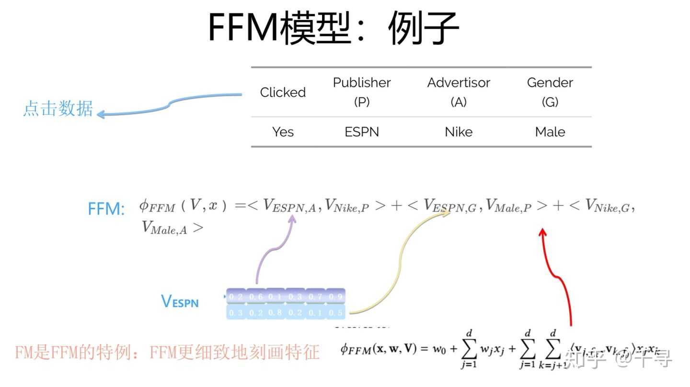

### GBDT + LR

* GBDT + LR
	- Facebook 2014，解决LR的特征组合问题
	- GBDT的思想使其具有天然优势，可以发现多种有区分性的特征以及特征组合，决策树的路径可以直接作为LR输入特征使用，省去了人工寻找特征、特征组合的步骤
	- 通常把一些连续特征，值空间不大的categorical特征都丢给GBDT模型；空间很大的ID特征留在LR模型中训练，既能做高阶特征组合又能利用线性模型易于处理大规模稀疏数据的优势

	
	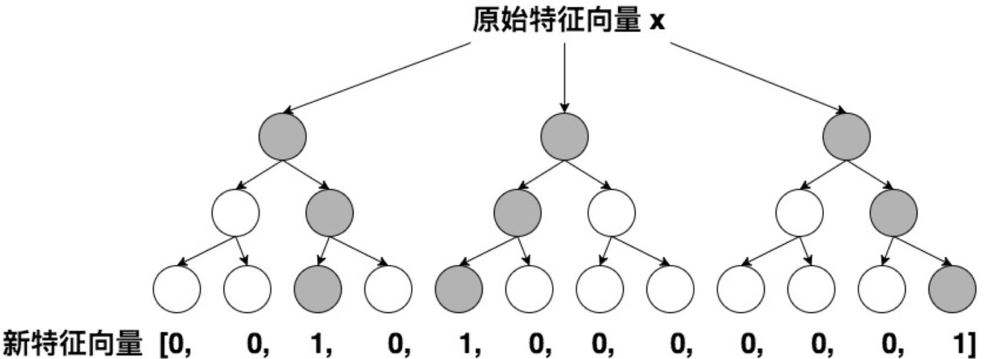

* GBDT：Gradient Boost Decision Tree
	- Boosting算法族一部分，通过集成多个弱学习器，构建最终的预测模型
	- 属于集成学习（ensemble learning）范畴：boosting，bagging，stacking
	- ...

* 优点
	- 简化人工特征工程
	- 能够学习高级非线性特征组合
	- 推进了**特征工程模型化**这一重要趋势

### FTRL
* FTRL: Follow-the-regularized-Leader
	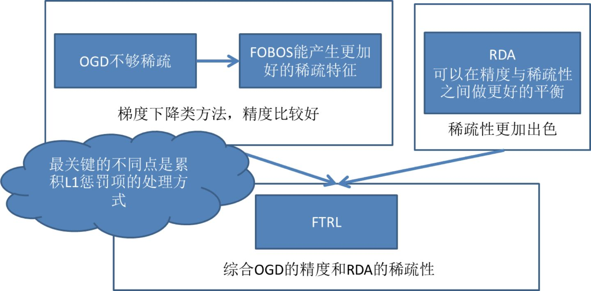

* SGD -> OGD -> FOBOS -> RDA -> FTRL
	- OGD通过引入L1正则化简单解决稀疏性问题
	- 截断梯度法，通过暴力截断小数值梯度的方法保证模型的稀疏性，但损失了梯度下降的效率和精度
	- FOBOS（Forward-Backward Splitting），对OGD做进一步改进，保证精度并兼顾稀疏性
	- RDA，抛弃了梯度下降，提出了正则对偶平均来进行online learning的方法，其特点是稀疏性极佳，但损失了部分精度
	- FTRL，综合FOBOS在精度上的优势和RDA在稀疏性上的优势

### MLR， LS-PLM
* 混合逻辑回归，分片线性模型；
	- alibaba，2012提出，2017发表
	- 对线性LR模型的推广，它利用分片线性方式对数据进行拟合
	- 基本思路是采用分而治之的策略：如果分类空间本身是非线性的，则按照合适的方式把空间分为多个区域，每个区域里面可以用线性的方式进行拟合，最后MLR的输出就变为了多个子区域预测值的加权平均
	- 基于领域知识先验，灵活地设定空间划分与线性拟合使用的不同特征结构
		- 定向 广告中验证有效的先验为：以user特征空间划分、以ad特征为线性拟合
		- e.g. 不同人群具有聚类特性，同一类人群对广告有类似的偏好，例如高消费人群喜欢点击高客单价的广告

	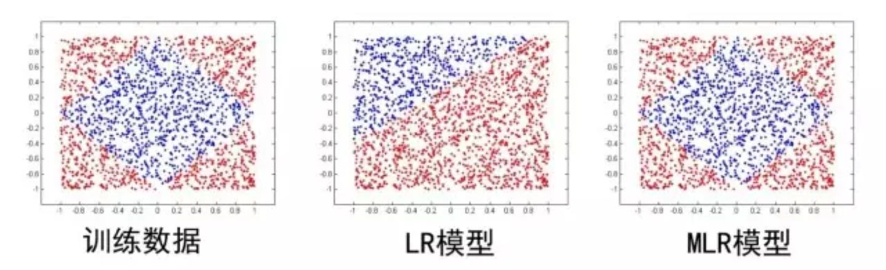
	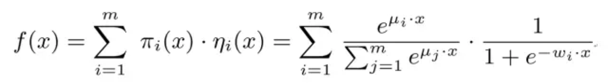
	

### Deep Crossing

* 微软Deep Crossing（2016年）——深度学习CTR模型的base model
	- 深度学习CTR模型的最典型和基础性的模型，涵盖了深度CTR模型最典型的要素：
		- 通过加入embedding层将稀疏特征转化为低维稠密特征
		- 用stacking layer，或者叫做concat layer将分段的特征向量连接起来，
		- 再通过多层神经网络完成特征的组合、转换，
		- 最终用scoring layer完成CTR的计算
	- 使用残差网络

	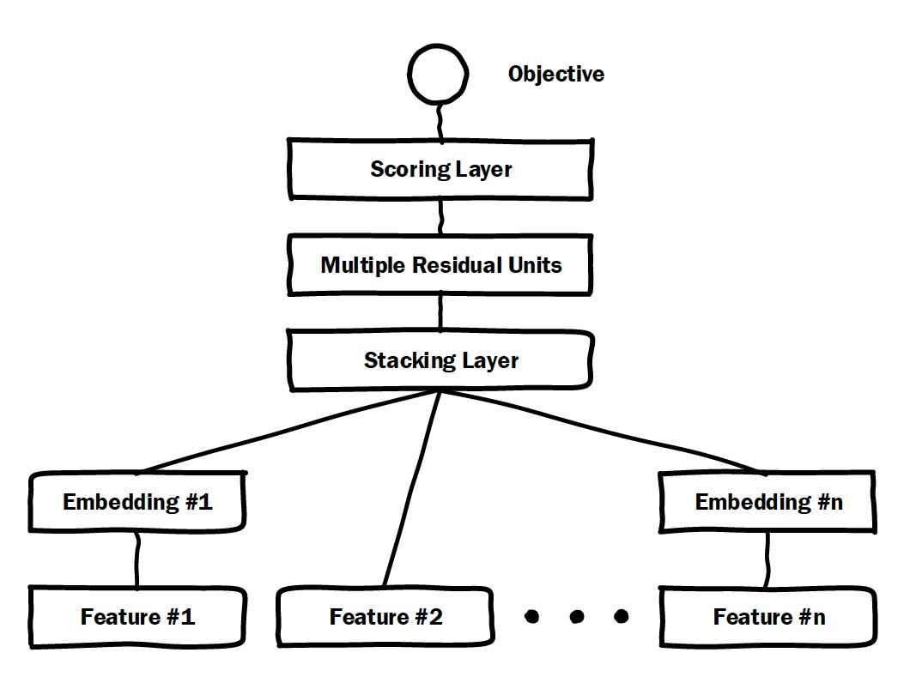

### GwEN
* Group-wise Embedding Network
	- 把大规模的稀疏特征ID用Embedding操作映射为低维稠密的Embedding向量，
	- 然后把每个特征组的Embedding进行简单的sum或average的pooling操作，得到Group-wise的Embedding向量
	- 多个特征组的向量通过Concatenate操作连接在一起，构成原始样本的完整稠密表达，喂给后续的全连接层

	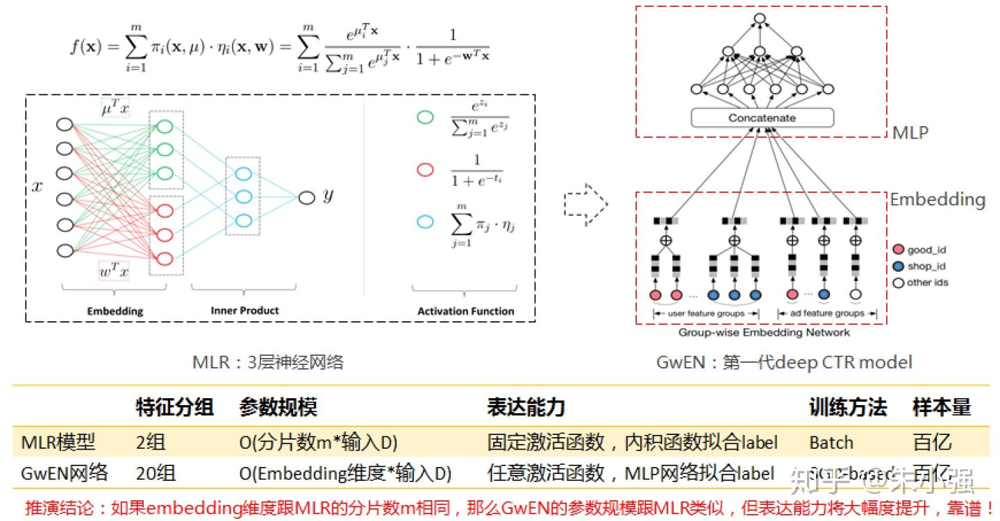

### FNN

* FNN: Factorization-machine supported Nerural Network
	- FNN模型就是用FM模型学习到的embedding向量初始化MLP，再由MLP完成最终学习
	- 整个学习过程分为两个阶段：
		- 第一个阶段先用一个模型做特征工程
		- 第二个阶段用第一个阶段学习到新特征训练最终的模型
	
	

	

### PNN

* PNN: Product-based Neural Networks
	- 在深度学习网络中增加了一个inner/outer product layer，用来建模特征之间的关系

	

### Wide & Deep
* Wide & Deep
	- Google 2016
	
	Generalized linear models with nonlinear feature transformations are widely used for large-scale regression and classification problems with sparse inputs. Memorization of feature interactions through a wide set of cross-product feature transformations are effective and interpretable, while generalization requires more feature engineering effort. With less feature engineering, deep neural networks can generalize better to unseen feature combinations through low-dimensional dense embeddings learned for the sparse features. However, deep neural networks with embeddings can over-generalize and recommend less relevant items when the user-item interactions are sparse and high-rank. In this paper, we present Wide & Deep learning---jointly trained wide linear models and deep neural networks---to combine the benefits of memorization and generalization for recommender systems. We productionized and evaluated the system on Google Play, a commercial mobile app store with over one billion active users and over one million apps. Online experiment results show that Wide & Deep significantly increased app acquisitions compared with wide-only and deep-only models. We have also open-sourced our implementation in TensorFlow

	

* 优点
	- combine the benefits of memorization and generalization

### DeepFM

* DeepFM
	- 华为 DeepFM (2017年)
	- PNN和FNN与其他已有的深度学习模型类似，都很难有效地提取出低阶特征组合。
	- WDL模型混合了宽度模型与深度模型，但是宽度模型的输入依旧依赖于特征工程
	- DeepFM用FM代替Wide部分，模型可以以端对端的方式来学习不同阶的组合特征关系，并且不需要其他特征工程
	- DeepFM的结构中包含了因子分解机部分以及深度神经网络部分，分别负责低阶特征的提取和高阶特征的提取

	

	

	

	

### DCN
* Google Deep&Cross（2017年）—— 使用Cross网络代替Wide部分
	- 设计Cross网络的基本动机是为了增加特征之间的交互力度，使用多层cross layer对输入向量进行特征交叉
	- 单层cross layer的基本操作是将cross layer的输入向量xl与原始的输入向量x0进行交叉，并加入bias向量和原始xl输入向量
	- DCN本质上还是对Wide&Deep Wide部分表达能力不足的问题进行改进，与DeepFM的思路非常类似
	
	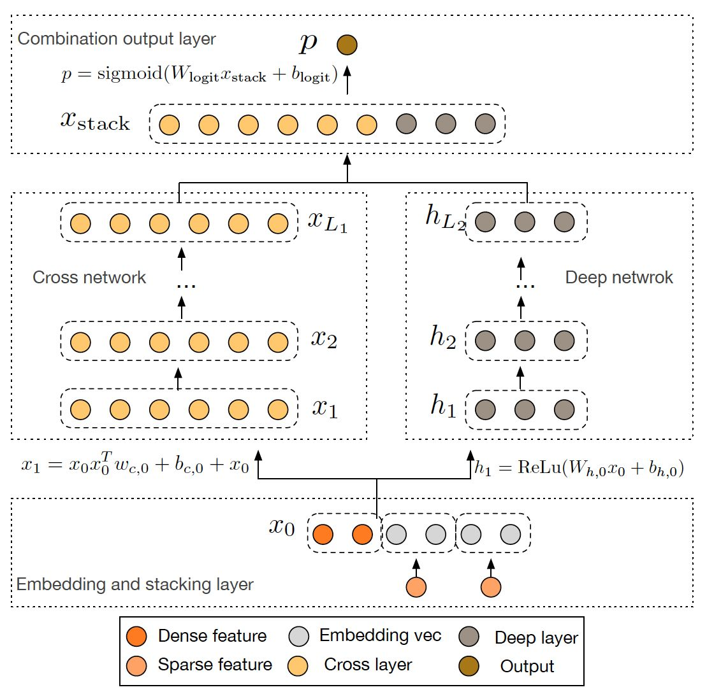

### NFM
* NFM（2017年）—— 对Deep部分的改进
* NFM: Neural Factorization Machines
	- 如果从深度学习网络架构的角度看待FM，FM可以看作是由单层LR与二阶特征交叉组成的Wide&Deep的架构
	- NFM从修改FM二阶部分的角度出发，用一个带Bi-interaction Pooling层的DNN替换了FM的特征交叉部分，形成了独特的Wide&Deep架构
	- Bi-interaction Pooling可以看作是不同特征embedding的element-wise product的形式

	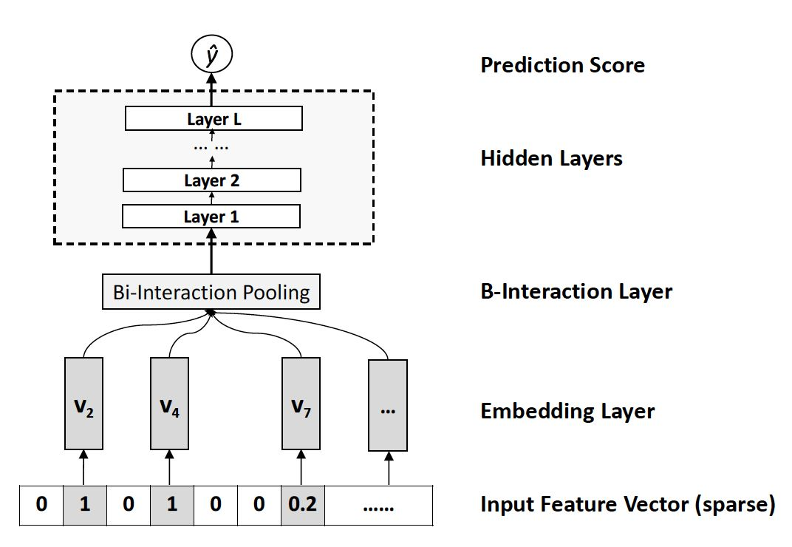
	
	
### AFN
* AFM（2017年）—— 引入Attention机制的FM
* AFM: Attentional Factorization Machines
	- AFM对FM的二阶部分的每个交叉特征赋予了权重，这个权重控制了交叉特征对最后结果的影响，也就非常类似于NLP领域的注意力机制（Attention Mechanism）

	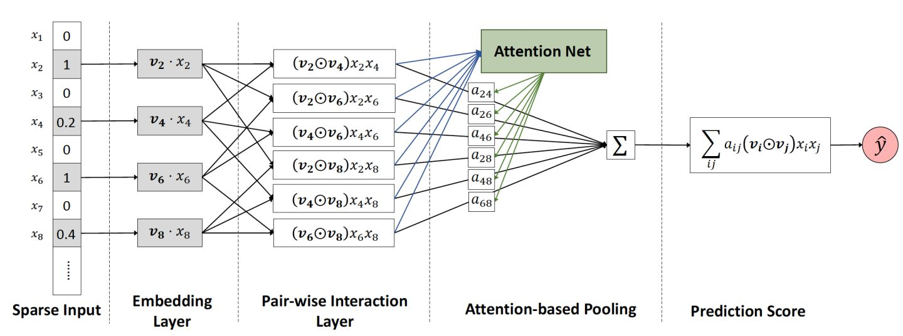

### DIN
* 阿里DIN（2018年）—— 阿里加入Attention机制的深度学习网络
* DIN: Deep Interest Network; 深层用户兴趣分布网络	- 针对电子商务领域的CTR预估, 重点在于充分利用/挖掘用户历史行为数据中的信息
	- 互联网电子商务领域，数据特点：Diversity、Local Activation
		- Diversity: 用户在访问电商网站时会对多种商品都感兴趣。也就是用户的兴趣非常的广泛
		- Local Activation: 用户是否会点击推荐给他的商品，仅仅取决于历史行为数据中的一小部分，而不是全部
	- DIN解决方案：同时对Diversity和Local Activation进行建模
		- 使用用户兴趣分布来表示用户多种多样的兴趣爱好
		- 使用Attention机制来实现Local Activation
		- 针对模型训练，提出了Dice激活函数，自适应正则，显著提升了模型性能与收敛速度

	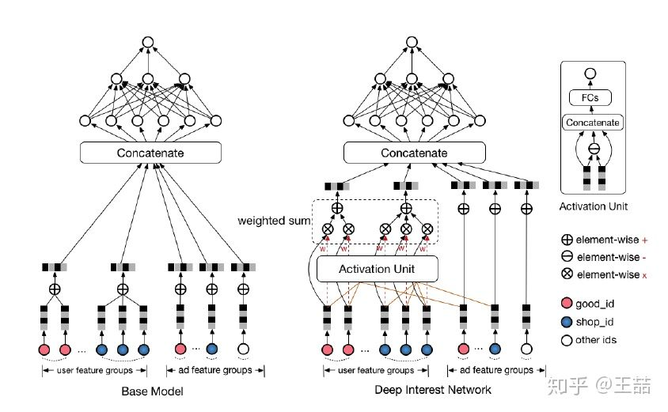
	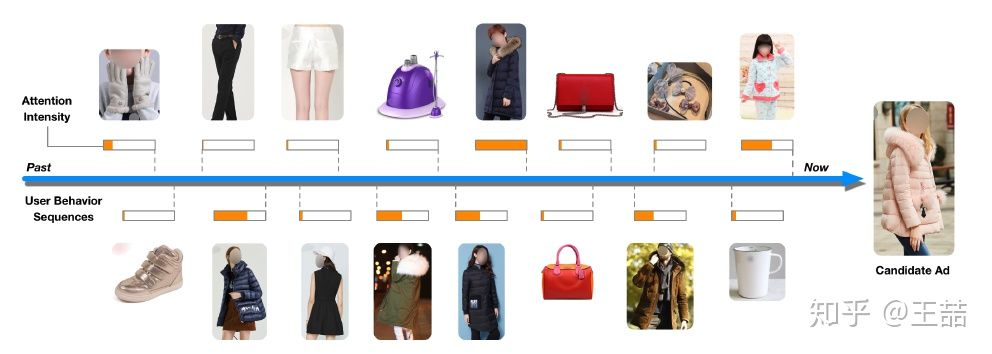

### DIEN
* 阿里DIEN（2018年）——DIN的“进化”
* DIEN: Deep Interest Evolution Network
	- 挖掘行为背后的用户真实兴趣，并考虑用户兴趣的动态变化
	- 用户行为建模（图中带颜色的部分）主要包含两个核心模块：Interest Extractor Layer和Interest Evolving Layer
		- Interest Extractor层，模型使用GRU来对用户行为之间的依赖进行建模
		- Interest Evolving层对与target item相关的兴趣演化轨迹进行建模。作者提出了带注意力更新门的GRU结果也就是AUGRU

	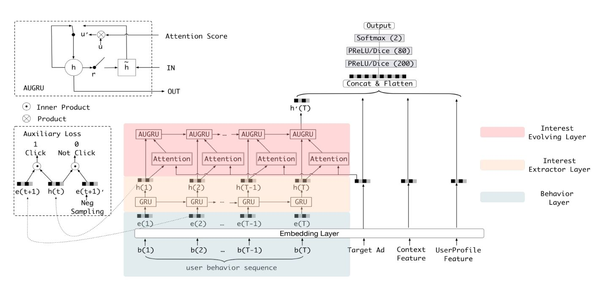
	
* DIN/DIEN都是围绕着用户兴趣建模进行的探索
	- 切入点是从我们在阿里电商场景观察到的数据特点并针对性地进行了网络结构设计
	- DIN捕捉了用户兴趣的多样性以及与预测目标的局部相关性
	- DIEN进一步强化了兴趣的演化性以及兴趣在不同域之间的投影关系

### CMN
* CMN多模态建模：ID + 图 + 文
* CMN：CrossMedia, DICM: Deep Image CTR Model
	- 这个工作结合了离散ID特征与用户行为图像两种模态联合学习
		- 用户行为和广告创意同时加入图片描述
		- 深层神经网络提取图片特征，部分图像网络参与训练
	- 模型主体采用的是DIN结构
	- 最大的挑战是工程架构
		- AMS深度学习训练架构

	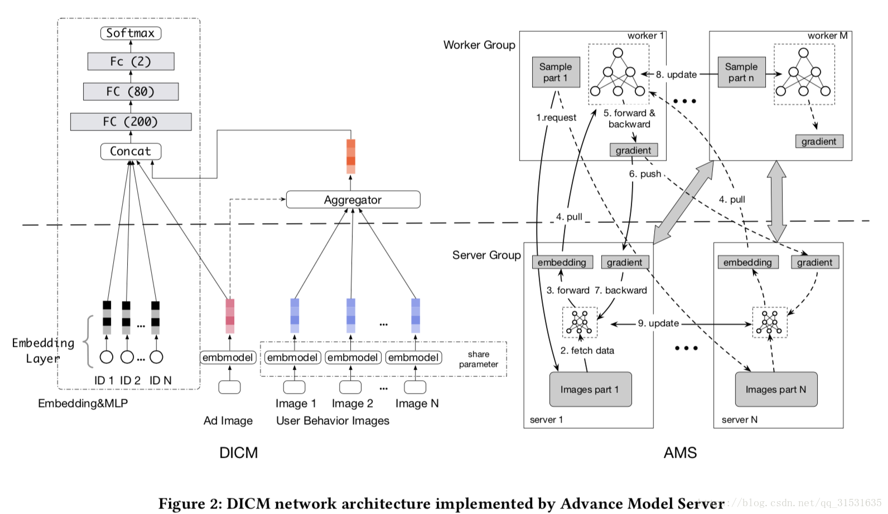

### ESMM
* ESMM多目标建模：CTR + CVR
*  ESMM：Entire-Space Multi-task Model
	- 对同态的CTR和CVR任务联合建模，帮助CVR子任务解决样本偏差与稀疏两个挑战
		- 在整个样本空间建模，而不像传统CVR预估模型那样只在点击样本空间建模
		- 共享特征表示。两个子网络共享embedding向量（特征表示）词典
	
	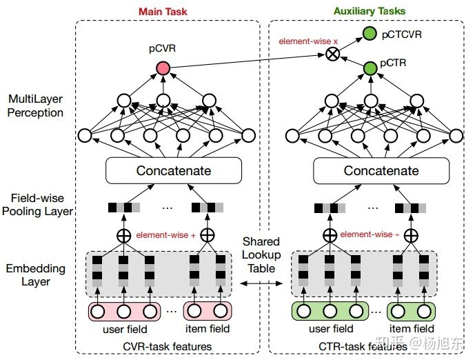

### DQM
* DQM多模块建模：粗排 + 精排
	- 深度个性化质量分模型
		- 海选/粗排的复杂模型化升级
			- 最终的输出是最简单的向量內积
			- 既迎合了检索引擎的性能约束，同时实测跟不受限DL模型(如DIN)在离线auc指标上差距不太显著
		- 对于检索匹配召回等模块同样适用，向量化召回架构

	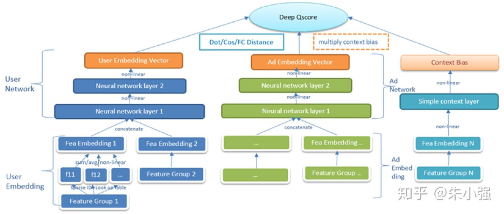

### Summary
* 特征工程 vs. 模型工程
	- 如果说大规模浅层机器学习时代的特征工程(feature engineering, FE)是经验驱动，那么大规模深度学习时代的模型工程(model engineering, ME)则是数据驱动
	- 特征工程模型化
	- 端到端
		- Embedding
		- Attention，GRU
		- 多模态/多目标/多场景/多模块信号
* 从实际业务出发，对多业务数据有深入的理解和洞察	

### References

- https://yangxudong.github.io/ctr-models/
- https://en.wikipedia.org/wiki/Logistic_regression
- https://blog.csdn.net/dengxing1234/article/details/73739481
- https://yangxudong.github.io/gbdt/
- https://blog.csdn.net/g11d111/article/details/77430095
- https://blog.csdn.net/wyisfish/article/details/79998959
- https://www.sohu.com/a/227652096_473283
- https://blog.csdn.net/u010352603/article/details/80590152
- https://zhuanlan.zhihu.com/p/61154299
- https://zhuanlan.zhihu.com/p/63186101
- https://zhuanlan.zhihu.com/p/54822778
- https://zhuanlan.zhihu.com/p/58160982
- https://zhuanlan.zhihu.com/p/97886466
- https://zhuanlan.zhihu.com/p/51623339
- https://zhuanlan.zhihu.com/p/50758485
- https://zhuanlan.zhihu.com/p/34940250