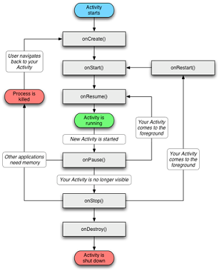
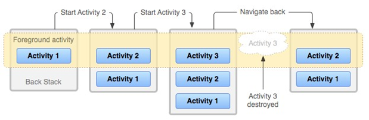
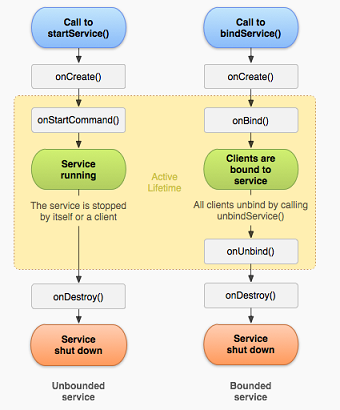
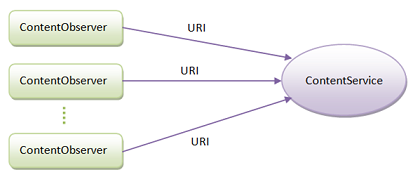
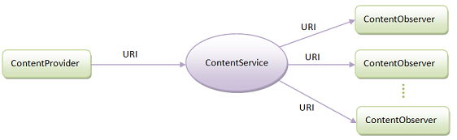

# APPlication Development Notes

### 1. Avtivity

##### Activity生命周期

* 生命周期函数
	- onCreate：创建时调用一次；初始化工作，比如setContentView，初始化变量值等
	- onStart：当Activity可见时执行；可见了，但是看不到，没有获得焦点
	- onResume：当Activity获取焦点时执行；
	- onPause：Activity失去焦点时执行；不能进行回收工作
	- onStop：Activity不可见时执行；比较简单地回收工作
	- onDestroy：Activity销毁时执行；最终的回收和资源释放
	- onRestart：Activity重新启动时执行；
	
	

	- onCreate对应onDestroy，创建和销毁
	- onStart对应onStop，可见和不可见
	- onResume对应onPause，获取焦点和失去焦点


* Activity的三种形态
	- 正继续（Active/Running）：此Activity位于Activity的栈的最顶层，具有用户焦点，可与用户进行交互
	- 已暂停（Paused）：Activity失去焦点，无法与用户交互；对象保留在内存中，与窗口管理器保持连接；在内存极度不足的情况下，可能被系统终止
	- 已停止（Stopped）：被另一个Activity完全遮盖，位于后台；对象保留在内存中，没有与窗口管理器连接；可能被系统终止


##### Android进程等级

* Foreground process （前台进程）
	- 正处于activity resume状态
	- 正处于与bound服务交互的状态
	- 正处于服务在前台运行的状态（startForeground）
	- service声明周期函数正在被执行
	- BroadcastReceiver正在执行onReceive
* Visible process （可视进程）
	- 当前进程不是焦点进程，Activity不在前端显示，但也没有完全隐藏，能够看得见；比如弹出一个对话框
	- 一个bound到visible或者foreground的activity的service
* Service process （服务进程）
	- 可运行的不在上述两种状态的service
* Backgroup process （后台进程）
	- 不可见状态的activity进程，又没有相关的service运行
* Empty process （空进程）
	- 没有任何四大组件在运行，所有Activity都关闭了，任务栈清空了


* Android进程优先级
	- 前台进程 > 可见进程 > 服务进程 > 后台进程 > 空进程


##### Activity切换

* saveInstanceState, OnRestoreInstanceState
	- saveInstanceState：当程序组件被异常销毁时，做一定的数据保存工作
	- onRestoreInstanceState：恢复程序被异常的终止时的数据


* configChanges


##### 任务栈/Activity启动模式

* Activity堆栈
	- 由ActivityManagerService维护
	- Activity在堆栈中以Task的形式聚集在一起
	- Task是一系列相关的Activity组成，描述用户完成某一操作所需要的Activity
	- 当从Launcher上点击一个应用图标的时候，就启动了一个Task

	


* 任务栈模式：
	- standard：标准模式，默认
	- singleTop：单一顶部模式；如果开启的Activity已经存在一个实例在任务栈的顶部，再去开启这个Activity，任务栈不会创建新的Activity的实例了，而是复用已经存在的这个Activity；onNewIntent方法被调用；如果不是位于栈顶，那么还是会产生新的实例入栈，不会回调onNewIntent方法
	- singleTask：单一任务栈；如果开启的Activity已经存在一个实例在任务栈中，再去开启Activity，不会创建新的实例，而是复用已存在的Activity；如果已存在的Activity不在栈顶，复用的同时会清理栈上方的全部Activity
	- singleInstance：单一实例；系统用一个新的栈存放Activity，而且这个新的任务栈只能存放这唯一一个Activity


* 任务栈查看
	- dumpsys activity


* taskAffinity，allowTaskReparenting


### Service

##### Service两种启动方式

* 通过StartService启动Service过程：
	- 通过startService启动后，service会一直运行下去，直到外部调用stopService或stopSelf方法时，该service才会停止运行并销毁
	- onCreate：只会在第一次创建service时候调用，完成初始化工作；多次执行startService不会重复调用onCreate
	- onStartCommand：根据Intent参数进行实际操作，执行具体任务；多次执行startService方法会多次调用onStartCommand方法
	- onBind：抽象方法，必须重写，即使用不到
	- onDestroy：在销毁时执行该方法


* 通过bindService启动的Service特定
	- BindService启动的服务和调用者之间是典型的client-server模式；绑定到service上面的client可以有一个或者很多个
	- client可以通过IBinder接口获取Service实例，从而实现在client端直接调用Service中的方法
	- bindService启动服务的生命周期与其绑定的client息息相关；当Client销毁时，client会自动与Service解除绑定；client也可以明确调用unbindService方法与Service解除绑定；当没有任何client与service绑定时，Service自行销毁


* bindService方式Server端实现
	- 在Service的onBind方法中返回IBinder类型的实例
	- onBind方法返回的IBinder实例需要能够返回Service实例本身


* bindService方式Client端实现
	- 创建ServiceConnection类型实例，重写onServiceConnected和onServiceDisconnected方法
	- 当执行到onServiceConnected回调时，可通过IBinder实例得到Service实例对象，实现client与service的连接
	- onServiceDisconnected回调被执行时，表示client与service断开连接


* bindService方式步骤
	- client执行bindService
	- 如果Service不存在，则Service执行onCreate，onBind
	- client实例ServiceConnection执行onServiceConnected方法
	- Client调用Service方法
	- client执行unbindService
	- client与Service解除绑定连接状态
	- Service检测是否还有其他client与其连接，如果没有执行onUNbind和onDestroy

	


##### Service类型


* 前台服务，后台服务
	- 前台服务：在通知栏显示通知；服务使用时需要让用户知道并进行相关操作，如音乐播放服务
	- 后台服务：处于后台的服务；服务使用时不需要让用户知道并进行相关操作


* 远程服务Service
	- AIDL：Android Interface Definition Language；为了让远程Service与多个应用程序组件之间进行跨进程通信
	- 服务器端：定义AIDL文件；实现AIDL文件中定义的接口方法；在AndroidManifest中注册服务并声明为远程服务
	- 客户端：拷贝服务端AIDL文件到目录下；通过Intent指定服务端的服务名和包，绑定远程service； 使用Stub.asInterface接口获取服务器的Binder，根据需要调用服务提供的接口方法；
	


### BroadcastReceiver

* BroadcastReceiver
	- 广播，全局监听器；用于监听/接收应用发出的广播消息，做出相应
	- 继承BroadcastReceiver基类，重写onReceive方法
	- 默认情况下，广播接收器运行在UI线程，onReceive方法不能执行耗时操作，否则将导致ANR
	- 两种注册方式：静态注册，动态注册
	- 静态注册：常驻广播；不受任何组件的生命周期影响；缺点：耗电，占内存；适用于需要时刻监听的广播
	- 动态注册：非常驻，灵活，跟随组件的声明周期变化；
	- 动态广播最好在Activity的onResume注册，onPause注销；onPause在App死亡前一定会被执行，从而保证广播在App死亡前一定会被注销，从而防止内存泄漏


* 广播的类型
	- 普通广播
	- 系统广播
	- 有序广播
		- Conext.sendOrderedBroadcast
		- 发送出去的广播被广播接受者按照先后顺序接收；有序是针对广播接受者而言的
		- 广播接收者顺序规则：按照Priority属性值从大到小排序；Priority属性相同者，动态注册的广播优先
		- 特点：
			- 先接收的广播接收者可以对广播进行截断，即后接收的广播接收者不再接收到此广播；
			- 先接收的广播接收者可以对广播进行修改，那么后接收的广播接收者将接收到被修改后的广播
	- App应用内广播
		- 注册广播时将exported属性设置为false，非本app内部发出的此广播不被接收
		- 发送广播时指定该广播接收器所在的包名
	- 粘性广播：在Android5.0 & API21中已将失效


### ContentProvider

* ContentProvider底层采用Android中的Binder机制 


* URI
	- 统一资源标识符；唯一标识ContentProvider中的数据
	- Schema://Authority/Path/ID，e.g. content://com.carson.provider/User/1


* 数据访问接口
	- Insert
	- Update
	- Delete
	- Query
	- call (hidden)


* 数据更新机制
	- 注册内容观察者：ContentResolver.ContentObserver

	

	- 发送数据更新通知：ContentResolver.notigyChange

	


### 异步

##### Handler

* Handler
	- Android提供的一套消息传递机制
	- 用于实现子线程对UI线程的更新，实现异步消息的处理：在新启动的线程中发送消息；在主线程中获取并处理
	- 主线程主要负责处理与UI相关的事件；子线程则负责一些比较耗时的操作


* 主要模块
	- Message：消息，线程间通信的数据单元；Handler接收和处理的消息对象
	- MessageQueue：消息队列，用来存放通过Handler发过来的消息
	- Handler：Message的主要处理者；负责将Message添加到消息队列；处理Looper分派过来的Message
	- Looper：负责消息循环：循环取出Message Queue的Message；消息派发：将取出的Message交付给相应的Handler
	- Handler可以在创建的时候可以执行Looper，这样在Handler调用sendMessage投递消息时，会将消息添加到指定的Looper里面的MessageQueue；默认情况Handler绑定的是创建它的线程的Looper


##### HandlerThread

* android.os.HandlerThread适合用来处理不需要更新UI的后台任务

	- 启动HanlderThread
	
	```
	HandlerThread handlerThread = new HandlerThread("Handler Thread")
	handlerThread.start()
	```

	- 向HandlerThread分配任务

	```
	Handler handler = new Handler(handlerThread.getLooper());
	handler.post(threadTask);
	```

	- 退出HandlerThread

	```
	handlerThread.quit();
	```

	
##### AsyncTask

* android.os.AyncTask适合用来处理需要更新UI的后台任务

* AyncTask
	- 在进程内维护一个线程池来执行任务
	- 任务在开始执行，执行过程以及结束执行时均可以与主线程进行交互
	- 任务是通过一个Handler向主线程发送消息以达到交互的目的


##### IntentService

* IntentService
	- Android里面的一个封装类，继承自Service
	- 处理异步请求，实现多线程
	- onCreate函数中通过HandlerThread单独开启一个线程；构造函数参数=工作线程的名字
	- startService传递请求IntentService


* 实现步骤
	- 定义IntentService子类，复写onHandlerIntent方法
	- 在Manifest.xml中注册服务
	- 在Activity中开启Service服务


###

* ANR
	- 主线程处理某一个消息时间过长时会产生ANR
	- Service生命周期函数  - 20s
	- BroadcastReceiver接收前台优先级广播函数 - 10s
	- BroadcastReceiver接收后台优先级广播函数 - 60s
	- 影响输入事件处理的函数 - 5s
	- 影响进程启动的函数 - 10s
	- 影响Activity切换的函数 - 2s

