# Android Framework Study Notes

### Android系统架构

* Android系统整体架构
	- Android OS = Android Runtime + Linux Kernel

	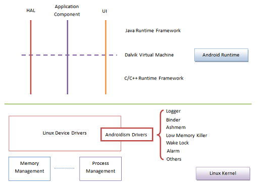

* Android专用驱动
	* Logger
		- 完全内存操作
		- 适合频繁读写
	
	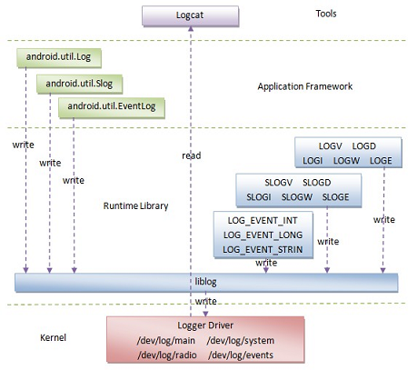
	
	* Binder
		- Client/Server模型
		- 进程间一次数据拷贝
		- 进程内直接调用

	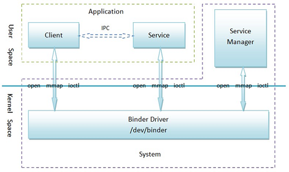

	* Ashmem
		- 使用文件描述符描述
		- 通过Binder在进程间传递

	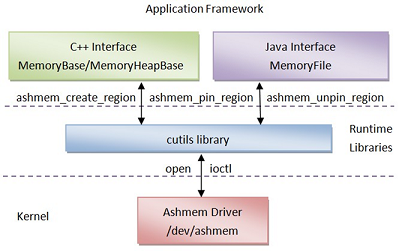

* Android硬件抽象层HAL
	- 设备驱动分为内核空间和用户空间两部分
	- 用户空间部分设备驱动即为HAL Module
		- HAL Module通过设备文件访问内核空间部分设备驱动
	- 系统服务通过HAL Module对硬件进行管理
		- 系统服务通过JNI访问HAL Module
	- 应用程序通过系统服务对硬件进行访问
		- 应用程序通过Binder IPC访问系统服务

	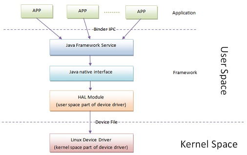

* Android应用程序组件
	- Activity：UI，交互
	- Service：后台计算
	- BroadcastReceiver：广播
	- ContentProvider：数据

* Android应用程序框架
	* 功能
		- 硬件管理
		- 服务提供
		- 组件管理
		- 进程管理
	* 按服务类型划分
		- Hardware Service: CameraService, LocationManagerService, LightsService
		- Software Service: PackageManagerService, ActivityManagerService, WindowManagerService
	* 按进程划分
		- System Server Process：PackageManagerService, ActivityManagerService, WindowManagerService
		- Independent Process：SurfaceFlinger，MediaPlayerService
	* 服务注册，获取和访问过程
	
	 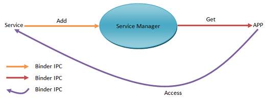

* Android用户界面架构
	* 窗口管理框架
		- Window
		- WindowManagerService
		- SurfaceFlinger

	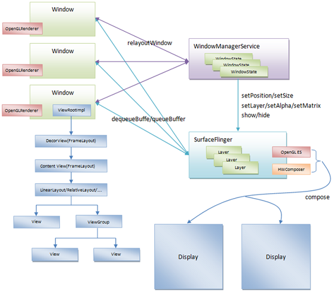
	
	* 资源管理框架
		- AssetManager
		- Resources

	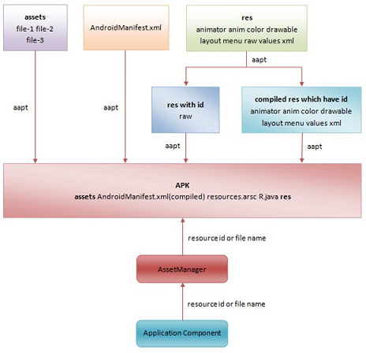

* Dalvik虚拟机
	- Dex文件编译与优化

	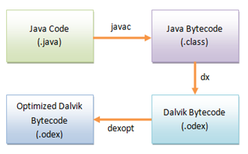

### Android启动过程

* Android正常模式启动流程：
	1. 系统加电，执行bootloader；bootloader负责初始化软件运行所需的最小硬件环境，最后加载内核到内存中
	2. 内核加载到内存后，进入内核引导阶段，在内核引导阶段最后，调用start_kernel进入内核启动阶段；start_kernel最终启动用户空间的init程序
	3. init程序负责解析init.rc配置文件，开启系统守护进程；两个最重要的守护进程是zygote和ServiceManager；Zygote是Android启动的第一个Dalvik虚拟机，负责启动Java世界的进程；ServiceManager是Binder通信的基础
	4. zygote虚拟机启动子进程system_server，在system_server中开启了Android核心服务并将核心服务添加到ServiceManager，然后系统进入systemReady状态
	5. 在systemReady状态下，ActivityManagerService与zygote中的socket通信，通过zygote启动HOME应用，进入系统桌面 

* init进程的执行过程
	1. 初始化文件系统和日志系统
	2. 解析init.rc和init.<hardware>.rc初始化文件
	3. 触发需要执行的Action和Service
	4. init循环监听处理事件；init触发所有Action后，进入一个无限循环，执行在可执行队列中的命令，重启异常退出的Service

* Android启动流程2： zygote后
	- zygote中定义一个socket，用于接收ActivityManagerService启动应用程序的请求
	- zygote通过fork系统调用创建system_server
	- 在system_server进程的init1和init2阶段分别启动Native System Service和Java System Service
	- 系统服务启动后会注册到ServiceManager中，用于Binder通信
	- ActivityManagerService进入systemReady状态
	- 在systemReady状态，ActivityManagerService与zygote的Socket通信，请求启动Home
	- zygote收到ActivityManagerService的连接请求，执行runSelectLoopMode处理请求
	- zygote处理请求会通过forkAndSpecialize启动新的应用进程，并最终启动Home

* zygote启动流程
	1. app_process：处理参数，设置虚拟机选项；修改进程名为zygote；调用AppRuntime的start方法启动ZygoteInit
	2. ZygoteInit: 创建Dalvik虚拟机；注册JNI方法
	3. 进入Java世界：
		1. 注册zygote的socket：通过socket，ActivityManagerService便可以通过zygote启动新的应用程序
		2. 预加载Class资源和Resource资源：通过预加载资源，让不同应用程序可以可以共享框架层资源，提高运行效率
		3. 启动system_server进程：system_server将开启Android的Native system service和Java system service，这是应用框架层运行的基础
		4. 执行MethodAndArgsCaller的run方法，继而执行SystemService的main方法
		5. 执行runSelectLoopMode方法；通过runSelectLoopMode便可以处理新的应用程序运行请求
	4. zygote在startSystemServer成功后，便进入一个无限循环，通过Socket监听客户端的连接请求；如果有请求到来，便调用runOnce方法来处理请求。

* system_server
	- zygote通过forkSystemServer创建system_server子进程
	- system_server生成后，执行handleSystemServerProcess；该方法中，首先做一些清理和初始化工作，接着调用RuntimeInit.zygoteInit方法
	- onZygoteInit开启system_server的Binder通信管道
	- 执行MethodAndArgsCaller的run方法，继而执行SystemService的main方法；main函数中：申请更多内存，加载android_server库，执行init1
	- Init1：
		- 启动核心系统服务SurfaceFlinger和SensorService
		- 调用SystemServer的init2方法
		- 初始化Binder通信

	- Init2：
		- 启动大量核心系统服务，Java System Service

* 
	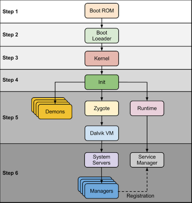

	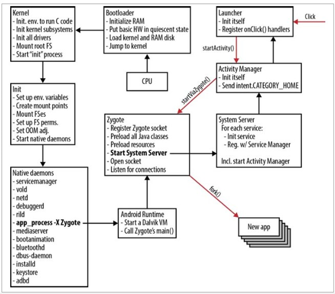

### Android应用程序进程启动和回收

* Android应用程序进程启动过程
	- ActivityManagerService.startProcessLocked
	- Process.start
	- Process.startViaZygote
	- Process.zygoteSendArgsAndGetResult
	- ZygoteConnection.runOnce
	- ZygoteConnection.handleChildProc
	- RuntimeInit.zygoteInit
		- nativeZygoteInit
		- applicationInit: invoke main of ActivityThread
	- ActivityThread.main

* Android应用进程回收机制
	- Linux内存回收机制：Out of Memory Killer
		- 每个进程都有一个oom_adj值，取值[-17, 15]；可通过/proc/<pid>/oom_adj访问
		- 每一个进程的oom_adj初始值等于其父进程的oom_adj值
		- oom_adj值越小，越不容易被杀死；其中-17表示不会被杀死
		- 内存紧张时，OOM Killer综合进程的内存消耗量，CPU时间，存活时间和oom_adj值来决定是否要杀死一个进程来回收内存
	- Android内存回收机制：Low Memory Killer
		- 进程的oom_adj值由ActivityManagerService根据运行在进程里面的组件状态来计算，取值[-16, 15]
		- 内存紧张时，LMK基于oom_adj值来决定是否要回收一个进程：当系统内存小于i时，在oom_adj值大于等于j的进程中，选择一个oom_adj值最大并且消耗内存最多的进程来回收
		- ActivityManagerService和WindowManagerService在特定情况下也会进行进程回收
	- 应用程序进程的oom_adj值
		- SYSTEM_ADJ(-16)：System Server进程
		- PERSISTENT_PROC_ADJ(-12)：android:persistent属性为true的系统App进程，如PhoneApp
		- FOREGROUND_APP_ADJ(0)：包含前台Activity的进程
		- VISIBLE_APP_ADJ(1)：包含可见Activity的进程
		- PERCEPTIBLE_APP_ADJ(2)：包含状态为Pausing、Paused、Stopping的Activity的进程，以及运行有Foreground Service的进程
		- HEAVY_WEIGHT_APP_ADJ(3)：重量级进程， android: cantSaveState属性为true的进程，目前还不开放
		- BACKUP_APP_ADJ(4)：正在执行备份操作的进程
		- SERVICE_ADJ(5)：最近有活动的Service进程
		- HOME_APP_ADJ(6)：HomeApp进程
		- PREVIOUS_APP_ADJ(7)：前一个App运行在的进程
		- SERVICE_B_ADJ(8)：SERVICE_ADJ进程数量达到一定值时，最近最不活动的Service进程
		- HIDDEN_APP_MIN_ADJ(9)和HIDDEN_APP_MAX_ADJ(15)：含有不可见Activity的进程，根据LRU原则赋予[9,15]中的一个值
	- 如果运行在进程A中的ContentProvider或者Service被绑定到进程B，并且进程B的oom_adj值比A的oom_adj值小，那么进程A的oom_adj值就会被设置成B的oom_adj值，但是不能小于FOREGROUND_APP_ADJ
	- ActivityManagerService在以下四种情况下会更新应用程序进程的oom_adj值，以及杀掉那些已经被卸载了的app所运行在的应用程序进程
		- activityStopped：停止Activity
		- setProcessLimit：设置进程数量限制
		- unregisterReceiver：注销BroadcastReceiver
		- finishReceiver：结束BroadcastReceiver
	- WindowManagerService在处理窗口的过程中发生Out Of Memory时，也会通知ActivityManagerService杀掉那些包含有窗口的应用程序进程

### Android组件化设计

* 组件化设计
	* 传统客户端应用程序
		- 运行载体是进程
		- 进程只有一个入口点：main
	* 组件化设计基本思想：Everything is Component
		- 程序由组件组成
		- 组件与进程剥离
		- 组件皆程序入口
	* 程序由组件组成
		- Activity：前台交互
		- Service：后台计算
		- BroadcastReceiver：广播通信
		- ContentProvider：数据封装
		- 此四种组件对客户端应用程序进行了很好的抽象
	* 组件与进程剥离
		- 将组件与进程进行剥离，使得进程对组件透明
		- 组件关闭时，进程可以继续存在；提高重新启动时的速度
		- 进程关闭时，组件可以继续存在；保护被杀进程里面的组件
	* 组件皆程序入口
		- 由于组件已于进程剥离，因此不存在进程入口的概念，只有组件入口的概念
		- Activity: onCreate
		- Service: onCreate
		- BroadcastReceiver: onReceive
		- ContentProvider: onCreate
	* 问题：
		- 谁来负责组件的启动和关闭？
		- 谁来维护组件的状态
		- 谁来管理组件运行时所需要的进程
		- 组件之间如何进行通信 

* 组件化支持
	* ActivityManagerService
		- 启动组件：组件启动时，检查其所要运行在的进程是否已经创建。如果已经创建就直接加载组件，否则，先将进程创建起来再加载组件
		- 关闭组件：组件关闭时，其所运行在的进程无需关闭，这样就可以让组件重新打开时得到快速启动
		- 维护组件状态：维护组件在运行过程的状态，这样组件可以在其所运行在的进程被回收的情况下仍然继续生存
		- 进程管理：在适当时候主动回收空进程和后台进程，以及通知进程自己进行内存回收
	* Binder
		- 为组件间通信提供支持：进程间、进程内
		- 高效的IPC机制
			- 进程间的组件通信时，通信数据只需一次拷贝
			- 进程内的组件通信时，跳过IPC进行直接的通信
		- 传统的IPC通信数据需要执行两次拷贝，一次是从源进程的用户空间拷贝到内核空间，然后再从内核空间拷贝到目标进程的用户空间
	* Low Memory Killer
		- 内存紧张时回收进程
		- 由于组件与进程时剥离的，因此进程回收不会影响组件的生命周期
		- 从低优先级进程开始回收
		- 给一个APP进程都有一个oom_adj值，根据进程所运行的组件计算出来的，值越小，优先级越高

### Android应用程序消息处理机制

* 带有消息队列的线程
	- 带有消息队列，用来执行循环性任务
	- 有消息时就处理，没有消息时就睡眠
	- e.g. 主线程，HandlerThread
	- 四要素：Message，MessageQueue，Looper，Handler

* 线程消息队列的创建
	- Looper.prepare/Looper.prepareMainLooper
		- new Looper (java)
		- new MessageQueue (java)
		- nativeInit
		- new NativeMessageQueue (native)
		- new Looper (native)

	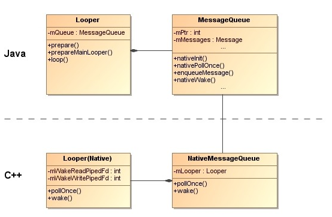

* pipe & epoll
	- pipe
		- 一种进程/线程间通信机制
		- 包含一个写端文件描述符和一个读端文件描述符
		- Looper通过读端文件描述符等待新消息的到来
		- Handler通过写端文件描述符通知Looper新消息的到来

	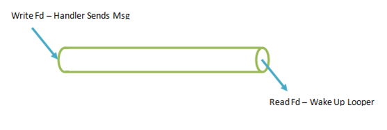

	- epoll
		- Looper利用epoll来监控消息队列是否有新的消息，也就是监控消息管道的读写文件描述符
		- why epool？ 
			- Looper除了监控消息管道之外，还需要监控其他文件描述符，例如，用来接收键盘、触摸屏事件的文件描述符

* 线程的消息循环 
	- Looper.loop (java)
	- MessageQueue.next
	- MessageQueue.nativePollOnce
	- NativeMessageQueue.pollOnce
	- Looper.pollOnce (native)
	- Looper.pollInner
		- epoll_wait
	- Lopper.awoken
		- nRead = read(mWakeReadPipeFd, buffer, sizeof(buffer))

* 线程的消息发送
	- Handler.sendMessage/Handler.post
	- Handler.sendMessageDelayed
	- Handler.sendMessageAtTime
	- Handler.enqueueMessage
	- MessageQueue.enqueueMessage
	- MessageQueue.nativeWake
	- NativeMessageQueue.wake
	- Looper.wake
		- nWrite = write(mWakeWritePipeFd, "W", 1)

* 线程消息的处理
	- msg.target.dispatchMessage(msg)
	- Handler.dispatchMessage
	- handleCallback/handleMessage
	

### 进程通信Binder

* Binder
	- Android对linux内核层的一个扩展，属于一个字符设备驱动，实现不同进程之间的间接通信
	- Android通过对Binder的封装，提供了一套Binder操作框架，便于上层使用

* C/S体系结构
	- Android将大量的核心功能放在不同的Service组件中实现
	- 提供服务的组件和使用服务的组件可以运行在不同的进程中
	- 通常把Service所在的进程称为Server进程，把使用Service组件的进程称为Client进程
	- Binder为这种体系结构提供IPC通信功能
	- 服务代理（Proxy）：位于Client端，提供访问服务的接口；主要作用是屏蔽用户端与Server端通信的细节；e.g. 数据的序列化/反序列化，通信协议
	- 服务存根（Stub）：位于Server端，屏蔽Proxy与Server端通信的细节；e.g. 数据的反序列化/序列化，通信协议的封装处理
	- ServiceManager：提供了Service的注册和检索功能；Service在启动过程中将自身信息注册到ServiceManager中，Client要使用服务时，只需向ServiceManager提供所需service的名字便可以获取Service信息；ServiceManager本身也是一个Server

* ServiceManager
	- ServiceManager是在init.rc中配置的Daemon System Service，由boot Action启动
	- ServiceManager先于其他服务启动；在其启动后，便可以对外提供服务注册，检索功能
	- ServiceManager还维护了一个Binder通信的上下文管理者ContextManager

* ServiceManager进程的启动过程
	1. 初始化Binder通信环境，打开Binder设备并映射共享内存
		- 由于进程的地址空间是彼此隔离的，但内核空间是可以共享的；因此要实现进程间通信，可以在内核中开辟缓冲区保存进程间通信数据，以此实现共享内存；通过open和mmap系统调用组合来实现共享内存
	2. 将自身注册为上下文管理者ContextManager
		- ServiceManager通过ioclt系统调用发送BINDER_SET_CONTEXT_MGR指令给Binder驱动程序
	3. 进入循环，等待接收并处理IPC通信请求

* Binder通信接口
	- 提供了通信协议的实现；主要由IBinder，BBinder，BpBinder三个类组成
	- IBinder定义了 Binder通信的接口
	- BBinder是Service对应的Binder对象
	- BpBinder是Client端访问BBinder的代理对象，负责打开Binder设备与服务端通信

* Binder在Java框架层
	- Binder的Java框架层 与Native框架层一样，具备C/S结构的主要组成部分：Client，Proxy，Stub，Server和Service
	- 为了便于Java框架层开发系统服务，在Java框架层提供了AIDL工具用于生成统一的Proxy和stub

* Binder跨进程机制
	- BpBinder，Binder代理方，主要用于向远方发送语义
	- BBinder，Binder响应方，主要用于响应语义
	- Binder代理方主要只负责“传递信息”的工作，并没有起到“远程过程调用”的作用，如果要支持远程过程调用，我们还需要提供“接口代理方”（BpInterface）和“接口实现体”（BnInterface）
	- 客户端并不直接和BpBinder（Binder代理）打交道，而是通过调用BpInterface（接口代理）的成员函数来完成远程调用；BpBinder已经被聚合进BpInterface了，它在BpInterface内部完成了一切跨进程的机制
	- 另一方面，与BpInterface相对的响应端实体就是BnInterface（接口实现），需要注意的是BnInterface是继承于BBinder的，并没有采用聚合的方式来包含一个BBinder对象
	- 此外，还需要一个专门的管理器来为通信两端牵线搭桥，这个管理器就是ServiceManager

	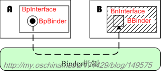
	
 
* Java层次中，与Binder相关的接口或类
	- Android要求所有的Binder实体都必须实现IBinder接口
	- 另外，不管是代理方还是实体方，都必须实现IInterface接口

	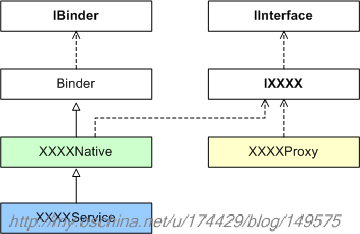

	- XXXNative，XXXProxy会根据aidl脚本自动生成；
	- 用户只需继承XXXNative编写一个具体的XXXService即可；这个XXXService就是远程通信的服务实体类，XXXProxy则是其对应的代理类

* C++层次的binder元素
	* BpBinder，BBinder都继承于IBinder
	* BpBinder
		- BpBinder最重要的职责就是实现跨进程传输的传输机制，至于具体传输的什么语义，它并不关心
		- transact()函数的参数，所有的语义都被打包成Parcel了
	* BpInterface
		- 内部的MRemote成员就是BpBinder对象
		- 需要继承BpInterface<>实现自己的代理类
	* BBinder
		- BBinder与BpBinder相对，主要关心的只是传输方面的东西，不太关心所传输的语义
	* BnInterface
		- BnInterface<>是与BpInterface相对应的模板类，关心传输的语义
		- 一般情况下，服务端不直接使用BnInterface<>，而是使用它的某个子类
		- 为此，我们需要编写一个新的BnXXX子类，并重载它的onTransact()成员函数
	* 几个重要的C++宏或模板
		- DECLARE_META_INTERFACE()
		- IMPLEMENT_META_INTERFACE()

	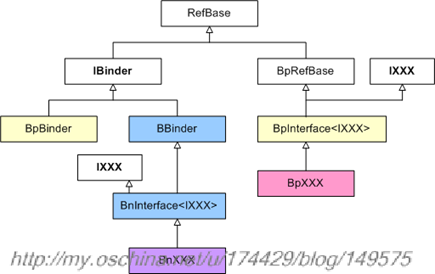	

	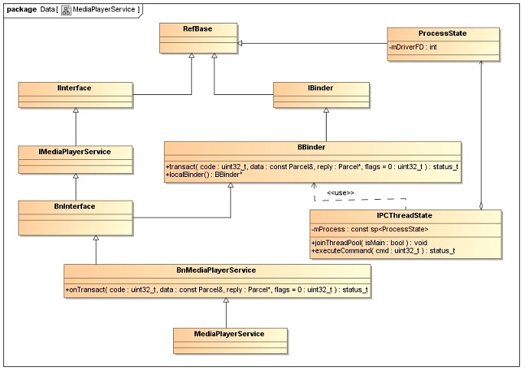

* 底层进程如何运用Binder机制来完成跨进程通信：ProcessState
	- 在每个进程中，会有一个全局的ProcessState对象
	- ProcessState对象采用单例模式，每一个应用进程中只会有唯一个ProcessState对象，被进程中的多个线程共用
	- ProcessState内有一个mDriverFD域，用来记录binder驱动所对应的句柄值
	- ProcessState对象构造时，就会打开binder驱动
	- ProcessState中的mHandleToObject记录所有BpBinder

* Service Manager
	- 对于普通Server来说，Client如果想要获得Server的远程接口，必须通过Service Manager远程接口提供的getService接口来获得，这本身就是一个使用Binder机制来进行进程间通信的过程
	- 而对于Service Manager这个Server来说，Client想要获得Service Manager远程接口，不必通过进程间通信机制获得，因为Service Manager远程接口是一个特殊的Binder引用，它的引用句柄一定是0
	- 获得Service Manager远程接口的函数是defaultServiceManager
	

### ActivityManagerService

### PackageManagerService

