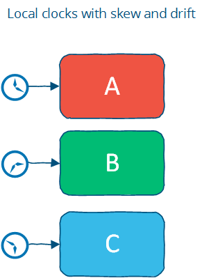
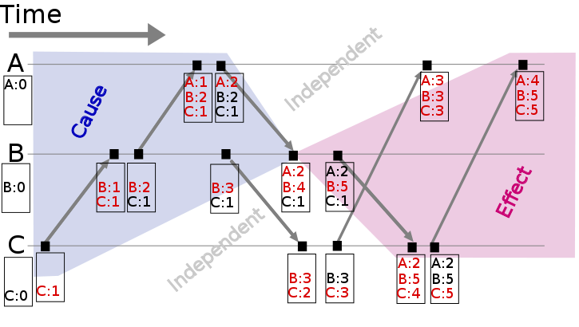
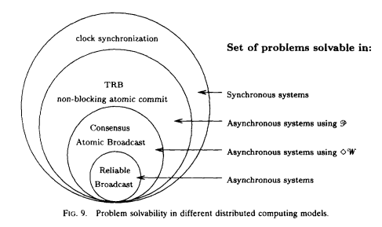

# [Distributed systems for fun and profit](http://book.mixu.net/distsys/index.html)

### 1. Basics: distributed systems at a high level

##### Introduction

* Distributed programming is the art of solving the same problem that you can solve on a single computer using multiple computers
* Much of distributed programming is about dealing with the implicationns of two consequences of distribution:
	- that information travels at (most) the speed of light
	- that independent things fail independently

##### Scalability and other good things to achieve

* Scalability 
	- Scalability is the ability of a system, network, or process, to handle a growing amout of work in a capable manner or its ability to be enlarged to accommodate that growth 
	- Size scalability: adding more nodes should make the system linearly faster; growing the dataset should not increase latency
	- Geographic scalability: it should be possible to use multiple data centers to reduce the time it takes to respond user queries, while dealing with cross-data center latency in some sensible manner
	- Administrative scalability: adding more nodes should not increase the administrative costs of the system; e.g. the administrators-to-machines ratio

* A scalable system is one that continues to meet the needs of its users as scale increases. There are two paticular relevant aspects: 
	- performance
	- availability

* Performance (and Latency)
	- Performance is characterized by the amount of useful work accomplished by a computer system compared to the time and resource used. 
	- This may involve achieving one or more of the following:
		- Short response time, low lantency for a given piece of work
		- High throughput, rate of processing work
		- Low utilization of computing resosurces
	- There are tradeoffs involved in optimizing for any of these outcomes
	- Latency is the time between when something happened and the time it has an impact or becomes visible. 
	- For example, latency could be measured in terms of how long it takes for a write to become visible to readers.
	- In a distributed system, there is a minimum latency that cannot be overcome: 
		- the speed of light limits how fast information can travel
		- hardware components have a minimum latency cost incurred per operation

* Availability (and fault tolerance)
	- The proportion of time a system is in a functioning condition. If a user cannot access the system, it is said to be unavailable
	- Distributed systems can take a bunch of unreliable components, and build a reliable system on top of them
	- Formulaically, availability is: Availability = uptime / (uptime + downtime)
	- The best we can do to achieve high availability is design for fault tolerance
	- Fault tolerance: ability of a system to behave in a well-defined manner once faults occur
	- You can't tolerate faults you haven't considered

##### Constrains

* Distributed systems are constrained by two physical factors:
	- the number of nodes, which increases with the required storage and computation capacity
	- the distance between nodes, information travels, at best, at the speed of light

* Working within those constraints:
	- an increase in the number of independent nodes increases the probability of failure in a system, reducing availability and increasing administrative costs
	- an increase in the number of independent nodes may increase the need for communication between nodes, reducing performance as scale increases
	- an increase in geographic distance increases the minimum latency for communication between distant nodes, reducing performance for certain operations

##### Abstractions and models

* Abstractions make things more manageable by removing real-world aspects that are not relevant to solving a problem
* Models describe the key properties of a distributed system in a precise manner
* Models that will be discussed:
	- system model:  asynchronous/synchronous
	- failure model: crash-fail, patitions, Byzantine
	- consistency model: strong, eventual

* A system that makes weaker guarantees has more freedom of action, and hence potentially greater performance, but it is also potentially hard to reason about
* One can often gain performance by exposing more details about the internals of the system, while systems that hide details are easier to understand.
* The ideal system meets both programmer needs (clean semantics) and business needs (availability/consistency/latency)

##### Design techniques: partition and replicate

* Partitioning is dividing the dataset into smaller distinct independent sets
	- Partitioning improves performance by limiting the amount of data to be examined and by locating related data in the same partition.
	- Partitioning improves availability by allowing partitions to fail independently, increasing the number of nodes that need to fail before availability is sacrificed 

	
* Replication is making copies of the same data on multiple machines, which allows more servers to take part in the computation.
	- Replication improves performance by making additional computing power and bandwidth applicable to a new copy of the data.
	- Replication improves availability by creating additional copies of the data, increasing the number of nodes that need to fail before availability is sacrificed.

* Replication allows us to achieve scalability, performance and fault tolerance. 
* Replication is also the source of many of the problems: copies of the data that has to be kept in sync on multiple machines means ensuring that the replication follows a consistency model

##### Further Readings

* [Fallacies of distributed computing](https://en.wikipedia.org/wiki/Fallacies_of_distributed_computing)
* [Notes on Distributed Systems for Young Bloods](https://www.somethingsimilar.com/2013/01/14/notes-on-distributed-systems-for-young-bloods/)

### 2. Up and down the level of abstraction

##### A system model

* System model
	- A set of assumptions about the environment and facilities on which a distributed system is implement 
	- Programs in a distributed system:
		- run concurrently on independent node
		- are connected by a network that may introduce nondeterminism and message loss
		- have no shared memory or shared clock
	- There are many implications:
		- each node execute a program concurrently
		- knowledge is local: nodes have fast access only to their local state, and any information about global state is potentially out of date
		- nodes can fail and recover from failure independently
		- messages can be delayed or lost; independent of node failure
		- clocks are not synchronized across node

* System models vary in their assumptions about the environment and facilities. These assumptions include:
	- what capabilities the nodes have and how they may fail
	- how communication links operate and how they may fail
	- properties of the overall system, such as assumptions about time and order
	

* A robust system is one that makes the weakest assumptions, on the other hand, strong assumptions make the system model easy to reason about

* Nodes in our system model
	- Nodes serve as hosts for computation and storage. They have:
		- the ability to execute program
		- the ability to store data into volatile memory, which can be lost upon failure, and into stable state, which can be read after a failure
		- a clock which may or may not be assumed to be accurate
	- There are many possible failure models which describe the ways in which nodes can fail.
		- most systems assume a crash-recovery failure model: nodes can only fail by crashing, and can (possibly) recover after crashing at some later point
		- Another alternative is to assume that nodes can fail by misbehaving in any arbitrary way. This is known as Byzantine fault tolerance.

* Communication links in our system model
	- Many distributed algorithms assume that there are individual links between each pair of nodes, that the links provide  FIFO order for message, that they can only deliver messages that were sent, and that send message can be lost
	- Some algorithms assume that the network is reliable, that messages are never lost and never delayed indefinitely.
	- A network partition occurs when the network fails while the nodes themselves remain operational. When this occurs, message may be lost or delayed until the network partition is repaired. Partition nodes may be accessible by some clients, and so must be treated differently from crash nodes.

	

* Timing/ordering assumptions
	- Any message sent from one node to the others will arrive at a different time and potentially in a different order at the other nodes
	- The two main alternative timing assumption:
		- Synchronous model: processes execute in lock-step; ther is a known upper bound on message transmission delay; each process has an accurate clock
		- Asychronous system model: No timing assumption, processes execute at independent rates; there is no bound on message transmission delay; useful clocks do not exist
	- It is easier to solve problems in the synchronous system model, you can make inferences based on those assumptions and rule out inconvenient failure scenarios by assuming they never occur
	 - However, real world systems are at best partially synchronous

##### The consensus problem

* Several nodes achieve consensus if they all agree on some value. More formally:
	- Agreement: every correct process must agree on the same value.
	- Integrity: every correct process decides at most one value, and if it decides some value, then it must have been proposed by some process.
	- Termination: all processes eventually reach a decision.
	- Validity: if all correct processes propose the same value V, then all correct processes decide V

* The consensus problem is at the core of many commercial distributed systems. After all, we want the reliability and performance of a distributed system without having to deal with the consequences of distribution, such as disagreements or divergence between nodes. Moreover, solving the consensus problem makes it possible to solve several related, more advanced problems such as atomic broadcast and atomic commit.

##### Two impossiblity results

* The FLP impoossibility result
	- Particularly relevant to people who design distributed algorithms
	- Examines the consensus problem under the asynchronous system model and assumed that 
		- nodes can only fail by crashing; 
		- the network is reliable, 
		- there are no bounds on message delay
	- Under these assumptions, the FLP result states that "there does not exist a (deterministic) algorithm for the consensus problem in an asynchronous system subject to failures, even if messages can never be lost, at most one process may fail, and it can only fail by crashing (stopping executing)".
	- This impossibility result is important because it highlights that assuming the asynchronous system model leads to a tradeoff: algorithms that solve the consensus problem must either give up **safety** or **liveness** when the guarantees regarding bounds on message delivery do not hold.

* The CAP theorem
	- The theorem states that of these three properties:
		- Consistency: all nodes see the same data at the same time.
		- Availability: node failures do not prevent survivors from continuing to operate.
		- Partition tolerance: the system continues to operate despite message loss due to network and/or node failure
	- Only two can be satisfied simultaneously, then we get three different system types:
		- CA: consistency + availability, examples include full strict quorum protocols, such as two-phase commit
		- CP: consistency + partition tolerance, examples include majority quorum protocols in which minority partitions are unavailable such as Paxos
		- AP: availability + partition tolerance, examples include protocols using conflict resolution, such as Dynamo

	

* The CA and CP system designs both offer the same consistency model: **strong consistency**
	- CA system cannot tolerate any node failures
	- CP system can tolerate up to f faults given 2f+1 nodes in a non-Byzantine failure model.
	- CA system does not distinguish between node failures and network failures, and hence must stop accepting writes everywhere to avoid introducing divergence (multiple copies). It cannot tell whether a remote node is down, or whether just the network connection is down: so the only safe thing is to stop accepting writes
	- CP system prevents divergence (e.g. maintains single-copy consistency) by forcing asymmetric behavior on the two sides of the partition. It only keeps the majority partition around, and requires the minority partition to become unavailable (e.g. stop accepting writes), which retains a degree of availability (the majority partition) and still ensures single-copy consistency
	

* Assuming that a partition occurs, the theorem reduces to a binary choice between availability and consistency.
	
	

* There are four conclusions that should be drawn from the CAP theorem:
	- Many system designs used in early distributed relational database systems did not take into account partition tolerance 
	- There is a tension between strong consistency and high availability during network partitions
		- Strong consistency guarantees require us to give up availability during a partition. This is because one cannot prevent divergence between two replicas that cannot communicate with each other while continuing to accept writes on both sides of the partition
		- Consistency can be traded off against availability and the related capabilities of offline accessibility and low latency. If "consistency" is defined as something less than "all nodes see the same data at the same time" then we can have both availability and some (weaker) consistency guarantee.
	- There is a tension between strong consistency and performance in normal operation
		- Strong consistency requires that nodes communicate and agree on every operation. This results in high latency during normal operation
		- If you can live with a consistency model that allows replicas to lag or to diverge, then you can reduce latency during normal operation and maintain availability in the presence of partitions
	- If we do not want to give up availability during a network partition, then we need to explore whether consistency models other than strong consistency are workable for our purposes

* Consistency and availability are not really binary choices, unless you limit yourself to strong consistency. But strong consistency is just one consistency model: the one where you, by necessity, need to give up availability in order to prevent more than a single copy of the data from being active.	

##### Consistency Model

* Consistency Model
	- A contract between programmer and system, wherein the system guarantees that if the programmer follows some specific rules, the results of operations on the data store will be predictable
	- Strong consistency models, capable of maintaining a single copy
		- Linearizable consistency
		- Sequential consistency
	- Weak consistency models, not strong
		- Client-centric consistency models
		- Causal consistency: strongest model available
		- Eventual consistency models
	- Consistency models are just arbitrary contracts between the programmer and system, so they can be almost anything.

 
* Strong consistency models
	- Linearizable consistency: under linearizable consistency, all operations appear to have executed atomically in *an order* that is consistent with the global real-time ordering of operations
	- Sequential consistency: under sequential consistency, all operations appear to have executed atomically in *some order* that is consistent with the order seen at individual nodes and that is equal at all nodes 
	- Sequential consistency allows for operations to be reordered as long as the order observed on each node remains consistent
	- Strong consistency models allow you as a programmer to replace a single server with a cluster of distributed nodes and not run into any problems

* A client-centric consistency model might guarantee that a client will never see older versions of a data item. This is often implemented by building additional caching into the client library, so that if a client moves to a replica node that contains old data, then the client library returns its cached value rather than the old value from the replica.

* Eventual consistency
	- The eventual consistency model says that if you stop changing values, then after some undefined amount of time all replicas will agree on the same value. 
	- It is implied that before that time results between replicas are inconsistent in some undefined manner. 
	- It's a very weak constraint, and we'd probably want to have at least some more specific characterization of two things:
		- how long is "eventually"? It would be useful to have a strict lower bound, or at least some idea of how long it typically takes for the system to converge to the same value
		- how do the replicas agree on a value? For example, one way to decide is to have the value with the largest timestamp always win

##### Further readings

* Impossibility of distributed consensus with one faulty process
* Perspectives on the CAP Theorem 
* [CAP Twelve Years Later: How the "Rules" Have Changed](https://www.infoq.com/articles/cap-twelve-years-later-how-the-rules-have-changed)
* [Replicated Data Consistency Explained Through Baseball](http://pages.cs.wisc.edu/~remzi/Classes/739/Papers/Bart/ConsistencyAndBaseballReport.pdf)
* [Life beyond Distributed Transactions: an Apostate’s Opinion](https://cs.brown.edu/courses/cs227/archives/2012/papers/weaker/cidr07p15.pdf)

	

### 3. Time and order

##### Time and order

* Order
	- Order as a property has received so much attention because the easiest way to define "correctness" is to say "it works like it would on a single machine". And that usually means that: 
		- we run the same operations 
		- we run them in the same order, even if there are multiple machines
	- The nice thing about distributed systems that preserve order is that they are generic. They will be executed exactly like on a single machine
	- Distributed systems do not behave in a predictable manner. They do not guarantee any specific order, rate of advance, or lack of delay. Each node does have some local order, as execution is (roughly) sequential, but these local orders are independent of each other

* Total and Partial order
	- The natural state in a distributed system is partial order. Neither the network nor independent nodes make any guarantees about relative order; but at each node, you can observe a local order
	- In a partially ordered set, some pairs of elements are not comparable and hence a partial order doesn't specify the exact order of every item
	- Any system that can only do one thing at a time will create a total order of operations 
	- Total order makes executions of programs predictable. This order can be maintained on a distributed system, but at a cost: 
		- communication is expensive
		- time synchronization is difficult and fragile

* Time
	- Time is a source of order
	- It allows us to define the order of operations, which also has an interpretation that people can understand e.g. a second, a minute, a day

* Three interpretations of time and timestamp:
	- Order
		- we can attach timestamps to unordered events to order them
		- we can use timestamps to enforce a specific ordering of operations or the delivery of messages. For example, by delaying an operation if it arrives out of order
		- we can use the value of a timestamp to determine whether something happened chronologically before something else
	- Duration
		-  Algorithms can use durations to make some judgment calls. In particular, the amount of time spent waiting can provide clues about whether a system is partitioned or merely experiencing high latency
	- Interpretation
		- The value of a timestamp can be interpreted as a date, which is useful, like a timestamp of when a downtime started from a log file.

* Benifits of time in a distributed system:
	- Time can define order across a system without communication
	- Time can define boundary conditions for algorithms
		- To distinguish between "high latency" and "server or network link is down"
		- In most real-world systems timeouts are used to determine whether a remote machine has failed, or whether it is simply experiencing high network latency. Algorithms that make this determination are called **failure detectors**

* Three timing assumptions:
	- The synchronous system model has a global clock
	- The partially synchronous model has a local clock
	- In the asynchronous system model one cannot use clocks at all

* Time with a "global-clock" assumption
	- The global clock assumption is that there is a global clock of perfect accuracy, and that everyone has access to that clock
	- The global clock is basically a source of total order: exact order of every operation on all nodes even if those nodes have never communicated
	- In reality, clock synchronization is only possible to a limited degree of accuracy
	- Assuming that clocks on distributed nodes are perfectly synchronized, we can use timestamps freely to determine a global total order. But there are many scenarios where a simple failure can cause hard-to-trace anomalies, such as a user accidentally changing the local time on a machine, or an out-of-date machine joining a cluster, or synchronized clocks drifting at slightly different rates 
	- Facebook's Cassandra is an example of a system that assumes clocks are synchronized. It uses timestamps to resolve conflicts between writes: the write with the newer timestamp wins
	- Google's Spanner: the paper describes their TrueTime API, which synchronizes time but also estimates worst-case clock drift
	
	

* Time with a "Local-clock" assumption
	- Local-clock assumes each machine has its own clock, but there is no global clock. It means you cannot meaningfully compare timestamps from two different machines
	- The local clock assumption assigns a partial order: events on each system are ordered but events cannot be ordered across systems by only using a clock

			

* Time with a "No-clock" assumption
	- There is the notion of logical time. Instead of using clocks, we track causality in some other way
	- We can use counters and communication to determine whether something happened before, after or concurrently with something else
	- This way, we can determine the order of events between different machines, but cannot say anything about intervals and **cannot use timeouts**
	- This is a partial order: events can be ordered on a single system using a counter and no communication, but ordering events across systems requires a message exchange
	- Vector clocks are a way to track causality without using clocks
	- Riak (Basho) and Voldemort (Linkedin) use vector clocks rather than assuming that nodes have access to a global clock of perfect accuracy

##### Vector clocks: time for causal order

* Lamport clocks and vector clocks are replacements for physical clocks which rely on counters and communication to determine the order of events across a distributed system. These clocks provide a counter that is comparable across different nodes

* Lamport Clock
	- A Lamport clock is simple. Each process maintains a counter using the following rules:
		- Whenever a process does work, increment the counter
		- Whenever a process sends a message, include the counter
		- When a message is received, set the counter to max(local_counter, received_counter) + 
	- A Lamport clock allows counters to be compared across systems, with a caveat: Lamport clocks define a partial order. If timestamp(a) < timestamp(b):
		- a may have happened before b or
		- a may be incomparable with b
	- Lamport clock can only carry information about one timeline, hence, comparing Lamport timestamps from systems that never communicate with each other may cause concurrent events to appear to be ordered when they are not

* Vector clock
	- A vector clock is an extension of Lamport clock, which maintains an array [ t1, t2, ... ] of N logical clocks, one per each node. Rather than incrementing a common counter, each node increments its own logical clock in the vector by one on each internal event. 
	- The update rules are:
		- Whenever a process does work, increment the logical clock value of the node in the vector
		- Whenever a process sends a message, include the full vector of logical clocks
		- When a message is received:
			- update each element in the vector to be max(local, received)
			- increment the logical clock value representing the current node in the vector
	- The issue with vector clocks is mainly that they require one entry per node, which means that they can potentially become very large for large systems. A variety of techniques have been applied to reduce the size of vector clocks: 
		- by performing periodic garbage collection
		- by reducing accuracy by limiting the size
	
	

##### Failure detectors: time for cutoff

* The amount of time spent waiting can provide clues about whether a system is partitioned or merely experiencing high latency, so we don't need to assume a global clock of perfect accuracy, it is simply enough that there is a reliable-enough local clock

* Failure detector
	- A failure detector is a way to abstract away the exact timing assumptions. 
	- Failure detectors are implemented using heartbeat messages and timers. Processes exchange heartbeat messages. If a message response is not received before the timeout occurs, then the process suspects the other process
	- A failure detector based on a timeout will carry the risk of being 
		- overly aggressive: declaring a node to have failed
		- overly conservative: taking a long time to detect a crash	

* Design of failure detector
	- Failure detectors can be characterized using two properties: completeness and accuracy
		- Strong completeness: every crashed process is eventually suspected by every correct process
		- Weak completeness: every crashed process is eventually suspected by some correct process
		- Strong accuracy: no correct process is suspected ever
		- Weak accuracy: some correct process is never suspected
	- Completeness is easier to achieve than accuracy. All you need to do is not to wait forever to suspect someone. 
	- Weak completeness can be transformed to strong completeness by broadcasting information about suspected processes
	- Avoiding incorrectly suspecting non-faulty processes needs a hard maximum on the message delay. 
		- Failure detectors in a synchronous system model can be strongly accurate. 
		- System models that do not impose hard bounds on message delay, failure detection can at best be eventually accurate
 	- Failure detector should be able to adjust to changing network conditions and to avoid hardcoding timeout values into it
	 	- For example, Cassandra uses an accrual failure detector, which is a failure detector that outputs a suspicion level (a value between 0 and 1) rather than a binary "up" or "down" judgment. This allows the application using the failure detector to make its own decisions about the tradeoff between accurate detection and early detection

	

##### Time, order and performance

* The natural view of the world is a partial order. You can transform a partial order into a total order, but this requires communication, waiting and imposes restrictions that limit how many computers can do work at any particular point in time

* All clocks are mere approximations bound either by network latency or by physics. Even keeping a simple integer counter in sync across multiple nodes is a challenge

* Algorithms care about more abstract properties rather than time:
	- the causal ordering of events
	- failure detection, e.g. approximations of upper bounds on message delivery)
	- **consistent snapshots**, e.g. the ability to examine the state of a system at some point in time; 

* Often the easiest way to ensure that events are delivered in some defined order is to nominate a single (bottleneck) node through which all operations are passed

* Is time/order/synchronicity really necessary? It depends. 
	- In some use cases, we want each intermediate operation to move the system from one consistent state to another. For example, in many cases we want the responses from a database to represent all of the available information, and we want to avoid dealing with the issues that might occur if the system could return an inconsistent result
	- In other cases, we might not need that much time/order/synchronization. For example, if you are running a long running computation, and don't really care about what the system does until the very end - then you don't really need much synchronization as long as you can guarantee that the answer is correct

##### Further reading

* Lamport clocks, vector clocks
	- Time, Clocks and Ordering of Events in a Distributed System - Leslie Lamport, 1978
* Failure detection
	- Unreliable failure detectors and reliable distributed systems - Chandra and Toueg
	- Latency- and Bandwidth-Minimizing Optimal Failure Detectors - So & Sirer, 2007
	- The failure detector abstraction, Freiling, Guerraoui & Kuznetsov, 2011
* Snapshots
	- Consistent global states of distributed systems: Fundamental concepts and mechanisms, Ozalp Babaogly and Keith Marzullo, 1993
	- Distributed snapshots: Determining global states of distributed systems, K. Mani Chandy and Leslie Lamport, 1985
* Causality
	- Detecting Causal Relationships in Distributed Computations: In Search of the Holy Grail - Schwarz & Mattern, 1994
	- Understanding the Limitations of Causally and Totally Ordered Communication - Cheriton & Skeen, 1993

### 4. Replication: preventing divergence

##### Replication

* Why replication problem interesing?
	- Parallel databases are differentiated is in terms of their replication features
	- Replication provides a context for many subproblems, such as leader election, failure detection, consensus and atomic broadcast

* Synchronous replication
	- Synchronous replication also known as active, or eager, or push, or pessimistic replication
	- The client sends the request, then it is blocked and waiting for a reply from the system. During the synchronous phase, the first server contacts the two other servers and waits until it has received replies from all the other servers. Finally, it sends a response to the client informing it of the result
	- This is a **write N-of-N approach**: before a response is returned, it has to be seen and acknowledged by every server in the system
	- From a performance perspective: the system will be as fast as the slowest server in it. The system will also be very sensitive to changes in network latency
	- Given the N-of-N approach, the system cannot tolerate the loss of any servers. When a server is lost, the system can no longer write to all the nodes, and so it cannot proceed
	- This arrangement can provide very strong durability guarantees: the client can be certain that all N servers have received, stored and acknowledged the request when the response is returned. In order to lose an accepted update, all N copies would need to be lost

	

* Asynchronous replication
	- Asynchronous replication: passive replication, or pull replication, or lazy replication 
	- The master/leader/coordinator immediately sends back a response to the client. It might at best store the update locally, but it will not do any significant work synchronously
	- At some later stage, the asynchronous portion of the replication task takes place. Here, the master contacts the other servers using some communication pattern, and the other servers update their copies of the data
	- This is a **write 1-of-N approach**: a response is returned immediately and update propagation occurs sometime later
	- From a performance perspective: the system is fast. The client does not need to spend any additional time waiting for the internals of the system to do their work. The system is also more tolerant of network latency, since fluctuations in internal latency do not cause additional waiting on the client side
	- Given the 1-of-N approach, the system can remain available as long as at least one node is up, at least in theory, though in practice the load will probably be too high
	- This arrangement can only provide weak, or probabilistic durability guarantees. If nothing goes wrong, the data is eventually replicated to all N machines. However, if the only server containing the data is lost before this can take place, the data is permanently lost
	- Passive replication cannot ensure that all nodes in the system always contain the same state. If you accept writes at multiple locations and do not require that those nodes synchronously agree, then you will run the risk of divergence

	

##### An overview of major replication approaches

xxx

### 5. Replication: accepting divergence

