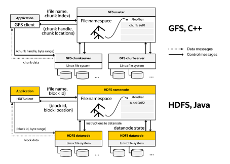
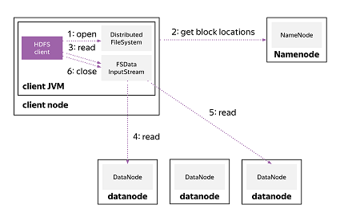
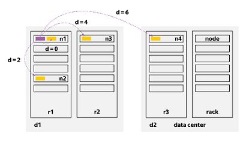
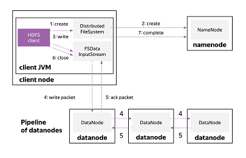
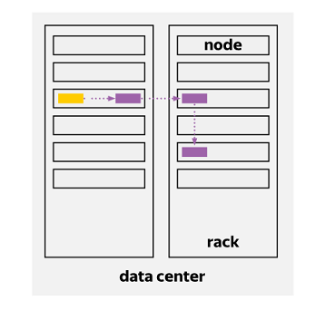
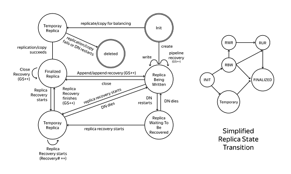
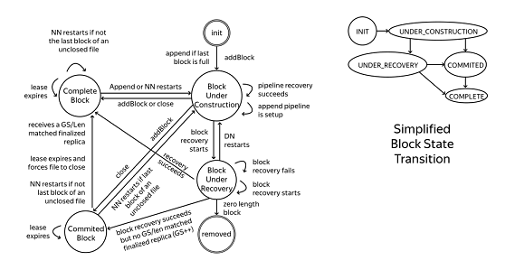
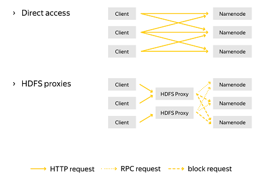

# Big Data Essentials: HDFS, MapReduce and Spark RDD

### 1. Distributed File Sysmtems, HDFS Architecture and Scalability

##### Scaling Distributed File System

* GFS key components
	- components failures are a norm => replication
	- even space utilisation
	- write-once-read-many

* Design of HDFS
	- Features:
		- Very large files
		- Streaming data access: write-once-read-many pattern
		- Commodity hardware
	- Types of applications does not do well using HDFS
		- Low-latency data access: HDFS is optimized fro delivering a high throughput of data, and this may be at the expense of lantency
		- Lots of small files: the NameNode holds file system metadata in memory, billions of files is beyond the capability of current hardware
		- Multiple writers, arbitrary file modifications: not support

* GFS v.s. HDFS

	

* File read data flow

	

	
* Network Topology: measure of closeness
	- d=0: processes on the same node
	- d=2: different nodes on the same rack
	- d=4: nodes on different racks in the same data center
	- d=6: nodes in different data centers
	
	

* File write data flow

	

* Replica placement
	- Hadoop's default strategy is to place the first replica on the same node as the client
	- Clients running outside the cluster, a node is chosen at random, which is not too full or too busy
	- The second replica is placed on a different from the first chosen at random
	- The third replica is placed on the same rack as the second, but on a different node
	- Further replicas are placed on random nodes in the cluster, although the system tries to avoid placing too many replicas on the same rack
	
	

* Summary questions
	
	- What vertical and horizontal scaling is?
		- Vertical scaling: scale up, use big capacity node
		- Horizontal scaling: scale out, use a collecion of nodes
	- Server roles in HDFS
		- namenode(master): maintains the filesystem tree and the metadata for all the files and directories in the tree
		- datanode(worker):  Store and retrieve blocks
	- How topology affects replica placement?
	- What chunk/block size is used for?
	- How HDFS client reads and writes data?

##### Block and Replica States, Recovery Process

* Replica state transition
	
	

	- datanode states
	- GS: each block has a version number Generation Stamp	
	- finalized: meda-information for this block on namenode is aligned with all the corresponding replica's states and data; You can safely read data from any datanode and get exactly the same content
	- RBW: Replica Being Written; 
	- RWR: Replica Waiting to be Recovered
	- RUR: Replica Under Recorvery
	- temporary: new generated replicas

* Block state transition

	

	- namenode states, in memory
	- under_construction: when user opens a file for writing, replica in RWR or RBW state
	- under_recovery: replica in RBW, RWR, or RUR state
	- commited: there are already some finalized replicas but not all of them, replica in RBW or finalized state
	- complete: all replicas are in the finalized state

* Block recovery
	- ...
* Lease recovery
	- ...
* Pipeline
	- ...
* Pipeline recovery
	- ...

* Summary
	- Block and replica state transition
	- Write pipeline statges and associated recovery process
	- 4 recovery processes and their puerpose
		- lease recovery
		- block recovery
		- replica recovery
		- pipeline recovery

##### HDFS Client

* Summary
	- request meta-information from Namenode and change its structure
		- ls, mkdir, rm, rm -r, touch, mv
	- read and write data from and to Datanode in HDFS
		- put, cat, head, tail, get, getmerge
	- change replication factor of files and get detailed information about data in HDFS
		- chown, hdfs groups, setrep, hdfs fsck, find

##### Web UI, REST API

* Web UI
	- through "http://namenode-server:50070/"

* Web HDFS
	
	

	- HTTP GET
		- OPEN: read data
		- GETFILESTATUS: get file meta information
		- LISTSTATUS: list directory
	-  HTTP PUT
		- CREATE
		- MKDIRS
		- RENAME
		- SETREPLICATION
	- HTTP POST
		- APPEND
	- HTTP DELETE
		- DELETE

* Summary
	- use HDFS Web UI to list folders and find detailed information about file blocks
	- use curl to move files through Web HDFS REST API, read/write files, etc.

##### Namenode Architecture

