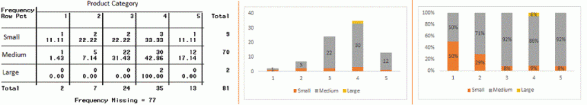
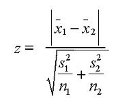
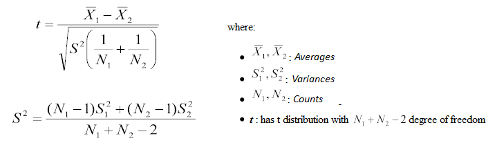
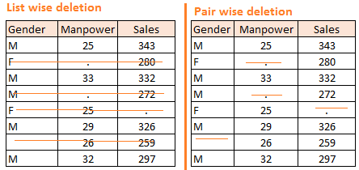
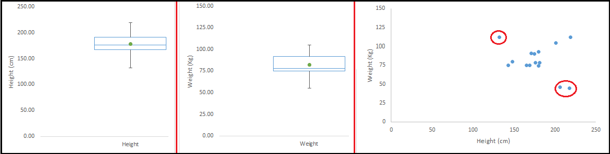
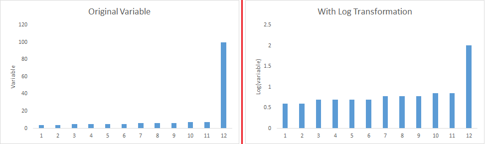

# [A Comprehensive Guide to Data Exploration](https://www.analyticsvidhya.com/blog/2016/01/guide-data-exploration/)

### 1. Steps of Data Exploration

Steps involved to understand and prepare your data for building your predictive model:

1. Variable Indenfication
2. Univariate Analysis
3. Bi-variate Analysis
4. Missing values treatment
5. Outlier treatment
6. Variable transformation
7. Variable creation

##### Variable Identification

First, identify Predictor(Input) and Target(Output) variables. Next, identify the data type and category of the variables. For example:

* Type of variable:
	- Predictor variable
	- Target variable  
* Data Type
	- Character
	- Numeric
* Variable Category
	- Categorical
	- Continuous
	

##### Univariate Analysis

At this stage, we explore variables one by one. Method to perform uni-variate analysis depends on whether the variable type is categorical or continuous.
 
**Continuous variables:** we need to understand the central tendency and spread of the variable:

* Central tendency
	- Mean
	- Median
	- Mode
	- Min
	- Max
* Measure of dispresion
	- Range, Quartile, IQR
	- Variance, Standard Deviation
	- Skewness and Kurtosis
* Visualization methods
	- Histogram
	- Box Plot
	
	
**Categorical Variables:** we use frequency table to understand distribution of each category. Bar chart can be used as visualizetion

##### Bi-variate Analysis

Bi-variate analysis finds out the relationship between variables. We can perform bi-variate analysis for any combination of categorical and continuous variables. 

**Continuous & Couninuous:** we should look at scatter plot. The pattern of scatter plot indicates the relationship between variables. the relationship can be linear or non-linear.

We use correlation to indicates the strength of the relationship.

Correlation = Covariance(X,Y)/SQTR(Var(X) * Var(Y))

**Categorical & Categorical** To find the relationship between two categorical variables, we can use the following methods

* Two-way table
	- Creating a two-way table of count and count%
	- The rows represents the category of one variable and the columns represents the category of the other variable. 
* Stacked column chart
	- This method is more of a visual form of Two-way table

	
	
* Chi-Sqaure test	
	- This test is used to derive the statistical significance of relationship between the variables. Also, it tests whether the evidence in the sample is strong engough to generalize that the relationship for a large population. 
	- Chi-square is based on the difference between the expected and observed frequencies in one or more categories in the two-way table. It returns probability for the computed chi-square distribution with the degree of freedom
	

**Categorical & Continuous** We can draw box plots for each level of categorical variables. To look at the statistical significance we can perform Z-test, T-test or ANOVA

* Z-test/Test
	- Either test assess whether mean of two groups are statistically different from each other or not
	- If the probability of Z is small then the difference of two averages is more significant.		
	
	

	- T-test is very similar to Z-test, it is used when number of observation for both categories is less than 30

	

* ANOVA
	- It assess whether the average of more than two groups is statistically different

### 2. Missing value Treatment

Missing data in the training data set can reduce the power/fit of a model or can lead to a biased model. 

##### Why my data has missing values?

They may occur at two stages:

1. Data Extraction: It is possible that there are problems with extraction process. Errors at data extraction stage are typically easy to find and can be correct easily
2. Data collection: errors occur at time of data collection are harder to correct. They can be categorized in four types:
	- Missing completely at random: this is a case when the probability of missing variable is same for all observations
	- Missing at random: this is a case when variable is missing at random and missing ratio varies for different values/level of other input variables. For example, we can collecting data for age and female has higher missing value compare to male
	- Missing that depends on unobserved predictors: this is a case  when the missing values are not random and are related to the unobserved input variable
	- Missing that depends on the missing vallue itself: this is a canse when probability of missing value is directly correlated with missing value itself. For example, people with higher or lower income are likely to provide non-response to their earning
	

##### Which are the methods to treat missing values?

**1. Deletion** 

It is of two types: List Wise Deletion and Pair Wise Deletion

* List wise deletion
 	- delete observations where any of the variable is missing
	- Advantage: simple
	- Disadvantage: reduces the power of model because it reduces the sample size
* Pair wise deletion
	- we perform analysis with all cases in which the variables of interest are present
	- Advantage: it keeps as many cases available for analysis
	- Disadvantage: it uses different sample size for different variables
	
	

**2. Mean/Mode/Median Imputation** 

Imputation is a method to fill in the missing values with estimated ones. The objective is to employ known relationships that can be identified in the valid values of the data set to assist in estimating the missing values. 

Mean/Mode/Median imputation is one of the most frequently used methods. It consists of replacing the missing data for a given attribute of that variable. It can be of two types:

* Generalized imputation
	- replace missing value with mean or median
	- E.g. variable "Manpower" is missing, so we take average of all non missing values of "Manpower" and then replace missing value with it
* Similar case Imputation
	- E.g. we can calculate average for gender "Male" and "Female" individually of non missing values of manpower, then replace the missing value based on gender

**3. Prediction Model** 

Prediction model is one of the sophisticated method for handing missing data. We create a predictive model to estimate values that will substitute the missing data. We can use regression, ANOVA, Logistic regression and various modeling technique to perform this.

There are 2 drawbacks for this approach:

1. The model estimated values are usually more well-behaved than the true values
2. If there are no relationships with attributes in the data set and the attribute with missing values, then the model will not be precise for estimating mising values

**4. KNN Imputation**

The missing values are imputed using given number of attributes that are most similar to the attribute whose values are missing. The similarity of two attributes is determined using a distance function. 

It is also known to have certain advantage & disadvantage

* Advantages:
	- k-nearest neighbour can predict both qualitative & quantitative attributes
	- Creation of predictive model for each attribute with missing data is not required
	- Attributes with multiple missing values can be easily treated
	- Correlation structure of the data is taken into consideration
* Disadvantages:
	- KNN algorithm is very time-consuming in analyzing large database. It searches through all the dataset looking for the most similar instance
	- Choice of k-value is very critical
	

### 3. Techniques of Outlier Detection and Treatment

##### What is an outlier?

Outlier is an observation that appears far away and diverges from an overall pattern in a sample. It needs close attention else it can result in wildly wrong estimations. 

Outlier can be of two types: Univariate and Multivariate

Example of Mutivariate outlier:

Outliers can drastically change the results of the data analysis and statistical modeling. There are numerous unfavourable impacts of outliers in the data set:

* It increases the error variance and reduces the power of statistical tests
* If the outliers are non-randomly distributed, they can decrease normality
* They can bias or influence estimates that may be of substantive interest
* They can also impact the basic assumption of regression, ANOVA, and other statistical model assumptions

##### What causes outliers?

Causes of outliers can be classified in two broad categories:

1. Artificial (Error) / Non-natural
2. Natural

Types of outliers:

* Data Entry Errors
	- Human erros such as errors caused during data collection
* Measurement Error
	- It is the most common source of outliers
	- This is caused when the measurement instrument used turns out to be faulty
	- E.g. there are 10 weighing machines, 9 of them are correct, 1 is faulty. Weights measured on faulty machine can lead to outliers
* Experimental Error
	- E.g. In a 100m sprint of 7 runners, one runner missed out on concentrating on the ‘Go’ call which caused him to start late. Hence, this caused the runner’s run time to be more than other runners. His total run time can be an outlier
* Intentional Outlier
	- This is commonly found in self-reported measures that involves sensitive data
	- E.g. Teens would typically under report the amount of alcohol that they consume. Only a fraction of them would report actual value. Here actual values might look like outliers
* Data Processing Error
	- When perform data mining, we extract data from multiple sources. It is possible that some manipulation or extraction errors may lead to outliers in the dataset
* Sampling Error
	- E.g. We have to measure the height of athletes. By mistake, we include a few basketball players in the sample. This inclusion is likely to cause outliers in the dataset
* Natural Outlier
	- When an outlier is not artificial (due to error), it is a natural outlier

##### How to detect and remove Outliers?

Most commonly used method to detect outlier is visualization. We use various visualization methods, like Box-plot, Histogram, Scatter Plot.

Some other useful analysts to detect outliers:
* Any value, which is beyond the range of -1.5*IQR to 1.5*IQR
* Any value which out of range of 5th and 95th percentile
* Three or more standard deviation of the examination from mean
* depends on the business understanding
* Bivariate and multivariate outliers are typically measured using either an index of influence or leverage, or distance. Popular indices sucn as Mahalanobis' distance and Cook's D are frequently used to detect outliers

Most of the ways to deal with outliers are similar to the methods of missing values like deleting observations, transforming them, binning them, treat them as separate group, imputing values and other statistical methods. 

Common techniques used to deal with outliers:

* Deleting observations
	- We delete outlier values if it is due to data entry error, data processing error, or outlier observations are very small in numbers
	- we can also use trimming at both ends to remove outliers 
* Transforming and binning values
	- Transforming variables can also eliminate outliers. Natural log of a value reduces the variation caused by extreme values
	- Binning is also a form of variable transformation. Decision tree algorithm allows to deal with outliers well due to binning of variable
	- We can also use the preocess of assigning weights to different observations 
*  Imputing
	- Like imputing of missing values, we can use mean, median, mode imputation methods
	- Before imputing, we should analyse if it is natural outlier or artificial
	- We can also use statistical model to predict values of outlier observation
*  Treat separately
	- If there are significant number of outliers, we should treat them separately in the statistical model. One of the approach is to treat both groups as two different groups and build individual model for both groups and then combine the output

### 4. The Art of Feature Engineering

##### Feature Engineering

Feature engineering is the science and art of extracting more information from existing data. 

Feature engineering can be divided in 2 steps:

* Variable transformation
* Variable/Feature creation

##### Variable Transformation

Transformation is a process that changes the distribution or relationship of a variable with others. In data modeling, transformation refers to the replacement of a variable by a function. For instance, replacing a variable x by the square/cube root or logarithm x is a transformation

Below are the situations where variable transformation is a requisite:

* When we want to change the scale of a variable or standardize the value of a variable for better understanding. 
* When we can transform complex non-linear relationships into linear relationships. Linear relationship between variables is easier to comprehend compared to a non-linear or curved relation. Transformation helps us to convert a non-linear relation into linear relation, and improve the prediction. Log transformation is one of the commonly used transformation technique used in these situations
* Symmetric distribution is preferred over skewed distribution as it is easier to interpret and generate inferences. Some modeling techniques requires normal distribution of variables. We can use transformations to reduce skewness. For right skewed distribution, we take square/cube root or logarithm of variable and for left skewed, we take square/cube or exponential of variables

	
	
* Variable transformation is also done from an implementation point of view (Human involvement). e.g. Binning of variables

Common methods of variable trainsformation

* Logarithm: Log of a variable is a common transformation method used to change the shape of distribution of the variable. It is generally used for reducing right skewness of variables. It can not be applied to zero or negitive values
* Square/Cube root: the square and cube root of a variable has a sound effect on variable distribution. However it is not as significant as logarithm transformation. Cube root can be applied to negative values including zero
* Binning: it is used to categorize variables. It is performed on original values, percentile, or frequency. Decision of categorization technique is based on business understanding. We can also perform co-variate binning which depends on the value of more than one variables

##### Feature/Variable Creation & Its benefits

Feature/Variable creation is a process to generate a new variables/features based on existing variables. This step is used to highlight the hidden relationship in a variable

Techniques to create new features:

* Creating derived variables
	- This refers to creating new variables from existing variables using set of functions or different methods
	- This is depends on business understanding of the analyst
	- Methods such as taking log of variables, binning variables and other methods of variable transformation can also be used to create new variables
* Creating dummy variables
	- One of the most common application of dummy variable is to convert categorical variable into numerical variables
	- Dummy variables are also called Indicator Variables
	- It is useful to take categorical variable as predictor in statistic models

 

 
 
 
 
 
 
 
 
 
 