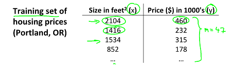
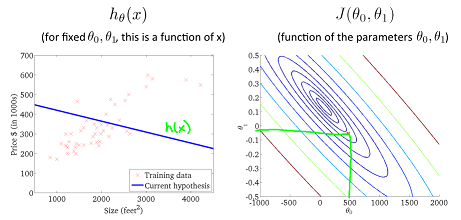
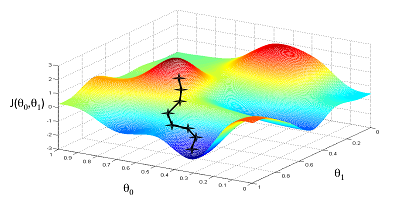
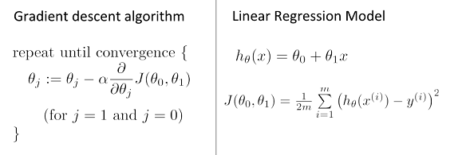
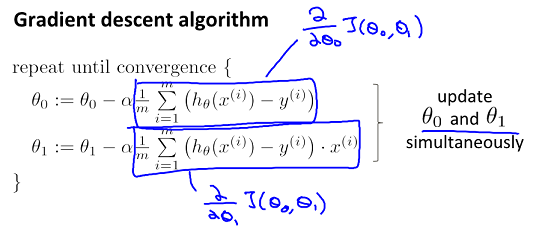
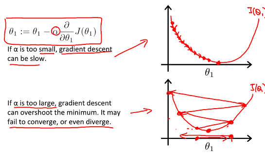
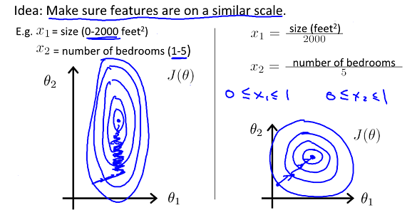
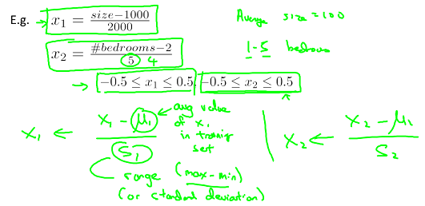
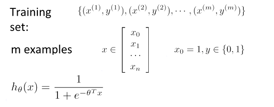
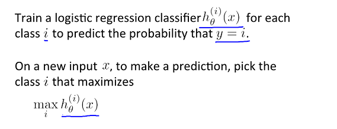

# Machine Learning by NG

### 1. Introduction

* Machine Learing
	- Grew out of work in AI
	- New capability for computers

* Examples:
	- Database mining
		- large datasets from growth of automation/web
		- E.g., Web click data, medical records, biology, engineering
	- Application can't program by hand
		- E.g., Autonomous helicopter, handwriting recignition, Natural Language Processing(NLP), Computer Vision
	- Self-customizing programs
		- E.g., Amazon, Netflix product recommendations
	- Understanding hunman learning(brain, real AI) 

* Machine Learning definition
	- Arthur Samuel (1959). Machine Learning: Field of study that gives computers the ability to learn without being explicitly programmed.
	- Tom Mitchell (1998). Well-posed Learning Problem: A computer program is said to learn from experience E with respect to some task T and some performance measure P, if its performance on T, as measured by P, improves with experience E.
	- E.g.
		- T: classifying emails as spam or not
		- E: watching you label emails as spam or not
		- P: the number of fraction of emails correctly classified as spam/not spam

* Machine learning algorithms
	- Supervised learning
	- Unsupervised learning
	- Others: reinforcement learning, recommender systems

* Supervised learning
	- "right answers" given
	- Regression: predict **continuous** valued output; e.g., housing price prediction
	- Classification: predict **discrete** valued output (0 or 1); e.g., cancer detection: malignant or benign

* Unsupervised learning
	- Clustering

### 2. Linear Regression with One Variable

* Model representation

	

	

	

* Cost function

	
	
	

	

* Gradient descent

	

	

	
	
	

* Learning rate

	

	- Gradient descent can converge to a local minimum, even with the learning rate fixed

### 3. Linear Algebra Review

...

### 4. Linear Regression with Multiple Variables 

##### Multiple Variables

* Gradient descent for multiple variables

	

##### Gradient descent in practice

* Feature scaling

	

	- get every feature into approximately a [-1, 1] range

	- Mean normalization
	
	
	

* Learning rate: making sure gradient desent is working correctly

	

	
	
	
	

* Features and polynomial regression
	
	

##### Normal equation

* Normal equation
	
	

* Intuition
	
	

* Compared with gradient descent

	
	
	
### 5. Octave Turorial

...

### 6. Logistic Regression

* Hypothesis representation

	

	

	
* Decision boundary

	

	

* Cost function

	

	

	

	

* Gradient descent

	
	

* Optimization algorithm

	

* Multi-class classification
	
	
	
	

### 7. Regularization

* The problem of overfitting

	

	

* Addressing overfitting

	

	

### 8. Neural Networks: Representation

### 9. Nural Networks: Learning

### 10. Advice for Applying Machine Learning

### 11. Machine Learning System Design

### 12. Support Vector Machines

### 13. Clustering

### 14. Dimensionality Reduction

### 15. Anomaly Detection

### 16. Recommender Systems

### 17. Large Scale Machine Learning

### 18. Application Example: Photo OCR

### 19. Conclusion

