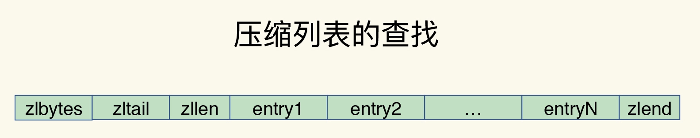

# Redis核心技术与实战

##### 0. Outlines

* Redis知识全景
    - 系统纬度：Redis设计原理；系统设计规范，run-to-complete模型、epoll网络模型
    - 应用纬度：应用场景驱动，典型案例驱动
    - 高性能主线：线程模型、数据结构、持久化、网络框架
    - 高可用主线：主从复制、哨兵机制
    - 高可扩展主线：数据分片，负载均衡

* Redis问题画像

##### 1. 基本架构

* 键值数据库的数据模型
  - 数据类型：String，哈希，列表，集合
  - 数据操作：PUT/GET/DELETE/SCAN/EXISTS
  - 数据存储：内存or外存？ -- 应用场景
  

* 键值数据库的基本组件
  - 访问框架：函数库调用，网络框架
  - 索引模块：哈希表、B+ 树、字典树
  - 操作模块：GET/SCAN，PUT，DELETE
  - 存储模块：内存分配器，持久化

* Redis基本组件
  - Redis主要通过网络框架进行访问
  - Redis数据类型很丰富，因此也带来了更多的操作接口
  - Redis的持久化模块能支持两种方式：日志（AOF）和快照（RDB）
  - Redis支持高可靠集群和高可扩展集群

##### 3. 数据结构

* 数据结构
  - 数据类型：String，List，Hash，Set，Sorted Set
  - 底层数据结构：简单动态字符串，双向链表，压缩列表，哈希表，跳表，整数数组
  

* 哈希表
  - 全局哈希表：Redis用一个哈希表来保存所有键值对，实现从键到值的快速访问O(1)
  - 哈希冲突, 链式哈希
  - rehash：增加哈希桶数量，让元素能在更多的桶之间分散保存，减少单个桶中的冲突
  - 渐进式rehash：处理请求时，顺带从哈希表1中将这个索引位置上的所有entries拷贝到哈希表2中

* 压缩列表
  - 类似数组
  - 表头有三个字段： 
    - zlbytes：列表长度
    - zltail：列表尾的偏移量
    - zllen，entry个数
  - 表尾zlend：表示列表结束
  - 查找第一个和最后一个元素，复杂度是O(1)
  - 查找其他元素的复杂度是O(N)

* 跳表
  - 在链表的基础上，增加了多级索引
  - 查找过程就是在多级索引上跳来跳去
  - 查找复杂度是O(logN)
  

* 不同操作的复杂度
  - 单元素操作是基础
    - 对单个数据实现的增删改查操作（HGET/HSET/HDEL/SADD/SREM/SRANDMEMBER），复杂度由集合采用的数据结构决定
  - 范围操作非常耗时
    - HGETALL/SMEMBERS/LRANGE /ZRANGE等，复杂度一般是O(N)，应该尽量避免
    - 可使用SCAN系列操作（HSCAN/SSCAN/ZSCAN），实现了渐进式遍历
  - 统计操作通常高效
    - 对集合中所有元素个数的记录（LLEN/SCARD），结构中有专门记录，复杂度只有O(1)
  - 例外情况：
    - 压缩列表和双向链表都会记录表头和表尾的偏移量
      - 在列表的头尾增删元素，复杂度也只有O(1)
    - List类型两种底层实现结构：双向链表和压缩列表
      - POP/PUSH效率高，主要用于FIFO队列场景

##### 3. 高性能IO模型

* Redis单线程
  - Redis的主要流程：网络IO和键值对读写，是由一个线程来完成的
  - 其他功能：持久化、异步删除、集群数据同步等，是由额外的线程执行的
  - 为什么用单线程？ 避免多线程开发的并发控制问题
  - 为什么单线程Redis这么快？
    1. Redis的大部分操作在内存上完成，并且采用了高效的数据结构
    2. Redis采用了多路复用机制
  

* 基本IO模型与阻塞点
  - 潜在的阻塞点：accept()和recv()
  - 当客户端有连接请求，但一直未能成功建立起连接时，会阻塞在accept()
  - 当Redis从客户端读取数据时，如果数据一直没有到达，会阻塞在recv()

* 非阻塞模式
  - 套接字类型
    - socket()方法，返回**主动套接字**
    - 然后调用listen()方法，将主动套接字转化为**监听套接字**，监听客户端的连接请求
    - accept()方法接收到达的客户端连接，并返回**已连接套接字**
  - 监听套接字设置非阻塞模式：
    - 当调用accept()但一直未有连接请求到达时，Redis线程可以返回处理其他操作
    - 需要有机制继续监听套接字上后续连接请求，并在有请求时通知Redis
  - 已连接套接字设置非阻塞模式：
    - 调用recv()后，如果已连接套接字上一直没有数据到达，Redis线程可以返回处理其他操作
    - 需要有机制继续监听该已连接套接字，并在有数据达到时通知Redis
 
 
* 基于多路复用的高性能IO模型
  - select/epoll机制，一个线程处理多个IO流
  - 同时存在多个监听套接字和已连接套接字，内核会监听这些套接字上的连接请求或数据请求 
  - 一旦监测到有请求到达时，就会触发相应的事件
  - 事件会被放进一个事件队列，Redis单线程对该事件队列不断进行处理

