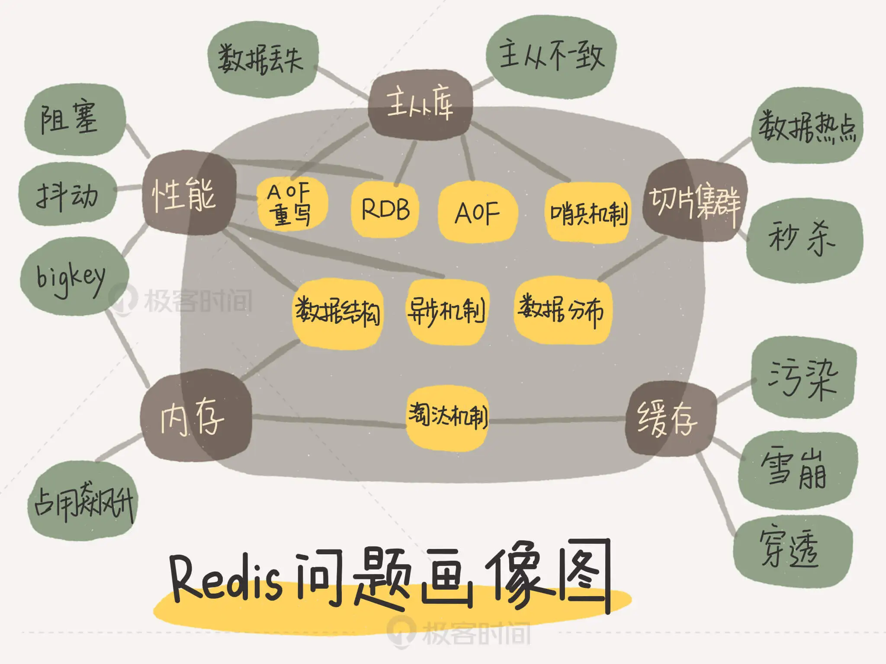
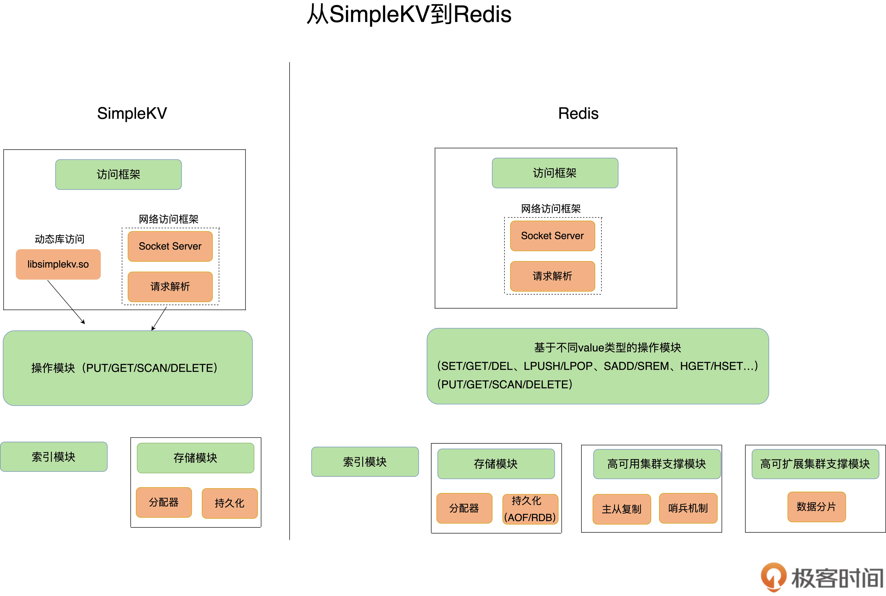
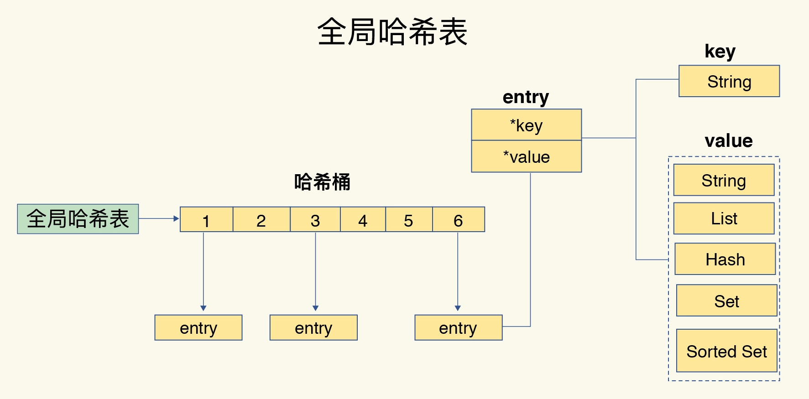
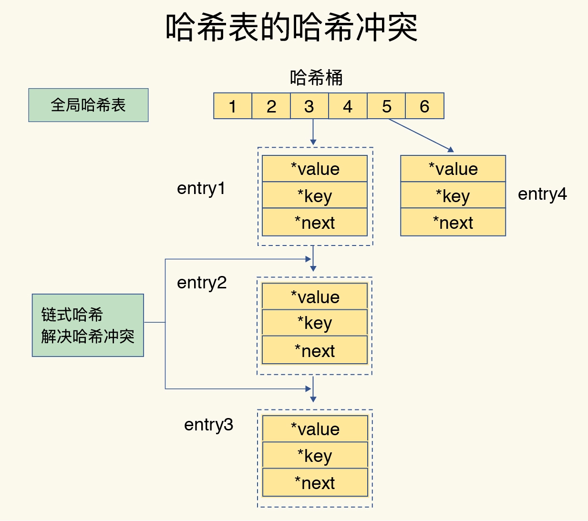

# Redis核心技术与实战

##### 0. Outlines

* Redis知识全景
    - 系统纬度：Redis设计原理；系统设计规范，run-to-complete模型、epoll网络模型
    - 应用纬度：应用场景驱动，典型案例驱动
    - 高性能主线：线程模型、数据结构、持久化、网络框架
    - 高可用主线：主从复制、哨兵机制
    - 高可扩展主线：数据分片，负载均衡


* Redis问题画像




##### 1. 基本架构

* 键值数据库的数据模型
  - 数据类型：String，哈希，列表，集合
  - 数据操作：PUT/GET/DELETE/SCAN/EXISTS
  - 数据存储：内存or外存？ -- 应用场景
  

* 键值数据库的基本组件
  - 访问框架：函数库调用，网络框架
  - 索引模块：哈希表、B+ 树、字典树
  - 操作模块：GET/SCAN，PUT，DELETE
  - 存储模块：内存分配器，持久化




* Redis基本组件
  - Redis主要通过网络框架进行访问
  - Redis数据类型很丰富，因此也带来了更多的操作接口
  - Redis的持久化模块能支持两种方式：日志（AOF）和快照（RDB）
  - Redis支持高可靠集群和高可扩展集群


##### 3. 数据结构

* 数据结构
  - 数据类型：String，List，Hash，Set，Sorted Set
  - 底层数据结构：简单动态字符串，双向链表，压缩列表，哈希表，跳表，整数数组
  


* 哈希表
  - 全局哈希表：Redis用一个哈希表来保存所有键值对，实现从键到值的快速访问O(1)
  - 哈希冲突, 链式哈希
  - rehash：增加哈希桶数量，让元素能在更多的桶之间分散保存，减少单个桶中的冲突
  - 渐进式rehash：处理请求时，顺带从哈希表1中将这个索引位置上的所有entries拷贝到哈希表2中






* 压缩列表
  - 类似数组
  - 表头有三个字段： 
    - zlbytes：列表长度
    - zltail：列表尾的偏移量
    - zllen，entry个数
  - 表尾zlend：表示列表结束
  - 查找第一个和最后一个元素，复杂度是O(1)
  - 查找其他元素的复杂度是O(N)


* 跳表
  - 在链表的基础上，增加了多级索引
  - 查找过程就是在多级索引上跳来跳去
  - 查找复杂度是O(logN)
  


* 不同操作的复杂度
  - 单元素操作是基础
    - 对单个数据实现的增删改查操作（HGET/HSET/HDEL/SADD/SREM/SRANDMEMBER），复杂度由集合采用的数据结构决定
  - 范围操作非常耗时
    - HGETALL/SMEMBERS/LRANGE /ZRANGE等，复杂度一般是O(N)，应该尽量避免
    - 可使用SCAN系列操作（HSCAN/SSCAN/ZSCAN），实现了渐进式遍历
  - 统计操作通常高效
    - 对集合中所有元素个数的记录（LLEN/SCARD），结构中有专门记录，复杂度只有O(1)
  - 例外情况：
    - 压缩列表和双向链表都会记录表头和表尾的偏移量
      - 在列表的头尾增删元素，复杂度也只有O(1)
    - List类型两种底层实现结构：双向链表和压缩列表
      - POP/PUSH效率高，主要用于FIFO队列场景


##### 3. 高性能IO模型

* Redis单线程
  - Redis的主要流程：网络IO和键值对读写，是由一个线程来完成的
  - 其他功能：持久化、异步删除、集群数据同步等，是由额外的线程执行的
  - 为什么用单线程？ 避免多线程开发的并发控制问题
  - 为什么单线程Redis这么快？
    1. Redis的大部分操作在内存上完成，并且采用了高效的数据结构
    2. Redis采用了多路复用机制
  

* 基本IO模型与阻塞点
  - 潜在的阻塞点：accept()和recv()
  - 当客户端有连接请求，但一直未能成功建立起连接时，会阻塞在accept()
  - 当Redis从客户端读取数据时，如果数据一直没有到达，会阻塞在recv()


* 非阻塞模式
  - 套接字类型
    - socket()方法，返回**主动套接字**
    - 然后调用listen()方法，将主动套接字转化为**监听套接字**，监听客户端的连接请求
    - accept()方法接收到达的客户端连接，并返回**已连接套接字**
  - 监听套接字设置非阻塞模式：
    - 当调用accept()但一直未有连接请求到达时，Redis线程可以返回处理其他操作
    - 需要有机制继续监听套接字上后续连接请求，并在有请求时通知Redis
  - 已连接套接字设置非阻塞模式：
    - 调用recv()后，如果已连接套接字上一直没有数据到达，Redis线程可以返回处理其他操作
    - 需要有机制继续监听该已连接套接字，并在有数据达到时通知Redis
 
 
* 基于多路复用的高性能IO模型
  - select/epoll机制，一个线程处理多个IO流
  - 同时存在多个监听套接字和已连接套接字，内核会监听这些套接字上的连接请求或数据请求 
  - 一旦监测到有请求到达时，就会触发相应的事件
  - 事件会被放进一个事件队列，Redis单线程对该事件队列不断进行处理


##### 4. AOF

* AOF日志
  - 记录Redis收到的每一条命令，以文本形式保存
  - 记录格式, e.g. set testkey testvalue
    ```
    *3
    $3
    set
    $7
    testkey
    $9
    testvalue
    ```
  - 在命令执行后才记录日志，不会阻塞当前的写操作
  - AOF日志在主线程中执行  
  - 潜在风险：
    - 数据有丢失的风险：刚执行完命令，没来得及记日志就宕机了
    - 阻塞后续操作：AOF日志写入，磁盘写压力大时
  

* 写回策略
  - Always，同步写回
    - 可靠性高，数据基本不丢失
    - 每个写命令都要落盘，性能影响较大
  - Everysec，每秒写回
    - 性能适中
    - 宕机时丢失一秒内的数据
  - No，操作系统控制的写回
    - 性能好
    - 宕机时丢失数据较多
  

* AOF重写机制
  - AOF文件过大带来性能问题
    - 文件系统对文件大小限制
    - 追加记录效率变低
    - 恢复时，执行命令时间长
  - 重写时，根据键值对的最新状态，生成对应的写入命令
  - 重写过程由后台子进程bgrewriteaof来完成，避免阻塞主线程
  - 主线程未阻塞，仍然可以处理新来的操作
    - 如有写操作，Redis会把这个操作写到正在使用的AOF日志的缓冲区
    - 并且，这个操作也会被写到重写日志的缓冲区，以保证最新状态的记录


##### 5. RDB

* 内存快照
  - 把某一时刻的状态以文件的形式写到磁盘上，恢复时，直接把文件读入内存
  - 两个命令生成RDB文件：save，bgsave
    - save：在主线程中执行，会导致阻塞
    - bgsave：创建子进程写入RDB文件，默认配置
    

* bgsave在执行快照的同时，可以正常处理写操作：操作系统的写时复制技术（Copy-On-Write, COW）
  - bgsave子进程读取主线程的内存数据，并把它们写入RDB文件
  - 如果主线程要修改一块数据，这块数据就会被复制一份
  - 主线程在这个数据副本上进行修改
  - bgsave子进程可以继续把原来的数据写入RDB文件
  


* 混合使用AOF日志和内存快照
  - 内存快照以一定的频率执行；两次快照之间，使用AOF记录这期间的命令操作
  - 快照不用很频繁地执行，避免了频繁fork对主线程的影响
  - AOF日志只用记录两次快照间的操作，不会出现文件过大的情况，也避免重写开销


* AOF和RDB的选择
  - 数据不能丢失时，内存快照和AOF混合使用
  - 如果允许分钟级别的数据丢失，可以只使用RDB
  - 如果只用AOF，建议everysec配置，平衡了可靠性和性能


##### 6. 主从复制

* Redis高可靠性
  - 数据尽量少丢失：AOF，RDB
  - 服务尽量少中断：增加副本冗余
  

* Redis主从库模式
  - 主从库之间采用的是读写分离的方式
  - 读操作：主库、从库都可以接收
  - 写操作：主库执行，然后由主库同步给从库
  - 通过replicaof/slaveof命令形成主库和从库的关系
  

* 主从库间的第一次数据同步
  - 第一阶段：建立连接、协商同步
    - 从库和主库建立连接，并告诉主库即将进行同步
      - 从库给主库发送psync命令，包含了主库的runID和复制进度offset两个参数
      - 当从库和主库第一次复制时，因为不知道主库的runID，所以将runID设为“？”
      - offset，此时设为-1，表示第一次复制
    - 主库确认回复
      - 用FULLRESYNC响应命令带上两个参数：主库runID和目前的复制进度offset
      - FULLRESYNC响应表示第一次复制采用的全量复制
  - 第二阶段：主库将所有数据同步给从库
    - 主库执行bgsave命令，生成RDB文件，将文件发给从库
    - 从库接收到RDB文件后，先清空当前数据库，然后加载RDB文件
    - 同步过程中，主库用replication buffer，记录RDB文件生成后收到的所有写操作
  - 第三个阶段：同步第二阶段执行过程中新收到的写命令
    - 主库完成RDB文件发送后，就会把replication buffer中的修改操作发给从库
    - 从库执行这些操作，主从库实现同步
    


- 主从级联模式分担全量复制时的主库压力
  - 主-从-从模式
  - 将主库生成RDB和传输RDB的压力，以级联的方式分散到从库上
- 基于长连接的命令传播
  - 主从库之间会一直维护一个网络连接
  - 主库会通过这个连接将后续陆续收到的命令操作再同步给从库
      

* 主从断开重连后，会采用增量复制的方式继续同步
  - 主从库断连后，主库会把期间的写操作命令，写入repl_backlog_buffer缓冲区
    - repl_backlog_buffer是一个环形缓冲区
    - 主库会记录自己写到的位置，从库则会记录自己已经读到的位置
    - 主库对应的偏移量master_repl_offset
    - 从库对应的偏移量slave_repl_offset
  - 主从库的连接恢复之后，从库给主库发送psync命令，把自己当前的slave_repl_offset发给主库
  - 主库把master_repl_offset和slave_repl_offset之间的命令操作同步给从库
  - 注意repl_backlog_size配置参数  
  


- 建议：一个Redis实例的数据库不要太大
  - 实例大小在几GB级别比较合适
  - 这样可以减少RDB文件生成、传输和重新加载的开销


##### 7. 哨兵机制

* 哨兵机制
  - 哨兵就是一个运行在特殊模式下的Redis进程
  - 哨兵主要负责的就是三个任务：监控、选主和通知
  - 监控：
    - 哨兵周期性地给所有的主从库发送PING命令，检测它们是否在线运行
  - 选主：
    - 主库挂了后，哨兵从多个从库里，按照一定规则选择一个从库实例，把它作为新的主库
  - 通知：
    - 哨兵把新主库的连接信息发给其他从库，让它们执行replicaof命令，和新主库建立连接
    - 哨兵还会把新主库的连接信息通知给客户端，让它们把请求操作发到新主库上
  

* 哨兵集群，主观下线和客观下线
  - 如果哨兵发现PING命令的响应超时了，就会先把它标记为**主观下线**
  - 当大多数(N/2+1)哨兵实例，都判断主库主观下线，主库会被标记为**客观下线**
  

* 选主规则
  - 筛选的条件
    - 检查从库的当前在线状态， 
    - 判断它之前的网络连接状态
      - down-after-milliseconds * 10
  - 打分规则：
    - 第一轮：优先级最高的从库得分高（slave-priority配置项）
    - 第二轮：和旧主库同步程度最接近的从库得分高
    - 第三轮：ID号小的从库得分高
  


##### 8. 哨兵集群

* 基于pub/sub机制的哨兵集群组成
  - 哨兵实例之间相互发现，依赖于Redis的pub/sub机制
  - 哨兵订阅主库上的__sentinel__:hello频道
  - 把自己的IP和端口发布到__sentinel__:hello频道
  - 知道IP和端口后，哨兵之间可以通过网络连接进行通信


* 基于INFO命令的从库列表 
  - 哨兵向主库发送INFO命令，获取从库列表
  - 根据从库列表的信息跟每个从库建立连接，持续对从库进行监控


* 基于pub/sub机制的客户端事件通知
  - 每个哨兵实例也提供pub/sub机制，客户端可以从哨兵订阅消息
  - 不同频道包含了主从库切换过程中的不同关键事件
  


```
SUBSCRIBE +odown
PSUBSCRIBE *
```

* 客观下线判断过程
  - 哨兵判断主库主观下线后，会给其他哨兵发送is-master-down-by-addr命令
  - 其他实例根据自己和主库的连接情况，做出Y或N的响应
  - 一个哨兵获得了仲裁所需的赞成票数后，就可以标记主库为客观下线
    - 哨兵配置文件中的quorum配置项设定


* Leader选举
  - 判断主库主观下线后，该哨兵就会给其他哨兵发送命令，表明希望由自己来执行主从切换，并让所有其他哨兵进行投票
  - 成为Leader的哨兵，需要满足两个条件：
    - 拿到半数以上的赞成票
    - 票数还需要大于等于配置文件中的quorum值
  - 选举失败后，哨兵集群会等待一段时间（哨兵故障转移超时时间的2倍），再重新选举
  

  

##### 9. 切片集群

* 切片集群 -- 分片集群
  - 多个Redis实例组成一个集群
  - 按照一定的规则把数据划分成多份，每个实例保存一部分数据
* 纵向扩展（单机，大内存）问题
  - RDB持久化时，使用内存大，主线程fork子进程可能会阻塞
  - 会受到硬件和成本的限制
  


* Redis Cluster哈希槽分配
  - 哈希槽（Hash Slot），来处理数据和实例之间的映射关系
    - 一个切片集群共有16384个哈希槽，每个键值对都会映射到一个哈希槽中
    - slot num = CRC16(key) mod 16384
  - 哈希槽分配  
    - 使用cluster create命令创建集群，Redis会自动把哈希槽平均分布在集群实例上
    - 也可以使用cluster addslots命令，手动分配每个实例上的哈希槽
    - 手动分配哈希槽时，需要把16384个槽都分配完，否则Redis集群无法正常工作
  - 全局哈希槽分配信息  
    - Redis实例会把自己的哈希槽信息发给其它实例
    - 当实例相互连接后，每个实例就有所有哈希槽的映射关系了
  - 重分配两种情况  
    - 集群实例有新增或删除时，Redis需要重新分配哈希槽
    - 为了负载均衡，Redis需要把哈希槽在所有实例上重新分布一遍


* 客户端访问
  - 客户端和集群实例建立连接后，实例就会把哈希槽的分配信息发给客户端
  - 客户端请求键值对时，先计算键所对应的哈希槽，然后就可以给相应的实例发送请求
  - 集群哈希槽分配变化时，提供重定向机制： 
    - 实例会给客户端返回MOVED命令，包含新实例的访问地址
    - 在这种迁移部分完成的情况下，客户端会收到ASK报错信息
  


##### 10. 基础篇总结
