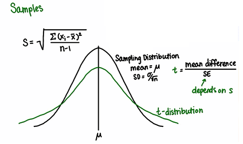
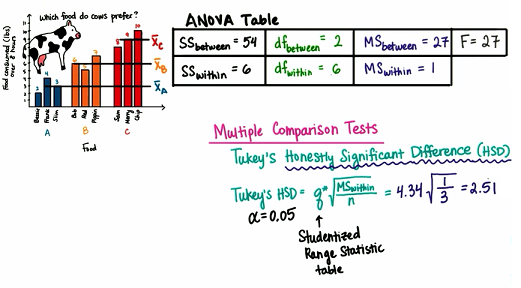
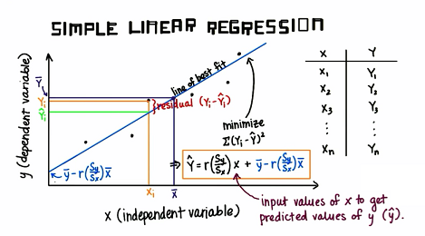

# Introduction to Statistics @ Udacity

### 1. Intro to Research Methods

* Constructs & Operational defination
	- A construct is a variable that is not directly observable or measurable
	- Example (Operational defination): Intelligence (IQ test), Effort (minutes donging homework, grades, GPA), Age (age in years, wisdom), Hunger (how often tummy grumbles), Itchiness
	- Counterexample: Gallons of gasoline, Annual salary in USD

* Lurking variables
	- Extraneous factors, need to be controlled

* Sampling error 

	

* Correlation & Causation
	- Correlation does **NOT** prove causation
	- Observational studies, Surveys => show relationships
	- Controlled experiment => show causation

### 2. Visualization Data

* Table:
	- Frequency, Relative frequence, Propotion, Percent

* Histogram
	- bin size

* Histogram & Bar graph
	- Histogram: x-axis: numberical/quantitative
	- Bar graph: x-axis: categorical/qualitiative 

* Biased graphs
	
	

### 3. Central Tendency

* Mode
	- The value at which frequency is highest
	- Uniform distribution has NO mode
	- Mode can be used to descibe any type of data, numerical or categorical
	- Not all scores in the dataset affect the mode
	- If we take a lot of samples from the same population, the mode will NOT be  the same in each sample
	
 
* Median
	- Value in the middle, the average of the two middle numbers when data size is even
	- Not affected by outliers 
	

* Mean
	- Average
	- All score in the distribution affect the mean
	- Many samples from the same population will have similar means
	- The mean of a sample can be used to make inferences about the population it came from
	- Mean with outlier

	

* Measure of Center

	

	

	

### 4. Variability

* Range
	- Range = Max - Min

* IQR
	- Inter-Quartile Range
	- IQR = Q3 - Q1

	

	- About 50% of the data falls within the IQR
	- The IQR is not affected by every value in the dataset
	- The IQR is not affected by outliers 

* Outlier
	- Outlier < (Q1 - 1.5 * IQR) ... (Q3 + 1.5 * IQR) < Outlier

* Boxplots

		

* Measeure variability
	- Average deviation is 0
	- Absolute deviation
	- Variance: average squared deviation
	- Standard deviation: square root of Variance

* Sample standard deviation & Bessels correction

	

### 5. Standardizing

* Relative Frequency Distribution
	- Concerned  with the propotion less than or greater than a certain value on a distribution
	
	

* Continuous Distribution

	

	

* Theoretical Normal Distribution
	
	

* Standard Normal Distribution
	
	

	
* Z-score
	- Number of standard deviations away from the mean
	
	

	

### 6. Normal Distribution

* PDF: Probability Distribution Function

	

* Z-table

### 7. Sampling Distribution

* Sample Mean Distribution
	- Sampling distribution => distribution of sample means
	- Sampling distribution is normal distribution

* Central Limit Theorem
	
	

	

	

	

### 8. Estimation

* Point estimate

	

* Margin of error, Confidence Interval

	

	

* Critical values of z

	

	

	

### 9. Hypothesis Testing

* Alpha levels
	- levels of likelihood
	- .05 (5%), .001 (1%), .001(0.1%)
	- If the probability of getting a particular sample mean is less than alpha, it is unlikely to occur

	
* Critical regions

	

	
* One-tailed vs. two-tailed test

	

* Hypothesis
	- Null hypothesis
	- Alternative hypothesis

	

	

* Decision errors
	
	

### 10. t-test I II

* z-test
	- z-test works when we know population mean and population standard deviation

* t-test
	- how different a sample mean is from a population
	- how different two sample means are from each other
		- dependent
		- independent
	

* t-distribution

	

* Degree of Freedom
	- df = n -1

	
* t-table

	
	

* t-statistics

	

* One-sample t-test

	

* p-value

	

* Cohen's d

	

* Dependent samples

	

	

	

* Types of Design
	
	

* Results sections
	1. Descriptive statistics
		- Mean, Stardard Deviation, etc.
		- in text, in graphs, in tables
	2. Inferential statistics
		- hypothesis test
			- kind of test, e.g. one-sample t-test
			- test statistic
			- degree of freedom
			- p-value
			- direction of test
			- confidence interval on the mean difference
		- APA style
	3. Effect size measures
	
	

		

	

### 11. t-test III

* Dependent vs. Independent Samples

	

* Independent samples t-test

	

	

* Pooled Variance

	

* t-Test Assumptions

	

### 12. One-Way ANOVA

* Grand mean

	

* Between-group variability, Within-group variability

	

* ANOVA
	- Analysis of Variance
	- One-Way ANOVA: one independent variable

* Hypothesis

	

	

	
* F-statistic

	
	
	

### 13. ANOVA, Continued

* Multiple Comparison Test

	
	

* Tukey's HSD

	

* Cohen's d for multiple comparison

	

* Explained variation

	

* Reporting results of ANOVA

	

* POWER

	

	

* ANOVA assumption

	

* Summary

	

	

### 14. Correlation

* Two variables

	

* Scatterplot

	

* Strength & Direction
	
	

* Correlation Coefficient

	

* Hypothesis testing

	

	

	
* Confidence Interval, p_value

	

* Outlier
	- r is sensitive to  outliers

	

### 15. Regression

* Linear Regression
	- The line of best fit

		

* Observed data, Expected data, residual

	

* Regression equation

	

	

	

* Standard Error of Estimate

	

* Confidence intervals

	

* Hypothesis testing for slope

	

* Outlier
	- factors that affect simple linear regression

	
	

* Summary of Linear regression

	

* Multiple regression

	

### 16. Chi-Sqaured test
