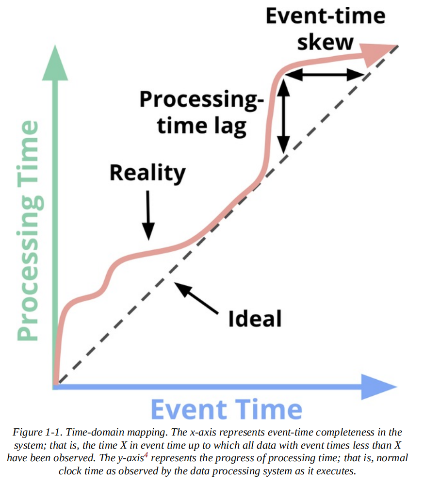

# Streaming Systems

## I. The Beam Model 

### 1. Streaming 101

##### Terminology

- What is Streaming?
  - Data processing engine, designed with **infinite datasets**
- Two important dimensions of a dataset:
  - Cardinality: size, finite or infinite
    - Bounded data vs. Unbounded data
  - Consititution: defines the ways one can interact with the data
    - Table: the holistic view of a dataset at a specific point in time
    - Stream: an element-by-element view of evolution of a dataset over time

##### Capabilities

- Lambda Architecture
  - Streaming systems provide low-latency, inaccurate or sepculative results
    - low-tatency, but does not provide correctness
  - so , it often conjuncted with a more capable batch system to provide eventually correct results 
  - You need to maintain two independent pipelines, and merge the results at the end
- Kappa Architecture
  - running a single pipeline using a well-designed system
- Well-designed streaming systems actually provide a strict superset of batch functionality
- Two things Streaming system need to achieve to surpass batch:
  - Correctness
    - Consistency storage: streaming systems need a method for checkpointing persistent state over time
  - Tools for reasoning about time
    - Reasoning about time are essential for dealing with unbounded, unordered data of varying event-time skew

##### Time domains

- Event time vs. Processing time

  - Event time: the time at which events actually **occurred**
  - Processing time: the time at which events are **observed** in the system
  - The skew between event time and processing time
    - processing-time lag, event-time skew

  

##### Data processing Patterns

- Bounded data: Batch
- Unbounded Data: Batch
  - slicing up the unbounded data into collections of bounded datasets for batch processing
  - Fixed windows -- most common way
    - windowing the input data into fixed-size windows and then processing each of those windows as a seperate, bounded data source
- Unbounded Data: Streaming
  - 4 approaches of dealing with data
    - Time-agnostic
      - time is irrelevant, all logic is data driven
      - all streaming systems support time-agnostic use cases
      - Batch systems are also well suited for time-agnostic processing of unbounded data sources
      - Examples: filtering, inner joins, 
    - Approximation algorithms
      - Examples: approximate Top-N, streaming k-means
      - Low overhead and designed for unbounded data
      - Algorithms are often complicated
      - usually processing-time based
    - Windowing by processing time
      - Simple: implementation is extremely straightforward
    - Windowing by event time
      - fixed windows by event time
      - session windows by event time
        - you can create dynamically sized windows, such as sessions
      - 2 Drawbacks, due to the fact that windows must often live longer than its length
        - Buffering: more buffering of data is required
        - Completeness: system can only give a heuristic estimate of window completion

### 2. The What, Where, When and How of Data Processing

##### What: Transformations 

- **What** results are calculated? 
- 3 types of transformations
  - Element-wise
  - Grouping
  - Composite

##### Where: Windowing

- **Where** in event time are results are calculated?

- 3 Windowing Strategies:

  - Fixed windows, aka tumbling windows

  - Sliding windows, aka hopping windows

  - Sessions: dynamic windows
    - composed of sequences of events terminated by a gap of inactivity
    - batch engine is not suitable for such tasks, need built up in a streaming manner

##### When: Triggers

- Triggers declare "**when** the output for a window should happened in processing time?"
- 

##### How

### 3. Watermarks

### 4. Advanced Windowing

### 5. Exactly-Once and Side Effect

## II. Streams and Tables

### 6. Streams and Tables

### 7. The Practicalities of Persistent State

### 8. Streaming SQL

### 9. Streaming Joins

### 10. The Evolution of Large-Scale Data Processing

