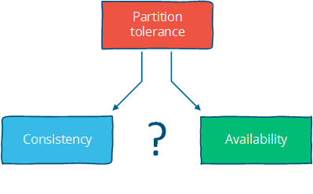

# [Distributed systems for fun and profit](http://book.mixu.net/distsys/index.html)

### 1. Basics: distributed systems at a high level

##### Introduction

* Distributed programming is the art of solving the same problem that you can solve on a single computer using multiple computers
* Much of distributed programming is about dealing with the implicationns of two consequences of distribution:
	- that information travels at (most) the speed of light
	- that independent things fail independently


##### Scalability and other good things to achieve

* Scalability 
	- Scalability is the ability of a system, network, or process, to handle a growing amout of work in a capable manner or its ability to be enlarged to accommodate that growth 
	- Size scalability: adding more nodes should make the system linearly faster; growing the dataset should not increase latency
	- Geographic scalability: it should be possible to use multiple data centers to reduce the time it takes to respond user queries, while dealing with cross-data center latency in some sensible manner
	- Administrative scalability: adding more nodes should not increase the administrative costs of the system; e.g. the administrators-to-machines ratio


* A scalable system is one that continues to meet the needs of its users as scale increases. There are two paticular relevant aspects: 
	- performance
	- availability


* Performance (and Latency)
	- Performance is characterized by the amount of useful work accomplished by a computer system compared to the time and resource used. 
	- This may involve achieving one or more of the following:
		- Short response time, low lantency for a given piece of work
		- High throughput, rate of processing work
		- Low utilization of computing resosurces
	- There are tradeoffs involved in optimizing for any of these outcomes
	- Latency is the time between when something happened and the time it has an impact or becomes visible. 
	- For example, latency could be measured in terms of how long it takes for a write to become visible to readers.
	- In a distributed system, there is a minimum latency that cannot be overcome: 
		- the speed of light limits how fast information can travel
		- hardware components have a minimum latency cost incurred per operation


* Availability (and fault tolerance)
	- The proportion of time a system is in a functioning condition. If a user cannot access the system, it is said to be unavailable
	- Distributed systems can take a bunch of unreliable components, and build a reliable system on top of them
	- Formulaically, availability is: Availability = uptime / (uptime + downtime)
	- The best we can do to achieve high availability is design for fault tolerance
	- Fault tolerance: ability of a system to behave in a well-defined manner once faults occur
	- You can't tolerate faults you haven't considered


##### Constrains

* Distributed systems are constrained by two physical factors:
	- the number of nodes, which increases with the required storage and computation capacity
	- the distance between nodes, information travels, at best, at the speed of light


* Working within those constraints:
	- an increase in the number of independent nodes increases the probability of failure in a system, reducing availability and increasing administrative costs
	- an increase in the number of independent nodes may increase the need for communication between nodes, reducing performance as scale increases
	- an increase in geographic distance increases the minimum latency for communication between distant nodes, reducing performance for certain operations


##### Abstractions and models

* Abstractions make things more manageable by removing real-world aspects that are not relevant to solving a problem
* Models describe the key properties of a distributed system in a precise manner
* Models that will be discussed:
	- system model:  asynchronous/synchronous
	- failure model: crash-fail, patitions, Byzantine
	- consistency model: strong, eventual


* A system that makes weaker guarantees has more freedom of action, and hence potentially greater performance, but it is also potentially hard to reason about
* One can often gain performance by exposing more details about the internals of the system, while systems that hide details are easier to understand.
* The ideal system meets both programmer needs (clean semantics) and business needs (availability/consistency/latency)


##### Design techniques: partition and replicate

* Partitioning is dividing the dataset into smaller distinct independent sets
	- Partitioning improves performance by limiting the amount of data to be examined and by locating related data in the same partition.
	- Partitioning improves availability by allowing partitions to fail independently, increasing the number of nodes that need to fail before availability is sacrificed 

	
* Replication is making copies of the same data on multiple machines, which allows more servers to take part in the computation.
	- Replication improves performance by making additional computing power and bandwidth applicable to a new copy of the data.
	- Replication improves availability by creating additional copies of the data, increasing the number of nodes that need to fail before availability is sacrificed.


* Replication allows us to achieve scalability, performance and fault tolerance. 
* Replication is also the source of many of the problems: copies of the data that has to be kept in sync on multiple machines means ensuring that the replication follows a consistency model


##### Further Readings

* [The Datacenter as a Computer - An Introduction to the Design of Warehouse-Scale Machines](http://www.morganclaypool.com/doi/pdf/10.2200/s00193ed1v01y200905cac006) - Barroso & Hölzle, 2008
* [Fallacies of Distributed Computing](https://en.wikipedia.org/wiki/Fallacies_of_distributed_computing)
* [Notes on Distributed Systems for Young Bloods](https://www.somethingsimilar.com/2013/01/14/notes-on-distributed-systems-for-young-bloods) - Hodges, 2013


### 2. Up and down the level of abstraction

##### A system model

* System model
	- A set of assumptions about the environment and facilities on which a distributed system is implement 
	- Programs in a distributed system:
		- run concurrently on independent node
		- are connected by a network that may introduce nondeterminism and message loss
		- have no shared memory or shared clock
	- There are many implications:
		- each node execute a program concurrently
		- knowledge is local: nodes have fast access only to their local state, and any information about global state is potentially out of date
		- nodes can fail and recover from failure independently
		- messages can be delayed or lost; independent of node failure
		- clocks are not synchronized across node


* System models vary in their assumptions about the environment and facilities. These assumptions include:
	- what capabilities the nodes have and how they may fail
	- how communication links operate and how they may fail
	- properties of the overall system, such as assumptions about time and order
	

* A robust system is one that makes the weakest assumptions, on the other hand, strong assumptions make the system model easy to reason about


* Nodes in our system model
	- Nodes serve as hosts for computation and storage. They have:
		- the ability to execute program
		- the ability to store data into volatile memory, which can be lost upon failure, and into stable state, which can be read after a failure
		- a clock which may or may not be assumed to be accurate
	- There are many possible failure models which describe the ways in which nodes can fail.
		- most systems assume a crash-recovery failure model: nodes can only fail by crashing, and can (possibly) recover after crashing at some later point
		- Another alternative is to assume that nodes can fail by misbehaving in any arbitrary way. This is known as Byzantine fault tolerance.


* Communication links in our system model
	- Many distributed algorithms assume that there are individual links between each pair of nodes, that the links provide  FIFO order for message, that they can only deliver messages that were sent, and that send message can be lost
	- Some algorithms assume that the network is reliable, that messages are never lost and never delayed indefinitely.
	- A network partition occurs when the network fails while the nodes themselves remain operational. When this occurs, message may be lost or delayed until the network partition is repaired. Partition nodes may be accessible by some clients, and so must be treated differently from crash nodes.

	


* Timing/ordering assumptions
	- Any message sent from one node to the others will arrive at a different time and potentially in a different order at the other nodes
	- The two main alternative timing assumption:
		- Synchronous model: processes execute in lock-step; ther is a known upper bound on message transmission delay; each process has an accurate clock
		- Asychronous system model: No timing assumption, processes execute at independent rates; there is no bound on message transmission delay; useful clocks do not exist
	- It is easier to solve problems in the synchronous system model, you can make inferences based on those assumptions and rule out inconvenient failure scenarios by assuming they never occur
	 - However, real world systems are at best partially synchronous


##### The consensus problem

* Several nodes achieve consensus if they all agree on some value. More formally:
	- Agreement: every correct process must agree on the same value.
	- Integrity: every correct process decides at most one value, and if it decides some value, then it must have been proposed by some process.
	- Termination: all processes eventually reach a decision.
	- Validity: if all correct processes propose the same value V, then all correct processes decide V


* The consensus problem is at the core of many commercial distributed systems. After all, we want the reliability and performance of a distributed system without having to deal with the consequences of distribution, such as disagreements or divergence between nodes. Moreover, solving the consensus problem makes it possible to solve several related, more advanced problems such as atomic broadcast and atomic commit.


##### Two impossiblity results

* The FLP impoossibility result
	- Particularly relevant to people who design distributed algorithms
	- Examines the consensus problem under the asynchronous system model and assumed that 
		- nodes can only fail by crashing; 
		- the network is reliable, 
		- there are no bounds on message delay
	- Under these assumptions, the FLP result states that "there does not exist a (deterministic) algorithm for the consensus problem in an asynchronous system subject to failures, even if messages can never be lost, at most one process may fail, and it can only fail by crashing (stopping executing)".
	- This impossibility result is important because it highlights that assuming the asynchronous system model leads to a tradeoff: algorithms that solve the consensus problem must either give up **safety** or **liveness** when the guarantees regarding bounds on message delivery do not hold.


* The CAP theorem
	- The theorem states that of these three properties:
		- Consistency: all nodes see the same data at the same time.
		- Availability: node failures do not prevent survivors from continuing to operate.
		- Partition tolerance: the system continues to operate despite message loss due to network and/or node failure
	- Only two can be satisfied simultaneously, then we get three different system types:
		- CA: consistency + availability, examples include full strict quorum protocols, such as two-phase commit
		- CP: consistency + partition tolerance, examples include majority quorum protocols in which minority partitions are unavailable such as Paxos
		- AP: availability + partition tolerance, examples include protocols using conflict resolution, such as Dynamo

	


* The CA and CP system designs both offer the same consistency model: **strong consistency**
	- CA system cannot tolerate any node failures
	- CP system can tolerate up to f faults given 2f+1 nodes in a non-Byzantine failure model.
	- CA system does not distinguish between node failures and network failures, and hence must stop accepting writes everywhere to avoid introducing divergence (multiple copies). It cannot tell whether a remote node is down, or whether just the network connection is down: so the only safe thing is to stop accepting writes
	- CP system prevents divergence (e.g. maintains single-copy consistency) by forcing asymmetric behavior on the two sides of the partition. It only keeps the majority partition around, and requires the minority partition to become unavailable (e.g. stop accepting writes), which retains a degree of availability (the majority partition) and still ensures single-copy consistency
	

* Assuming that a partition occurs, the theorem reduces to a binary choice between availability and consistency.
	
	


* There are four conclusions that should be drawn from the CAP theorem:
	- Many system designs used in early distributed relational database systems did not take into account partition tolerance 
	- There is a tension between strong consistency and high availability during network partitions
		- Strong consistency guarantees require us to give up availability during a partition. This is because one cannot prevent divergence between two replicas that cannot communicate with each other while continuing to accept writes on both sides of the partition
		- Consistency can be traded off against availability and the related capabilities of offline accessibility and low latency. If "consistency" is defined as something less than "all nodes see the same data at the same time" then we can have both availability and some (weaker) consistency guarantee.
	- There is a tension between strong consistency and performance in normal operation
		- Strong consistency requires that nodes communicate and agree on every operation. This results in high latency during normal operation
		- If you can live with a consistency model that allows replicas to lag or to diverge, then you can reduce latency during normal operation and maintain availability in the presence of partitions
	- If we do not want to give up availability during a network partition, then we need to explore whether consistency models other than strong consistency are workable for our purposes


* Consistency and availability are not really binary choices, unless you limit yourself to strong consistency. But strong consistency is just one consistency model: the one where you, by necessity, need to give up availability in order to prevent more than a single copy of the data from being active.	


##### Consistency Model

* Consistency Model
	- A contract between programmer and system, wherein the system guarantees that if the programmer follows some specific rules, the results of operations on the data store will be predictable
	- Strong consistency models, capable of maintaining a single copy
		- Linearizable consistency
		- Sequential consistency
	- Weak consistency models, not strong
		- Client-centric consistency models
		- Causal consistency: strongest model available
		- Eventual consistency models
	- Consistency models are just arbitrary contracts between the programmer and system, so they can be almost anything.

 
* Strong consistency models
	- Linearizable consistency: under linearizable consistency, all operations appear to have executed atomically in *an order* that is consistent with the global real-time ordering of operations
	- Sequential consistency: under sequential consistency, all operations appear to have executed atomically in *some order* that is consistent with the order seen at individual nodes and that is equal at all nodes 
	- Sequential consistency allows for operations to be reordered as long as the order observed on each node remains consistent
	- Strong consistency models allow you as a programmer to replace a single server with a cluster of distributed nodes and not run into any problems


* A client-centric consistency model might guarantee that a client will never see older versions of a data item. This is often implemented by building additional caching into the client library, so that if a client moves to a replica node that contains old data, then the client library returns its cached value rather than the old value from the replica.


* Eventual consistency
	- The eventual consistency model says that if you stop changing values, then after some undefined amount of time all replicas will agree on the same value. 
	- It is implied that before that time results between replicas are inconsistent in some undefined manner. 
	- It's a very weak constraint, and we'd probably want to have at least some more specific characterization of two things:
		- how long is "eventually"? It would be useful to have a strict lower bound, or at least some idea of how long it typically takes for the system to converge to the same value
		- how do the replicas agree on a value? For example, one way to decide is to have the value with the largest timestamp always win


##### Further readings

* [Brewer's Conjecture and the Feasibility of Consistent, Available, Partition-Tolerant Web Services](http://lpd.epfl.ch/sgilbert/pubs/BrewersConjecture-SigAct.pdf) - Gilbert & Lynch, 2002
* [Impossibility of distributed consensus with one faulty process](https://scholar.google.com/scholar?q=Impossibility+of+distributed+consensus+with+one+faulty+process) - Fischer, Lynch and Patterson, 1985
* [Perspectives on the CAP Theorem](https://scholar.google.com/scholar?q=Perspectives+on+the+CAP+Theorem) - Gilbert & Lynch, 2012
* [CAP Twelve Years Later: How the "Rules" Have Changed](https://www.infoq.com/articles/cap-twelve-years-later-how-the-rules-have-changed) - Brewer, 2012
* [Uniform consensus is harder than consensus](https://scholar.google.com/scholar?q=Uniform+consensus+is+harder+than+consensus) - Charron-Bost & Schiper, 2000
* [Replicated Data Consistency Explained Through Baseball](http://pages.cs.wisc.edu/~remzi/Classes/739/Papers/Bart/ConsistencyAndBaseballReport.pdf) - Terry, 2011
* [Life Beyond Distributed Transactions: an Apostate's Opinion](https://scholar.google.com/scholar?q=Life+Beyond+Distributed+Transactions%3A+an+Apostate%27s+Opinion) - Helland, 2007
* [If you have too much data, then 'good enough' is good enough](http://dl.acm.org/citation.cfm?id=1953140) - Helland, 2011
* [Building on Quicksand](https://scholar.google.com/scholar?q=Building+on+Quicksand) - Helland & Campbell, 2009


### 3. Time and order

##### Time and order

* Order
	- Order as a property has received so much attention because the easiest way to define "correctness" is to say "it works like it would on a single machine". And that usually means that: 
		- we run the same operations 
		- we run them in the same order, even if there are multiple machines
	- The nice thing about distributed systems that preserve order is that they are generic. They will be executed exactly like on a single machine
	- Distributed systems do not behave in a predictable manner. They do not guarantee any specific order, rate of advance, or lack of delay. Each node does have some local order, as execution is (roughly) sequential, but these local orders are independent of each other


* Total and Partial order
	- The natural state in a distributed system is partial order. Neither the network nor independent nodes make any guarantees about relative order; but at each node, you can observe a local order
	- In a partially ordered set, some pairs of elements are not comparable and hence a partial order doesn't specify the exact order of every item
	- Any system that can only do one thing at a time will create a total order of operations 
	- Total order makes executions of programs predictable. This order can be maintained on a distributed system, but at a cost: 
		- communication is expensive
		- time synchronization is difficult and fragile


* Time
	- Time is a source of order
	- It allows us to define the order of operations, which also has an interpretation that people can understand e.g. a second, a minute, a day


* Three interpretations of time and timestamp:
	- Order
		- we can attach timestamps to unordered events to order them
		- we can use timestamps to enforce a specific ordering of operations or the delivery of messages. For example, by delaying an operation if it arrives out of order
		- we can use the value of a timestamp to determine whether something happened chronologically before something else
	- Duration
		-  Algorithms can use durations to make some judgment calls. In particular, the amount of time spent waiting can provide clues about whether a system is partitioned or merely experiencing high latency
	- Interpretation
		- The value of a timestamp can be interpreted as a date, which is useful, like a timestamp of when a downtime started from a log file.

* Benifits of time in a distributed system:
	- Time can define order across a system without communication
	- Time can define boundary conditions for algorithms
		- To distinguish between "high latency" and "server or network link is down"
		- In most real-world systems timeouts are used to determine whether a remote machine has failed, or whether it is simply experiencing high network latency. Algorithms that make this determination are called **failure detectors**


* Three timing assumptions:
	- The synchronous system model has a global clock
	- The partially synchronous model has a local clock
	- In the asynchronous system model one cannot use clocks at all


* Time with a "global-clock" assumption
	- The global clock assumption is that there is a global clock of perfect accuracy, and that everyone has access to that clock
	- The global clock is basically a source of total order: exact order of every operation on all nodes even if those nodes have never communicated
	- In reality, clock synchronization is only possible to a limited degree of accuracy
	- Assuming that clocks on distributed nodes are perfectly synchronized, we can use timestamps freely to determine a global total order. But there are many scenarios where a simple failure can cause hard-to-trace anomalies, such as a user accidentally changing the local time on a machine, or an out-of-date machine joining a cluster, or synchronized clocks drifting at slightly different rates 
	- Facebook's Cassandra is an example of a system that assumes clocks are synchronized. It uses timestamps to resolve conflicts between writes: the write with the newer timestamp wins
	- Google's Spanner: the paper describes their TrueTime API, which synchronizes time but also estimates worst-case clock drift
	
	


* Time with a "Local-clock" assumption
	- Local-clock assumes each machine has its own clock, but there is no global clock. It means you cannot meaningfully compare timestamps from two different machines
	- The local clock assumption assigns a partial order: events on each system are ordered but events cannot be ordered across systems by only using a clock

			


* Time with a "No-clock" assumption
	- There is the notion of logical time. Instead of using clocks, we track causality in some other way
	- We can use counters and communication to determine whether something happened before, after or concurrently with something else
	- This way, we can determine the order of events between different machines, but cannot say anything about intervals and **cannot use timeouts**
	- This is a partial order: events can be ordered on a single system using a counter and no communication, but ordering events across systems requires a message exchange
	- Vector clocks are a way to track causality without using clocks
	- Riak (Basho) and Voldemort (Linkedin) use vector clocks rather than assuming that nodes have access to a global clock of perfect accuracy


##### Vector clocks: time for causal order

* Lamport clocks and vector clocks are replacements for physical clocks which rely on counters and communication to determine the order of events across a distributed system. These clocks provide a counter that is comparable across different nodes

* Lamport Clock
	- A Lamport clock is simple. Each process maintains a counter using the following rules:
		- Whenever a process does work, increment the counter
		- Whenever a process sends a message, include the counter
		- When a message is received, set the counter to max(local_counter, received_counter) + 
	- A Lamport clock allows counters to be compared across systems, with a caveat: Lamport clocks define a partial order. If timestamp(a) < timestamp(b):
		- a may have happened before b or
		- a may be incomparable with b
	- Lamport clock can only carry information about one timeline, hence, comparing Lamport timestamps from systems that never communicate with each other may cause concurrent events to appear to be ordered when they are not


* Vector clock
	- A vector clock is an extension of Lamport clock, which maintains an array [ t1, t2, ... ] of N logical clocks, one per each node. Rather than incrementing a common counter, each node increments its own logical clock in the vector by one on each internal event. 
	- The update rules are:
		- Whenever a process does work, increment the logical clock value of the node in the vector
		- Whenever a process sends a message, include the full vector of logical clocks
		- When a message is received:
			- update each element in the vector to be max(local, received)
			- increment the logical clock value representing the current node in the vector
	- The issue with vector clocks is mainly that they require one entry per node, which means that they can potentially become very large for large systems. A variety of techniques have been applied to reduce the size of vector clocks: 
		- by performing periodic garbage collection
		- by reducing accuracy by limiting the size
	
	


##### Failure detectors: time for cutoff

* The amount of time spent waiting can provide clues about whether a system is partitioned or merely experiencing high latency, so we don't need to assume a global clock of perfect accuracy, it is simply enough that there is a reliable-enough local clock


* Failure detector
	- A failure detector is a way to abstract away the exact timing assumptions. 
	- Failure detectors are implemented using heartbeat messages and timers. Processes exchange heartbeat messages. If a message response is not received before the timeout occurs, then the process suspects the other process
	- A failure detector based on a timeout will carry the risk of being 
		- overly aggressive: declaring a node to have failed
		- overly conservative: taking a long time to detect a crash	


* Design of failure detector
	- Failure detectors can be characterized using two properties: completeness and accuracy
		- Strong completeness: every crashed process is eventually suspected by every correct process
		- Weak completeness: every crashed process is eventually suspected by some correct process
		- Strong accuracy: no correct process is suspected ever
		- Weak accuracy: some correct process is never suspected
	- Completeness is easier to achieve than accuracy. All you need to do is not to wait forever to suspect someone. 
	- Weak completeness can be transformed to strong completeness by broadcasting information about suspected processes
	- Avoiding incorrectly suspecting non-faulty processes needs a hard maximum on the message delay. 
		- Failure detectors in a synchronous system model can be strongly accurate. 
		- System models that do not impose hard bounds on message delay, failure detection can at best be eventually accurate
 	- Failure detector should be able to adjust to changing network conditions and to avoid hardcoding timeout values into it
	 	- For example, Cassandra uses an accrual failure detector, which is a failure detector that outputs a suspicion level (a value between 0 and 1) rather than a binary "up" or "down" judgment. This allows the application using the failure detector to make its own decisions about the tradeoff between accurate detection and early detection

	


##### Time, order and performance

* The natural view of the world is a partial order. You can transform a partial order into a total order, but this requires communication, waiting and imposes restrictions that limit how many computers can do work at any particular point in time


* All clocks are mere approximations bound either by network latency or by physics. Even keeping a simple integer counter in sync across multiple nodes is a challenge


* Algorithms care about more abstract properties rather than time:
	- the causal ordering of events
	- failure detection, e.g. approximations of upper bounds on message delivery)
	- **consistent snapshots**, e.g. the ability to examine the state of a system at some point in time; 


* Often the easiest way to ensure that events are delivered in some defined order is to nominate a single (bottleneck) node through which all operations are passed


* Is time/order/synchronicity really necessary? It depends. 
	- In some use cases, we want each intermediate operation to move the system from one consistent state to another. For example, in many cases we want the responses from a database to represent all of the available information, and we want to avoid dealing with the issues that might occur if the system could return an inconsistent result
	- In other cases, we might not need that much time/order/synchronization. For example, if you are running a long running computation, and don't really care about what the system does until the very end - then you don't really need much synchronization as long as you can guarantee that the answer is correct


##### Further reading

* Lamport clocks, vector clocks
	- [Time, Clocks and Ordering of Events in a Distributed System](http://lamport.azurewebsites.net/pubs/time-clocks.pdf) - Leslie Lamport, 1978
* Failure detection
	- [Unreliable failure detectors and reliable distributed systems](https://scholar.google.com/scholar?q=Unreliable+Failure+Detectors+for+Reliable+Distributed+Systems) - Chandra and Toueg
	- [Latency- and Bandwidth-Minimizing Optimal Failure Detectors](http://www.cs.cornell.edu/people/egs/sqrt-s/doc/TR2006-2025.pdf) - So & Sirer, 2007
	- [The failure detector abstraction](https://scholar.google.com/scholar?q=The+failure+detector+abstraction) - Freiling, Guerraoui & Kuznetsov, 2011
* Snapshots
	- [Consistent global states of distributed systems: Fundamental concepts and mechanisms](https://scholar.google.com/scholar?q=Consistent+global+states+of+distributed+systems%3A+Fundamental+concepts+and+mechanisms) - Ozalp Babaogly and Keith Marzullo, 1993
	- [Distributed snapshots: Determining global states of distributed systems](https://scholar.google.com/scholar?q=Distributed+snapshots%3A+Determining+global+states+of+distributed+systems) - K. Mani Chandy and Leslie Lamport, 1985
* Causality
	- [Detecting Causal Relationships in Distributed Computations: In Search of the Holy Grail](http://www.vs.inf.ethz.ch/publ/papers/holygrail.pdf) - Schwarz & Mattern, 1994
	- [Understanding the Limitations of Causally and Totally Ordered Communication](https://scholar.google.com/scholar?q=Understanding+the+limitations+of+causally+and+totally+ordered+communication) - Cheriton & Skeen, 1993


### 4. Replication: preventing divergence

##### Replication

* Why replication problem interesing?
	- Parallel databases are differentiated is in terms of their replication features
	- Replication provides a context for many subproblems, such as leader election, failure detection, consensus and atomic broadcast


* Synchronous replication
	- Synchronous replication also known as active, or eager, or push, or pessimistic replication
	- The client sends the request, then it is blocked and waiting for a reply from the system. During the synchronous phase, the first server contacts the two other servers and waits until it has received replies from all the other servers. Finally, it sends a response to the client informing it of the result
	- This is a **write N-of-N approach**: before a response is returned, it has to be seen and acknowledged by every server in the system
	- From a performance perspective: the system will be as fast as the slowest server in it. The system will also be very sensitive to changes in network latency
	- Given the N-of-N approach, the system cannot tolerate the loss of any servers. When a server is lost, the system can no longer write to all the nodes, and so it cannot proceed
	- This arrangement can provide very strong durability guarantees: the client can be certain that all N servers have received, stored and acknowledged the request when the response is returned. In order to lose an accepted update, all N copies would need to be lost

	


* Asynchronous replication
	- Asynchronous replication: passive replication, or pull replication, or lazy replication 
	- The master/leader/coordinator immediately sends back a response to the client. It might at best store the update locally, but it will not do any significant work synchronously
	- At some later stage, the asynchronous portion of the replication task takes place. Here, the master contacts the other servers using some communication pattern, and the other servers update their copies of the data
	- This is a **write 1-of-N approach**: a response is returned immediately and update propagation occurs sometime later
	- From a performance perspective: the system is fast. The client does not need to spend any additional time waiting for the internals of the system to do their work. The system is also more tolerant of network latency, since fluctuations in internal latency do not cause additional waiting on the client side
	- Given the 1-of-N approach, the system can remain available as long as at least one node is up, at least in theory, though in practice the load will probably be too high
	- This arrangement can only provide weak, or probabilistic durability guarantees. If nothing goes wrong, the data is eventually replicated to all N machines. However, if the only server containing the data is lost before this can take place, the data is permanently lost
	- Passive replication cannot ensure that all nodes in the system always contain the same state. If you accept writes at multiple locations and do not require that those nodes synchronously agree, then you will run the risk of divergence

	


##### Replication algorithms that maintain single-copy consistency

* Single copy consistency algorithms
	- Replicated systems that maintain single copy consistency need to solve the consensus problem in some way. Mutual exclusion, leader election, multicast and atomic broadcast are all instances of the consensus problem
	- The replication algorithms that maintain single-copy consistency include:
		- 1n messages: asynchronous primary/backup
		- 2n messages: synchronous primary/backup
		- 4n messages: 2-phase commit, Multi-Paxos
		- 6n messages: 3-phase commit, Paxos with repeated leader election
	- These algorithms are simply classified by the number of messages exchanged during execution
	- These algorithms vary in their fault tolerance, e.g. the types of faults they can tolerate 


* Primary/backup replication
	- Primary/backup replication also known as primary copy replication, master-slave replication, or log shipping
	- All updates are performed on the primary and a log of operations is shipped across the network to the backup replicas. There are two variants:
		- asynchronous primary/backup replication
		- synchronous primary/backup replication
	- The synchronous version requires two messages ("update" + "acknowledge receipt") while the asynchronous version could run with just one ("update")
	- P/B is very common. For example, by default MySQL replication uses the asynchronous variant. MongoDB also uses P/B with some additional procedures for failover
	- Asynchronous replication algorithm can only provide weak durability guarantees. In MySQL, the asynchronous backups are always at least one operation behind the primary. If the primary fails, then the updates that have not yet been sent to the backups are lost
	- However, even synchronous variant can only offer weak guarantees. Consider the following simple failure scenario:
		- the primary receives a write and sends it to the backup, the backup persists and ACKs the write and then primary fails before sending ACK to the client
		- the client now assumes that the commit failed, but the backup committed it; if the backup is promoted to primary, it will be incorrect
	- All primary/backup replication algorithms follow the same general messaging pattern, they differ in their handling of failover, replicas being offline for extended periods and so on. However, it is not possible to be resilient to inopportune failures of the primary in this scheme. 
	- To prevent inopportune failures from causing consistency guarantees to be violated, we need to add another round of messaging, which gets us the two phase commit protocol (2PC)


* Two phase commit (2PC)
	- Two phase commit (2PC) is a protocol used in many classic relational databases. For example, MySQL Cluster provides synchronous replication using 2PC 
	```
	[ Coordinator ] -> OK to commit?     [ Peers ]
                	<- Yes / No

	[ Coordinator ] -> Commit / Rollback [ Peers ]
	                <- ACK
	```
	- In the first phase (voting), the coordinator sends the update to all the participants. Each participant processes the update and votes whether to commit or abort. When voting to commit, the participants store the update onto a temporary area (the write-ahead log). Until the second phase completes, the update is considered temporary
	- In the second phase (decision), the coordinator decides the outcome and informs every participant about it. If all participants voted to commit, then the update is taken from the temporary area and made permanent
	- Having a second phase in place before the commit allows the system to roll back an update when a node fails. In contrast, in primary/backup ("1PC"), there is no step for rolling back an operation that has failed on some nodes and succeeded on others, and hence the replicas could diverge
	- 2PC is prone to blocking, since a single node failure blocks progress until the node has recovered
	- 2PC is a CA. It is not partition tolerant. The failure model that 2PC addresses does not include network partitions
	- 2PC is also fairly latency-sensitive, since it is a write N-of-N approach in which writes cannot proceed until the slowest node acknowledges them
	- 2PC has been popular in relational databases. However, newer systems often use a partition tolerant consensus algorithm, since such an algorithm can provide automatic recovery from temporary network partitions as well as more graceful handling of increased between-node latency


##### Partition tolerant consensus algorithms

* Network partition
	- During a network partition, it is not possible to distinguish between a failed remote node and the node being unreachable. If a network partition occurs but no nodes fail, then the system is divided into two partitions which are simultaneously active
	- A system that enforces single-copy consistency must have some method to break symmetry. Otherwise, it will split into two separate systems, which can diverge from each other and can no longer maintain the illusion of a single copy
	- Network partition tolerance for systems that enforce single-copy consistency requires that during a network partition, only one partition of the system remains active since during a network partition it is not possible to prevent divergence


* Majority decisions
	- Partition tolerant consensus algorithms rely on a majority vote. Requiring a majority of nodes rather than all of the nodes (as in 2PC) to agree on updates allows a minority of the nodes to be down, or slow, or unreachable due to a network partition. As long as (N/2 + 1)-of-N nodes are up and accessible, the system can continue to operate 
	- Majorities are also useful because they can tolerate disagreement: if there is a perturbation or failure, the nodes may vote differently. However, since there can be only one majority decision, a temporary disagreement can at most block the protocol from proceeding (giving up liveness) but it cannot violate the single-copy consistency criterion (safety property)


* Roles
	- Consensus algorithms for replication have distinct roles for each node. 
	- Having a single fixed leader or master server is an optimization that makes the system more efficient, since we know that all updates must pass through that server. Nodes that are not the leader just need to forward their requests to the leader
	- Both Paxos and Raft make use of distinct node roles. In particular, they have a leader node ("proposer" in Paxos) that is responsible for coordination during normal operation. The rest of the nodes are followers ("acceptors" or "voters" in Paxos) 
	

* Epochs
	- Each period of normal operation in both Paxos and Raft is called an epoch ("term" in Raft). During each epoch only one node is the designated leader
	- After a successful election, the same leader coordinates until the end of the epoch
	- Some elections may fail, causing the epoch to end immediately 
	- Epochs act as a logical clock, allowing other nodes to identify when an outdated node starts communicating.  Nodes that were partitioned or out of operation will have a smaller epoch number than the current one, and their commands are ignored

	


* Leader election
	- All nodes start as followers; one node is elected to be a leader at the start. During normal operation, the leader maintains a heartbeat which allows the followers to detect if the leader fails or becomes partitioned
	- When a node detects that a leader has become non-responsive, it switches to an intermediate state (called "candidate" in Raft) where it increments the term/epoch value by one, initiates a leader election and competes to become the new leader
	- In order to be elected a leader, a node must receive a majority of the votes. One way to assign votes is to simply assign them on a first-come-first-served basis; this way, a leader will eventually be elected. Adding a random amount of waiting time between attempts at getting elected will reduce the number of nodes that are simultaneously attempting to get elected


* Numbered proposals within an epoch
	- Within each epoch, each proposal is numbered with a unique strictly increasing number
	- During normal operation, all proposals go through the leader node. When a client submits a proposal, the leader contacts all nodes in the quorum. If no competing proposals exist, the leader proposes the value. If a majority of the followers accept the value, then the value is considered to be accepted
	- If a proposal with value v is chosen, then every higher-numbered proposal that is chosen has value v
		- Since it is possible that another node is also attempting to act as a leader, we need to ensure that once a single proposal has been accepted, its value can never change. Otherwise a proposal that has already been accepted might for example be reverted by a competing leader
	- If a proposal with value v is chosen, then every higher-numbered proposal issued by any proposer has value v
		- the proposers must first ask the followers for their (highest numbered) accepted proposal and value. If the proposer finds out that a proposal already exists, then it must simply complete this execution of the protocol, rather than making its own proposal
	- For any v and n, if a proposal with value v and number n is issued by a leader, then there is a set S consisting of a majority of acceptors [followers] such that either (a) no acceptor in S has accepted any proposal numbered less than n, or (b) v is the value of the highest-numbered proposal among all proposals numbered less than n accepted by the followers in S
		- The value to be proposed is not chosen until the second phase of the protocol. Proposers must sometimes simply retransmit a previously made decision to ensure safety until they reach a point where they know that they are free to impose their own proposal value 
	
	```
	[ Proposer ] -> Prepare(n)                                [ Followers ]
	             <- Promise(n; previous proposal number
	                and previous value if accepted a
	                proposal in the past)
	
	[ Proposer ] -> AcceptRequest(n, own value or the value   [ Followers ]
	                associated with the highest proposal number
	                reported by the followers)
	                <- Accepted(n, value)
	```
	
	- The prepare stage allows the proposer to learn of any competing or previous proposals. The second phase is where either a new value or a previously accepted value is proposed
	- In some cases, such as if two proposers are active at the same time (dueling), or if messages are lost, or if a majority of the nodes have failed, then no proposal is accepted by a majority. But this is acceptable, since the decision rule for what value to propose converges towards a single value (the one with the highest proposal number in the previous attempt)
	- According to the FLP impossibility result, this is the best we can do: algorithms that solve the consensus problem must either give up safety or liveness when the guarantees regarding bounds on message delivery do not hold. Paxos gives up liveness: it may have to delay decisions indefinitely until a point in time where there are no competing leaders, and a majority of nodes accept a proposal
	

* Partition-tolerant consensus algorithms: Paxos, Raft, ZAB
	- Paxos is one of the most important algorithms when writing strongly consistent partition tolerant replicated systems. It is used in many of Google's systems, including the Chubby lock manager used by BigTable/Megastore, the Google File System as well as Spanner
	- ZAB, the Zookeeper Atomic Broadcast protocol is used in Apache Zookeeper. Technically speaking atomic broadcast is a problem different from pure consensus, but it still falls under the category of partition tolerant algorithms that ensure strong consistency
	- Raft is a recent (2013) addition to this family of algorithms. It is designed to be easier to teach than Paxos, while providing the same guarantees. In particular, the different parts of the algorithm are more clearly separated and the paper also describes a mechanism for cluster membership change


##### Summary: replication methods with strong consistency

* Primary/Backup
	- Single, static master
	- Replicated log, slaves are not involved in executing operations
	- No bounds on replication delay
	- Not partition tolerant
	- Manual/ad-hoc failover, not fault tolerant, "hot backup"


* 2PC
	- Unanimous vote: commit or abort
	- Static master
	- 2PC cannot survive simultaneous failure of the coordinator and a node during a commit
	- Not partition tolerant, tail latency sensitive


* Paxos
	- Majority vote
	- Dynamic master
	- Robust to n/2-1 simultaneous failures as part of protocol
	- Less sensitive to tail latency


##### Further reading

* Primary-backup and 2PC
	- [Replication techniques for availability](https://scholar.google.com/scholar?q=Replication+techniques+for+availability) - Robbert van Renesse & Rachid Guerraoui, 2010
	- [Concurrency Control and Recovery in Database Systems](https://www.microsoft.com/en-us/research/people/philbe/?from=http%3A%2F%2Fresearch.microsoft.com%2Fen-us%2Fpeople%2Fphilbe%2Fccontrol.aspx)


* Paxos
	- [The Part-Time Parliament](http://lamport.azurewebsites.net/pubs/lamport-paxos.pdf) - Leslie Lamport
	- [Paxos Made Simple](http://research.microsoft.com/users/lamport/pubs/paxos-simple.pdf) - Leslie Lamport, 2001
	- [Paxos Made Live - An Engineering Perspective](https://research.google.com/archive/paxos_made_live.html) - Chandra et al
	- [Paxos Made Practical](https://scholar.google.com/scholar?q=Paxos+Made+Practical) - Mazieres, 2007
	- [Revisiting the Paxos Algorithm](http://groups.csail.mit.edu/tds/paxos.html) - Lynch et al
	- [How to build a highly available system with consensus](http://research.microsoft.com/lampson/58-Consensus/Acrobat.pdf) - Butler Lampson
	- [Reconfiguring a State Machine](https://www.microsoft.com/en-us/research/publication/reconfiguring-a-state-machine/?from=http%3A%2F%2Fresearch.microsoft.com%2Fen-us%2Fum%2Fpeople%2Flamport%2Fpubs%2Freconfiguration-tutorial.pdf) - Lamport et al - changing cluster membership
	- [Implementing Fault-Tolerant Services Using the State Machine Approach: a Tutorial](http://citeseer.ist.psu.edu/viewdoc/summary?doi=10.1.1.20.4762) - Fred Schneider


* Raft and ZAB
	- [In Search of an Understandable Consensus Algorithm](https://ramcloud.stanford.edu/wiki/download/attachments/11370504/raft.pdf) - Diego Ongaro, John Ousterhout, 2013
	- [Raft Lecture - User Study](https://www.youtube.com/watch?v=YbZ3zDzDnrw)
	- [A simple totally ordered broadcast protocol]() - Junqueira, Reed, 2008
	- [ZooKeeper Atomic Broadcast]() - Reed, 2011


### 5. Replication: accepting divergence

#####  weak consistency

* Why weak consistency
	- A system enforcing strong consistency doesn't behave like a distributed system: it behaves like a single system, which is bad for availability during a partition
	- For each operation in strong consistency system, often a majority of the nodes must be contacted, and often not just once, but twice. This is particularly painful in systems that need to be geographically distributed to provide adequate performance for a global user base 
	- Perhaps what we want is a system that doesn't use expensive coordination and returns a "usable" value. Instead of having a single truth, we will allow different replicas to diverge from each other, both to keep things efficient but also to tolerate partitions, and then try to find a way to deal with the divergence in some manner
	- Eventual consistency expresses this idea: that nodes can for some time diverge from each other, but that eventually they will agree on the value


* Within the set of systems providing eventual consistency, there are two types of system designs:
	- Eventual consistency with probabilistic guarantees
		- This type of system can detect conflicting writes at some later point, but does not guarantee that the results are equivalent to some correct sequential execution
		- e.g. Amazon's Dynamo
	- Eventual consistency with strong guarantees 
		- This type of system guarantees that the results converge to a common value equivalent to some correct sequential execution
		- Without any coordination you can build replicas of the same service, and those replicas can communicate in any pattern and receive the updates in any order, and they will eventually agree on the end result as long as they all see the same information
		- CRDT's (convergent replicated data types) are data types that guarantee convergence to the same value in spite of network delays, partitions and message reordering. They are provably convergent, but the data types that can be implemented as CRDT's are limited
		- The CALM (consistency as logical monotonicity) conjecture is an alternative expression of the same principle: it equates logical monotonicity with convergence. If we can conclude that something is logically monotonic, then it is also safe to run without coordination


* Example 1
	- Imagine a system of three replicas, each of which is partitioned from the others. For example, the replicas might be in different datacenters and for some reason unable to communicate. 
	- Each replica remains available during the partition, accepting both reads and writes from some set of clients
	```
	[Clients]   - > [A]

	--- Partition ---
	
	[Clients]   - > [B]
	
	--- Partition ---
	
	[Clients]   - > [C]
	```
	- After some time, the partitions heal and the replica servers exchange information. They have received different updates from different clients and have diverged each other, so some sort of reconciliation needs to take place. What we would like to happen is that all of the replicas converge to the same result
	```
	[A] \
	    --> [merge]
	[B] /     |
	          |
	[C] ----[merge]---> result
	```


* Example 2
	- Imagine a set of clients sending messages to two replicas in some order. Because there is no coordination protocol that enforces a single total order, the messages can get delivered in different orders at the two replicas
	```
	[Clients]  --> [A]  1, 2, 3
	[Clients]  --> [B]  2, 3, 1
	```
	- This is, in essence, the reason why we need coordination protocols. For example, assume that we are trying to concatenate a string and the operations in messages 1, 2 and 3 are
	```
	1: { operation: concat('Hello ') }
	2: { operation: concat('World') }
	3: { operation: concat('!') }
	```
	- Then, without coordination, A will produce "Hello World!", and B will produce "World!Hello ".
	```
	A: concat(concat(concat('', 'Hello '), 'World'), '!') = 'Hello World!'
	B: concat(concat(concat('', 'World'), '!'), 'Hello ') = 'World!Hello '
	```
	- This is, of course, incorrect. Again, what we'd like to happen is that the replicas converge to the same result


##### Amazon's Dynamo

* Dynamo
	- Amazon's Dynamo system design (2007) is probably the best-known system that offers weak consistency guarantees but high availability. It is the basis for many other real world systems, including LinkedIn's Voldemort, Facebook's Cassandra and Basho's Riak
	- Dynamo is an eventually consistent, highly available key-value store
	- Dynamo prioritizes availability over consistency; it does not guarantee single-copy consistency. Instead, replicas may diverge from each other when values are written; when a key is read, there is a read reconciliation phase that attempts to reconcile differences between replicas before returning the value back to the client
	- For many features on Amazon, it is more important to avoid outages than it is to ensure that data is perfectly consistent, as an outage can lead to lost business and a loss of credibility. Furthermore, if the data is not particularly important, then a weakly consistent system can provide better performance and higher availability at a lower cost than a traditional RDBMS
	

* Consistent hashing
	- In Dynamo, keys are mapped to nodes using a hashing technique known as consistent hashing
	- The main idea is that a key can be mapped to a set of nodes responsible for it by a simple calculation on the client. This means that a client can locate keys without having to query the system for the location of each key; this saves system resources as hashing is generally faster than performing a remote procedure call


* Partial quorums
	- A strict quorum system is a quorum system with the property that any two quorums (sets) in the quorum system overlap. Requiring a majority to vote for an update before accepting it guarantees that only a single history is admitted since each majority quorum must overlap in at least one node. This was the property that Paxos, for example, relied on
	- With partial quorums, a majority is not required and different subsets of the quorum may contain different versions of the same data. The user can choose the number of nodes to write to and read from:
		- the user can choose some number W-of-N nodes required for a write to succeed; and
		- the user can specify the number of nodes (R-of-N) to be contacted during a read  
	- W and R specify the number of nodes that need to be involved to a write or a read. Writing to more nodes makes writes slightly slower but increases the probability that the value is not lost; reading from more nodes increases the probability that the value read is up to date
	- The usual recommendation is that R + W > N, because this means that the read and write quorums overlap in one node - making it less likely that a stale value is returned
		- R = 1, W = N: fast reads, slow writes
		- R = N, W = 1: fast writes, slow reads
		- R = N/2 and W = N/2 + 1: favorable to both
	- Other similar designs inspired by Dynamo paper all use the same partial quorum based replication approach, but with different defaults for N, W and R:
		- Basho's Riak (N = 3, R = 2, W = 2 default)
		- Linkedin's Voldemort (N = 2 or 3, R = 1, W = 1 default)
		- Apache's Cassandra (N = 3, R = 1, W = 1 default)
	- N is rarely more than 3, because keeping that many copies of large amounts of data around gets expensive


* Conflict detection and read repair
	- Systems that allow replicas to diverge must have a way to eventually reconcile two different values
	- One way to do this is to detect conflicts at read time, and then apply some conflict resolution method
	- Clients must keep the metadata information when they read data from the system, and must return back the metadata value when writing to the database
	- The original Dynamo design uses vector clocks for detecting conflicts. Options of metadata:
		- No metadata. cannot really do anything special about concurrent writes; the last writer wins 
		- Timestamps. The value with the higher timestamp value wins. Time may not carefully be synchronized. Facebook's Cassandra uses timestamps instead of vector clocks
		- Version numbers. Version numbers may avoid some of the issues related with using timestamps. Note that the smallest mechanism that can accurately track causality when multiple histories are possible are vector clocks, not version numbers
		- Vector clocks. Using vector clocks, concurrent and out of date updates can be detected. Performing read repair then becomes possible, though in some cases (concurrent changes) we need to ask the client to pick a value. This is because if the changes are concurrent and we know nothing more about the data (as is the case with a simple key-value store), then it is better to ask than to discard data arbitrarily
	- When reading a value, the client contacts R of N nodes and asks them for the latest value for a key. It takes all the responses, discards the values that are strictly older (using the vector clock value to detect this). If there is only one unique vector clock + value pair, it returns that. If there are multiple vector clock + value pairs that have been edited concurrently (e.g. are not comparable), then all of those values are returned
	

* Replica synchronization: gossip and Merkle trees
	- Replica synchronization is used to bring nodes up to date after a failure, and for periodically synchronizing replicas with each other
	- **Gossip** is a probabilistic technique for synchronizing replicas. Gossip is scalable and has no single point of failure, but can only provide probabilistic guarantees
	- In order to make the information exchange during replica synchronization efficient, Dynamo uses a technique called Merkle trees 
		- The key idea is that a data store can be hashed at multiple different levels of granularity: a hash representing the whole content, half the keys, a quarter of the keys and so on
		- By maintaining this fairly granular hashing, nodes can compare their data store content much more efficiently
		- Once the nodes have identified which keys have different values, they exchange the necessary information to bring the replicas up to date
	

* Summary of Dynamo system design:
	- Consistent hashing to determine key placement
	- Partial quorums for reading and writing
	- Conflict detection and read repair via vector clocks
	- Gossip for replica synchronization


##### CRDTs

* Disorderly programming
	- operation-centric work can be made commutative where a simple READ/WRITE semantic does not lend itself to commutativity
	- Consider a system that implements a simple accounting system with the debit and credit operations in two different ways:
		- using a register with read and write operations, and
		- using a integer data type with native debit and credit operations 
	- The latter implementation knows more about the internals of the data type, and so it can preserve the intent of the operations in spite of the operations being reordered. Debiting or crediting can be applied in any order, and the end result is the same
	```
	100 + credit(10) + credit(20) = 130
	100 + credit(20) + credit(10) = 130
	```
	- However, writing a fixed value cannot be done in any order: if writes are reordered, the one of the writes will overwrite the other
	```
	100 + write(110) + write(130) = 130
	100 + write(130) + write(110) = 110
	```
	- If we know that the data is of a more specific type, handling these kinds of conflicts becomes possible. CRDT's are data structures designed to provide data types that will always converge, as long as they see the same set of operations in any order


* CRDTs: Convergent replicated data types
	- CRDTs exploit knowledge regarding the commutativity and associativity of specific operations on specific datatypes 
	- In order for a set of operations to converge on the same value in an environment where replicas only communicate occasionally, the operations need to be order-independent and insensitive to message duplication/redelivery. Thus, their operations need to be:
		- Associative (a+(b+c)=(a+b)+c), so that grouping doesn't matter
		- Commutative (a+b=b+a), so that order of application doesn't matter
		- Idempotent (a+a=a), so that duplication does not matter
	- These structures are already known in mathematics as join or meet **semilattices**
	- Any data type that be expressed as a semilattice can be implemented as a data structure which guarantees convergence. For example, calculating the max() of a set of values will always return the same result regardless of the order in which the values were received, as long as all values are eventually received
	- However, expressing a data type as a semilattice often requires some level of interpretation. Many data types have operations which are not in fact order-independent. 
		- For example, adding items to a set is associative, commutative and idempotent. However, if we also allow items to be removed from a set, then we need some way to resolve conflicting operations, such as add(A) and remove(A). What does it mean to remove an element if the local replica never added it? This resolution has to be specified in a manner that is order-independent, and there are several different choices with different tradeoffs
	- This means that several familiar data types have more specialized implementations as CRDT's which make a different tradeoff in order to resolve conflicts in an order-independent manner


* Examples of the different data types specified as CRDT's:
	- Counters
		- Grow-only counter (merge = max(values); payload = single integer)
		- Positive-negative counter (consists of two grow counters, one for increments and another for decrements)
	- Registers
		- Last Write Wins register (timestamps or version numbers; merge = max(ts); payload = blob)
		- Multi-valued register (vector clocks; merge = take both)
	- Sets
		- Grow-only set (merge = union(items); payload = set; no removal)
		- Two-phase set (consists of two sets, one for adding, and another for removing; elements can be added once and removed once)
		- Unique set (an optimized version of the two-phase set)
		- Last write wins set (merge = max(ts); payload = set)
		- Positive-negative set (consists of one PN-counter per set item)
		- Observed-remove set 


##### The CALM theorem

* Programming models of order-independence
	- There are many programming models in which the order of statements does not play a significant role 
	- In the MapReduce model, both the Map and the Reduce tasks are specified as stateless tuple-processing tasks that need to be run on a dataset. Concrete decisions about how and in what order data is routed to the tasks is not specified explicitly
	- In SQL one specifies the query, but not how the query is executed. The query is simply a declarative description of the task, and it is the job of the query optimizer to figure out an efficient way to execute the query (across multiple machines, databases and tables)
	- There are many kinds of data processing tasks which are expressed in a declarative language where the order of execution is not explicitly specified
	- Programming models which express a desired result while leaving the exact order of statements up to an optimizer to decide often have semantics that are order-independent. 
	- Such programs may be possible to execute without coordination, since they depend on the inputs they receive but not necessarily the specific order in which the inputs are received


* The CALM theorem
	- The CALM theorem is based on a recognition of the link between logical monotonicity and useful forms of eventual consistency (e.g. confluence / convergence). It states that logically monotonic programs are guaranteed to be eventually consistent
	- Both basic Datalog and relational algebra are known to be monotonic. More specifically, computations expressed using a certain set of basic operators are known to be monotonic: selection, projection, natural join, cross product, union and recursive Datalog without negation. Any computations using these operators are monotonic and thus safe to run without coordination
	- Non-monotonicity is introduced by using more advanced operators: negation, set difference, division, universal quantification, aggregation. Expressions that make use of negation and aggregation are not safe to run without coordination


* The Bloom language
	- The Bloom language is a language designed to make use of the CALM theorem. It is a Ruby DSL which has its formal basis in a temporal logic programming language called Dedalus
	- In Bloom, each node has a database consisting of collections and lattices. Programs are expressed as sets of unordered statements which interact with collections (sets of facts) and lattices (CRDTs). Statements are order-independent by default, but one can also write non-monotonic functions


##### Further reading

* The CALM theorem, confluence analysis and Bloom
	- [The Declarative Imperative: Experiences and Conjectures in Distributed Logic](https://www2.eecs.berkeley.edu/Pubs/TechRpts/2010/EECS-2010-90.pdf) - Hellerstein, 2010
	- [Consistency Analysis in Bloom: a CALM and Collected Approach](http://db.cs.berkeley.edu/papers/cidr11-bloom.pdf) - Alvaro et al., 2011
	- [Logic and Lattices for Distributed Programming](http://db.cs.berkeley.edu/papers/UCB-lattice-tr.pdf) - Conway et al., 2012
	- [Dedalus: Datalog in Time and Space](http://db.cs.berkeley.edu/papers/datalog2011-dedalus.pdf) - Alvaro et al., 2011


* CRDTs
	- [CRDTs: Consistency Without Concurrency Control](https://hal.archives-ouvertes.fr/file/index/docid/397981/filename/RR-6956.pdf) - Letitia et al., 2009
	- [A comprehensive study of Convergent and Commutative Replicated Data Types](https://hal.inria.fr/file/index/docid/555588/filename/techreport.pdf) - Shapiro et al., 2011
	- [An Optimized conflict-free Replicated Set](https://arxiv.org/pdf/1210.3368v1.pdf) - Bieniusa et al., 2012


* Dynamo; PBS; optimistic replication
	- [Dynamo: Amazon’s Highly Available Key-value Store](http://www.allthingsdistributed.com/files/amazon-dynamo-sosp2007.pdf) - DeCandia et al., 2007
	- [PNUTS: Yahoo!'s Hosted Data Serving Platform](http://scholar.google.com/scholar?q=PNUTS:+Yahoo!%27s+Hosted+Data+Serving+Platform) - Cooper et al., 2008
	- [The Bayou Architecture: Support for Data Sharing among Mobile Users](http://scholar.google.com/scholar?q=The+Bayou+Architecture%3A+Support+for+Data+Sharing+among+Mobile+Users) - Demers et al. 1994
	- [Probabilistically Bound Staleness for Practical Partial Quorums](http://pbs.cs.berkeley.edu/pbs-vldb2012.pdf) - Bailis et al., 2012
	- [Eventual Consistency Today: Limitations, Extensions, and Beyond](https://queue.acm.org/detail.cfm?id=2462076) - Bailis & Ghodsi, 2013
	- [Optimistic replication]() - Saito & Shapiro, 2005


