# Introduction to Operating Systems (Course@Udacity) 


### 1. Introduction

##### Introduction

* Preview
	- What is an operating system?
	- What are key components of an operating system?
	- Design and implementation considerations of operating systems


* An Operating system is a layer of software that:
	- directly has privileged access to the underlying hardware
	- hides the hardware complexity
	- manages hardware on behalf of one or more applications according to some predifined policies
	- ensures that applications are isolated and protected from one another


* OS Elements
	- Abstraction: process, thread, file, socket, memory page
	- Mechanisms: create, schedule, open, write, allocate
	- Policies: LRU(Least Recently Used), EDF(Earliest Deadline First)
	
	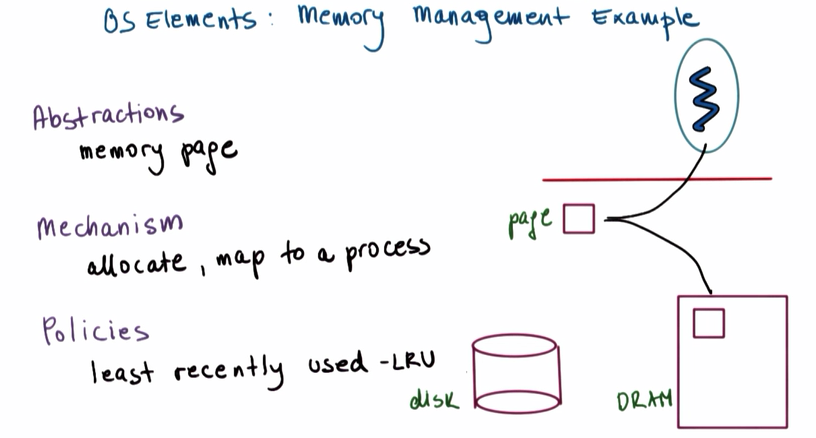


* Design Principles
	- Separation of mechanism & policy: implement flexible mechanism to support  many policies
	- Optimize for common case 


##### System call

* User/Kernel Protection Boundary
	- User-level: applications
	- Kernel-level: OS kernel, privileged direct hardware access


* User/kernel switch is supported by hardware:
	- trap instructions
	- system call: open(file), send(socket), malloc(memory)
	- signals

	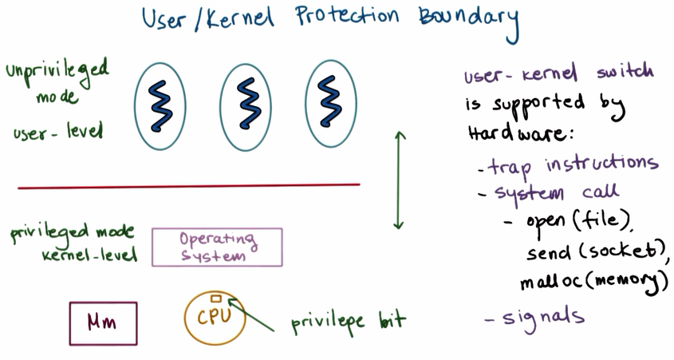


* To write a system call, an application must:
	- write argument
	- save relevant data at well-defined location
	- make system call

	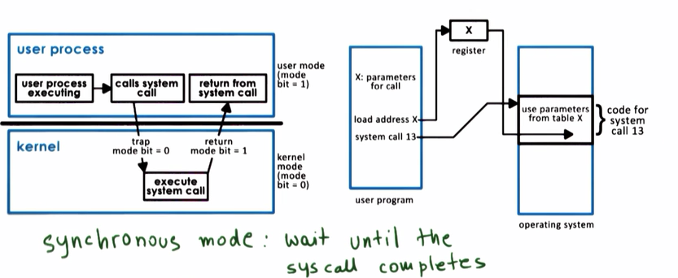


* User/Kernel transitions
	- involves a number of instructions, e.g. ~50-100ms on a 2GHz machine running linux
	- switch locality: affects hardware cache
	- not cheap!


* OS services
	- process management
	- file management
	- device management
	- memory management
	- security
	- ...

	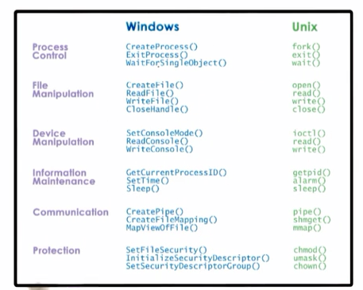


##### OS structures

* Monolithic OS
	-  [Monolithic kernel](https://en.wikipedia.org/wiki/Monolithic_kernel)

	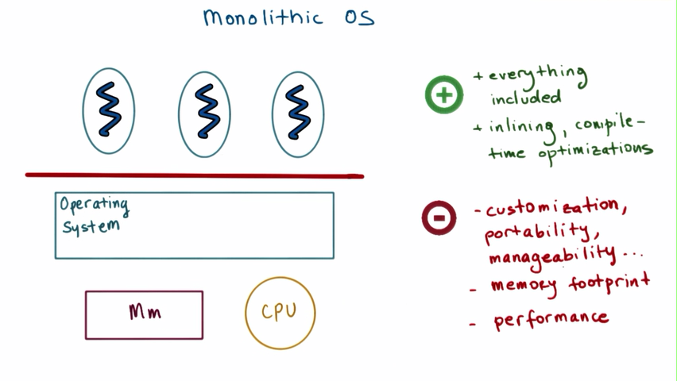


* Modular OS
	
	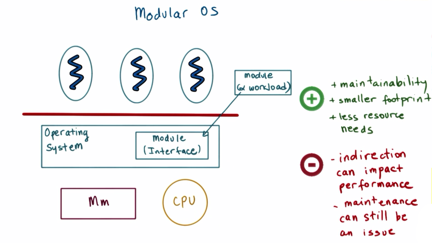


* Microkernel
	- [Micorkernel](https://en.wikipedia.org/wiki/Microkernel)

	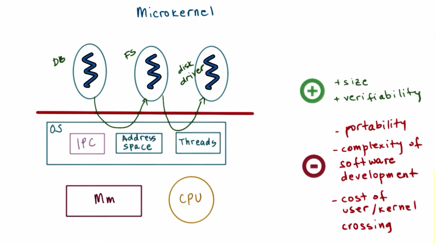


* Linux architecture

	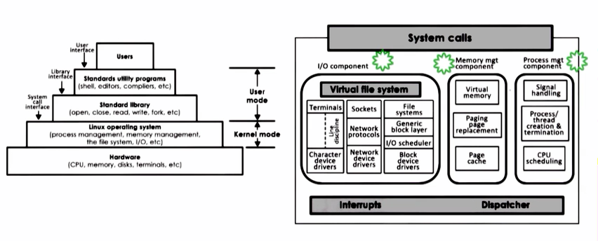


* Mac OS Architecture

	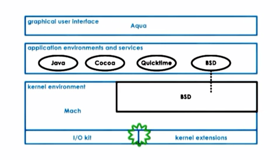


* Summary
	- OS elements: abstractions, mechanisms, and policies
	- Communication between applications and OS via system calls


* Recommended Textbooks
	- Operating System Concepts
	- Operating System Concepts Essentials
	- Modern Operating Systems
	- [Operating Systems: Three Easy Pieces](http://pages.cs.wisc.edu/~remzi/OSTEP/)


### 2. Processes and Process Management

##### Introduction

* Preview
	- What is a process
	- How are processes represented by OS
	- How are multiple concurrent processes managed by OS


* What is a process
	- OS manages hardware on behalf of applications
	- Application: program on disk, static entity 
	- Process: state of a program, loaded in memory when executing, active entity


##### process-related abstrctions

* Process address space

	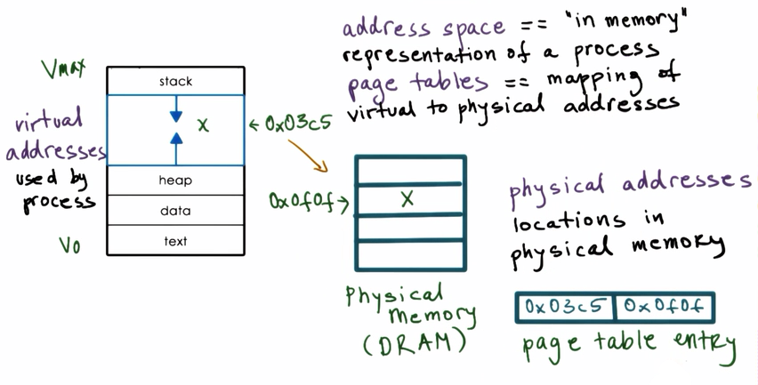
	
	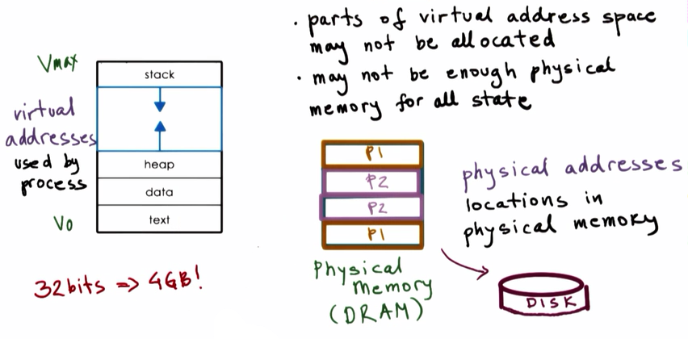


* How does the OS know what a process is doing?
	- Program Counter
	- CPU registers
	- Stack pointer
	- ...


* PCB: Process Control Block
	- created when process is created
	- certain fields are updated when process state changes
	
	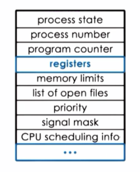


##### Process management mechanisms

* Context switch
	- switching the CPU from  the context of one process to the context of another
	- expensive:
		- direct costs: number of cycles for load & store instructions
		- indirect costs: cold cache, cache misses

	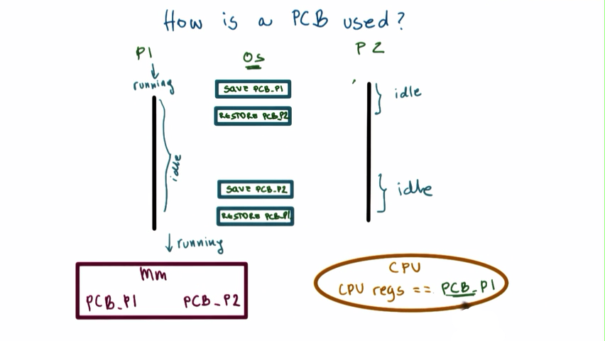
	

* Process life cycle

	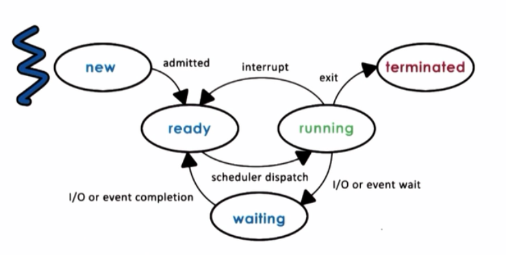


* Process creation
	- fork
		- copies the parent PCB into new PCB
		- child continues execution at instruction after fork
	- exec
		- replace child image
		- load new program and start from first instruction


* CPU scheduler
	- A CPU scheduler determines *which one* of the currently ready processes will be *dispatched* to the CPU to start running, and for *how long* it should run
	- OS must be efficiently
		- preempt: interrupt and save current context
		- schedule: run scheduler to choose next process
		- dispatch: dispatch a process & switch into its context
	- Scheduling design desions
		- what are appropriate timeslice values
		- metrics to choose next process to run

	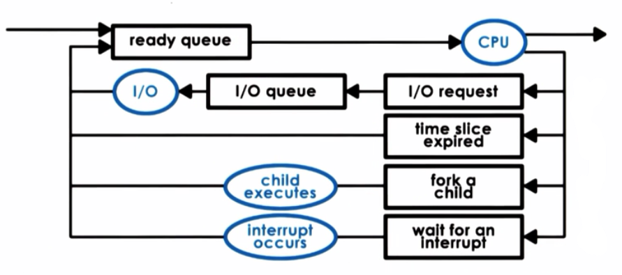


* Processes interact
	- Inter Process Communication (IPC) Mechanisms
		- transfer data/info between address spaces
		- maintain protection and isolation
		- provide flexibility and performance
	- Message-passing IPC
		- OS provides communication channel, like shared buffer
		- processes write(send)/read(recv) messages to/from channel
	- Shared memory IPC
		- OS establishes a shared channel and maps it into each process address space
		- processes directly read/write from this memory
		- OS is out of the way

	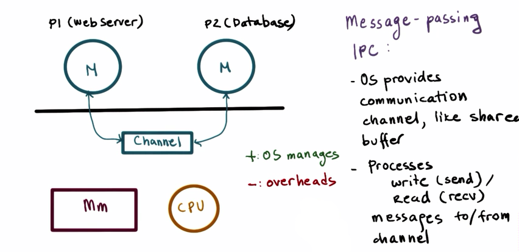

	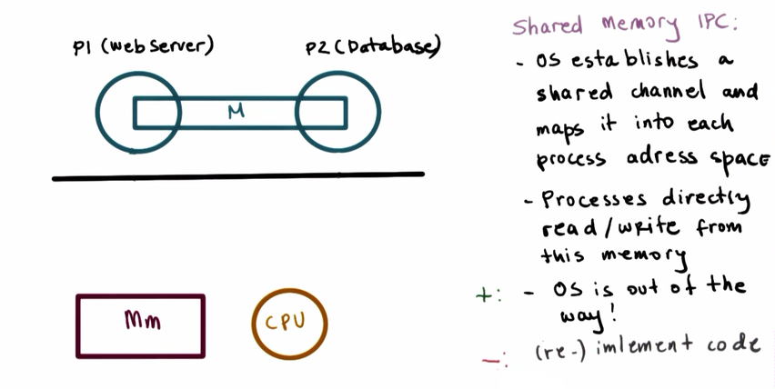


*  Summary
	- Process and process-related abstrctions: address space and PCB
	- Basic mechanisms for managing process resources
		- context switching
		- process creation
		- scheduling
		- inter-process communication 


### 3. Threads and Concurrency

##### Introduction

* Preview
	- Whare are threads
	- How threads different from processes
	- What data structure are used to implement and manage threads


* Paper: "An Introduction to Programming with Threads" by Birrell
	- Threads and concurrency
	- Basic mechanisms for multithreaded systems
	- Synchronization  


* Process vs. Thread

	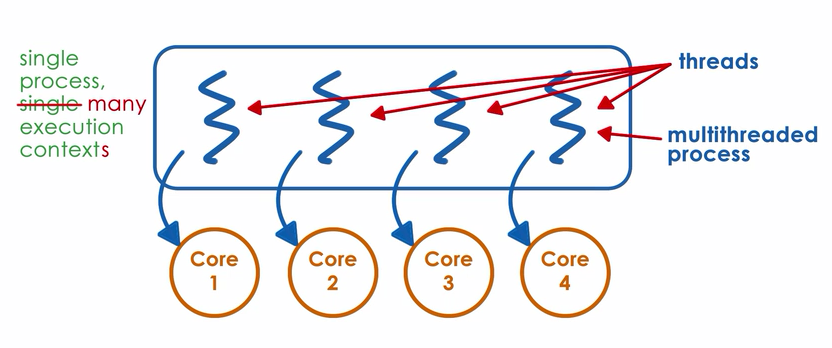

	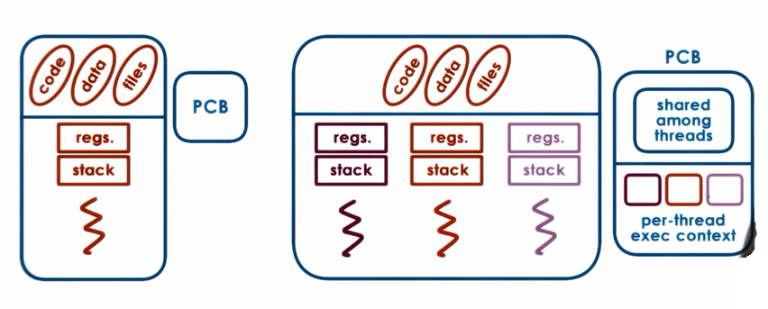


* Why are theads useful
	- parallelization => speed up
	- specialization => hot cache
	- efficiency: lower mm requirement & cheaper IPC (compared to multi-process)


* Multi-threaded OS kernel
	- threads working on behalf of apps
	- OS-level services like daemons or drivers 

	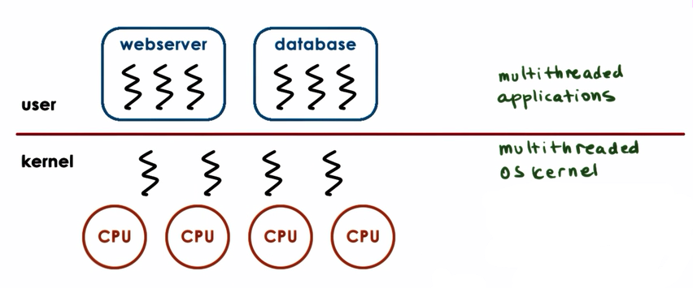


* Basic thread mechanisms
	- thread data structure: identify threads, keep track of resource usage
	- mechanisms to create and manage threads
	- mechanisms to safely coordinate among threads running concurrently in the same  address space


* Thread creation
	
	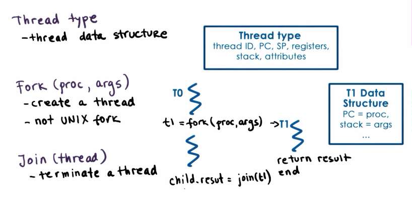


##### Thread synchronization

* Concurrency control & Coordination
	- mutual exclusion
		- exclusive access to only one thread at a time
		- mutex
	- waiting on other threads
		- specify condition before proceeding
		- condition variable
	- waking up other threads from wait state


* Mutual exclusion

	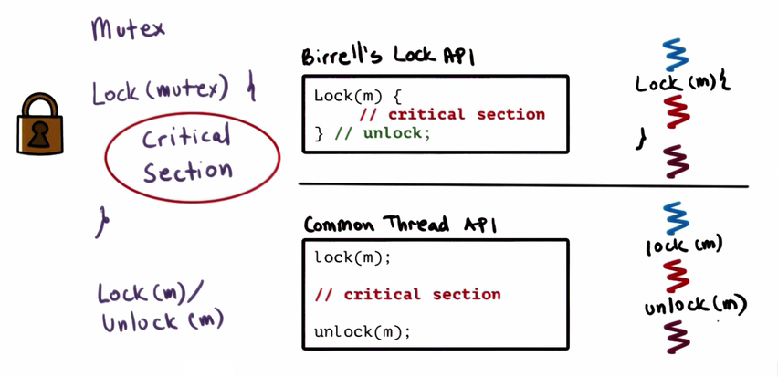


* Condition variable
	- Wait(mutex, cond)
		- mutex is automatically released and re-aquired on wait
	- Signal(cond)
		- notify only one thread waiting on condition
	- Broadcast(cond)
		- notify all waiting threads

	```
	// consumer: print and clear
	Lock(m) {
	    while (my_list.not_full())
	        Wait(m, list_full)
	    my_list.print_and_remove_all();
	} // unlock;

	// producers: safe_insert
	Lock(m) {
	    my_list.insert(my_thread_id);
	    if (my_list.full())
	        Signal(list_full);
	} // unlock;
	```

	- why use "while" rather than "if"
		- "while" can support multiple consumer threads
		- cannot guarantee access to m once the condition is signaled
		- the list can change before the consumer gets access again


* Reader/Writer Problem
	- rules:
		- reader: 0 or more access
		- writer: 0 or 1 access
	- condition:
		- if (read.counter == 0 and write.conter == 0) then R=ok, W=ok 
		- if (read.counter > 0) then R=ok, W=no
		- if (write.counter == 1) then R=no, w=no
	- state of shared resource:
		- free: resource.counter = 0
		- reading: resource.counter > 0
		- writing: resource.counter = -1
	
	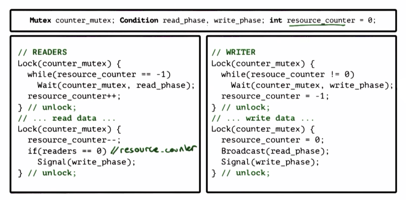


* Critical section structure
	- typical critical section structure
	```
	Lock (mutex) {
	    while (!predicate_indicating_access_ok)
	        Wait(mutex, cond_var)
	    update state => update predicate
	    Signal/Broadcast(cond_var_with_correct_waiting_threads)
	}
	```
	- critical section structure with proxy variable, e.g. Reader/Writer
	```
	// ENTER CRITICAL SECTION
	Lock (mutex) {
	    while (!predicate_for_access)
	        Wait(mutex, cond_var)
	    update predicate;
	} // unlock

	// CRITICAL_OPERATION
	perform_critical_operation(read/write_shared_file)

	// EXIT CRITICAL SECTION
	LOCK(mutex) {
	    update predicate;
	    Signal/Broadcast(cond_var);
	} // unlock
	```


##### Common pitfalls

* Avoiding Common mistakes
	- keep track of mutex/cond variables used with a resource
	- check that you are always using lock & unlock correctly 
	- use a single mutex to access a single resource 
	- check that you are signaling correct condition
	- check that you are not using signal when broadcast is needed
	- ask yourself: do you need priority guarantees? 
		- thread execution order not controlled by signals to condition variables
	- aware of spurious wakeup
	- avoid deadlocks 


* Spurious wake up
	- wake up threads that may not be able to proceed
	- if (unlock after broadcast/signal) => no other thread can get lock 
	- unlock the mutex before broadcast/signal
	```
	// OLD WRITER
	Lock (counter_mutex) {
	    resource_counter =  0;
	    Broadcast(read_phase);
	    Signal(write_phase);
	} // unlock

	// New WRITER
	Lock (counter_mutex) {
	    resource_counter = 0;
	}
	Broadcast(read_phase);
	Signal(write_phase);
	```
	- could NOT unlock the mutex before broadcast/signal
	```
	// READERS
	Lock (counter_mutex) {
	    resource_counter--;
	    if (counter_resource == 0) {
	        Signal(write_phase);
	    }
	}
	```


* Dead lock
	- Two or more competing threads are waiting on each other to complete, but one of them do
	- Solutions:
		- fine-grained locking, e.g. unlock A before locking B
		- get all locks upfront, then release at the end
		- use one MEGA lock
		- maintain lock order, prevent cycles in wait graph
		- deadlock detection & recovery, rollback


##### Kernel vs. User-level threads

* Kernel & user-level thread mappings
	- One-to-One model
		- +: os sees threads, synchronization, blocking
		- -: must go to OS for all operations, may be expensive
		- -: OS may have limits on policies, thread number
		- -: portability
	
	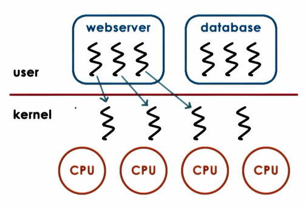
		
	- Many-to-One model
		- +: totally protable
		- -: OS has no insights into application needs
		- -: OS may block entire process if one user-level thread blocks on I/O

	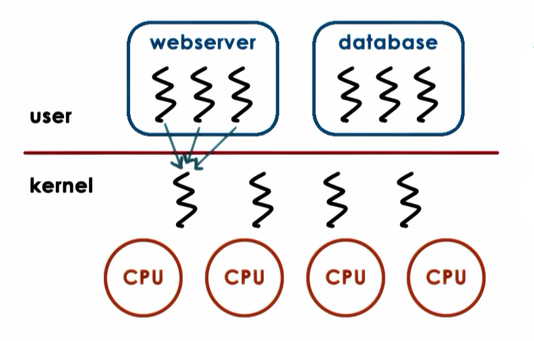

	- Many-to-Many model
		- +: can be best of both worlds
		- +: can have bound or unbound threads
		- -: require coordination between user and kernel level thread managers
	
	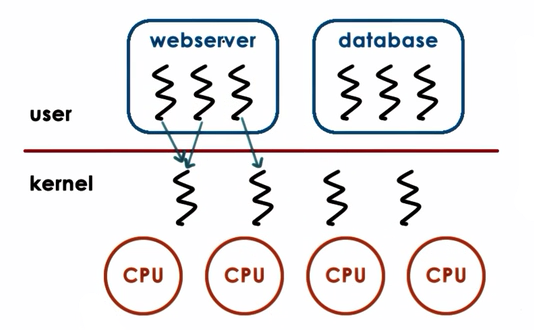


* Scope of multithreading
	- Process scope: user-level library manages threads within a sigle process
	- System scope: system-wide thread management by OS-level thread managers, e.g. CPU scheduler


##### Multithreading Patthers

* Boss-workers Pattern
	- Boss-workers
		- boss: assign work to workers
		- worker: performs entire task
	- Throughput of the system limited by boss thread => must keep boss efficient
		- throughput = 1 / boss_time_per_order
	- Boss assign work by 
		- directly signalling specific worker
			- +: workers don't need to synchronize
			- -: boss must track what each worker is doing
			- -: throughput will go down!
		- placing work in producer/consumer queue
			- +: boss does't need to know details about workers
			- -: queue synchronization
	- Worker pool: static or dynamic
	- +: simplicity
	- -: thread pool management
	- -: locality

	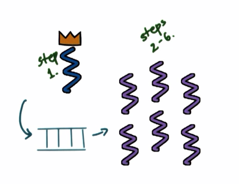


* Boss-workers variants
	- workers specialized for certain tasks instead of all workers created equal
	- +: better locality
	- +: Quality of service management
	- -: load balancing


* Pipeline pattern
	- threads assigned one subtask in the system
	- multiple tasks concurrently in the system,  in different pipeline stages
	- sequence of stages, stage == subtask
	- each stage == thread pool
	- shared-buffer based communication b/w stages
	- +: specialization and locality
	- -: balancing and synchronization overheads


* Layered pattern
	- each layer group of related subtasks
	- end-to-end task must pass  up and down through all layers
	- +: specilization
	- +: less fine-grained than pipeline
	- -: not suitable for all applications
	- -: syncrhonization
		
	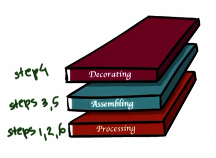


* Summary
	- What are threads? How and why do we use them?
	- Thread mechanisms
		- mutexes, condition variables
	- Using threads
		- problems, solutions and design approaches


### 4. PThreads

* Preview
	- PThread: POSIX Thread
	- POSIX: Portable Operating System Interface
	- POSIX Threads
		- POSIX version of Birrell's API
		- Specifies syntax and semantics of the operations


* PThread creation
	
	```
	pthread_t aThread;  // type of thread
	int pthread_create(pthread_t* thread, 
	    const pthread_attr_t* attr,
	    void* (*start_routine)(void*),
	    void* arg);
	int pthread_join(pthread_t thread, void** status);
	```


* PThread attributes
	- pthread_attr_t
	- specified in pthread_create
	- defines features of the new thread
		- static size
		- inheritance
		- joinable
		- scheduling policy
		- priority
		- system/process scope
	- has default behavior with NULL in pthread_create 

	```
	int pthread_attr_init(pthread_attr_t* attr);
	int pthread_attr_destory(pthread_attr_t* attr);
	pthread_attr_{set/get}{attribute}
	```
	
	```
	#include <stdio.h>
	#include <pthread.h>
	
	void* foo(void* arg) {
	    printf("Foobar!\n");
	    pthread_exit(NULL);
	}
	
	int main(void) {
	    int i;
	    pthread_t tid;
	    
	    pthread_attr_t attr;
	    pthread_attr_init(&attr);
	    pthread_attr_setdetachstate(&attr, PTHREAD_CREATE_DETACHED);
	    pthread_attr_setscope(&attr, PTHREAD_SCOPE_SYSTEM);
	    pthread_create(&tid, &attr, foo, NULL);
	}	
	```
	
	```
	#include <stdio.h>
	#include <pthread.h>
	#define NUM_THREADS 4
	
	void* hello(void* arg) {
	    printf("Hello Thread\n");
	    return 0;
	}
	
	int main(void) {
	    int i;
	    pthread_t tid[NUM_THREADS];
	    for (i = 0; i < NUM_THREADS; i++) {
	        pthread_create(&tid[i], NULL, hello, NULL);
	    }
	    for (i = 0; i < NUM_THREADS; i++) {
	        pthread_join(tid[i], NULL);
	    }
	    return 0;
	}	
	```


* PThread mutexes
	
	```
	pthread_mutex_t aMutexl;  // mutex type
	int pthread_mutex_lock(pthread_mutex_t* mutex);
	int pthread_mutex_unlock(pthread_mutex_t* mutex);
	int pthread_mutex_trylock(pthread_mutex_t* mutex);
	int pthread_mutex_init(pthread_mutex_t* mutex, const pthread_mutexattr_t* attr);
	int pthread_mutex_destroy(pthread_mutex_t* mutex);
	```


* PThread condition variables

	```
	pthread_cond_t aCond;  // type of cond variable
	int pthread_cond_wait(pthread_cond_t* cond, pthread_mutex_t* mutex);
	int pthread_cond_signal(pthread_cond_t* cond);
	int pthread_cond_broadcast(pthread_cond_t* cond);
	int pthread_cond_init(pthread_cond_t* cond, const pthread_condattr_t * attr);
	int pthread_cond_destroy(pthread_cond_t* cond);
	```


* Producer and consumer example

	```
	#include <stdio.h>
	#include <stdlib.h>
	#include <pthread.h>
	
	#define BUF_SIZE 3
	
	int buffer[BUF_SIZE];  // shared buffer
	int add = 0;           // place to add next element
	int rem = 0;           // place to remove next element
	int num = 0;           // number of elements in buffer
	
	pthread_mutex_t m = PTHREAD_MUTEXT_INITIALIZER;
	pthread_cond_t c_cons = PTHREAD_COND_INITIALIZER;
	pthread_cond_t c_prod = PTHREAD_COND_INITIALIZER;
	
	void* producer(void* param);
	void* consumer(void* param);

	int main(int argc, char* argv[]) {
	    pthread_t tid1, tid2;
	    int i;
	    
	    if (pthread_create(&tid1, NULL, producer, NULL) != 0) {
	        fprintf(stderr, "Unable to create producer thread\n");
	        exit(1);
	    }
	    if (pthread_create(&tid2, NULL, consumer, NULL) != 0) {
	        fprintf(stderr, "Unable to create consumer thread\n");
	        exit(1);
	    }
	    
	    pthread_join(tid1, NULL);
	    pthread_join(tid2, NULL);
	    printf("Parent quiting\n");
	}

	void* producer(void* param) {
	    int i;
	
	    for (i = 1; i <= 20; i++) {
	        pthread_mutex_lock(&m);
	        if (num > BUF_SIZE) {
	            exit(1);  // overflow
	        }
	        while (num == BUF_SIZE) {  // block if buffer is full
	            pthread_cond_wait(&c_prod, &m);
	        }
	        buffer[add] = i;  // buffer not full, add element
	        add = (add + 1) % BUF_SIZE;
	        num++;
	        pthread_mutex_unlock(&m);
	
	        pthread_cond_signal(&c_cons);
	        printf("producer: insert %d\n", i);
	        fflush(stdout);
	    }
	    
	    printf("producer quiting\n");
	    fflush(stdout);
	    return 0;
	}

	void* consumer(void* param) {
	    int i;
	
	    while (1) {
	        pthread_mutex_lock(&m);
	        if (num < 0) {  // underflow
	            exit(1);
	        }
	        while (num == 0) {  // block if buffer empty
	            pthread_cond_wait(&c_cons, &m);
	        }
	        i = buffer[rem];  // buffer not empty, remove element
	        rem = (rem + 1) % BUF_SIZE;
	        num--;
	        pthread_mutex_unlock(&m);
	
	        pthread_cond_signal(&c_prod);
	        printf("Consume value %d\n", i);
	        fflush(stdout);
	    }
	}
	```


### 5. Thread Design Consideration

* Preview
	- Kernel vs. user-level threads
	- Threads and interrupts
	- Threads and signal handling

* Papers
	- "Beyond Multiprocessing: Multithreading the Sun OS Kernel" by Eykholt et. al.
	- "Implementing Lightweight Threads" by Stein and Shah


##### Kernel vs. user-level threads

* Kernel vs. user-level threads
	- User level library provides:
		- thread abstraction
		- scheduling, synchronization, ...
	- OS kernel maintains:
		- thread abstraction
		- scheduling, synchronization, ...


* Thread-related Data Structures
	- "Hard" process state
		- virtual address mapping, ...
	- User-level thread (ULT)
		- UL thread ID
		- UL regs
		- thread stack, ...
	- "Light" process state
		- signal mask
		- sys call args, ...
	- Kernel-level thread (KLT)
		- stack
		- regitsters, ...
	- CPU
		- pointer to current and other threads, ...
	
	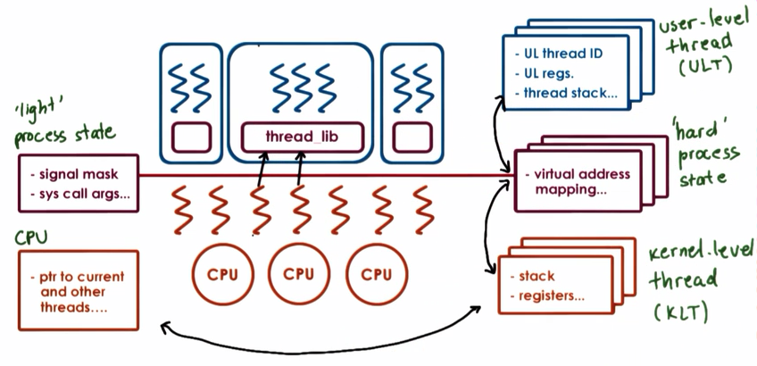

	
* Rational for multiple data structures
	- Signle PCB
		- large continuous data structure
		- private for each entity
		- saved and restored on each context switch
		- update for any changes
	- Multiple data structures
		- smaller data structures
		- easier to share
		- on context switch, only save and restore what needs to change
		- user-level library need only update portion of the state
	- Merits
		- scalability
		- overheads
		- performance
		- flexibility


* User-level Thread Data Structures
	- thread creation => thread ID (tid)
	- tid: index into table of pointers
	- table pointers point to per-thread data structure
	- stack growth can be dangerous
		- solution: red zone

	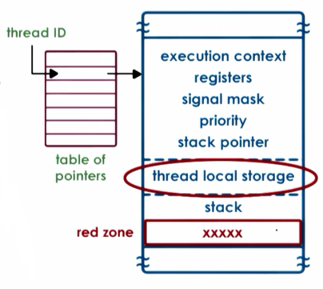


* Kernel-level Data Structure
	- Process
		- list of kernel-level threads
		- virtual address space
		- user credentials
		- signal handlers
	- Light-Weight Process (LWP)
		- user level registers
		- system call args
		- resource usage info
		- signal mask
		- similar to ULT, but visible to kernel, not needed when process not running
	- Kernel-level Threads
		- kernel-level register
		- stack pointer
		- scheduling info
		- pointers to associate LWP, Process, CPU structures
		- information needed even when process not running => not swappable
	- CPU
		- current thread
		- list of kernel-level thread
		- dispatching & interrupt handling information
		- on SPARC dedicated reg == current thread

	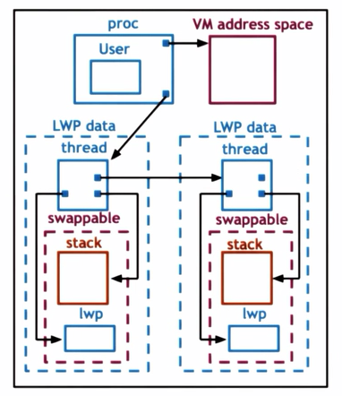


##### Interrupts and Signals

* Interrupts
	- events generated externally by components other than CPU (I/O devices, timers, other CPUs)
	- determined based on the physical platform
	- appear asynchronously
	- have a unique ID depending on the hardware
	- can be masked and disabled/suspended via corresponding mask, per-CPU interrupt mask
	- if enabled, trigger corresponding hadler, interrupt handler set for entire system by OS

* Signals
	- events triggered by the CPU & software running on it
	- determined based on the Operating System
	- appear synchronously or asynchronously
	- have a unique ID depending on OS
	- can be masked and disable/suspended via corresponding mask, per-process signal mask
	- if enable, trigger corresponding handler, signal handlers set on per process basis, by process


* Interrupt Handling

	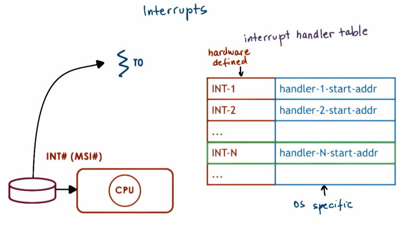


* Signal Handing

	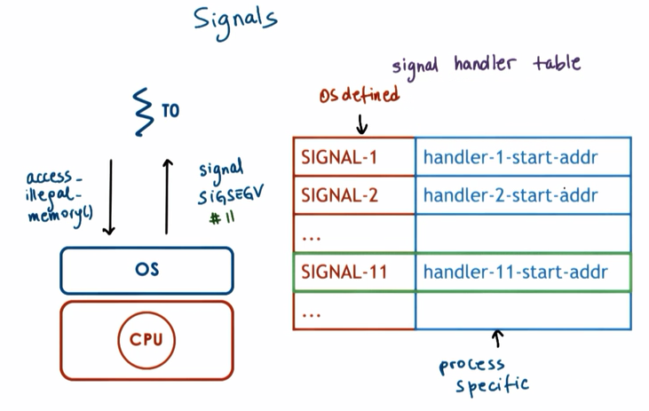


##### Task in Linux

* Task
	- main execution abstraction
	- kernel level thread
	- single-threaded process => 1 task
	- multi-threaded process => many task

	```
	// task struct in Linux
	struct task_struct {
	    // ...
	    pid_t pid;
	    pid_t tgid;
	    int prio;
	    volatile long state;
	    struct mm_struct* mm;
	    struct files_struct* files;
	    struct list_head tasks;
	    int on_cpu;
	    cpumask_t cpus_allowed;
	    // ...
	}
	``` 

* Task creation
	- clone(function, stack_ptr, sharing_flags, args)

	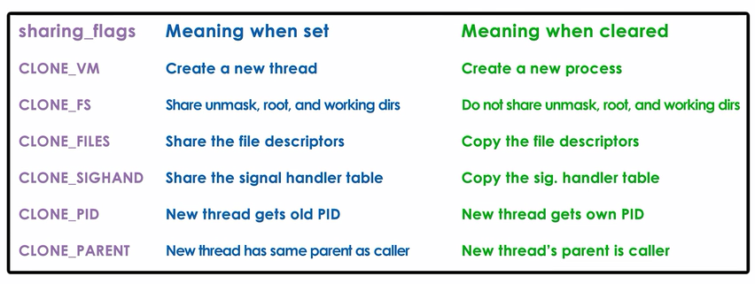


* Linux thread model
	- Native POSIX Thread Library (NPTL), "1:1 model"
		- kernel sees each ULT info
		- kernel traps are cheaper
		- more resources: memory, large range of IDs
	- Older Linux threads, "M-M model"
		- similar to those described in Solaris papers 


* Summary
	- Sun/Solaris paper
		- implementation insights for supporting user/kernel-level threads
		- historic perspective on Linux threading models
	- Interrupts and signals


### 6. Thread Performance Consideration

* Preview
	- Performance comparisons
		- multi-process vs. multi-threaded vs. event-driven
	-  Event-driven architectures
		-  Paper: "Flash: An Efficient and Portable Web Server"
	- Designing experiments


* Performance metrics
	- Metrics
		- a measurement standard
		- measurable and/or quanlifiable property, e.g. execution time
		- of the system we're interested in, e.g. software implementation of a problem
		- that can be used to evaluate the system behavior, e.g. its improvement compared to other implementations
	- Throughput, execution time, request rate, wait time, CPU utilization, average resource usage, client-perceived performance, etc.
	- For a matrix multiply application
		- execution time
	- For a web service application
		- number of client requests/time
		- response time
	- For hardware
		- higher utilization


* MultiProcess web server (MP)
	- +: simple programming
	- -: high memory usage
	- -: costly context switch
	- -: hard and costly to maintain shared state (tricky port setup)
	
	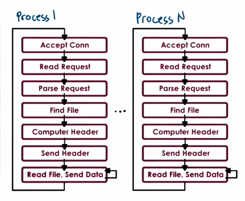


* MultiThreaded web server
	- +: shared address space
	- +: shared state
	- +: cheap context switch
	- -: not simple implementation
	- -: requires synchronization
	- -: underlying support for threads
	
	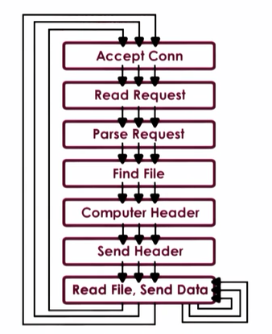


* Event-driven Model
	- Single process, single address space, single thread of control
	- Events
		- receipt of request
		- completion of send
		- completion of disk read
	- Dispatcher
		- state machine, external events
		- call handler => jump to code
	- Handler
		- run to completion
		- if  they need to block => initiate blocking operation and pass control to dispatch loop
	
	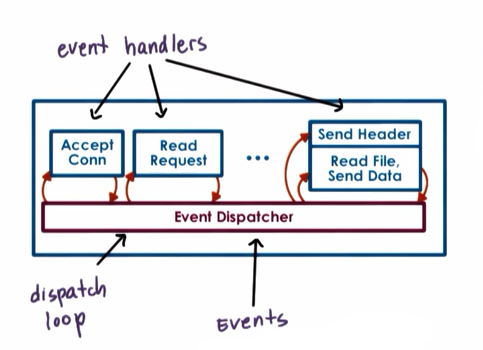

	- Benefits
		- signle address space, single flow of control
		- smaller memory requirement, no context switching
		- no synchronization


* Concurrent execution in event-driven model
	- MP or MT: 1 request per execution context (process/thread)
		- if (idle > 2 * ctx_switch) => ctx_switch to hide latency
	- Event-driven: many request interleaved in an execution context, 
		- context switching just waste cycles that could have been used for request processsing
		- process request until wait necessary then switch to another request	
		- e.g.
			- client C1: wait on send
			- client C2: wait on disk I/O
			- client C3: wait on recv
		- multiple CPUs: multiple event-driven processes
	- How does this work
		- file descriptors: sockets, network, files, disk
		- event: input on file descriptor (fd)
		- which file descriptor?
			- select()
			- poll()
			- epoll()


* Asynchronous I/O operations
	- Asynchronous system call
		- process/thread makes system call
		- OS obtains all relevant info from stack and either learns where to return results, or tells caller where to get results later
		- process/thread can continue
	- Requires support from kernel (e.g. threads) and/or device (e.g. DMA)
		- fits nicely with event-driven model

	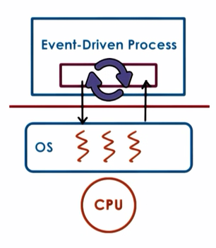	


* What if Async calls are not available
	- Asymmetric Multi-Process/Thread Event-Driven Model (AMPED/AMTED)
	- Helpers:
		- designated for blocking I/O operations only
		- pipe/socket based communication with event dispather
		- helper blocks, but main event loop and process will not
	- Helper threads/processes
		- +: resolves portability limitations of basic event-driven model
		- +: smaller footprint thant regular worker thread
		- -: applicability to certain classes of applications
		- -: event routing on multi CPU systems

	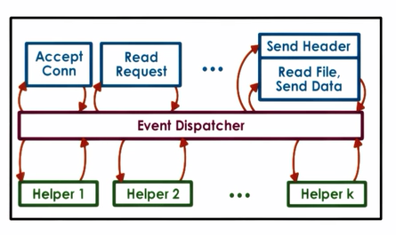


* Flash: event-driven web server
	- AMPED: an event-driven web server with asymmetric helper processes
	- helpers used for disk reads
	- pipes used for communicating with dispatcher
	- helpers reads file in memory via mmap
	- dispatcher checks via mincore if pages are in mm, to decide 'local' handler or helper

	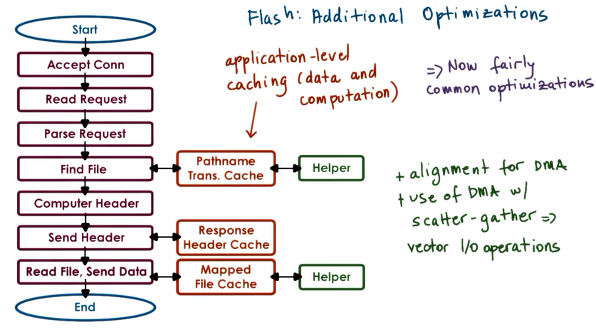


* Apache web server
	* Apache core: basic server skeletion
	* Module: per functionality
	* Flow of control: similar to event driven model
	* Combination of MP + MT
		- each process: boss/worker with dynamic thread pool
		- number of processes can also be dynamically adjusted

	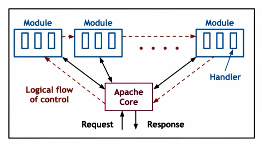

* Summary
	- Event-driven model for concurrent processing
	- Compared multi-process vs. multi-threaded vs. event-driven designs


### 7. Scheduling


### 8. Memory Management

* Preview
	- Physical and virtual memory management
	- Memory management mechanisms
	- Illustration of advanced services


* Memory management systems:
	- uses intelligently sized containers: memory pages or segments
	- not all memory is needed at once: tasks operate on subset of memory
	- optimized for performance: reduce time to access state in memory
	

* Memory management goals
	- Virtual vs. Physical memory
		- Allocate: allocation, replacement, ...
		- Arbitrate: address translation and validation
	- Page-based memory management
		- Allocate: virtual page -> physical page frames (fixed size)
		- Arbitrate: page tables
	- Segment-based memory management
		- Allocate: segments (flexible size)
		- Arbitrate: segment registers


* Hardware support
	- MMU
		- Memory Management Unit
		- translate virtual to physical addresses
		- report faults: illegal access, permission, not present in main memory
	- Registers
		- pointers to page table
		- base and limit size, number of segments, ...
	- Cache
		- TLB: Translation Lookaside Buffer
		- valid virtual address to physical address translations
	- Translation: actual address generation done in hardware

	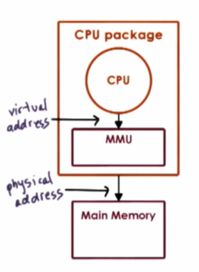


* Page tables
	- per process
	- on context switch, switch to valid page table
	- update register, e.g. CR3 on x86

	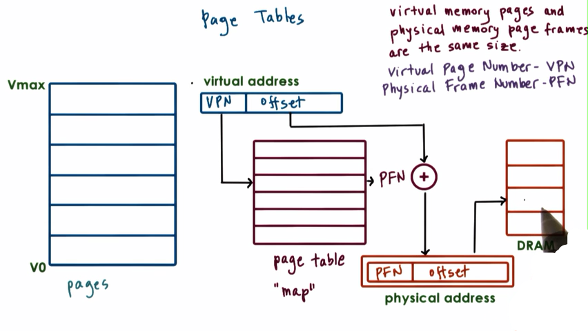

	- VPN: Virtual Page Number
	- PFN: Physical Frame Number

	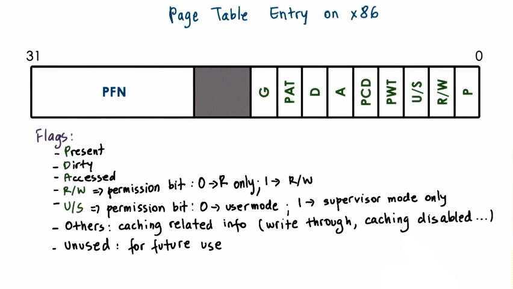

	
* Page fault
	- Page fault handler determines action based on error code and faulting address
		- bring page from disk to memory
		- protection error(SIGSEGV)
	- On x86:
		- error code from PTE flags
		- faulting address in CR2


* Page table size
	- Process does not use entire address space
	- Page table assumes an entry per VPN, regardless of whether corresponding virtual memory is needed or not
	- Hierarchical page tables
		- internal page table, only for valid virtual memory regions
		- on malloc, a new internal page table may be allocated


* TLB
	- Translation Lookaside Buffer
	- MMU-level address translation cache
	- on TLB miss: page table access from memory
	- has protection/validity bits
	- small number of cached addr: high TLB hit rate <=> temporal & spatial locality
	- x86 core i7:
		- per core: 64-entry data TLB, 128-entry instruction TLB
		- 512 entry shared second-level TLB
	

* Inverted page tables
	- [A Discussion of Inverted Page Tables](http://www.jklp.org/~chiefdigger/profession/papers/ipt/ipt.htm) 
	
	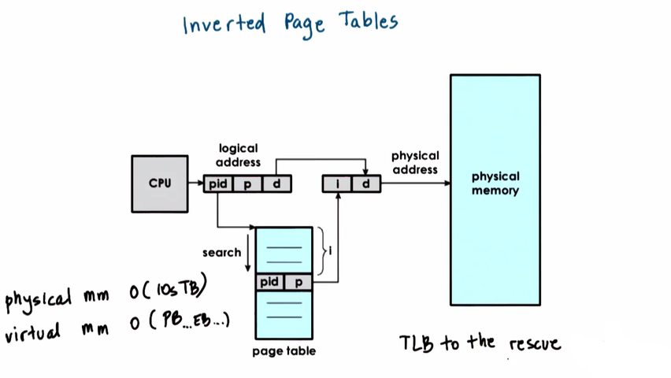


* Hashing page tables

	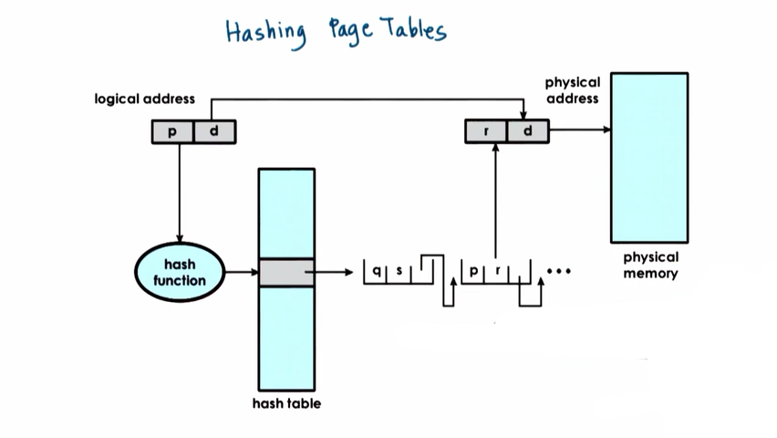


* Segmentation
	
	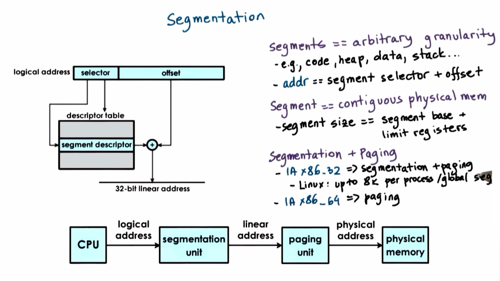


* Page size
	- 10-bit offset => 1KB page size
	- 12-bit offset => 4KB page size
	- Linux/x86: 4KB, 2MB, 1GB
	- larger pages:
		- fewer page table entries, smaller page tables, more TLB hits
		- internal fragmentation, wastes memory


* Memory allocation
	- Memory allocator: determines VA to PA mapping
	- Kernel level allocators: kernel state, static process state
	- User level allocators: dynamic process state(cheap), malloc/free, e.g. dllmalloc, jemalloc, tcmalloc
	- Memory allocation challenges
		- external fragmentation
		- internal fragmentation


* Allocators in linux kernel
	* Buddy allocator

	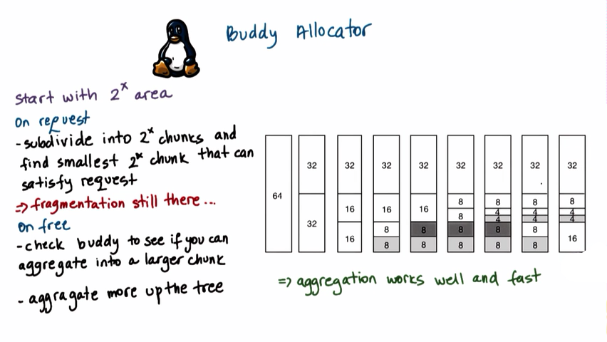
	
	* Slab allocator
	
	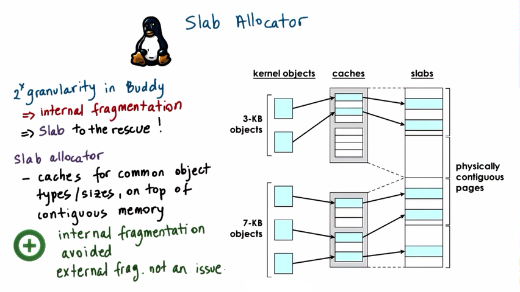


* Demand paging
	- Virtual memory => physical memory
	- Virtual memory page not always in physical memory
	- Physical page frame saved and restored to/from secondary storage
	- Demand paging: pages swapped in/out of memory and a swap partition 

	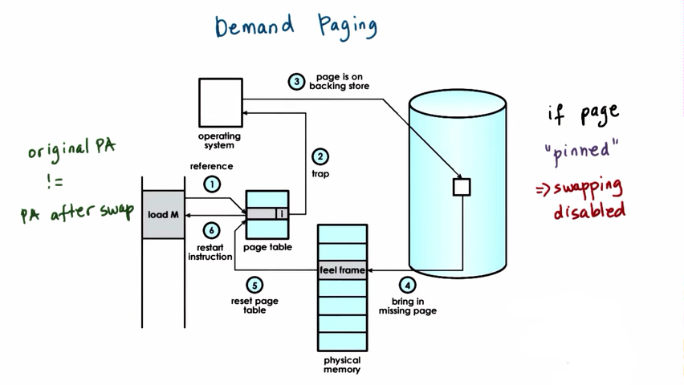
	

* Page replacement
	- When should page be swapped out?
		- when memory usage is above threshold
		- when CPU usage is below threshold
	- Which page should  be swapped out?
		- pages that won't be used
		- history-based prediction
			- LRU: Least Recently Used
			- access bit tp track if page is referenced
		- pages that donot need to be written out
			- dirty bit to track if modified
		- avoid non-swapped pages


* Copy on write
	
	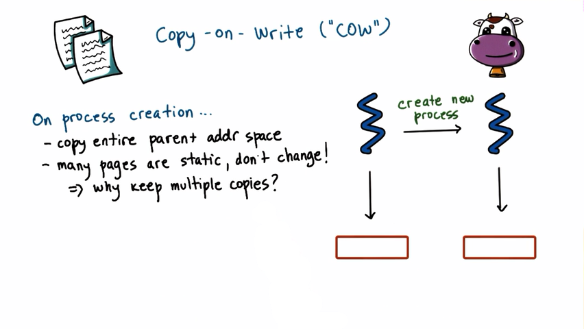
	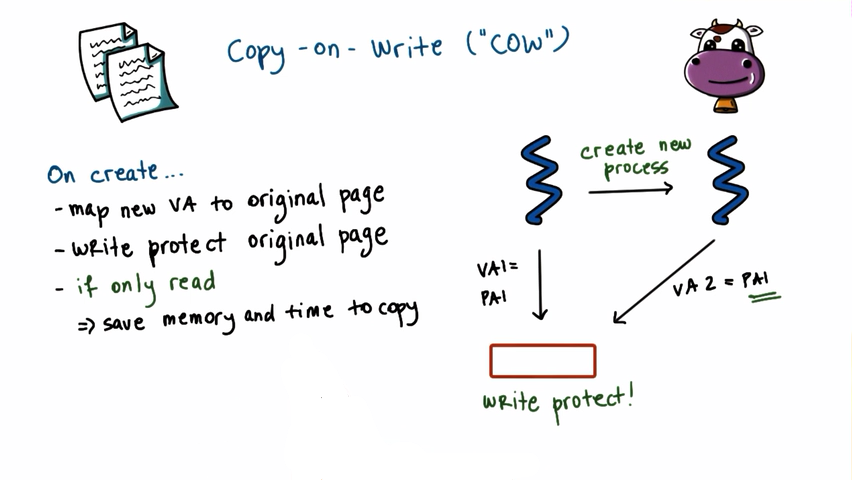
	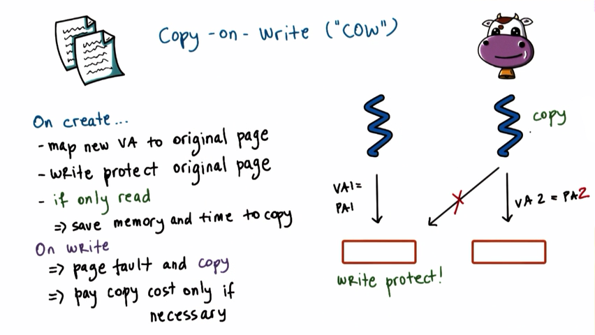


* Check pointing
	- failure & recovery management technique 
	- periodcally save process state
	- failure may be unavoidable, but can restart from checkpoint, so recovery much faster


* Check pointing approaches
	- simple approach: pause and copy
	- better approach:
		- write-protect and copy everything once
		- copy diffs of 'dirtied' pages for incremental checkpoints
		- rebuild from multiple diffs, or in background

* Debugging
	- Rewind-Replay(RR)
	- Rewind: restart from checkpoint
	- gradually go back to older checkpoints until error found


* Migration
	- continue on another machine
	- disaster recovery
	- consolidation
	- repeated checkpoints in a fast loop until pause-and-copy becomes acceptable


* Summary
	- Virtual memory abstracts a process' view of physical memory
	- Pages and segments
	- Allocation and replacement strategies and checkpointing
   

### 9. Inter-Process Management


### 10. Synchronization


### 11.  I/O Management


### 12. Virtualization

* Preview
	- Overview of virtualization
	- Main technical approaches in popular virtualization solutions
	- Virtualization-related hardware advances


* Virtualization
	- Virtualization allows concurrent execution of multiple OS and their applications on the same physicala machine
	- Virtual resources: each OS thins that it owns hardware resources
	- Virtual machine(vm): OS + applications + virtual resources(guest domain)
	- Virtualization layer: management of physical hardware, virtual machine monitor(VMM), hypervisor


* Virtaul Machine
	- A virtual machine is an efficient, isolated, duplicate of the real machine, supported by a virtual machine monitor(VMM)


* VMM goals:
	- Fidelity: provides environment essentially identical with the originala machine
	- Performance: programs show at worst only minor decrease in speed
	- Safety & isolation: VMM is in complete control of system resources


* Two main virtualization models:
	- Bare-matal or hypervisor based
	- Hosted


* Bare-metal virtualization
	- VMM(hypervisor) manages all hardware resources and supports execution of VMs
	- Service(privileged) VM to deal with devices and other configuration and management task
	- Xen
		- Opensource or Citrix XenServer
		- dom0 and domUs
		- drivers in dom0
	- ESX(VMware)
		- many open APIs
		- drivers in VMM
	
	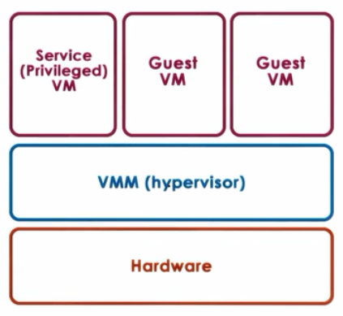


* Hosted virtualization
	- Host OS owns all hardware
	- Special VMM module provides hardware interface to VMs and deals with VM context switching 
	
	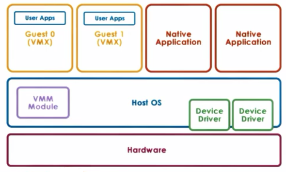


* KVM
	- Kernel-based VM
	- KVM kernel module + QEMU for hardware virtualization
	- Leverages linux opensource community
	
	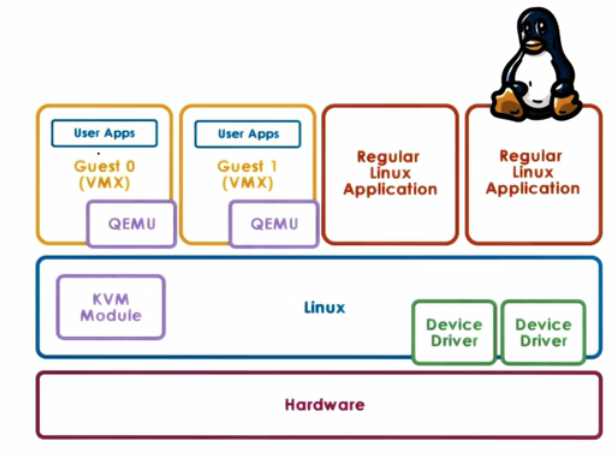

##### CPU virtualization

* Trap-and-Emulate
	- guest instructions executed directly by hardware
	- for non-privileged operations: hardware speeds => effiency
	- for privileged operations: trap to hypervisor
		- if illegal: terminate VM
		- if legal: emulate the behavior the guest OS was expecting from the hardware
	- works all right in MainFrame
	- Problems:
		- x86, pre 2005, 4 rings, no root/non-root modes yet, hypervisor in ring0, guest OS in ring 1
		- 17 privileged instructions do not trap, and fail silently
		- hypervisor does NOT know, so it does not try to change settings, OS does not know, so assumes change was successful


* Binary translation
	- Main idea: rewrite the VM binary
	- Pioneered at Stanford, commercialized as VMWare
	- Goal: full virtualization, guset OS not modified
	- Approach: dynamic binary translation
		- inspect code blocks to be executed
		- if needed, translate to alternate instruction sequencee, e.g. to emulate desired behavior, possibly even avoiding trap
		- otherwise, run at hardware speed


* Para-virtualization
	- Goal: performance, give up on unmodified guests
	- Approach: modify guest so that:
		- it knows it is running virtualized
		- it makes explicit calls to the hypervisor(hypercalls)
		- hypercall(~ system call): package context info, specify desired hypercall, trap to VMM
		- e.g. Xen

##### Memory virtualization

* Full virtualization
	- all guest expect contiguous physical memory, starting at 0
	- Vitual Address(VA), Physical Address(VA), Machine Address(MA) and page frame numbers
	- still leverages hardware MMU, TLB, ...
	- option 1:
		- guest page tables: VA => PA
		- hypervisor: PA => MA
		- to expensive!
	- option 2:
		- guest page tables: VA => PA
		- hypervisor shaow PT: VA => MA
		- hypervisor maintains consistence, e.g. invalidate on context switch, write-protect guest PT to track new mappings...


* Para-virtualization
	- guest aware of virtualization
	- no longer strict requirement on contiguous physical memory starting at 0
	- explicitly register page tables with hypervisor
	- cat 'batch' page table updates to reduce VM exits
 
##### Device virtualization

* Device virtualization
	- CPUs and memory: less diversity, ISA-level, standardization of interface
	- Devices: high diversity, lack of standard specification of device interface and behavior
	- 3 key models for device virtualization

		
* Passthrough model
	- Approach: VMM-level driver configures devices access permissions
	- Merits:
		- VM provided with exclusive access to the device VM can directly access the device (VMM-bypage)
	- Demerits:
		- device sharing difficult
		- device  must have exact type of device as what VM expects
		- VM migration tricky
	
	 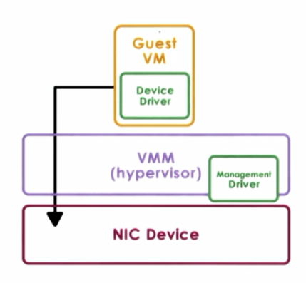


* Hypervisor-Direct model
	- Approach:
		- VMM intercepts all device access
		- emulate device operation translate to generic I/O operation, travers VMM-resident I/O stack, invoke VMM-resident driver
	- Merits:
		- VM decoupled from physical device
		- sharing, migration,  dealing with device specifics, ...
	- Demerits:
		- latency of device operations
		- device driver ecosystem comlexities in hypervisor

	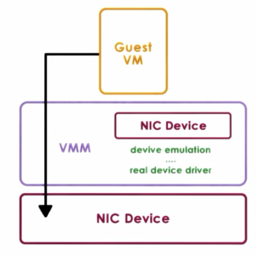


* Split-Device Driver model
	- Approach: device access control split between:
		- front-end driver in guest VM, device API
		- back-end driver in service VM or Host
	- Merits:
		- eliminate emulation overhead, allow for better management of shared devices
	- Demerits:
		- modified guest driver, limited to para-virtualized guests

##### Hardware Virtualization

* Key virtualization-related hardware features of X86
	- AMD Pacifica & Intel Vanderpool Technology (Intel VT), ~2005
	- Modes: root/non-root or host/guest mode
	- VM control structure, per VCPU, 'walked' by hardware
	- extended page tables and tagged TLB with VM ids
	- multiqueue devices and interrupt routing
	- security and management support
	- additional instructions to excercise the above features

	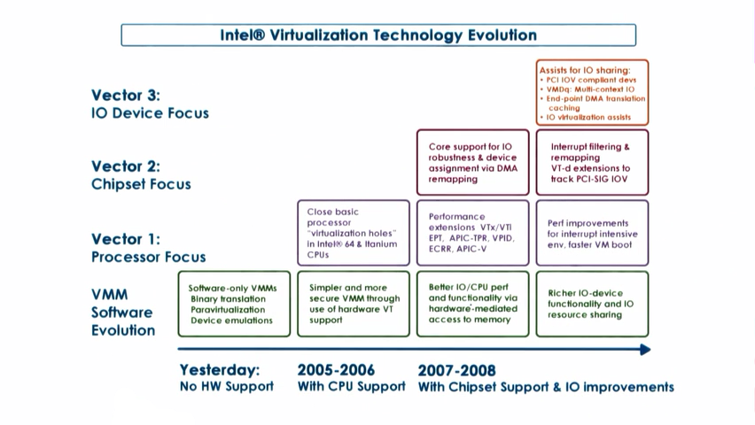


### 13. Remote Procedure Calls


### 14. Distributed File Systems


### 15. Distributed Shared Memory


### 16. DateCenter Technologies