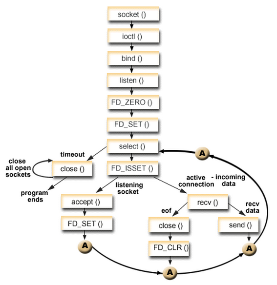

#### I/O Models

* 标准I/O
	- 缓存I/O，大多数文件系统的默认I/O操作都是缓存I/O
	- 操作系统会将I/O的数据缓存在文件系统的页缓存（page cache）中，也就是说，数据会先被拷贝到操作系统内核的缓冲区中，然后才会从操作系统内核的缓冲区拷贝到应用程序的地址空间
	- 数据在传输过程中需要在应用程序地址空间和内核进行多次数据拷贝操作，这些数据拷贝操作所带来的CPU以及内存开销非常大
	- 例，当一个read操作发生时，它会经历两个阶段：
		1. 等待数据准备(Waiting for the data to be ready)
		2. 将数据从内核拷贝到进程中(Copying the data from the kernel to the process)


* I/O Models：
	- blocking IO
	- nonblocking IO
	- IO multiplexing
	- signal driven IO
	- asynchronous IO


* Blocking I/O
	- 在Linux中，默认情况下所有的socket都是blocking
	- 当用户进程调用了recvfrom系统调用，kernel就开始了IO的第一个阶段：准备数据。 对于网络IO来说，很多时候数据在一开始还没有到达，kernel要等待足够的数据到来
	- 这时用户进程一直处于block状态
	- kernel一直等到数据准备好了，还需要将数据从kernel中拷贝到用户内存，然后返回结果
	- 这时用户进程才解除block的状态，重新运行起来
	- blocking IO的特点就是在IO执行的两个阶段都被block了
	
	


* Nonblocking I/O
	- Linux下，可以通过设置socket使其变为non-blocking
	- 当用户进程发出read操作时，如果kernel中的数据还没有准备好，那么它并不会block用户进程，而是立刻返回一个error
	- 从用户进程角度讲 ，它发起一个read操作后，并不需要等待，而是马上就得到了一个结果。 用户进程判断结果是一个error时，就知道数据还没有准备好，于是可以再次发送read操作
	- 一旦kernel中的数据准备好了，并且又再次收到了用户进程的system call，那么马上就将数据拷贝到了用户内存，然后返回 
	- **NOTE：** 数据从kernel拷贝到用户内存的这段时间内，用户进程是被block的
	- nonblocking IO的特点是用户进程需要不断的主动询问kernel数据好了没有

	


* I/O multiplexing
	- IO multiplexing就是我们说的select，poll，epoll，有些地方也称这种IO方式为event driven IO
	- select/epoll的好处就在于单个进程就可以同时处理多个网络连接的IO
	- 它的基本原理就是select，poll，epoll这些function会不断的轮询所负责的所有socket，当某个socket有数据到达了，就通知用户进程
	- 当用户进程调用了select，整个进程会被block，而同时，kernel会“监视”所有select负责的socket，当任何一个socket中的数据准备好了，select就会返回。这个时候用户进程再调用read操作，将数据从kernel拷贝到用户进程
	- I/O 多路复用的特点是通过一种机制一个进程能同时等待多个文件描述符，而这些文件描述符其中的任意一个进入读就绪状态，select()函数就可以返回
	- 因为这里需要使用两个system call (select 和 recvfrom)，而blocking IO只调用了一个system call (recvfrom)，所以如果处理的连接数不是很高的话，使用select/epoll的web server不一定比使用multi-threading + blocking IO的web server性能更好，可能延迟还更大
	- select/epoll的优势并不是对于单个连接能处理得更快，而是在于能处理更多的连接
	- 在IO multiplexing Model中，对于每一个socket，一般都设置成为non-blocking，但是整个用户进程其实是一直被block的，只不过进程是被select这个函数block，而不是被socket IO给block

	


* Asynchronous I/O
	- Linux下的asynchronous IO其实用得很少
	- 用户进程发起read操作之后，立刻就可以开始去做其它的事
	- 从kernel的角度，当它受到一个asynchronous read之后，首先它会立刻返回，所以不会对用户进程产生任何block
	- kernel会等待数据准备完成，然后将数据拷贝到用户内存，当这一切都完成之后，kernel会给用户进程发送一个signal，告诉它read操作完成了

	


* Comparison of I/O models
	- 调用blocking IO会一直block住对应的进程直到操作完成，而non-blocking IO在kernel还准备数据的情况下会立刻返回
	- non-blocking IO和asynchronous IO的区别: 在non-blocking IO中，虽然进程大部分时间都不会被block，但是它仍然要求进程去主动的check；并且当数据准备完成以后，也需要进程主动的再次调用recvfrom来将数据拷贝到用户内存。 而asynchronous IO则完全不同。 它就像是用户进程将整个IO操作交给了他人（kernel）完成，然后他人做完后发信号通知。在此期间，用户进程不需要去检查IO操作的状态，也不需要主动的去拷贝数据

	


* An Interesting Metaphore
	- 有A，B，C，D四个人在钓鱼：
	- A用的是最老式的鱼竿，所以呢，得一直守着，等到鱼上钩了再拉杆 => blocking I/O
	- B的鱼竿有个功能，能够显示是否有鱼上钩，所以呢，B就和旁边的MM聊天，隔会再看看有没有鱼上钩，有的话就迅速拉杆 => nonblocking I/O
	- C用的鱼竿和B差不多，但他想了一个好办法，就是同时放好几根鱼竿，然后守在旁边，一旦有显示说鱼上钩了，它就将对应的鱼竿拉起来 => I/O multiplexing
	- D是个有钱人，干脆雇了一个人帮他钓鱼，一旦那个人把鱼钓上来了，就给D发个短信 => asynchronous I/O


#### select

* select函数
	```
	#include <sys/select.h>
	#include <sys/time.h>
	
	int select(int max_fd_p1, fd_set* read_set, fd_set* write_set, fd_set* except_set, timeval* timeout);
	
	```

* 函数参数
	- max_fd_p1：指定待测试的描述符个数。 它的值是待测试的最大描述符值加1，描述符0,1,2，...，max_fd_p1-1均被测试
	- read_set，write_set，except_set指定我们让内核测试读，写和异常条件的描述符
	- timeout指定内核等待指定描述符中任何一个就绪的超时时间。 有三种选择：
		- 永远等下去，仅在有描述符准备好I/O时才返回。 这时把参数设置为NULL
		- 等待一段固定时间，不超过由该参数指向的timeval中指定的秒数和微秒数
		- 根本不等待：检查描述符后立即返回，即轮询。 将timeval结构中的值设置为0

	```
	struct timeval
	{
	    long tv_sec;  // seconds
	    long tv_usec; // microseconds
	};
	```


* fd_set为一个存放文件描述符的集合，可通过以下四个宏进行设置
	```
	void FD_ZERO(fd_set* fdset);           // clear set
	void FD_SET(int fd, fd_set* fdset);    // add fd to fdset
	void FD_CLR(int fd, fd_set* fdset);    // remove fd to fdset
	void FD_ISSET(int fd, fd_set* fdset);  // check whether fd in fdset is ready to read/write
	``` 


* 操作流程
	- 调用后select函数会阻塞，直到有描述副就绪（有数据可读、可写、或者有except），或者超时，函数返回
	- 当select函数返回后，使用FD_ISSET遍历fdset，来找到就绪的描述符

	


* select的缺点
	- 每次调用select，都需要把fd集合从用户态拷贝到内核态，这个开销在fd很多时会很大
	- 每次调用select，都需要在内核遍历传递进来的所有fd，这个开销在fd很多时也很大
	- 单个进程能够监视的文件描述符的数量存在最大限制，在Linux上一般为1024
	- 只有一个字段记录关注和发生事件，每次调用之前要重新初始化 fd_set 结构体


#### poll

* poll vs. select
	- poll的实现和select非常相似，只是描述符fd集合的方式不同，poll使用pollfd，而不是select的fd_set结构
	- 通过一个pollfd 数组向内核传递需要关注的事件消除文件句柄上限
	- 使用不同字段分别标注关注事件和发生事件，来避免重复初始化
	- poll和select同样存在一个缺点就是，包含大量文件描述符的数组被整体复制于用户态和内核地址空间之间，而不论这些文件描述符是否就绪，它的开销随着文件描述符数量的增加而线性增大
	- select函数一样，poll返回后，需要轮询pollfd来获取就绪的描述符


* poll函数

	```
	#include <poll.h>
	int poll(struct pollfd* fds, unsigned int nfds, int timeout);
	```
	

* pollfd

	```
	struct pollfd
	{
	    int fd;          // file descriptor
	    short events;    // requested events to watch
	    short revents;   // returned events witnessed
	}
	```
	
	- 每一个pollfd结构体指定了一个被监视的文件描述符，可以传递多个结构体，指示poll()监视多个文件描述符
	- 每个结构体的events域是监视该文件描述符的事件掩码，由用户来设置这个域
	- revents域是文件描述符的操作结果事件掩码，内核在调用返回时设置这个域
	- events域中请求的任何事件都可能在revents域中返回。合法的事件如下：
		- POLLIN： 有数据可读
		- POLLRDNORM： 有普通数据可读
		- POLLRDBAND： 有优先数据可读
		- POLLPRI：有紧迫数据可读
		- POLLOUT：写数据不会导致阻塞
		- POLLWRNORM：写普通数据不会导致阻塞
		- POLLWRBAND：写优先数据不会导致阻塞
		- POLLMSGSIGPOLL：消息可用
	- 此外，revents域中还可能返回下列事件，这些事件在events域中无意义
		- POLLER：指定的文件描述符发生错误
		- POLLHUP：指定的文件描述符挂起事件
		- POLLNVAL：指定的文件描述符非法
	- POLLIN | POLLPRI等价于select()的读事件，POLLOUT | POLLWRBAND等价于select()的写事件
	

* 返回值和错误代码
	- 成功时，poll()返回结构体中revents域不为0的文件描述符个数
	- 如果在超时前没有任何事件发生，poll()返回0
	- 失败时，poll()返回-1，并设置errno为下列值之一：
		- EBADF： 一个或多个结构体中指定的文件描述符无效
		- EFAULTfds：指针指向的地址超出进程的地址空间
		- EINTR：请求的事件之前产生一个信号，调用可以重新发起
		- EINVALnfds：参数超出PLIMIT_NOFILE值
		- ENOMEM：可用内存不足，无法完成请求


#### epoll

* epoll
	- Linux 2.6内核提出，是select，poll的增强版本
	- epoll更加灵活，没有描述符的限制
	- epoll使用一个文件描述符管理多个描述符，将用户关系的文件描述符放在内核的一个事件表中，这样在用户空间和内核空间的copy只需要一次
	- 在epoll_ctl加入fd时，为每个fd指定一个回调函数，当设备就绪时，回调函数会把就绪的fd加入一个就绪链表。 epoll_wait的实际工作就是查看就绪链表中有没有就绪的fd。 而select，poll的每次调用都需要自己不断轮询fd集合，直到设备就绪
	- 使用mmap加速内核与用户空间的消息传递


* epoll接口
	
	```
	#include <sys/epoll.h>
	int epoll_create(int size);
	int epoll_ctl(int epfd, int op, int fd, struct epoll_event *event);
	int epoll_wait(int epfd, struct epoll_event* events, int maxevents, int timeout);
	```


* epoll_create
	- 创建一个epoll句柄，size用来告诉内核这个监听的数目一共有多大
	- 需要注意的是，在使用完epoll后，必须调用close()关闭创建的描述符，否则可能导致fd被耗尽


* epoll_ctl
	- 事件注册函数
	- 第一个参数是epoll_create的返回值
	- 第二个参数表示动作，用三个宏来表示
		- EPOLL_CTL_ADD：注册新的fd到epfd中
		- EPOLL_CTL_MOD：修改已经注册的fd的监听事件
		- EPOLL_CTL_DEL：从epfd中删除一个fd
	- 第三个参数是需要监听的fd
	- 第四个参数告诉内核需要监听什么事，epoll_event的结构如下
	
	```
	struct epoll_event
	{
	    __uint32_t events;  // epoll events
	    epoll_data_t data;  // user data variable
	}
	```
	- events可以是以下几个宏的集合：
		- EPOLLIN ：表示对应的文件描述符可以读（包括对端SOCKET正常关闭）
		- EPOLLOUT：表示对应的文件描述符可以写
		- EPOLLPRI：表示对应的文件描述符有紧急的数据可读（这里应该表示有带外数据到来）
		- EPOLLERR：表示对应的文件描述符发生错误
		- EPOLLHUP：表示对应的文件描述符被挂断
		- EPOLLET： 将EPOLL设为边缘触发(Edge Triggered)模式，这是相对于水平触发(Level Triggered)来说的
		- EPOLLONESHOT：只监听一次事件，当监听完这次事件之后，如果还需要继续监听这个socket的话，需要再次把这个socket加入到EPOLL队列里


* epoll_wait
	- 等待事件的产生
	- events为从内核得到事件的集合
	- maxevents告诉内核这个events有多大，不能大于epoll_create中的size
	- timeout是超时时间，毫秒。0表示立即返回
	- 函数返回需要处理的事件数目，返回0表示已超时


* 工作模式
	- LT（Level Trigger）和ET（Edge Trigger），LT是默认模式
	- LT模式：当epoll_wait检测到描述符事件发生并将此事件通知应用程序，应用程序可以不立即处理该事件 。下次调用epoll_wait时，会再次响应应用程序并通知此事件
	- ET模式：当epoll_wait检测到描述符事件发生并将此事件通知应用程序，应用程序必须立即处理该事件。如果不处理，下次调用epoll_wait时，不会再次响应应用程序并通知此事件
	- ET模式很大程度上减少了epoll事件被重复触发的次数，效率要比LT模式高。
	- epoll工作在ET模式的时候，必须使用非阻塞套接口，以避免由一个文件句柄的阻塞读/写操作把处理多个文件描述符的任务饿死


#### Technique evolution (C10k)

* 每个进程/线程处理一个连接
	- 实现：每个进程/线程处理一个连接
	- 问题：资源占用过多，可扩展性差


* 每个进程/线程同时处理多个连接
	- 实现：直接循环处理各个连接
	- 问题：任一文件句柄不成功会阻塞住整个应用


* select
	- 实现：有连接请求抵达了再检查处理
	- 问题：句柄上限，重复初始化，逐个排查所有文件句柄状态效率不高

* poll
	- 实现：设计新的数据结构提供使用效率
	- 问题：逐个排查所有文件句柄状态效率不高


* epoll
	- 实现：只返回状态变化的文件句柄
	- 问题：依赖特定平台（Linux）
	- FreeBSD的kqueue，Linux的epoll，Windows的IOCP，Solaris的/dev/poll，这些都是操作系统为了解决C10K问题提供的功能
	- epoll技术的编程模型就是异步非阻塞回调，也可以叫做Reactor，事件驱动，事件轮循（EventLoop）。 Nginx，libevent，node.js这些就是Epoll时代的产物

* libevent
	- 由于epoll, kqueue, IOCP每个接口都有自己的特点，程序移植非常困难
	- libevent库跨平台，封装底层平台的调用，提供统一的 API，在底层不同平台上自动选择合适的调用
	- 当一个文件描述符的特定事件（如可读，可写或出错）发生了，或一个定时事件发生了，libevent就会自动执行用户指定的回调函数，来处理事件


#### References

* [Linux IO模式及 select、poll、epoll详解](https://segmentfault.com/a/1190000003063859)
* [IO - 同步，异步，阻塞，非阻塞 （亡羊补牢篇）](http://blog.csdn.net/historyasamirror/article/details/5778378)
* [高性能IO模型浅析](http://blog.csdn.net/baixiaoshi/article/details/48708347)
* [select、poll、epoll之间的区别总结](http://www.cnblogs.com/Anker/p/3265058.html)
* [IO多路复用之select总结](http://www.cnblogs.com/Anker/archive/2013/08/14/3258674.html)
* [IO多路复用之poll总结](http://www.cnblogs.com/Anker/archive/2013/08/15/3261006.html)
* [IO多路复用之epoll总结](http://www.cnblogs.com/Anker/archive/2013/08/17/3263780.html)
* [Linux多路复用之select/poll/epoll实现原理及优缺点对比](http://blog.csdn.net/xiaofei0859/article/details/53202273)
* [高性能网络编程(二)：上一个10年，著名的C10K并发连接问题](https://segmentfault.com/a/1190000007240744)
* [高性能IO模型浅析](http://blog.csdn.net/baixiaoshi/article/details/48708347)