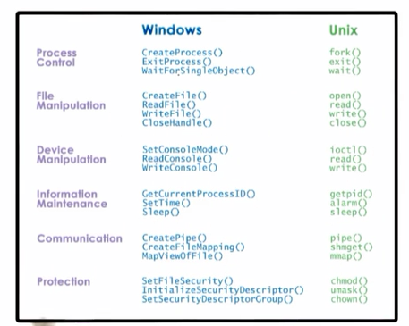
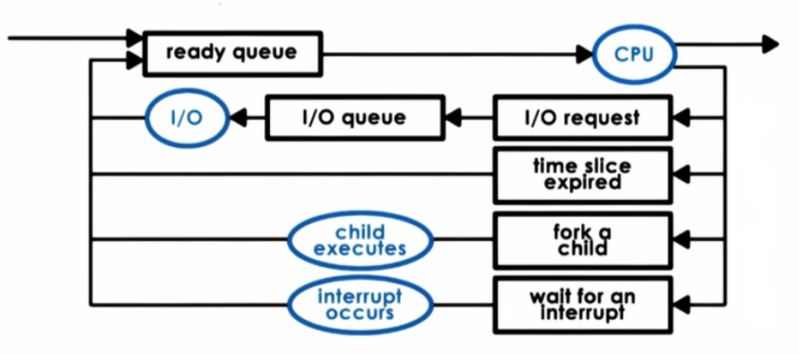
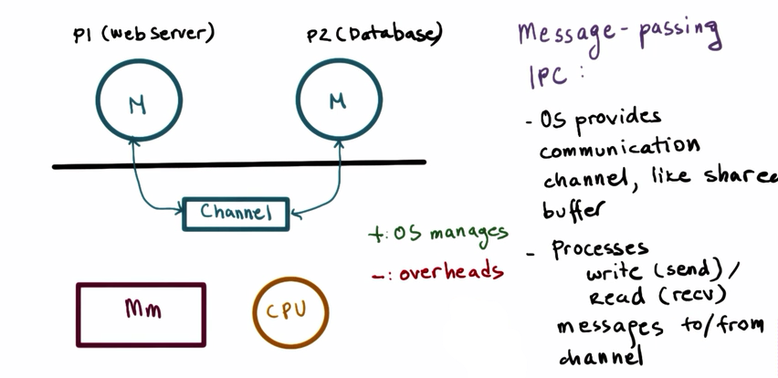
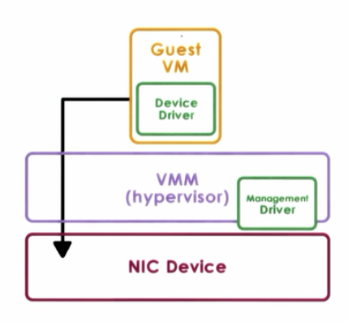

# Introduction to Operating Systems (Course@Udacity) 

### 1. Introduction

* Preview
	- What is an operating system?
	- What are key components of an operating system?
	- Design and implementation considerations of operating systems

* An Operating system is a layer of software that:
	- directly has privileged access to the underlying hardware
	- hides the hardware complexity
	- manages hardware on behalf of one or more applications according to some predifined policies
	- ensures that applications are isolated and protected from one another

* OS Elements
	- Abstraction: process, thread, file, socket, memory page
	- Mechanisms: create, schedule, open, write, allocate
	- Policies: LRU(Least Recently Used), EDF(Earliest Deadline First)
	
	

* Design Principles
	- Separation of mechanism & policy: implement flexible mechanism to support  many policies
	- Optimize for common case 

* User/Kernel Protection Boundary
	- User-level: applications
	- Kernel-level: OS kernel, privileged direct hardware access

* User/kernel switch is supported by hardware:
	- trap instructions
	- system call: open(file), send(socket), malloc(memory)
	- signals

	

* To write a system call, an application must:
	- write argument
	- save relevant data at well-defined location
	- make system call

	

* User/Kernel transitions
	- involves a number of instructions, e.g. ~50-100ms on a 2GHz machine running linux
	- switch locality: affects hardware cache
	- not cheap!

* OS services
	- process management
	- file management
	- device management
	- memory management
	- security
	- ...

	

* Monolithic OS
	-  [Monolithic kernel](https://en.wikipedia.org/wiki/Monolithic_kernel)

	

* Modular OS
	
	

* Microkernel
	- [Micorkernel](https://en.wikipedia.org/wiki/Microkernel)

	

* Linux architecture

	

* Mac OS Architecture

	

* Summary
	- OS elements: abstractions, mechanisms, and policies
	- Communication between applications and OS via system calls

* Recommended Textbooks
	- Operating System Concepts
	- Operating System Concepts Essentials
	- Modern Operating Systems
	- [Operating Systems: Three Easy Pieces](http://pages.cs.wisc.edu/~remzi/OSTEP/)

### 2. Processes and Process Management

* Preview
	- What is a process
	- How are processes represented by OS?
	- How are multiple concurrent processes managed by OS?

* What is a process
	- OS manages hardware on behalf of applications
	- Application: program on disk, static entity 
	- Process: state of a program, loaded in memory when executing, active entity

* Process address space

	
	
	

* How does the OS know what a process is doing?
	- Program Counter
	- CPU registers
	- Stack pointer
	- PCB: Process Control Block

* Process Control Block
	- created when process is created
	- certain fields are updated when process state changes
	
	

* Context switch
	- switching the CPU from  the context of one process to the context of another
	- expensive:
		- direct costs: number of cycles for load & store instructions
		- indirect costs: cold cache, cache misses

	
	

* Process life cycle

	

* Process creation
	- fork
		- copies the parent PCB into new PCB
		- child continues execution at instruction after fork
	- exec
		- replace child image
		- load new program and start from first instruction

* CPU scheduler
	
	

	

* Process interact
	- Inter Process Communication (IPC) Mechanisms
		- transfer data/info between address spaces
		- maintain protection and isolation
		- provide flexibility and performance
	- Message-passing IPC
	- Shared memory IPC

	

	

*  Summary
	- Process and process-related abstrctions: address space and PCB
	- Basic mechanisms for managing process resources
		- context switching
		- process creation
		- scheduling
		- inter-process communication 

### 3. Threads and Concurrency

### 4. PThreads

### 5. Thread Design Consideration

### 6. Thread Performance Consideration

### 7. Scheduling

### 8. Memory Management

* Preview
	- Physical and virtual memory management
	- Memory management mechanisms
	- Illustration of advanced services

* Memory management systems:
	- uses intelligently sized containers: memory pages or segments
	- not all memory is needed at once: tasks operate on subset of memory
	- optimized for performance: reduce time to access state in memory
	

* Memory management goals
	- Virtual vs. Physical memory
		- Allocate: allocation, replacement, ...
		- Arbitrate: address translation and validation
	- Page-based memory management
		- Allocate: virtual page -> physical page frames (fixed size)
		- Arbitrate: page tables
	- Segment-based memory management
		- Allocate: segments (flexible size)
		- Arbitrate: segment registers

* Hardware support
	- MMU
		- Memory Management Unit
		- translate virtual to physical addresses
		- report faults: illegal access, permission, not present in main memory
	- Registers
		- pointers to page table
		- base and limit size, number of segments, ...
	- Cache
		- TLB: Translation Lookaside Buffer
		- valid virtual address to physical address translations
	- Translation: actual address generation done in hardware

	

* Page tables
	- per process
	- on context switch, switch to valid page table
	- update register, e.g. CR3 on x86

	

	- VPN: Virtual Page Number
	- PFN: Physical Frame Number

	

	
* Page fault
	- Page fault handler determines action based on error code and faulting address
		- bring page from disk to memory
		- protection error(SIGSEGV)
	- On x86:
		- error code from PTE flags
		- faulting address in CR2

* Page table size
	- Process does not use entire address space
	- Page table assumes an entry per VPN, regardless of whether corresponding virtual memory is needed or not
	- Hierarchical page tables
		- internal page table, only for valid virtual memory regions
		- on malloc, a new internal page table may be allocated

* TLB
	- Translation Lookaside Buffer
	- MMU-level address translation cache
	- on TLB miss: page table access from memory
	- has protection/validity bits
	- small number of cached addr: high TLB hit rate <=> temporal & spatial locality
	- x86 core i7:
		- per core: 64-entry data TLB, 128-entry instruction TLB
		- 512 entry shared second-level TLB
	

* Inverted page tables
	- [A Discussion of Inverted Page Tables](http://www.jklp.org/~chiefdigger/profession/papers/ipt/ipt.htm) 
	
	

* Hashing page tables

	

* Segmentation
	
	

* Page size
	- 10-bit offset => 1KB page size
	- 12-bit offset => 4KB page size
	- Linux/x86: 4KB, 2MB, 1GB
	- larger pages:
		- fewer page table entries, smaller page tables, more TLB hits
		- internal fragmentation, wastes memory

* Memory allocation
	- Memory allocator: determines VA to PA mapping
	- Kernel level allocators: kernel state, static process state
	- User level allocators: dynamic process state(cheap), malloc/free, e.g. dllmalloc, jemalloc, tcmalloc
	- Memory allocation challenges
		- external fragmentation
		- internal fragmentation

* Allocators in linux kernel
	* Buddy allocator

	
	
	* Slab allocator
	
	

* Demand paging
	- Virtual memory => physical memory
	- Virtual memory page not always in physical memory
	- Physical page frame saved and restored to/from secondary storage
	- Demand paging: pages swapped in/out of memory and a swap partition 

	
	

* Page replacement
	- When should page be swapped out?
		- when memory usage is above threshold
		- when CPU usage is below threshold
	- Which page should  be swapped out?
		- pages that won't be used
		- history-based prediction
			- LRU: Least Recently Used
			- access bit tp track if page is referenced
		- pages that donot need to be written out
			- dirty bit to track if modified
		- avoid non-swapped pages

* Copy on write
	
	
	
	

* Check pointing
	- failure & recovery management technique 
	- periodcally save process state
	- failure may be unavoidable, but can restart from checkpoint, so recovery much faster

* Check pointing approaches
	- simple approach: pause and copy
	- better approach:
		- write-protect and copy everything once
		- copy diffs of 'dirtied' pages for incremental checkpoints
		- rebuild from multiple diffs, or in background

* Debugging
	- Rewind-Replay(RR)
	- Rewind: restart from checkpoint
	- gradually go back to older checkpoints until error found

* Migration
	- continue on another machine
	- disaster recovery
	- consolidation
	- repeated checkpoints in a fast loop until pause-and-copy becomes acceptable

* Summary
	- Virtual memory abstracts a process' view of physical memory
	- Pages and segments
	- Allocation and replacement strategies and checkpointing
   

### 9. Inter-Process Management

### 10. Synchronization

### 11.  I/O Management

### 12. Virtualization

* Preview
	- Overview of virtualization
	- Main technical approaches in popular virtualization solutions
	- Virtualization-related hardware advances

* Virtualization
	- Virtualization allows concurrent execution of multiple OS and their applications on the same physicala machine
	- Virtual resources: each OS thins that it owns hardware resources
	- Virtual machine(vm): OS + applications + virtual resources(guest domain)
	- Virtualization layer: management of physical hardware, virtual machine monitor(VMM), hypervisor

* Virtaul Machine
	- A virtual machine is an efficient, isolated, duplicate of the real machine, supported by a virtual machine monitor(VMM)

* VMM goals:
	- Fidelity: provides environment essentially identical with the originala machine
	- Performance: programs show at worst only minor decrease in speed
	- Safety & isolation: VMM is in complete control of system resources

* Two main virtualization models:
	- Bare-matal or hypervisor based
	- Hosted

* Bare-metal virtualization
	- VMM(hypervisor) manages all hardware resources and supports execution of VMs
	- Service(privileged) VM to deal with devices and other configuration and management task
	- Xen
		- Opensource or Citrix XenServer
		- dom0 and domUs
		- drivers in dom0
	- ESX(VMware)
		- many open APIs
		- drivers in VMM
	
	

* Hosted virtualization
	- Host OS owns all hardware
	- Special VMM module provides hardware interface to VMs and deals with VM context switching 
	
	

* KVM
	- Kernel-based VM
	- KVM kernel module + QEMU for hardware virtualization
	- Leverages linux opensource community
	
	

##### CPU virtualization

* Trap-and-Emulate
	- guest instructions executed directly by hardware
	- for non-privileged operations: hardware speeds => effiency
	- for privileged operations: trap to hypervisor
		- if illegal: terminate VM
		- if legal: emulate the behavior the guest OS was expecting from the hardware
	- works all right in MainFrame
	- Problems:
		- x86, pre 2005, 4 rings, no root/non-root modes yet, hypervisor in ring0, guest OS in ring 1
		- 17 privileged instructions do not trap, and fail silently
		- hypervisor does NOT know, so it does not try to change settings, OS does not know, so assumes change was successful

* Binary translation
	- Main idea: rewrite the VM binary
	- Pioneered at Stanford, commercialized as VMWare
	- Goal: full virtualization, guset OS not modified
	- Approach: dynamic binary translation
		- inspect code blocks to be executed
		- if needed, translate to alternate instruction sequencee, e.g. to emulate desired behavior, possibly even avoiding trap
		- otherwise, run at hardware speed

* Para-virtualization
	- Goal: performance, give up on unmodified guests
	- Approach: modify guest so that:
		- it knows it is running virtualized
		- it makes explicit calls to the hypervisor(hypercalls)
		- hypercall(~ system call): package context info, specify desired hypercall, trap to VMM
		- e.g. Xen

##### Memory virtualization

* Full virtualization
	- all guest expect contiguous physical memory, starting at 0
	- Vitual Address(VA), Physical Address(VA), Machine Address(MA) and page frame numbers
	- still leverages hardware MMU, TLB, ...
	- option 1:
		- guest page tables: VA => PA
		- hypervisor: PA => MA
		- to expensive!
	- option 2:
		- guest page tables: VA => PA
		- hypervisor shaow PT: VA => MA
		- hypervisor maintains consistence, e.g. invalidate on context switch, write-protect guest PT to track new mappings...

* Para-virtualization
	- guest aware of virtualization
	- no longer strict requirement on contiguous physical memory starting at 0
	- explicitly register page tables with hypervisor
	- cat 'batch' page table updates to reduce VM exits
 
##### Device virtualization

* Device virtualization
	- CPUs and memory: less diversity, ISA-level, standardization of interface
	- Devices: high diversity, lack of standard specification of device interface and behavior
	- 3 key models for device virtualization

		
* Passthrough model
	- Approach: VMM-level driver configures devices access permissions
	- Merits:
		- VM provided with exclusive access to the device VM can directly access the device (VMM-bypage)
	- Demerits:
		- device sharing difficult
		- device  must have exact type of device as what VM expects
		- VM migration tricky
	
	 

* Hypervisor-Direct model
	- Approach:
		- VMM intercepts all device access
		- emulate device operation translate to generic I/O operation, travers VMM-resident I/O stack, invoke VMM-resident driver
	- Merits:
		- VM decoupled from physical device
		- sharing, migration,  dealing with device specifics, ...
	- Demerits:
		- latency of device operations
		- device driver ecosystem comlexities in hypervisor

	

* Split-Device Driver model
	- Approach: device access control split between:
		- front-end driver in guest VM, device API
		- back-end driver in service VM or Host
	- Merits:
		- eliminate emulation overhead, allow for better management of shared devices
	- Demerits:
		- modified guest driver, limited to para-virtualized guests

##### Hardware Virtualization

* Key virtualization-related hardware features of X86
	- AMD Pacifica & Intel Vanderpool Technology (Intel VT), ~2005
	- Modes: root/non-root or host/guest mode
	- VM control structure, per VCPU, 'walked' by hardware
	- extended page tables and tagged TLB with VM ids
	- multiqueue devices and interrupt routing
	- security and management support
	- additional instructions to excercise the above features

	

### 13. Remote Procedure Calls

### 14. Distributed File Systems

### 15. Distributed Shared Memory

### 16. DateCenter Technologies