# C++ 必知必会

### 1. 数据抽象

* “类型”是一组操作，“抽象数据类型”则是一组具有某种实现的操作
* 当我们在某个问题领域中识别对象时，首先考虑的问题是“可以用这个对象来做什么”而不是“这个对象是如何实现的”
* 对抽象数据类型的设计，建议遵循下列步骤：
	1. 为类型选择一个描述性的名字；一个抽象的数据类型应该表示一个单纯的，有着良好定义的概念
	2. 列出类型所能执行的操作
	3. 为类型设计接口；一个类型应该做到“易于正确使用，难以错误使用”
	4. 实现类型；不要让实现影响类型的接口；要实现类型的接口所承诺的约定


### 2. 多态

* 多态
	- 多态类型就是带有虚函数的类类型
	- 从设计角度看，多态对象就是一个具有不止一种类型的对象
	- 多态基类则是一个为满足多态对象的使用需求而设计的基类


* 例：金融期权类型AmOption

	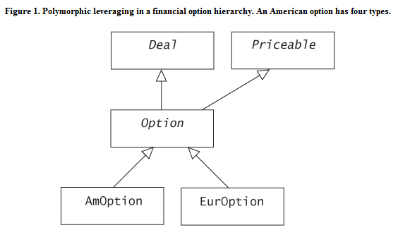
	
	- AmOption对象同时具有四种类型：AmOption，Option，Deal以及Priceable
	- 一个AmOption对象可以被针对Deal，Priceable和Option接口编写的代码所操纵
	- 多态类型，从基类继承的最重要的东西就是它们的接口，而不是它们的实现
	- 一个良好设计的多态类对于它的每个基类而言必须是可替换的，即如果针对Option接口编写的通用代码接受一个AmOption对象，那么该对象的行为最好就像一个Option对象
	- 可以将一个多态基类（如Option）想象成一份契约，这个基类对其接口的用户做了某些承诺。像AmOption和EurOption这样的具体派生类被称为“转包者”，它们实现Option与其客户签订的契约

	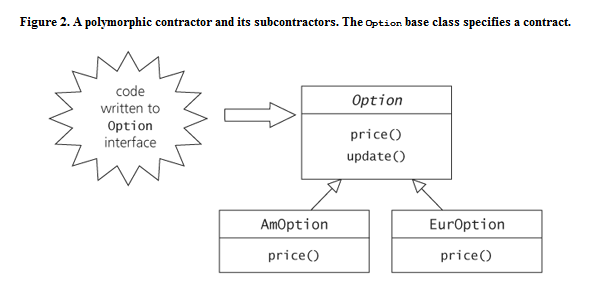


### 3. 设计模式

* 设计模式为特定上下文中的常见设计问题提供了解决方案，并描述了这种解决方案的结果
* 设计模式是从现有的成功实践汇集起来的设计智慧的具名封装，并以容易交流和复用的方式编写而成
* 设计模式的两个重要属性：
	1. 它们描述了经过验证的、成功的设计技术，这些技术可以按上下文相关的方式进行定制，以便满足新的设计场合的要求
	2. 在提及某个特定模式的应用时，不仅包括其中用到的技术，还包括应用该模式的动因以及应用后所达到的效果
* 设计模式的描述会包含以下4个比不可少的部分：
	1. 必须具有一个毫无歧义的名字
	2. 必须定义该模式所能解决的问题
	3. 要记述该问题的解决方案
	4. 要记述将该模式应用于某个上下文的后果


### 4. STL

* STL包含三大组件：容器，算法，和迭代器
* 迭代器提供了一种使容器与算法协同工作的机制。 算法和容器可以紧密的协作，同时还可以保持彼此不知情
* 容器还可以利用容器适配器进行配接，将接口修改为栈，队列，或优先队列
* STL对约定有着很强的依赖
* STL约定并未指明具体的实现细节，但对实现指定了效率方面的约束


### 5. 指针和引用

* 区别：
    1. 不存在空引用
    2. 引用必须初始化
    3. 一个引用永远指向用来对他初始化的那个对象
* 一个指向非常量的引用是不可以用字面值或临时变量进行初始化的


### 6. 数组形参

* Tips：
	```
	const int anArraySize = sizeof(anArray) / sizeof(anArray[0]); 
	// 可以抵挡数组初始化元素的改变以及数组元素类型的改变
	```

* 退化
	- 数组在传入函数时，实质上只传入指向其首元素的指针。数组在退化时丢失边界;
	- 函数型参数也会退化成一个函数指针，不过一个退化的函数可以保持其参数类型和返回值类型
	- 最好声明为：
	```
	void average(int array[]); // 形参array仍然是一个int*
	```

	- 如果数组的边界的精确数值非常重要，并且希望函数只接受含义特定数量的元素，可以考虑使用一个引用形参：
	```
	void average(int (&arr)[12]);                   // 函数只接受大小为12的整形数组
	template <int n> void average(int (&arr)[n]);   // 使用模板代码泛化
	```
	
	- 更为传统的做法是将数组的大小明确地传入函数：
	```
	void average_n(int arr[], int size)
	```
	
	- 两种方法结合：
	```
	template <int n> inline void average(int (&arr)[n]) { average_n(arr, n); }
	```

	- **NOTE:** 不可以使用int* 初始化int (&)[n]

	```
	int *anArray2 = new int[anArraySize];
	average(anArray2);                             // WRONG!
    average_n(anArray2, anArraySize);              // OK
	```

	- 因此，经常使用标准容器（vector或string）来代替对数组的大多数传统用法，并且通常应该优先考虑标准容器


* 二维数组

	- 二位数组形参是一个指向数组的指针。第二个以及后续的边界没有退化，否则无法对形参执行指针算术运算。
	```
    void process(int (*arr)[20]);   // 一个指针，指向一个具有20个int元素的数组
    void process(int arr[][20]);    // 仍然是一个指针，但更清晰
	```
	
	- 需要程序员代替编译器来执行索引计算：
	```
    void process_2d(int* a, int n, int m) { // a是一个nxm的数组
        for (int i = 0; i < n; ++i) {
            for (int j = 0; j < n; ++j) {
                a[i * m  + j] = 0;          // 手工计算索引
            }
        }
    }
	```

	- 使用模板有助于让事情更干净利落：
	```
    template <int n, int m>
    inline void process(int (&arr)[n][m]) {
        return process_2d(&arr[0][0], n, m);
    }
	```


### 7. 常量指针与指向常量的指针

* 指向常量的指针
	```
	T* pt = new T;
    const T * pct1 = pt;    // 指向常量T的指针
    T const * pct2 = pt;    // 也是指向常量T的指针
	```

* 常量指针
	```
    T * const cpt;    // 常量指针，指向非常量T
	```

* 指向常量的常量指针，两者均为常量
	```
    const T * const cpct1 = pt; 
    T const * const cpct2 = pt;
	```

    - 使用一个引用通常比使用一个常量指针更简单 （引用vs.常量指针）
    ```
    const T &rct = *pt;
	```

* 使用指向常量的指针或引用指向非常量对象，不会造成任何危害，而且经常这样使用

	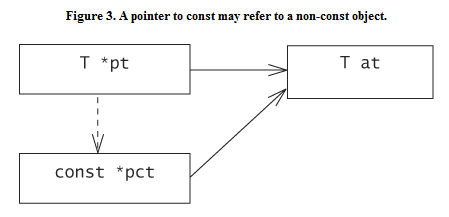

* 相反，从指向常量的指针转换为指向非常量的指针，则是非法的，可能产生危险的后果

	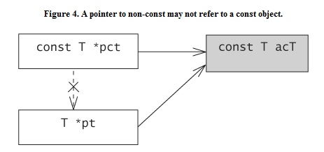

* 可以使用const_cast显式的执行类型转换
	```
    pt = pct1;                  // 报错
    pt = const_cast<T *>pct1;   // 没有错，但这种做法不妥
	```


### 8. 指向指针的指针

* 多级指针
	```
    int *pi;        // 一个指针
    int **ppi;      // 一个2级指针
    int ***pppi;    // 一个3级指针
	```

* 场景1：当声明一个指针数组时
	
	* 由于数组的名字会退化为指向其首元素的指针，所以指针数组的名字也是一个指向指针的指针
	```
    Shape *picture[MAX];    // 一个数组，其元素为指向Shape的指针
    Shape **pic1 = picture;
	```   

* 场景2：当一个函数需要改变传递给它的指针的值时
    
	* C中常见用法:
    ```
    void scanTo(const char **p, char c) {
        while (**p && **p != c) {
            ++*p;
        }
    }
    .....
    char s[] = "Hello, world!";
    const char *cp = s;
    scanTo(&cp, ',');
	```
    
	* C++中，更习惯，更简单，更安全的做法是使用指向指针的引用作为函数参数
    ```
    void scanTo(const char*&p, char c);
    scanTo(cp, ',');
	```

* 适用于指针的转换不适用于指向指针的指针
    * 一个派生类的指针可以被转换为一个指向其公共基类的指针，但一个指向派生类的指针的指针并不是一个指向基类的指针的指针
    * 一个指向非常量的指针可以转换为一个指向常量的指针，但不可以将一个指向“指向非常量的指针”的指针转换为一个指向“指向常量的指针”的指针


### 9. 新式转型操作符


* 旧式转换
	```
    char* hopeItWorks = (char*)0x00ff0000;    // C，旧式转型
    typedef char* pChar; 
	hopeItWorks = PChar(0x00ff0000);          // C++， 函数形式，旧式转型
	```


* const_cast: 运行添加或移除表达式中类型的const或volatile
	```
    const Person* getEmployee() {...}
    Person* anEmployee = const_cast<Person*>(getEmployee());    
    anEmployee = (Person*)getEmployee();     // 旧式转型
	```
    * 使用const_cast的做法更好： 
        1. 醒目，在代码中非常引人注目；
        2. 威力小，只影响类型修饰符；
        

* static_cast: 最常见的用法是将一个集成层次结构中的基类的指针或引用，向下转型为一个派生类的指针或引用
	```
    Shape* sp = new Circle; 
    Circle* cp = static_cast<Circle*>(sp);
	```
	* **NOTE:** 如果sp指向其他类型Shape（而不是Circle），那么当使用cp时，很可能会得到某种运行期错误。
    * 结合使用：
    ```
    const shape* getNextShape() {......}
    Circle cp = static_cast<Circle*>(const_cast<shape*>(getNextShape()));
	```


* reinterpret_cast: 从位的角度来看待一个对象，从而允许将一个东西看做另一个完全不同的东西
	```
    hopeItWorks = reinterpret_cast<char*>(0x00ff0000);
    int* hopeless = reinterpret_cast<int *>(hopeItWorks);
	```
    * 在底层编码里偶尔非用不可，但可能不具移植性
    

* dynamic_cast：通常用于执行从指向基类的指针安全地向下转型为指向派生类的指针
	```
    if (const Circle* cp = dynamic_cast<const Circle*>(getNextShare())) {
        //......
    }
	```
    - 仅用于多态类型进行向下转型，并且执行运行期检查工作，来判定转型的正确性
    - 使用static_cast无需运行期代价，而dynamic_cast要付出显著的运行期开销
    - 如果getNextShape返回一个指向Circle或者从Circle公有派生的东西，那么转型成功，否则cp为空
    - dynamic_cast只是偶尔使用，常常因为安全而被滥用


### 10. 常量成员函数的含义

* this指针
    - 在类X的非常量成员函数中，this指针的的类型为X* const; 
    - 在类的常量成员函数中，this指针的类型为const X* const;


 * mutable
    - 有时，一个应该被声明为常量的成员函数必须要修改其对象。常见于利用“缓式求值”机制来计算一个值时。
    - 类的非静态数据成员可以声明为mutable，这将允许它们的值可以被该类的常量成员函数修改。
    ```
    class X {
    public:
        //......
        int getValue() const {
            if (!isComputed_) {
                computeValue_ = expensiveOperation();
                isComputed_ = true;
            }
            return computeValue_;
        }
    private:
        //......
        mutable bool isComputed_;
        mutable int computedValue_;    
    }
	```


### 11. 编译器会在类中放东西

* 虚函数表
    - 如果一个类声明了一个或多个虚函数，那么编译器会为该类的每一个对象插入一个虚函数表
    - 不同平台之间的虚函数表指针的位置是不同的，不都是在对象的开头
* 虚拟继承
    - 如果使用了虚拟继承，对象将会通过嵌入的指针，嵌入的偏移或者其他非嵌入的信息来保持对其虚基类子对象位置的跟踪
* 不管类的数据成员的声明顺序如何，编译器都被允许重新安排它们的布局
* POD（Plain Old Data）
    - 內建类型（int，double），C struct或union的声明都是POD
    - 可以对POD进行底层的处理。
    - 但注意要始终保持其为POD
* 在高层操作类对象，而不应把它当做一组位的集合
    - 不要使用memcpy这样的函数复制一个类对象，应该使用对象的初始化或复制操作
    - 对象的构造函数是编译器建立隐藏机制的地方，实现对象的虚函数等
    - 不要假定一个类的特定成员位于对象中给定的位置


### 12. 赋值和初始化并不相同

* 赋值发生于当你赋值时，除此之外，遇到所有其他的复制情形均为初始化，包括声明，函数返回，参数传递，以及捕获异常中的初始化
* 赋值和初始化本质上是不同的操作
    - 用于不同的上下文
    - 做的事情不同
* 赋值有点像一个析构动作后跟一个构造动作
    - 对于复杂的用户自定义类型来说，目标（this）在采用源重新初始化之前必须被清理掉
    - 构造函数可以假定它肯定是在处理一个未初始化的存储区
    - 由于一个正当的赋值操作会清掉左边的实参，因此永远都不应该对一个未初始化的存储区执行用户自定义赋值操作
	```
	// ...
	// 直接调用operator new从而避免了通过String的默认构造函数执行的隐式初始化动作
	String* names = static_cast<String*>(::operator new(_BUFSIZ));
	names[0] = "Sakamoto";                 // ERROR! delete [] 未被初始化的指针names
	```


### 13. 复制操作

* 复制构造和复制赋值是两种不同的操作，但它们一般一起出现，而且必须兼容
	```
    class impl;
	class Handle {
	public:
		//...
		Handle(const Handle&);              // 复制构造函数
		handle &operator=(const Handle&);   // 复制赋值操作符
		void swap(Handle&);
		//...
	private:
		Impl *impl;                         // 指向Handle的实现
	};
	```

* 成员swap
    - 如果成员形式的swap具有性能或异常安全的优势，那应该定义一个成员函数swap
    - 典型的非成员形式的swap：
    ```
    template <typename T>
    void swap(T& a, T& b) {
        T temp(a);          // 调用T的复制构造函数
        a = b;              // 调用T的复制赋值操作符
        b = temp;           // 调用T的复制赋值操作符
    }
	```
    - 如果T是一个庞大而复杂的类，这种方式就会导致不小的开销
    - 自定义成员swap：
    ```
    inline void Handle::swap(Hanle& that) {
        std::swap(impl_, that.impl_);
    }
	```

* 异常安全的复制赋值操作
	-  首先要得到一个异常安全的复制构造函数和一个异常安全的swap操作
    ```
    Handle& Handle::operator=(const Handle& that) {
        if (this != that) {         // 为了正确性，也出于效率方面的考虑 
            Handle temp(that);    	// 异常安全的复制构造
            swap(temp);          	// 异常安全的swap
            return *this;         	// 假定temp的析构不会抛出异常
        }
    }
	```
    - 对于句柄类，这项技术工作得尤其好。句柄类：如上面的Handle类，主要或全部是由一个指向其实现的指针构成
    

* 复制构造的行为必须和复制赋值的行为兼容，它们产生的结果不应该有区别


### 14. 函数指针

* 将一个函数的地址初始化或赋值给一个指向函数的指针时，无需显式地取得函数地址，编译器知道隐式地获得函数地址
	```
    void (*fp)(int);
    extern void h(int);
    fp = 0;    	// ok，设置为null
    fp = h;    	// ok，指向h
    fp = &h  	// ok，明确赋予函数地址
	```

* 调用函数指针所指向的函数时，对指针的解引用操作也是不必要的，编译器可以帮助解引用
	```
    fp(12);     // 隐式解引用
    (*fp)(12);  // 显式地解引用
	```

* 不存在指向任何类型的通用函数指针
* 非静态成员函数的地址不是一个指针，不可以将一个函数指针指向一个非静态成员函数
* 一个函数指针指向内联函数时合法的，然而通过函数指针调用内联函数将不会导致内联式的函数调用
* 函数指针持有一个重载函数的地址也是合法的，指针的类型被用于在各种不同的候选函数中挑选最佳匹配的函数


### 15. 指向类成员的指针并非指针

* 指向类成员的指针并非指针，因为它们既不包含地址，行为也不像指针
* 声明：使用classname::*，而不是普通的 *
	```
    int *ip;    	// 一个指向int的指针
    int C::*pimC;	// 一个指针，指向类C的一个int成员
    ```

* 一个指向成员的指针并不指向一个具体的内存位置，它指向一个类的特定成员
    - 可以将指向数据成员的指针看作为一个偏移量
    ```
    class C {
    public:
        //...
        int a_;
    };
    int C::*pimC;
    C ac;
    C *pC = &ac;
    pimC = &C::a_;
    aC.pimC = 0;
    int b = pC->*pimC;
	```

- 指向基类成员的指针到指向公有派生类成员的指针的隐式转换
	```
    class Shape {
        //...
        Point center_;  
    };
    class Circle : public Shape {
        //...
        double radius_;
    };
    Point Shape::* loc = &Circle::center_;      // 从基类到派送类的转换
    double Circle::* extent = &Shape::radius_； // 错误！ 从派生类到基本的转换；基类并不存在radius成员 
	```


### 16. 指向成员函数的指针并非指针

* 获取非静态成员函数的地址时，得到的不是一个地址，而是一个指向成员函数的指针

    - 使用classname*而不是*来说明所指向的函数时classname的一个成员
    ```
    class Shape {
        //...
        void moveTo(Point newLocation);
        bool validate() const;
        virtual bool draw() const = 0;
    };
    class Circle : public Shape {
        //...
        bool draw() const;
    };
    void (Shape::* mf1)(Point) = &Shape::moveTo; // 指向成员函数的指针
	```

    - 和指向常规函数的指针不同(?)，指向成员函数的指针可以指向一个常量成员函数
    ```
    bool (Shape::* mf2)() const = &Shape::validate;
	```

* 为了对一个指向成员函数的指针进行解引用，需要一个对象或一个指向对象的指针

    - 将对象的地址用作this指针的值，进行函数调用
    ```
    Circle circ;
    Shape *pShape = &circ;
    (pShape->*mf2)();    	// 调用Shape::validate
    (circ.*mf2)();         	// 调用Shape::validate
	```

    - 不存在指向成员函数的"虚拟"指针。虚拟性是成员函数自身的属性
    ```
    mf2 = &Shape::draw      // draw是虚函数
    (pShare->*mf2)();       // 调用Circle::draw
	```

* 一个指向成员函数的指针，通常不能被实现为一个简单的指向函数的指针
    - 一个指向函数的指针的实现自身必须存储一些信息，比如它所指向的成员函数是虚拟的，还是非虚拟的，到哪里去找打适当的虚函数表指针。
    - 指向成员函数的指针通常实现为一个小型结构，包含这些信息
    - 解引用和调用一个指向成员函数的指针通常涉及到检查这些存储的信息，并有条件地指向适当的虚函数或非虚函数的函数调用序列
    

* 和指向数据成员的指针一样，存在从指向基类成员函数的指针到指向派生类成员函数指针的预定义转换，反之则不然。


### 17. 处理函数和数组声明

* 指向函数的指针与指向数组的指针
    - 函数修饰符优先级比指针优先级高
    ```
    int *f1();  	// 一个返回值为int*的函数
    int (*fp1)();   // 一个指针，指向一个返回值为int的函数
	```
    - 数组修饰符优先级比指针修饰符优先级高
    ```
    const int N = 12;
    int *a1[N]; 	// 一个具有N个int*元素的数组 
    int (*ap1)[N]   // 一个指针，指向一个具有N个int元素的数组
	```
    - 指针的指针
    ```
    int (**ap2)[N];     	// 一个指针，它指向一个指针，后者指向一个具有N个int元素的数组
    int *(*ap3)[N];        	// 一个指针，指向一个具有N个int*元素的数组
    int (**const fp2)();  	// 一个常量指针，指向一个指向函数的指针
    int *(*fp3)();          // 一个指针，指向一个返回值为int*的函数
	```

* 参数和返回值类型都会影响函数或函数指针的类型

* 使用typedef可以简化复杂的声明语法
	```
    int (*afp2[N])();       // 一个具有N个元素的数组，其元素类型为指向“返回值为int”的函数的指针
    typedef int (*FP)();    // FP: 一个指向返回值为int的函数指针类型
    FP afp3[N];             // 一个具有N个“类型为FP”的元素的数组
	```


### 18. 函数对象

* 智能指针通过重载->和*操作符，来模仿指针行为；函数对象类型则重载()，来创建类似于函数指针的东西
* 函数对象就是常规的类对象，但是可以采用标准的函数调用语法来调用它的operator()成员
	```
    class Fib {
    public:
        Fib(): a0_(1), a1_(1) {}
        int operator();
    private:
        int a0_, a1_;
    };
    int Fib::operator() {
        int temp = a0_;
        a0_ = a1_;
        a1_ = temp + a0_;
        return temp;
    }
    Fib fib;
    cout << "next two in series: " << fib() << " " << fib() << endl;
	```
* 使用函数指针不灵活，不能处理需要状态的函数或指向成员函数的指针。可以创建一个函数对象层次结构。该层次结构的基类是一个简单接口类，只声明一个纯虚operator()


### 19. Command模式与好莱坞法则

* 当一个函数对象用作回调时，就是一个Command（命令）模式的实例
* 好莱坞法则：“不要call我们，我们会call你”，责任分割
* 使用简单的函数指针作为回调的做法有一些严格的限制，函数指针没有相关联的数据
* 使用面向对象方式的好处：
    - 函数对象可以封装数据
    - 函数对象可以通过虚拟成员表现出动态行为，可以拥有一个相关的函数对象的层次结构
	```
    class Action {
    public:
        virtual ~Action();
        virtual void operator()() = 0;
        virtaul Action* clone() const = 0;
    };
    class Button {
    public:
        Button(const std::string& label): label_(label), action_(0) {}
        void setAction(const Action* newAction) {
            Action* temp = newAction->clone();
            delete action_;
            action_ = temp;
        }
        void onClick() const {
            if (action_) (*action_)();
        }
    private:
        std::string label_;
        Action* action_;
    };
    class PlayMusic : public Action {
    public:
        PlayMusic(const string& songFile): song_(songFile) {}
        void operator() ();
    private:
        MP3 song_;
    }
    //...
    Button* b = new Button("Anoko no namaewa");
    auto_ptr<PlayMusic> song(new PlayMusic("AnokiNoNamaewa.mp3"));
    b->setAction(song);
	```


### 20. STL函数对象

* 比较器
    - STL一般允许我们指定一个替代的类似于小于操作符，用于比较两个值
    ```
    inline bool popLess(const State&a, const State& b) {
        return a.population() < b.population();
    }
    State union[50];
    //...
    std::sort(union, union + 50, popLess); // 按人口进行排序
	```

* 使用函数对象作为比较器
    - 派生于binary_function基类，此项机制允许其他部分的STL实现询问函数对象编译期问题
    - 从binary_function派生下来的PopLess类型，允许我们找出函数对象的参数和返回值类型
    - 用作STL比较器的函数对象一般都很小巧，简单且快速。在函数对象中避免使用数据成员
    ```
    struct PopLess: public std::binary_function<State, State, bool> {
        bool operator()(const State &a, const State& b) const {
            return popLess(a, b);
        }
    } 
    sort(union, union + 50, PopLess()); // 匿名临时对象
	```

* 判断式
    - 询问关于单个对象的真/假问题的操作
    ```
    struct IsWarm: public std::unary_function<State, bool> {
        bool operator()(const State& a) const {
            return a.aveTempF() > 60;
        }
    } 
    State* warmandsparse = find_if(union, union+50, IsWarm());
	```


### 21. 重载与重写并不相同

* 重载和重写之间没有任何关系
    - 重载发生与同一个作用域内有两个或更多个函数具有相同的名字，但签名不同时；选择形参与函数调用中的实参有着最佳匹配的那一个函数
    - 重写发生于派生类函数和基类虚函数具有相同的名字和签名时；派生类函数的实现将会取代它所继承的基类函数的实现


### 22. Template Method模式

* 它是基类设计者为派生类设计者提供清晰指示的一种方式，指示“应该如何实现基类所规定的契约”
* 虚函数指定的操作可以由派生类通过重写机制定制
    - 一个非纯虚函数提供了一个默认实现，并且不强求派生类一定要重写它
    - 一个纯虚函数则必须在具体派生类中进行重写
* Template Method模式确立了实现的整体架构，同时将部分实现延迟到派生类中进行      
    - 通常，Template Method被实现为一个公有非虚函数，它调用被保护的虚函数
    - 派生类必须接受它所继承的非虚函数所指明的全部实现，
    - 同时还可以通过重写该公有函数所调用的被保护的虚函数，以有限的方式来定制其行为
    ```
    class App {
    public:
        virtual ~App();
        //...
        void Startup() {    // Template Method
            initialize();
            if (!validate()) altInit();
        }
    protected:
        virtual bool validate() const = 0;
        virtual void altInit();
        //...
    private:
        void initialize();
        //...
    };
    class MyApp: public App {
    public:
        //...
    private:
        bool validate() const;
        void altInit();
        //...
    };
	```
* Template Method是一个“好莱坞法则”的例子，即”不要call我们，我们会call你“
    - 派生类类设计者不知道validate或altInit何时会被调用，但他们知道这两个方法被调用时应该做什么
    - 基类和派生类同心协力打造了一个完整的函数实现


### 23. 名字空间

* 名字空间是对全局作用域的细分
	```
	// 打开名字空间
    namespace org_semantics {
        class String {...};
        String operator+(const String&, const String&);
    }
	//...
    // 重新打开名字空间
    namespace org_semantics {
        String operator+(const String&, String&) {     //WARN: lost one const 
            //...
        }
    }
	```
    - 名字空间限定，可以仅仅为该定义加上名字空间限定而无需重新打开名字空间；可以防止上面的错误
    ```
    org_semantics::String org_semantics::operator+(const org_semantics::String &a, const org_semantics::String& b)
    {
        //...    
    }
	```

* C++标准库组件，除了operator new，operator delete，array new，array delete等，大多数都在std名字空间中


* using指令
    - using namespace std;
    - 将using指令局限在较小的作用域，例如函数体或函数体内的某个代码块


* using声明
    - using std::vector;
    - 通过一个真正的声明提供对名字空间中名字的访问
    - using声明通常是介于冗长的显式限定和不受限制的using指令之间的一种折中


* 使用别名
	```
    namespace S = org_semantics;
	```


* 匿名名字空间
    - 一种声明具有静态连接的函数和变量的新潮方式
    - 匿名名字空间中的内容，只能在其所出现的翻译单元（预处理后的文件）内被访问，就像静态对象一样
    ```
    namespace {
        int anInt = 12;
        int aFunc() {return anInt;}
    }
	```


### 24. 成员函数查找

* 调用一个成员函数时，涉及三个步骤：
	1. 编译器查找函数的名字
    2. 从可用的候选者中选择最佳匹配函数
    3. 检查是否具有访问该匹配函数的权限
    

* 内层作用域中的名字会隐藏外层作用域中相同的名字。不同于Java中，内层作用域中的方法名字和外层作用域中同名方法属于重载关系
	```
    class B {
    public:
        //...
        void f(double);
    };
    class D : public B {
        void f(int);
    };
    //...
    D d;
    d.f(12.3)
	```
    - step1: 查找函数名字，定位到D::f上
    - step2: 只有一个候选者D::f，尝试匹配该函数，将实参从double转换为int
    - step3: 检查访问权限，得到错误！D::f是私有成员
    - 基类中有着更好匹配，并且可访问的函数f，但不会使用。编译器一旦在内层作用域找到一个，就不会到外层作用域继续查找该名字。


### 25. 实参相依查找

* 实参相依查找（ADL: Argument Dependent Lookup）

    - 当查找一个函数调用表达式中函数名字时，编译器也会到“包含函数调用实参的类型”的名字空间中查找
    ```
    namespace org_semantics {
        class X { ... };
        void f(const X&);
        void g(X*);
        X operator+(const X&, const X&);
        class String { ... };
        std::ostream operator<<(std::ostream&, const String&);
    }
    //...
    int g(org_semantics::X*);
    void aFunc() {
        org_semantics::X a;
        f(a);           // 调用org_semantics::f 
        g(&a);          // 错误！ 调用具有歧义性
        a = a + a;      // 调用org_semantics::operator+
    }
	```
    - 由于实参a的类型被定义与org_semantics名字空间中，编译器也会到该名字空间中检查候选函数
    - org_semantics::g与::g都为候选函数，从而导致调用具有歧义性
    - org_semantics::g与::g不是重载，因为它们不是声明于同一个作用域中的
    ```
    org_semantics::String name("Qwan");
    std::cout << "Hello, " << name;
	```   
    - 第一个<<是std::baisic_ostream的一个成员函数
    - 第二个<<是对于org_semantics::operator<<的调用
    
- ADL是关于函数如何被调用的一个属性，而重载是关于函数被如何声明的一个属性


### 26. 操作符函数查找

* 有时看上去好像一个成员操作符函数重载了一个非成员的操作符，其实并非如此。这不是重载，而是不同的查找算法
	```
    class X {
    public:
        X operator%(const X&) const;
        X memFunc1(const X&);
        void memFunc2();
        //...
    };
    //...
    X a, b, c;
    a = b % c;                          // 采用中缀语法调用成员操作符%
    a = b.operator%(c);                 // 成员函数的调用语法
    //...
    X operator %(const X&, int);        // 非成员操作符
    void X::memFunc2() {
        *this % 12;                     // 调用非成员操作符%
        operator%(*this, 12);           // 错误！ 实参太多
    }
	```
    - 当我们使用函数调用语法时，调用的处理方式与其他成员函数一致
    - 对于中缀操作符调用来说，编译器不仅会考虑成员操作符，也会考虑非成员操作符。这不是重载的实例，而是编译器在两个不同的地方查找候选函数
    

* 对重载操作符的中缀调用执行了一个退化形式的ADL，即当确定将哪些函数纳入重载解析考虑范围时，中缀操作符中左参数的类的作用域和全局作用域都被考虑在内


### 27. 能力查询

* 在C++中，能力查询通常是通过对“不相关”的类进行dynamic_cast转换而表达的

	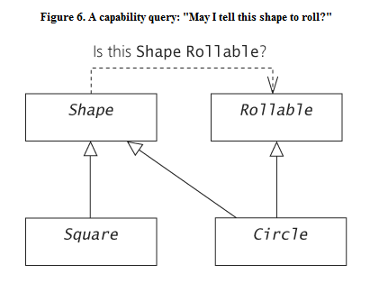

	```
	class Shape {
    public:
        virtual ~Shape();
        virtual void draw() const = 0;
        //...
    };
    class Rollable {
    public:
        virtual ~Rollable();
        virtual void roll() = 0;
    };
    class Circle : public Shape, public Rollable {
        //...
        void draw() const;
        void roll();
    };
    class Square : public Shape {
        //...
        void draw() const;
    }
    //...
    Shape* s = getSomeShape();
    if (Rollable *roller = dynamic_cast<Rollable *>(s)) {
        roller->roll();
    }
	```
    - 这种dynamic_cast用法通常称为“横向转型（cross-cast）”，试图在一个类层次结构中执行横向转换，而不是向上或向下转换


* 能力查询只是偶尔需要，它们通常是糟糕设计的“指示器”。最好避免对一个对象的能力进行运行期查询。


### 28. 指针比较的含义

* C++中，一个对象可以有多个有效的地址；指针比较不是关于地址的问题，而是关于对象同一性的问题
	```
    class Shape { ... };
    class Subject { ... };
    class ObservedBlob : public Shape, public Subject { ... };
    //...
    ObservedBlob *ob = new ObservedBlob;
    Shape* s = ob;
    Subject* subj = ob;
    // ...
    if (ob == s) ...    // true
    if (subj == ob) ... // true
	```
    - 存在从ObservedBlob到任一基类的预定义转换；同时，一个指向ObservedBlob的指针可以与指向其任何一个基类的指针进行比较。
 
   
* 多重继承内存布局
	
	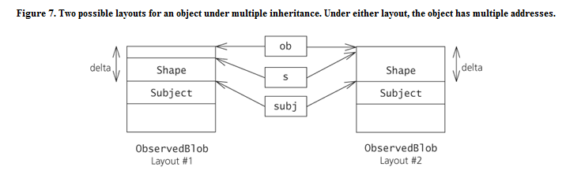

	- ob, s和subj都指向同一个observedBlob对象，因此编译器必须确保ob与s和subj的比较结果为true；
    - 不能拿s与subj进行比较，因为他们之间不具有继承关系
    - 编译器通过将参与比较的指针值之一调整一定的偏移量来完成这种比较
    ```
    ob ? (ob + delta == subj) : (subj == 0);
    ```
	- 将ob调整为指向其subject基类子对象，然后再和subj进行比较


* 当我们处理指向对象的指针或引用时，必须小心避免丢失类型信息。
    - 指向void的指针是常见的错误
        void* v = subj;
        if (ob == v) // 不相等！
    - void丢掉了subj中包含的地址的类型信息，编译器只好进行原始地址比较了


### 29. 虚构造函数与Prototype模式

* 有两个主要原因需要使用“克隆”：
    - 对正在处理的对象的精确类型保持“不知情”
    - 并且，不希望改变被克隆的原始对象，也不希望接受原始对象改变的影响


* Prototype模式的一个实例
    - C++中提供了克隆对象能力的成员函数。
    - “虚构造函数“：通过一个虚函数对其类的构造函数的间接调用
    ```
    class Meal {
    public:
        virtual ~Meal();
        virtual void eat() = 0;
        virtual Meal* clone() const = 0;
        // ......
    };
    class Spaghetti : public Meal {
    public:
        Spaghetti(const Spaghetti&);
        void eat();
        Spaghetti* clone() const {
            return new Spaghetti(*this);    // 调用复制构造函数
        }
    }
    // ......
    const Meal* m = thatGuyMeal();
    Meal* myMeal = m->clone(); 
	```
    - clone函数实际上是一种专门类型的Factory Method模式，它制造一个适当的产品，同时允许调用代码对上下文和产品类的精确类型保持不知情
    - 例证了软件设计中“不知情”的优点，尤其是在用于定制和扩展的框架结构软件设计中


### 30. Factory Method模式

* 一个高级设计通常要求基于一个现有对象类型来创建一个“适当”类型的对象

    -  例如，我们可能拥有一个指向某种类型的Employee对象的指针或引用，现在需要为该类型的Employee生成一个适当类型的HRInfo对象
    
    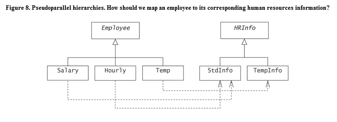
	
	 - 一种常见、但总是错误的方法是使用“类型编码”和switch语句
	 ```
    class Employee {
    public:
        enum Type {SALARY, HOURLY, TEMP};
        Type type() const {return type_;}
        //...
    private:
        Type type_;
        //...
    };
    //...
    HRInfo* getInfo(const Employee& e) {
        switch(e.type()) {
        case SALARY:
        case HOURLY: return new StdInfo(e);
        case TEMP: return new TempInfo(static_cast<const Temp*>(e));
        default: return 0;
        }
    }
	```

	- 另外一种几乎同样糟糕的方式，是使用dynamic_cast来询问关于Employee对象一系列的私人问题
	```
    HRInfo* getInfo(const Employee& e) {
        if (const Salary* s = dynamic_cast<const Salary*>(&e)) {
            return new StdInfo(s);
        } else if (const Hourly* h = dynamic_cast<const Hourly*>(&e)) {
            return new StdInfo(h);
        } else if (const Temp* t =  dynamic_cast<const Temp*>(&e)) {
            return new TempInfo(t);
        } else {
            return 0;
        }
    }
	```

	- 两种getInfo实现的主要缺点：与所有从Employee和HRInfo派生下来的具体类型相耦合，还必须熟悉从每一种Employee类型到其相应的HRInfo类型的映射
    - Employee自己最清楚需要何种HRInfo对象
    ```
    class Employee {
    public:
        //...
        virtual HRInfo* getInfo() const = 0;    // Factory Method
        //...
    };
    class Temp : public Employee {
    public:
        //...
        TempInfo* getInfo() const {
            return new TempInfo(*this);
        }
        //...
    };
    //...
    Employee* e = getAnEmployee();
    HRInfo* info = e->getInfo();    //使用Factory Method
	```


* Factory Method的本质在于：
	- 基类提供一个虚函数“挂钩”，用于生产适当的“产品”。
	- 每一个派生类可以重写继承的虚函数，为自己产生适当的产品。
    - 实际上，我们具备了使用一个未知类型的对象来产生另一个未知类型的对象的能力
    - Factory Method模式通常意味着一个高级设计需要基于一个对象的确切类型产生另一个“适当”的对象，这样的需要往往发生于存在多个平行或几乎平行的类层次结构的情况下。
    - Factory Method模式通常是治疗一系列运行期类型查询问题的良方


### 31. 协变返回类型

* 一般来说，一个重写的函数与被它重写的函数必须具有相同的返回类型
	```
	class Shape {
	public:
	    //...
	    virtual double area() const = 0;
	    //...
	};
	class Circle : public Shape {
	public:
        float area() const; 	// error! different return type    
        //...
	};

	```
* 协变返回类型（covariant return type）
    - 只要原来的返回类型是基类类型的指针或引用，新的返回值类型是派生类的指针或引用，覆盖的方法就可以改变返回类型
	```
	class Shape {
	public:
	    //...
	    virtual Shape *clone() const = 0; // Prototype
	    //...
	};
	class Circle : public Shape {
	public:
	    Circle *clone() const;
	    //...
	};

	```

### 32. 禁止复制

* 访问修饰符可以用于表达和执行高级约束技术，指明一个类可以被怎样使用
* 通过将复制操作声明为private，不接受对象的复制操作
    - 将复制构造函数和复制赋值操作符声明为private是必不可少的，否则编译器就会偷偷地将它们声明为公有、内联的成员
    ```
    class NoCopy {
    public:
	    NoCopy(int);
	    //...
    private:
	    NoCopy(const NoCopy&);              // 复制构造函数
	    NoCopy& operator=(const NoCopy&)    // 复制赋值操作符
    };
	```
* C++11，可以通过将拷贝构造函数和拷贝赋值运算符定义为删除函数来阻止拷贝 (C++ Primer 5th ed)
	```
	struct NoCopy {
	    NoCopy() = default;                         // 使用合成的默认构造函数
	    NoCopy(const NoCopy&) = delete;	            // 阻止拷贝
	    NoCopy& operator=(const NoCopy&) = delete;  // 阻止赋值
	};
	```


### 33. 制造抽象基类

* 抽象基类通常用于表示目标问题领域的抽象概念
* 我们通过至少声明一个纯虚函数使得一个基类成为抽象的，编译器将会确保无人能够创建该抽象基类的任何对象
	```
    Class ABC {
    public:
        virtual ~ABC();
        virtual void anOperation() = 0;    //纯虚函数
    };
	```


* 有时候找不到一个可以成为纯虚函数的合理候选者，但仍然希望类的行为像个抽象基类
    - 可以通过确保类中不存在公有构造函数来模拟抽象基类的性质。
    ```
    class ABC {
    public:
        virtual ~ABC();
    protected:
        ABC();
        ABC(const ABC&);
        //...
    };

	```
    - 我们必须至少显式声明一个构造函数，否则编译器将会隐式声明一个公有、内联的默认构造函数
    - 如果我们不显式地声明一个复制构造函数，编译器也会声明一个隐式的复制构造函数
    - 将这两个构造函数声明为受保护的，是为了即允许派生类的构造函数使用它们，同时阻止创建独立的ABC对象


 * 另一种方式需要人为地将类的一个虚函数指定为纯虚的；
    - 通常来说，析构函数是最佳候选者
    ```
    class ABC {
    public:
        virtual ~ABC() = 0;
        //...
    };   
    ABC::~ABC() { ... }
	```
    - **NOTE**：为该纯虚函数提供一个实现是必不可少的，因为派生类的析构函数将会隐式地调用其基类的析构函数；
    - 从一个派生类析构函数内部对一个基类析构函数的隐式调用，总是非虚拟的


* 当一个类没有任何虚函数并且不需要显式声明构造函数时，可以使用受保护的，非虚的析构函数
    - 受保护的析构函数和受保护的构造函数发挥的效果基本相同，不过前者的报错发生于对象离开作用域时或被显式销毁时，而非对象创建时
    ```
    class ABC {
    protected:
        ~ABC();
    public:
        //...
    };
	```


### 34. 禁止或强制使用堆分配

* 有时候，指明一些特定类的对象不应该被分配到堆上
    - 通常是确保对象的析构函数一定会得到调用
    - 具有自动存储区的类的局部对象，具有静态存储区的类的对象，其析构函数会被自动的调用
    - 堆分配的对象则必须被显式地销毁


* 指明对象不应该被分配到堆上的方式之一，是将其堆内存分配定义为不合法
	```
    class NoHeap {
    public:
        //...
    protected:
        void* operator new(size_t) {return 0;}
        void operator delete(void *) {}
    };
	```
    - 任何在堆上分配一个“NoHeap”对象的习惯性尝试，都将会导致编译期错误
    - 给出operator new和operator delete的定义是因为在一些平台上，它们可能会被构造函数和析构函数隐式地调用
    - 同理，将其声明为protected，因为它们可能会被派生类 的构造函数和析构函数调用


* 还要注意阻止在堆上分配对象的数组
    - 将array new和array delete声明为private且不予以定义即可
	```
    class NoHeap {
    public:
        //...
    protected:
        void* operator new(size_t) {return 0;}
        void operator delete(void *) {}
    private:
        void* operator new[](size_t);
        void operator delete[](void*);
    };
	```


* 某些场合下，我们可能鼓励而非阻止使用堆分配
    - 将析构函数声明为private即可
    - 当对象离开其作用域时，自动或静态对象，都会隐式调用析构函数
    - 同时，要提供一个公有的销毁对象的方法（destory），否则创建的对象将无从销毁
	```
    class OnHeap {
    private:
        ~onHeap();
    public:
        void destory() {
            delete this;
        }
    }
	```


### 35. placement new

* 用户的程序不能在一块内存上自行调用其构造函数，必须由编译系统生成的代码调用构造函数。 然而，可以通过使用placement new来“哄骗”编译器调用构造函数
* placement new是operator new的一个标准的重载版本，它完成的功能是在给定地址上调用构造函数
    - 原型如下：
    ```
    void* operator new(size_t, void* p) throw() {return p;}
	```
    - placement new允许我们在一个特定位置“放置”对象，起到了调用一个构造函数的效果
    ```
    class SPort { ... };
    const int comLoc = 0x00400000;
    //...
    void* comAddr = reinterpret_cast<void*>(comLoc);
    SPort* com1 = new (comAddr) SPort;    // 在comLoc位置创建对象
	```
	- 语言禁止用户替换placement new；而“普通的”operator new和operator delete则可以被替换掉


* placement new是函数operator new的一个版本，它并不实际分配任何存储区
    - 因为调用placement new并没有分配存储空间，所以不要对其进行delete操作
    - 应该直接调用该对象的析构函数
    ```
    com1->~SPort(); // 调用析构函数而非delete操作符
	```


* 也可以使用placement array new在给定空间创建对象数组
	```
	const int numComs = 4;
	SPort* comPorts  = new (comAddr) SPort[numComs];
	```
	- 销毁元素
	```
	int i = numComs;
	while (i)
	    comPort[--i].~SPort();
	```


* placement new通常用于解决缓冲区问题

    - 当数组被分配时，每一个元素必须通过调用一个默认的构造函数而被初始化
    ```
    string* sbuf = new string[BUFSIZE];     // 调用默认构造函数
    int size = 0;
    void append(string buf[], int& size, const string& val) {
        buf[size++] = val;                  // 刚才的默认构造动作白做了！
    }
	```
    - 使用placement new，可以避免被默认的构造函数初始化
    ```
    const size_t n = sizeof(string) * BUFSIZE;
    string* sbuf = static_cast<string *>(::operator new(n));
    int size = 0;
	```
    - 在第一次访问数组元素时，使用placement new通过复制构造函数来初始化元素：
    ```
    void append(string buf[], int&  size, const string& val) {
        new (&buf[size++]) string(val);    // placement new
    }
	```
    - 通常，使用placement new也需要做一些清理工作
    ```
    void cleanupBuf(string buf[], int size) {
        while (size) {
            buf[--size].~string();  // 销毁已初始化的元素
        }
        ::operator delete(buf);     // 释放存储区
    } 
	```
    - 这一基本技术广泛应用于大多数标准库容器的实现


- 参考：
	- [C++中placement new操作符](http://blog.csdn.net/zhangxinrun/article/details/5940019)
	- [new/delete 详解](http://blog.csdn.net/hihozoo/article/details/51441521)


### 36. 特定于类的内存管理

* 可以为类声明operator new和operator delete成员函数，来代替标准的实现
	```
    class Handle {
    public:
        void* operator new(size_t);
        void operator delete(void*);
        //...
    };
    Handle* h = new Handle;    // 使用Handle::operator new
    //...
    delete h;
	```
    - 在一个new表达式中分配一个类型为Handle的对象时，编译器首先会在Handle作用域内查找一个operator new，如果没有找到，会使用全局作用域中的operator new
    - 如果定义了一个成员operator new，最后也同时定义一个成员operator delete


*  成员operator new和operator delete是静态成员函数；仅仅负责获取和释放对象的存储区
    - 它们可以被派生类继承
    ```
    class MyHandle : public Handle {
        //...
    };
    MyHandle* mh = new MyHandle;    // 使用Handle::operator new
    //...
    delete mh;                      // 使用Handle::operator delete
	```
    - 如果MyHandle声明了自己的operator new和operator delete，那么编译器将在查找期间首先发现并采用它们，而不再使用从基类继承来的版本
    - 如果在基类中定义了成员operator new和operator delete，要确保基类的析构函数是虚拟的。否则，通过一个基类指针来删除一个派生类对象的结果就是未定义的


* 标准全局的operator new和operator delete从堆上分配内存，但成员operator new和operator delete对于从哪里分配内存没有限制


### 37. 数组分配

* 在分配和释放内存时，应该保持数组和非数组形式的操作符的匹配
	```
    T* aT = new T;
    T* aryT = new T[12];
    delete [] aryT;
    delete aT;
	```
* 数组的分配和归还所使用的函数不同于非数组形式
    - 数组new使用array new而不是operator new分配数组内存
    - 数组delete使用array delete而不是operator delete来释放数组内存
    ```
    void* operator new(size_t) throw(bad_alloc);     // operator new
    void* operator new[](size_t) throw(bad_alloc);   // array new
    void operator delete(void*) throw();             // operator delete
    void operator delete[](void*) throw();           // array delete
	```
* 一般来说，只要声明了非数组形式的函数（operator new和operator delete），就应该为这些函数声明数组的形式

* 当operator new在一个new表达式中被隐式地调用时，编译器会决定需要多少内存，并将数量作为参数传递给operator new
	```
    aT = new T; // 调用operator new(sizeof(T));
	```
    - 可以直接调用operator new，这时，必须明确指明希望分配的字节数
    ```
    aT = static_cast<T*>(operator new(sizeof(T)));
	``` 
    - 然而，当通过new表达式隐式地调用array new时，编译器会略微增加一些内存请求；所请求的额外空间一般用于运行期内存管理器记录关于数组的一些信息；这些信息包括分配的元素个数，每个元素的大小等，对于以后回收内存是比不可少的
    ```
    aryT = new T[5];    // 调用内存量为5 * sizeof(T) + delta字节
	```
		


### 38. 异常安全公理

* 公理1：异常是同步的
    - 异常是同步的并且只能发生于函数调用的边界
* 公理2：对象的销毁是异常安全的
    - 按照惯例，析构函数、operator delete以及operatordelete[]不会抛出异常   
* 公理3：交换操作不会抛出异常


### 39. 异常安全的函数

* 在编写异常安全的代码时，最困难的地方不在于抛出或捕获异常，而是在“抛出”和“捕获”之间我们应该怎么做。
    - 例，String赋值实现：
    ```
    String& String::operator=(const char* str) {
        if (!str) str = "";
        char* tmp = strcpy(new char[strlen(str) + 1], str);
        delete [] s_;
        s_ =  tmp;
        return *this;
    }
	```
    - 可以取消使用临时变量，从而采用更少行代码来实现它：
    ```
      String& String::operator=(const char* str) {
        delete [] s_;
        if (!str) str = "";
        s_ = strcpy(new char[strlen(str) + 1], str);
        return *this;
    }
	```
    - 不是异常安全的！如果在不清楚新缓冲区是否被成功分配之前就delete掉原来的缓冲区，可能会使String对象处于糟糕的状态
    - **首先做任何可能抛出异常的事情，但不会改变对象的重要的状态，然后使用不会抛出异常的操作作为结束**
    
- 编写正确的异常安全的代码其实很少使用try语句
- 只要可能，尽量少用try语句块；主要在这种地方使用它们：确实希望检查一个传递的异常类型，为的是对它做一些事情


### 40. RAII

* RAII：资源获取即初始化（resource acquisition is initialization）
    - 利用C++对象生命周期的概念来控制程序的资源，例如内存，文件句柄，网络连接以及审计追踪
    - 如果希望保持对某个重要资源的跟踪，那么创建一个对象，并将资源的生命周期和对象的生命周期相关联
    ```
    class Resource { ... };
    class ResourceHandle {
    public:
        explicit ResourceHandle(Resource* aResource) : r_(aResource) {}
        ~ResourceHandle() {delete r_;}
        Resource* get() {return r_;}
    private:
        ResourceHandle(const ResourceHandle&);
        ResourceHandle& operator=(const ResourceHandle&);
        Resource* r_;
    };
	```

* ResourceHandle对象的好处在于，如果它被声明为一个函数的局部变量，或作为函数的参数，或是一个静态对象，我们都可以保证析构函数会得到调用从而释放对象所引用的资源
    ```
    void f() {
        Resource* rh = new Resource;
        //......
        if (iFeelLikeIt())    
            return;            // 函数退出？
        g();                   // 抛出异常？
        delete rh;
    }
	```
    - 使用RAII， 可以使函数变得更简单，并且更强健
    ```
        void f() {
            ResourceHandle rh(new Resource);
            //...        
            if (iFeelLikeIt())    
                return;            // 函数退出？ OK
            g();                   // 抛出异常？ OK
            // rh析构函数执行delete操作
        }
	```
    - 当使用RAII时，只有一种情况无法确保析构函数得到调用，就是当ResourceHandle对象被分配到堆上时，因为这样一来，只有显式地delete该ResourceHandle对象，此ResourceHandle对象所包含的析构函数才会被调用


### 41. new、构造函数和异常

* 为了编写异常安全的代码，应该保持对任何分配的资源的跟踪并且时刻准备着当异常发生时释放它们。
    - 可以将代码组织成无需回收资源的方式，参见“异常安全的函数”
    - 可以使用资源句柄来自动回收资源，参见“RAII”
    - 极端情况下，还可以采用try语句块，但这应该视作为一个例外


* 关于new操作符的使用有一个明显的问题：new操作符实际上执行两个不同的操作，首先它调用一个名为operator new的函数来分配一些存储区，然后它调用一个构造函数来将未被初始化的存储区变成一个对象
    - 如果operator new成功，而构造函数异常，我们应该调用operator delete来归还分配的内存
    - 编译器可以帮助我们处理这些情况。而且会调用operator new相对应的operator delete
    ```
    String* title = new String("Kicks");      // 使用成员operator new （如果提供）
    String* title = ::new String("Kicks");    // 使用全局的new/delete   
	```    
    - 同样的情形也适用于数组分配以及使用了重载版本的operator new[]的其他分配，编译器将会试图发现并调用适当的operator delete[]
    

### 42. 智能指针

* 智能指针是一个类类型，它打扮成一个指针，但额外提供了内建指针无法提供的能力
    - 通常而言，一个智能指针使用类的构造函数，析构函数和复制操作符所提供的能力，来控制或跟踪对它所指向的东西的访问
    - 所有智能指针都重载->和*操作符，从而可以采用标准指针羽凡来使用它们
    - 另有一些智能指针，尤其是用作STL迭代器的指针，还重载了其他一些指针操作符，包括++，--，+，-，+=，-=
    - 智能指针通常采用类模板来实现，从而使它们可以指向不同类型的对象
    ```
        template <typename T>
        class CheckedPtr {
        public:
            explicit CheckedPtr(T* p) : p_(p) {}
            ~checkPtr() {delete p_;}
            T* operator->() {return get();}
            T& operator *() {return *get();}
        private:
            T* p_;
            T* get() {
                 if (!p_) {
                    throw NullCheckedPointer();
                }
                return p_;
            }
            CheckedPtr(const CheckedPtr&);
            Checked& operator=(const CheckedPtr&);
        };
        //...
        CheckedPtr<Shape> s(new Circle);
        s->draw();    // (s.operator->())->draw()
        (*s).draw();  // (s.operator*()).draw()
	```


### 43. auto_ptr非同寻常

* auto_ptr是一个类模板，用于生成具体的智能指针
    - 正如RAII中讨论的，资源句柄是C++编程中广为使用的技术，因此标准库提供了一个资源句柄模板，以便满足许多需用资源句柄的场合，这个模板就是auto_ptr
    ```
    using std::auto_ptr;
    auto_ptr<Shape> aShape(new Circle);
    aShape->draw();
    (*aShape).draw();
	```
* auto_ptr好处：
    - 非常高效
    - 当auto_ptr离开作用域时，其析构函数将会释放它所指向的任何东西
    - 在类型转换方面，其行为酷似内建指针
    ```
    auto_ptr<Circle> aCircle(new Circle);
    aShape = aCircle;     
	```   
- 对auto_ptr而言，赋值和初始化并不是真正的复制操作
    - 它们实际上是将底层对象的控制权从一个auto_ptr转移到另一个auto_ptr
    - 如果aShape是非空的，那么不管它指向任何东西，都会被delete掉，并且代之以aCircle所指向的东西
    - 除此之外，aCircle也被设置为空
    - 底层对象的控制权从“源”传递给“接收器”。对于资源句柄的情形来说，这是一个很好的属性
- 两种场合应该避免使用auto_ptr
    - auto_ptr永远都不应该被用作容器元素；容器中的元素通常在容器内部被拷来拷去，并且容器假定其元素遵从普通的非auto_ptr复制语义
    - 一个auto_ptr应该指向单个元素，而不应该指向一个数组；当auto_ptr所指向的对象被删除时，它使用operator delete而非array delete来执行删除元素


### 44. 指针算术

* 为了理解C++中指针算术的性质，最好将指针放在数组环境中考虑
	```
    const int MAX = 10;
    short points[MAX];
    short* curPoint = points + 4;
	```

	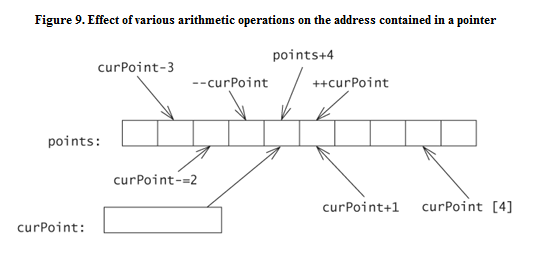

	- 将curPoint递增1并不是将指针增加一个字节，而是增加sizeof(short)个字节。
	- 这也正是void*不支持指针算术运算的原因，因为无法正确的按比例进行 指针算术运算


* 多维数组其实是一个数组的数组
	```
    const int ROWS = 2;
    const int COLS = 3;
    int table[ROWS][COLS];        // 一个具有ROWS个元素的数组，其中每一个又是一个具有COLS个int元素的数组
    int (*ptable)[COLS] = table;  // 一个指针，指向具有COLS个int元素的数组
	```
	
	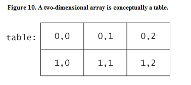
	
	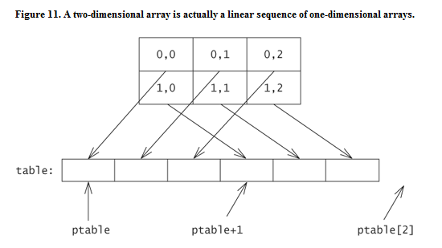

	- 对ptable执行指针算术时，算术按照ptable所指对象的大小比例进行。此时的对象是一个具有COLS个int元素的数组，其大小为sizeof(int) * COLS，而不是一个int


* 同一类型的两个指针可以进行减法运算，运算结果为参与运算的两个指针之间的元素个数
    - 两个指针相减的结果类信息为标准typedef ptrdiff_t，通常是int的一个别名


* 这种对指针算术通常意义上的理解，被STL迭代器用作设计隐喻。STL迭代器还允许指针风格的算术操作，即利用了和内建指针相同的操作。
    - STL list容器一个可能的实现

	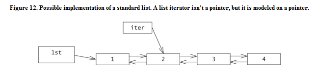    

	```
    int a[] = {1, 2, 3, 4};
    std::list<int> lst(a, a+3);
    std::list<int>::iterator iter = lst.begin(); 
    ++iter;
	```
    - list的迭代器不能是一个内建指针，而是一个带有重载操作符的智能指针
    - 指针算术操作，例如++iter，并不是像递增一个指针那样来递增iter，而是根据节点之间的链接关系，从list当前节点移动 到下一个节点


### To be continue...