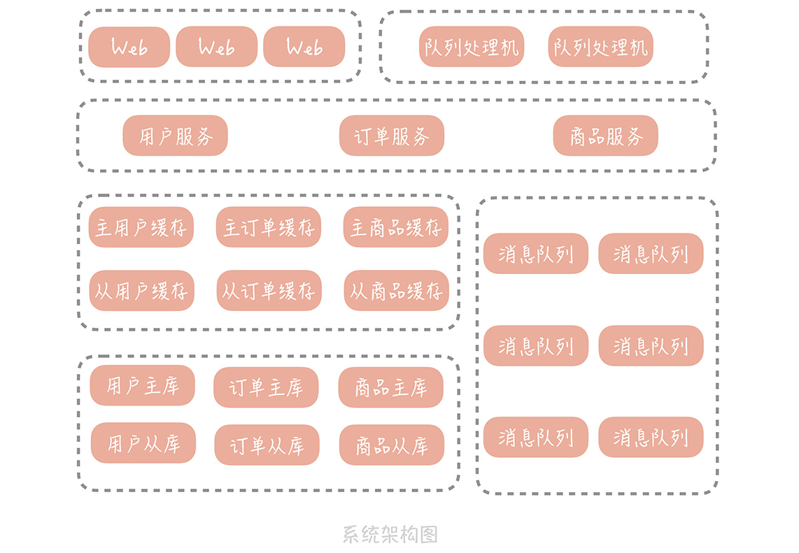
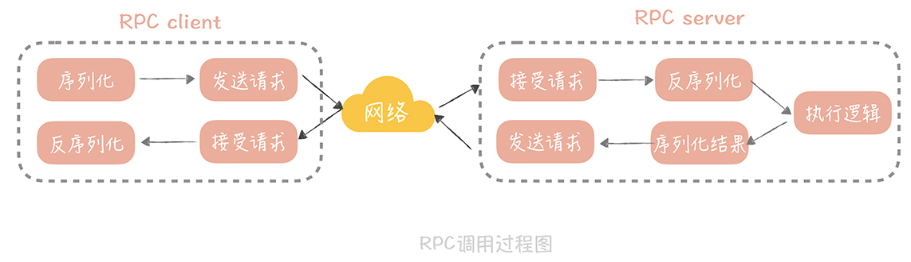
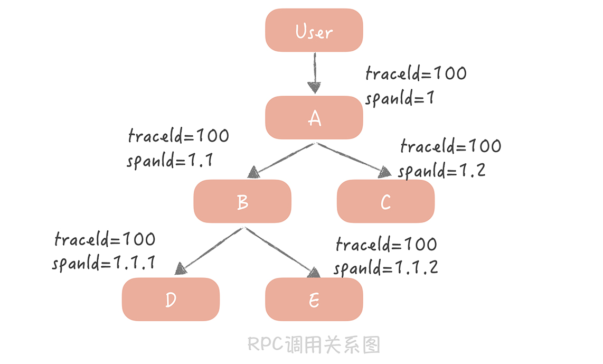

# 高并发系统设计

### 1. 基础

##### 1.1. 高并发系统

- 高并发系统应对大流量方法
  - Scale out
  - 缓存
  - 异步

##### 1.2. 架构分层

- 优点

  - 简化系统设计，让不同的人专注做某一层的事情
  - 高复用
  - 更容易横向扩展

- 三层架构

  

- 阿里系统分层规约

  

##### 1.3. 高并发系统设计

- 高并发系统设计3大目标：
  1. 高性能
  2. 高可用
  3. 可扩展

###### 高性能

- 性能优化原则

  - 问题导向，八二原则（优先优化最主要的性能瓶颈），数据支撑

- 性能度量指标

  - 吞吐量，响应时间
  - 优化目标通常的表述方式：在每秒1万次的请求量下，响应时间99分位在10ms以下

- 高并发下的性能优化

  1. 提高系统处理核心数

     - 阿姆达定律
       - 1 / (1 - p + p / s): s 表示并行进程数，p 表示任务中并行部分的占比
       - p 为 1 时，加速比趋近于无穷大

     - 拐点模型
       - 随着并发进程数的增加，并行的任务对于系统资源的争抢也会愈发严重
       - 在某一个临界点上继续增加并发进程数，反而会造成系统性能的下降

     - 压力测试
       - 找到系统的**拐点**，从而知道系统的承载能力
       - 也便于找到系统的瓶颈，优化系统性能

  2. 减少单次任务响应时间
     - CPU 密集型系统
       - 选用更高效的算法或者减少运算次数
       - 通过一些 Profile 工具来找到消耗 CPU 时间最多的方法或者模块
     - I/O 密集型系统
       - 系统的大部分操作是在等待 I/O 完成：磁盘 I/O 或者 网络 I/O
       - 采用工具发现性能瓶颈；通过监控发现性能问题

###### 高可用

- HA： High Availability，即指系统具备较高的无故障运行能力

- 可用性度量

  - Availability = MTBF / (MTBF + MTTR)
  - MTBF (Mean TIme Between Failure), 即系统正常运转的平均时间
  - MTTR (Mean Time To Repair), 即平均故障时间

- 高可用系统设计

  - 系统设计：Design for Failure

  - 系统优化方法

    1. 故障转移 Failover
       - 发生 Failover 节点的两种情况：
         - 在完全对等的节点之间做 Failover
         - 在不对等的节点之间，即系统中存在主节点和备节点，做主备切换
       - 使用最广泛的故障检测机制是 **心跳**

    2. 超时控制
       - 需要跟据统计数据来指定超时时间

    3. 降级
       - 保证核心服务稳定，牺牲非核心服务
    4. 限流
       - 对并发请求进行限速；限制处理请求数，超过部分直接返回错误

  - 系统运维

    - 灰度发布
      - 90% 的故障发生在上线变更阶段
    - 故障演练
      - 观察在局部出现故障时，整体系统的表现；发现系统中存在的潜在可用性问题
      - 混沌工程，Chaos Monkey (by Netflix）

###### 可扩展

- **拆分** 是提升系统扩展性最重要的一个思路
- 存储层的扩展性
  - 首先考虑业务维度的拆分
  - 再按数据特征做水平的拆分
    - e.g.， 数据库的分库分表
    - 最好一次性增加足够的节点以避免频繁地扩容
  - 按照业务和数据维度拆分之后，尽量不要使用事务
- 业务层的扩展性
  - 业务维度
    - 把相同业务的服务拆分成单独的业务池；e.g.，用户池，内容池，评论池，搜索池
    - 某一个业务接口成为瓶颈时，只需要扩展该业务的池子
  - 重要性维度
    - 根据业务接口的重要程度，分为核心池和非核心池
    - 整体流量上升时先扩容核心池，降级部分非核心池的接口
  - 请求来源维度
    - 根据接入客户端类型的不同做业务池的拆分

### 2. 数据库

##### 2.1. 池化技术

- 池化技术

  - 核心思想是空间换时间
  - 使用预先创建好的对象来减少频繁创建对象的性能开销
  - 对对象进行统一的管理，降低对象的使用成本

- 数据库连接池

  - Why
    - 数据库连接过程：TCP三次握手 + MySQL服务端校验客户端密码
  - Best practices
    - 最小连接数建议在10左右，最大连接数在20～30
    - 启动一个线程定期检测连接池中的连接是否可用
      - 发送 “select 1” 命令给数据库看是否会抛出异常

  

- 连接池技术

  - 数据库连接池，HTTP 连接池，Redis 连接池
  - 连接池的管理是连接池设计的核心

- 线程池

  - JDK 中的 ThreadPoolExecutor 是一种线程池的实现
    - 优先把任务放入队列暂存起来，而不是创建更多的线程
    - 比较适合执行 CPU 密集型的任务
  - Tomcat 使用的线程池会优先创建线程，直到线程数到达最大值
    - 比较适合于 Web 系统大量 IO 操作的场景
  - 把重要线程池的队列任务堆积量，作为一个重要的监控指标 

##### 2.2. 主从分离

- 主从分离

  - 一种数据库横向扩展的方法
  - 主从读写分离，一主多从部署，解决突发数据库读流量
  - 大部分系统 读多写少，差距可能达到几个数量级
  - 把读写流量区分开，可以方便针对读流量做单独的扩展

  

- 关键技术

  1. 数据的拷贝，即**主从复制**
  2. 屏蔽主从分离带来的访问数据库方式的变化

- 主从复制

  - 主从复制过程

    - 关键词
      - binlog：主库数据写入，更新 binlog 
      - IO 线程：从库 IO 线程请求主库更新的 binlog
      - log dump 线程：主库 log dump 线程发送 binlog 给从库
      - relay log：从库 IO 线程将接收到的 binlog 信息写入到 relay log 中
      - SQL 线程：从库 SQL 线程度取 relay log 中的内容，在从库做回放，实现主从一致性
    - 异步：主库上的操作不会等待从库操作完成

    

  - 主从同步延迟
    - 可能会造成写入数据之后，立刻读时，读取不到的情况
    - 解决这个问题的核心思想就是尽量不去从库中查询信息
      - 数据冗余：更新数据直接传递；简单，但数据量有可能大
      - 使用缓存：写数据库时同时写入缓存，查询时优先使用缓存；注意缓存数据并发更新，导致不一致的问题
      - 查询主库（不建议使用）

- 访问数据库

  - 业界涌现了很多数据库中间件来解决数据库访问的问题
  - 第一类：以代码形式内嵌运行在应用程序内部，e.g.，淘宝的TDDL
  - 第二类：单独部署的代理层方案，e.g.，阿里的Cobar，My cat，360的Atlas，美团的DBProxy

  

##### 2.3. 分库分表

- 单库单表问题

  - 数据量持续增长，索引增大，无法缓存全量索引信息，影响查询性能
  - 数据库备份和恢复的时间变长
  - 全部存储在一个库中，一旦出问题，所有模块都受影响
  - 不能满足更高的并发写请求

- 分库分表

  - 依照某种策略将数据尽量平均地分配到多个数据库节点或者多个表中

  

  - 垂直拆分
    - 将数据库的表拆分到不同的数据库中
    - 一般按照业务类型来拆分，核心思想是专库专用
  - 水平拆分
    - 将单一数据表按照某一规则拆分到多个数据库或多个数据表中
    - 解决某一业务模块数据大量膨胀的问题
    - 拆分规则
      - 按照某一字段的哈希值做拆分
      - 按照某一字段的区间做拆分，e.g.，把一个月的数据放入到一张表中

- 分库分表问题

  - 引入分区键，即对数据库做分库分表所依据的字段
  - 一些数据库特性在实现时可能变得困难，e.g.，多表JOIN，用count查询数据总数

  

##### 2.4. 发号器

- 发号器：分库分表后，如何生成全剧唯一的数据库主键

- UUID：通用唯一标识码

  - 一般用来生成RequestID，标记单次请求
  - 不适合作为数据库主键
    - 无序，没有单调递增性
    - 不具备业务含义

- 基于 Snowflake 算法搭建发号器

  - 核心思想是将 64 bit 的二进制数字分成若干部分，每一部分都存储特定含义的数据
  - 两种实现方式
    - 嵌入到业务代码里，即分布在业务服务器中
    - 作为独立的服务部署，即发号器服务

   

##### 2.5. NoSQL

- NoSQL 数据库类型
  - KV 存储：Redis，LevelDB；极高的读写性能
  - 列式存储：Hbase，Cassandra；以列来存储，适用于一些离线数据统计的场景
  - 文档型：MongoDB，CouchDB；Schema Free，数据表中字段可以任意扩展
- NoSQL 优点
  - 弥补了传统数据库在性能方面的不足
  - 数据库变更方便，不需要更改原先的数据结构
  - 适合互联网项目常见的大数据量的场景
- SQL 优点
  - SQL 语句的强大的查询功能
  - 传统数据库事务和灵活的索引
- NoSQL 数据库与传统关系型数据库互补
  - 使用 NoSQL 提升写入性能
    - e.g.，HBase 使用基于 LSM 树的存储引擎
      - LSM 树牺牲了一定的读性能来换取写入数据的高性能
      - 核心思想就是将随机 IO 变成顺序 IO
  - 场景补充
    - e.g.， ElasticSearch 提供了分布式的全文搜索服务
  - 提升扩展性
    - 大部分 NoSQL 数据库在设计之初就考虑到了分布式和大数据存储的场景
    - e.g.，MongoDB 三个扩展性方面的特性
      - replica：副本集，可以理解为主从分离
      - shard：分片，可以理解为分库分表
      - 负载均衡

### 3. 缓存

##### 3.1. 加速动态数据查询

- 缓存加速实现方式

  - 使用更快的介质，比如内存
  - 缓存复杂的运算结果，比如 TLB 缓存地址转化结果

- 缓存分类

  - 静态缓存
    - 针对静态数据的缓存，处于负载均衡层
    - e.g.，静态页面放置在所有前端 Web 服务器上
  - 分布式缓存
    - 处于应用层和数据层之间
    - 通过一些分布式方案组成集群突破单机的限制
    - memcached，redis等
  - 热点本地缓存
    - 热点本地缓存部署在应用服务器的代码中
    - 用于阻挡热点查询对于分布式缓存节点或者数据库的压力
    - 本地缓存方案：HashMap，Guava Cache，Ehcache等

  

- 缓存的不足

  - 适合于读多写少的业务场景，数据最好带有一定的热点属性
  - 会给整体系统带来复杂度，并且会有数据不一致的风险
  - 通常使用内存作为存储介质，内存并不是无限的
  - 给运维带来一定的成本

##### 3.2. 缓存的读写策略

- 错误的缓存使用方式

  - 更新数据时，先更新数据库，再更新缓存
  - 没有对操作做任何的并发控制

- Cashe Aside（旁路缓存）策略

  - 以数据库中的数据为准，缓存中的数据按需加载
    - 最常用的缓存策略
  - 策略
    - 如果缓存不命中，从数据库查询数据
      - 查询到数据后，将数据写入到缓存中，并返回
    - 更新数据库时，删除缓存记录

  

  - 缺点

    - 当写入比较频繁时，缓存中的数据被频繁的清理，影响缓存命中率

    - 解决方案：

      1. 更新数据时也更新缓存，加分布式锁

      2. 更新数据时也更新缓存，给缓存加一个较短的过期时间

- Read / Write Though （读穿 / 写穿）策略

  - 用户只与缓存打交道，由缓存和数据库通信，写入或者读取数据
  - Write Through 策略
    - 先查询要写入的数据是否在缓存中已经存在
    - 如果存在，则更新缓存中的数据，并由缓存组件同步更新到数据库中
    - 如果不存在（Write Miss），直接更新数据库（No-Write allocate）
  - Read Through 策略
    - 先查询缓存中的数据是否存在，如果存在则直接返回
    - 如果不存在，则由缓存组件负责从数据库中同步加载数据

  

  - 需要缓存组件支持，在使用本地缓存的时候可以考虑使用这种策略
    - 本地缓存 Cuava Cache 中的 Loading Cache 就有 Read Through 策略的影子
  - Write Though 策略中写数据库是同步的，延迟要高很多

- Write Back（写回）策略

  - 写入数据时只写入缓存，并把缓存块标记为“脏”的；脏块只有被再次使用时才会将其中的数据写入到后端的存储中

    - 计算机体系结构中的设计，在向磁盘中写数据时采用的就是这种策略
    - 避免了直接写磁盘造成的随机写问题

  - 策略

    

    

- Write Miss，两种处理方式：
  - Write Allocate：写入缓存相应位置，再由缓存组件同步更新到数据库中
  - No-write allocate：不写入缓存中，直接更新数据库中

##### 3.3. 缓存的高可用

- 缓存命中率是缓存最重要的一项监控指标

  - 缓存命中率：命中缓存请求数 / 总请求数

- 分布式缓存的高可用方案

  - 客户端方案
    - 写入数据时，将数据分散到多个节点，即进行数据分片
    - 读取数据时，利用多组缓存来做容错；有主从和多副本两种策略
  - 中间代理层方案
    - 将客户端解决方案的经验移植到代理层中，通过通用的协议来实现在其他语言中的复用
    - 代理层是无状态的，主要负责读写请求的路由功能；并在其中内置可一些高可用的逻辑
  - 服务端方案
    - Redis Sentinel 模式来解决主从 Redis 部署时的高可用问题

- 客户端方案

  1. 缓存数据分片

     - 在客户端配置多个缓存节点，通过缓存写入和读取算法策略来实现分布式
     - Hash 分片算法：简单；缓存节点变化造成缓存计算变化，缓存失效不可用
     - 一致性 Hash 分片算法
       - 解决增加和删除节点时，命中率下降的问题
       - 脏数据问题：设置缓存的过期时间，减少存在脏数据的几率

     

  2. 主从机制（Memcached）

     - Memcached 主从机制在客户端实现
     - 为每一组 Master 配置一组 Slave， 更新数据时，同步更新
     - 读取时，优先从 Slave 中读取数据，如果读取不到就穿透到 Master 读取，并将数据回种到 Slave 中以保持 Slave 数据的热度
     - 优点：当Slave 宕机时，还会有 Master 兜底  

     

  3. 多副本

     - 极端流量的场景下，一组Slave 不能完全承担所有流量
     - 在 Master / Slave 之前增加一层副本层
     - 请求首先会先从多个副本组中选取一个副本组发起查询
     - 实践中，会把 Master 和 Slave 也作为一组副本组使用

     

​		

##### 3.4. 缓存穿透

- 缓存穿透

  - 大量的穿透请求超过了后端系统的承受范围，会造成后端系统的崩溃
    - 场景：大量读取用户表中未注册用户
  - 解决穿透问题的核心目标在于减少对于数据库的并发请求

- 解决方案

  1. 回种空值

     - 当从数据库中查询到空值或者发生异常时，可以向缓存中回种一个空值

     - 给这个空值加一个比较短的过期时间，让空值在短时间内能够快速过期淘汰

     - 如果有大量的空值缓存，也会浪费缓存的存储空间

  2. 布隆过滤器
     - 注册用户除了写数据库外，还需要更新布隆过滤器数组中对应位置的值
     - 当查询用户信息时，先查询这个 ID 在布隆过滤器中是否存在；不存在就返回空值，不需要继续查询数据库和缓存
     - 缺陷
       - 一定错误几率：会把不在集合中的元素判断为处在集合中；False Positive
       - 不支持删除元素

- 布隆过滤器

  - 组成：一个二进制数组，一组Hash函数
  - 插入时，将元素值按照提供的 Hash 函数算出对应的 Hash 值，再将 Hash 值计算出数组的索引值，将数组这个位置上的值从 0 改为 1
  - 判断元素是否存在时，当所有 Hash 值对应的数组中的值都为 1 时，认为这个元素在集合中

- 狗桩效应（dog-pile effect）

  - 当一个极热点的缓存项失效后，会有大量请求穿透的数据库，造成瞬时极大的压力
  - 解决思路：尽量地减少缓存穿透后的并发
    - 当某一个热点缓存项失效后，启动一个后台线程，将数据再加载到缓存中；在缓存未加载之前，所有访问这个缓存的请求都不再穿透而直接返回
    - 通过在 Mencached 或者 Redis 中设置分布式锁，只有获取到锁的请求才能够穿透到数据库

##### 3.5. CDN

- CDN: Content Delivery Network / Content Distribution Network，内容分发网络

  - 静态资源加速：在业务服务器的上层，用来承担绝大部分**静态资源**的访问
  - 就近访问：缓存节点遍布全国各地，用户可以选择最近的节点访问
  - 缓存的命中率需要一定的保证，尽量减少访问资源存储站的请求数量（回源请求）

- 搭建一个 CDN 系统需要考虑

  - 如何将用户请求映射到 CDN 节点上：DNS
  - 如何根据用户的地理位置信息选择比较近的节点：GSLB

- DNS: Domain Name System，域名系统

  - 存储域名和 IP 地址对应关系的分布式数据库
  - 域名解析的结果有两种
    - A 记录：返回域名对应的 IP 地址
    - CNAME 记录：返回另一个域名，即从当前域名的解析跳转到另一个域名的解析上
  - 利用 CNAME 记录解决域名映射问题，将用户最初使用的域名代理到正确的 IP 地址上

- GSLB: Global Server Load Balance，全局负载均衡

  - 让流量平均分配使得下面管理的服务器的负载更平均
  - 保证流量流经的服务器与流量源头在地缘上是比较接近的

  

##### 3.6. 数据迁移

- 数据库迁移

  - 目标
    - **在线**的迁移：即迁移的同时还会有数据的写入
    - 保证数据**完整性**：即迁移之后新库和旧库的数据是一致的
    - 迁移过程**可回滚**：一旦出问题，可立刻回滚到源库；不会对系统的可用性造成影响
  - 双写方案
    - 步骤
      1. 将新库配置为源库的从库用来同步数据
         - 如果需要将数据同步到多库多表，可使用第三方工具，e.g.，开源工具 Canal
      2. 改造业务代码，在数据写入的时候不仅要写入旧库也要写入新库
      3. 校验数据，保证这些数据一致
      4. 将流量切换到新库，最好采用灰度方式。比如先切换 10% 的流量
      5. 观察数据的迁移没有问题之后，将数据库的双写改造成只写新库；数据迁移完成
    - 优点：由于双写的存在，迁移过程可以随时回滚，降低迁移风险
    - 缺点：时间周期比较长，应用改造有成本

  

  - 级联同步方案

    - 步骤

      1. 先将新库配置为旧库的从库，用作数据同步

      2. 再将一个备库配置为新库的从库，用作数据的备份

      3. 等到三个库的写入一致后，将数据库的读流量切换到新库

      4. 然后暂停应用的写入，将业务的写入流量切换到新库

    - 优点：简单易实施，业务上基本没有改造的成本

    - 缺点：切写的时候需要短暂的停止写入，对业务有一定影响

    

- 缓存预热
  - 缓存迁移的重点是保持缓存的热度
  - 使用副本组预热缓存
    - 在云上部署一个副本组
    - 当云上部署的副本组足够热之后，将云主机的缓存服务器的主从都指向这个副本组
    - 问题：请求穿透云上的副本组，达到自建机房缓存时，需要跨越专线
  - 改造副本组方案预热缓存
    - 在缓存写入的时候异步写入云上的副本组，在读取时放少量流量到云上副本组
    - 尽量减少穿透给自建机房专线延迟的问题

### 4. 消息队列

##### 4.1. 秒杀

- 秒杀抢购是最典型的高并发写请求的场景

- 队列是系统设计的常见的组件

  - 线程池中使用一个队列来存储提交的任务，等待有空闲的线程处理这些任务
  - RPC 框架会将从网络上接收到的请求写到队列里，再启动若干工作线程来处理

- 消息队列在秒杀系统中的作用

  - 削峰填谷
    - 削去到达秒杀系统的峰值流量，让业务逻辑的处理更加缓和
    - 会造成请求处理的延迟
  - 异步处理
    - 异步处理可以简化业务流程中的步骤，提升系统性能
    - 需要分清同步流程和异步流程的边界
    - 消息存在丢失的风险，需要考虑如何确保消息一定到达
  - 解耦合
    - 将秒杀系统和数据系统解耦合，两个系统的变更不会相互影响
    - 提升整体系统的鲁棒性

  

  

##### 4.2. 消息投递

- 如何保证产生的消息一定会被消费到并且只被消费一次

  1. 避免消息丢失

     - 为避免消息丢失付出的代价：性能的损耗，消息的重复消费

     - 在允许丢失消息的情况下，消息队列的性能更好，方案实现的复杂度也最低

  2. 保证消息只被消费一次
     - 在生产，消费过程中增加幂等性的保证

- 消息丢失

  - 在生产的过程中丢失
    - 原因：消息可能因为网络的错误而丢失
    - 解决办法：消息重传
    - 带来问题：可能会造成消息的重复
  - 在消息队列中丢失
    - 原因：异步刷盘
      - 为减少消息存储对磁盘的随机 IO，系统先将消息写入到 Page cache，达到一定的时间间隔或积累一定的消息时，再刷盘；如果发生机器掉电或异常重启，Page cache 中的消息就会丢失
    - 解决：以集群方式部署，通过部署多个副本备份数据保证消息尽量不丢失
      - 多个 Follower 负责数据的备份，Leader 的数据会异步地复制给 Follower
      - acks = all：每一条消息必须得到 Leader 和所有 ISR 的确认后才被认为发送成功；确保消息一条都不丢失
  - 在消费的过程中丢失
    - 原因：在接受或处理消息时发生异常，没有执行完成就更新消费进度
    - 解决：一定要等到消息接收和处理完成后才能更新消费进度
    - 问题：也可能会造成消息重复的问题

- 消息只被消费一次

  - 在生产、消费过程中增加消息幂等性的保证
  - 消息生产过程中
    - producer idempotency 特性
      - 保证消息虽然可能在生产端产生重复，在最终在消息队列存储时只会存储一份
      - 给生产者和消息都赋予一个唯一 ID，消息队列存储 <生产者 ID，最后一条消息 ID> 映射
      - 当生产者产生新消息时，消息队列会比对消息 ID 是否与存储的最后一条 ID 一致
  - 在消费端
    - 通用层
      - 在消息被生产的时候使用发号器给它生成一个全局唯一的消息 ID
      - 消息被处理之后把这个 ID 存储在数据库中，处理下一条消息之前先从数据库查询这个 ID 是否被消费过
      - 问题：如果消息在处理之后，还没有来得及写入数据库，会重复执行消费逻辑
      - 解决：引入事务机制，保证消息处理和写入数据库必须同时成功或者同时失败
        - 问题：消息处理成本更高了
    - 业务层
      - 给数据加乐观锁
        - e.g.，update user set amount = amount + 20, version = version + 1 where userId = 1 and version = 1
        - 当消费第一条消息时，version 值为1 ，SQL 可以执行成功，并同时把 version 值改为了 2
        - 之后再执行相同的消息时，由于 version 值不再是 1，所以这条SQL 不能执行成功

##### 4.3. 消息队列性能提升

###### 监控消息延迟

- 监控消息延迟的两种方式
  - 使用消息队列提供的工具，通过监控消息的堆积来完成
    - Kafka 提供了工具叫做 Kafka-consumer-groups.sh；方便了解消费者的消费情况
    - Kafka 通过 JMX 暴露了消息堆积的数据；可以看到消费者的堆积数据
  - 通过生成监控消息的方式来监控消息的延迟情况
    1. 先定义一种特殊的消息，消息的内容可以时生成消息的时间戳
    2. 启动一个监控程序，将这个消息定时地写入到消息队列中
    3. 监控程序在消费到这个消息时，和消息的生成时间做对比
    4. 如果时间差达到某一个阈值就报警
- 实际项目中，推荐两种方式结合使用
  - 优先在监控程序中获取 JMX 中队列堆积数据做到 dashboard 报表中
    - 消息的堆积时消息队列的基础监控
  - 同时也启动探测进程确认消息的延迟情况
    - 对于消费的延迟监控更加直观
    - 从时间维度来做监控也比较容易确定报警阈值

###### 减少消息延迟

- 消费端
  - 目标：提升消费者的消息处理能力
  - 方法
    1. 增加消费者的数量
       - 受限于消息队列的实现
         - Kafka 就无法通过增加消费者数量的方式来提升消息处理能力
         - 在消费的时候，Kafka 约定一个分区只能被一个消费者消费
         - 话题的分区数量决定了消费的并行度，可以通过增加分区来提高消费者的处理能力
    2. 在 consumer 中提升处理消息的并行度
       - 考虑使用多线程的方式增加处理能力
       - 预先创建线程池，在接收到消息之后把消息丢到线程池中来异步处理
    3. 注意消费线程空转的问题
       - 消费客户端拉取不到新的消息时，就会不间断地轮询拉取消息，把 CPU 跑满了
       - 在写消费客户端的时候要考虑这种场景，拉不到消息可以等待一段时间再拉取；但等待的时间也不宜过长，否则会增加消息的延迟

- 消息队列

  - 消息的存储

    - Page Cache 可以提升消息的读取速度

  - 零拷贝技术

    - 操作系统提供了 Sendfile 函数，可以减少数据被拷贝的次数
    - 内核缓冲区的数据不会被拷贝到用户缓冲区，而是直接被拷贝到 Socket 缓冲区

    

    

### 5. 分布式服务

##### 5.1. 系统架构

###### 一体化架构

- 优点
  - 开发简单直接
  - 只需要维护一个工程，节省维护系统运行的人力成本
  - 排查问题的时候，只需要排查这个应用进程就可以，目标性强
- 痛点
  - 系统中使用的资源出现扩展性问题
    - e.g.，数据库连接数可能成为系统的瓶颈，最多为 16384
  - 增加了研发的成本，抑制了研发效率的提升
    - 代码部署在一起，冲突无法避免
    - 功能之间耦合严重，可能很小的修改导致其他功能不可用
    - 测试时需要对整体功能回归，延长了交付时间
  - 对于系统运维也有很大影响
    - 系统部署成本越来越高；一次构建过程需要花费很长时间
    - 任何小的修改，都需要构建整个项目；上线变更过程非常不灵活

###### 微服务

- 基于提升扩展性和降低成本的考虑，使用微服务化架构；QPS 并不是决定性因素

- 通过按照业务做横向拆分的方式，解决数据库层面的扩展性问题

- 可以将与业务无关的公用服务抽取出来，下沉成单独服务

- 一旦服务出了问题，也可以通过服务熔断，降级的方式减少对于其他服务的影响

  

##### 5.2. 分布式架构

- 服务拆分原则
  - 做到单一服务内部功能的高内聚和低耦合
  - 服务拆分的粒度：先粗略拆分在逐渐细化
  - 拆分的过程：要尽量避免影响产品的日常功能迭代
  - 服务接口的定义要具备可扩展性
- 服务边界，服务粒度
  - 优先剥离比较独立的边界服务
    - e.g.，短信服务，地理位置服务
    - 从非核心服务出发，减少拆分对现有业务的影响
  - 当两个服务存在依赖关系时，优先拆分被依赖的服务
    - 要理清服务之间的调用关系
  - 团队也要按照业务边界拆分
    - 每一个模块由一个小团队负责，包括开发，测试，运维和 DBA
    - 沟通的成本会明显减低
- 服务化后，引入的问题
  - 接口的调用不再是同一进程内的方法调用，而是跨进程的网络调用
    - 增加接口响应时间
      - 解决：选择高效的调用框架
    - 接口调用方需要知道服务部署在哪些机器的哪个端口上
      - 解决：引入服务注册中心
  - 多个服务之间有着错综复杂的依赖关系
    - 被依赖服务的性能出现问题，会导致依赖的服务也会出现性能问题
      - 解决1：引入服务治理体系，采用熔断，降级，限流，超时控制等方法
      - 解决2：使问题被限制在单一服务中，保护服务网络中的其他服务不受影响
  - 一条请求的调用链路上涉及多个服务
    - 出现问题时，很难定位是哪一个服务出现的问题
      - 解决：引入分布式追踪工具，以及更细致的服务端监控报表
        - 分布式追踪关注的是单一慢请求中的性能瓶颈分析
        - 监控报表关注的是依赖服务和资源的宏观性能表现
- 微服务是一种架构手段，有效拆分可以帮助实现服务的敏捷开发和部署
  - 服务化的一个目标是减少研发成本
    - 其中也包括沟通成本，小团队的内部成员不宜过多；贝佐斯的 “两个披萨” 理论

##### 5.3. RPC 框架

- RPC：Remote Procedure Call，远程过程调用

  - 封装了网络调用的细节，能够实现远程调用其他服务
  - RMI：Java 原生远程调用框架
    - 使用专为 Java 远程对象定制的协议 JRMP 进行通信，无法实现跨语言通信
    - 使用 Java 原生的对象序列化方式，字节数组空间大，效率差
  - Web Service
    - 使用 HTTP + SOAP 协议，调用可以跨语言，跨平台
    - 使用 XML 封装数据，数据包大，性能较差

- RPC 调用步骤

  1. 将客户端调用的类名，方法名，参数名，参数值等信息序列化成二进制流

  2. 客户端将二进制流通过网络发送给服务端
  3. 服务端接收到二进制流之后反序列化，得到调用类名，方法名，参数名和参数值
  4. 服务端通过动态代理的方式调用对应的方法得到返回值
  5. 服务端将返回值序列化，再通过网络发送给客户端
  6. 客户端对结果反序列化，得到调用的结果

  

- 提升网络传输性能

  - I/O 的处理方式
    - 等待资源阶段：阻塞，非阻塞
    - 使用资源阶段：同步处理，异步处理
  - 网络参数调优
    - 可以结合网络基础知识和成熟 RPC 框架源码来深入了解
    - e.g.，tcp_nodelay，Nagle's 算法

- 选择合适的序列化方式

  - 考虑因素
    - 性能
      - 时间上：序列化和反序列化的速度
      - 空间上：过大的二进制串会占据传输带宽，影响传输效率
    - 是否可以跨语言，跨平台
    - 可扩展性
      - 不会因为增加一个字段就造成传输协议的不兼容，导致服务调用失败
  - 备选方案
    - JSON
      - 简单易用，可读，性能上相比 XML 有较大优势
      - 对性能要求不高，数据占用带宽不大时，可以使用 JSON 作为序列化协议
    - 需要引入 IDL 的
      - IDL
        - 按照约定语法写一个 IDL 文件
        - 带来一些使用上的不方便
        - 空间和时间上都有很高的性能
      - Thrift
        - 轻量级 RPC 框架，一体化解决方案
      - Protobuf
        - 对新能要求较高时，可以考虑使用 Protobuf 替换 JSON 作为数据序列化方式

##### 5.4. 注册中心

- 把服务地址直接配置在文件 / 代码中的问题

  - 在紧急扩容的时候，需要修改客户端配置，重启所有客户端进程，操作时间较长
  - 一旦某个服务出现故障，需要修改所有客户端配置后重启，无法做到自动恢复
  - 服务端上线无法做到提前摘除流量

- 注册中心基本功能

  - 提供服务地址的存储，当存储内容发生变化时，可以将变更内容推送给客户端
    - 动态扩缩容，故障快速恢复；实现不重启就能动态地变更服务节点
    - 实现优雅关闭：服务退出时，先将服务从注册中心删除，观察服务端没有流量后，再停止服务

  

- 服务状态管理

  - 主动探测

    - 服务要打开一个端口，注册中心每隔一段时间探测这些端口是否可用
    - 问题
      - 所有 RPC 服务端都需要开放一个统一端口给注册中心探测
        - 多服务混部情况下，端口可能被占用，造成服务启动失败
      - 如果 RPC 服务实例较多，每次探测的成本会较高，探测时间也较长
        - 当一个服务不可用时，可能会有一段延迟，才会被探测到

  - 心跳模式

    - RPC 服务节点按照一定的时间间隔，向注册中心发送心跳包
    - 注册中心接受到心跳包后，更新这个节点的最近续约时间
    - 注册中心定期检测当前时间和节点最近续约时间的差值；如果达到一个阈值，认为这个服务节点不可用

    

- 使用注意

  - 给注册中心增加保护策略
    - 如果摘除的节点占到了服务集群节点数的阈值，就停止摘除服务节点，并给服务的开发和运维同学报警
  - 通知风暴
    - 如果多个服务集群同时上线或者发生波动时，注册中心推送的消息就会很多
    - 方案解决
      - 控制一组注册中心管理的服务集群的规模
      - 通知的消息量达到某一个阈值就停止变更通知

  

##### 5.5. 分布式Trace

- 一体化架构中的慢请求排查

  - 打印操作的每一步骤的耗时情况，清晰地了解一个调用链路上的耗时分布情况
  - 问题 1: 日志穿插打印，无法知道哪些日志来自于同一个请求
    - 在程序入口处生成一个 requestId，把它放在线程的上下文中，给同一个请求的每一行日志都增加相同的 requestId
  - 问题 2: 每次排查一个接口需要增加日志，重启服务
    - 使用切面编程，可以在不修改源代码的前提下给应用添加功能；对代码无侵入
  - 问题 3: 日志量过大
    - 增加日志采样率，避免全量日志的打印
  - 问题 4: 给定requestId，不能确定请求在哪台服务器上
    - 将日志发送到消息队列里，再由消息处理程序写入到集中存储中，比如 ElasticSearch

  

- 切面编程

  - 静态代理，AspectJ，在编译期做切面代码注入
    - 编译期插入代码，增加编译时间，运行期对于性能基本没有影响
    - 校验，限流或者日志打印等工作，建议使用静态代理
  - 动态代理，Spring AOP，在运行期做切面代码注入
    - 在运行期需要生成代理对象，性能要比静态代理差

- 分布式Trace

  - 微服务场景下，单次请求可能跨越多个 RPC 服务；单次请求的日志会分布在多个服务器上

  - 采用 traceId + spanId 来记录服务之间的调用关系

    - 仅仅依靠 requestId 很难表达清楚服务之间的调用关系
    - traceId 就是 requestId

    

  - 作用

    - 跨进程调用链展示
    - 服务依赖分析
    - 提供性能优化和问题排查方面的数据支持

  - 开源方案

    - Zipkin，Jaeger

  - 注意

    - 提供开关，方便随时将线上日志打印关闭
    - 开始设置一个较低的日志采样率，观察系统性能情况后再调整

##### 5.6. 负载均衡

- 负载均衡器作为流量入口
  - 可以对请求方屏蔽服务节点的部署细节
  - 实现对于业务方无感知的扩容
  - 分类
    - 代理类负载均衡服务
      - 以单独服务方式部署，所有请求都要先经过负载均衡服务
      - 需要承担全量的请求，对于性能要求极高
    - 客户端负载均衡服务
      - 把负载均衡的服务内嵌在 RPC 客户端中
      - 和客户端应用部署在同一个进程中，提供多种选择节点的策略
- 代理类负载均衡服务
  - LVS
    - 在传输层工作（网络模型第四层），称为四层负载
  - Nginx
    - 在应用层工作（网络模型第七层），称为七层负载
  - 同时部署 LVS 和 Nginx 做 HTTP 应用服务的负载均衡
    - 在入口处部署 LVS 将流量分发到多个 Nginx 服务器上
    - 再由 Ngnix 服务器分发到应用服务器上
  - Note
    - 如果 QPS 在十万以内，可以不引入 LVS，只使用 Nginx 作为负载均衡器
    - 两个负载均衡服务适用于普通 Web 服务，不适合微服务架构
- 客户端负载均衡服务
- 负载均衡策略
- 

##### 5.7. API 网关

##### 5.8. 多数据中心

##### 5.9. Service Mesh

### 6. 维护

##### 6.1. 服务端监控

##### 6.2. 应用性能管理

##### 6.3. 压力测试

##### 6.4. 配置管理

##### 6.5. 降级

##### 6.6. 流量控制

### 7. 实战

