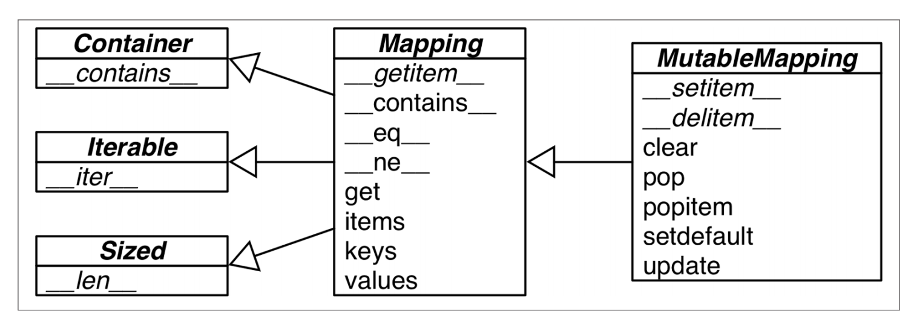
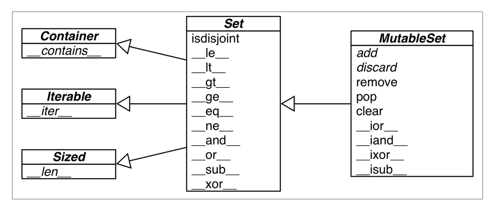
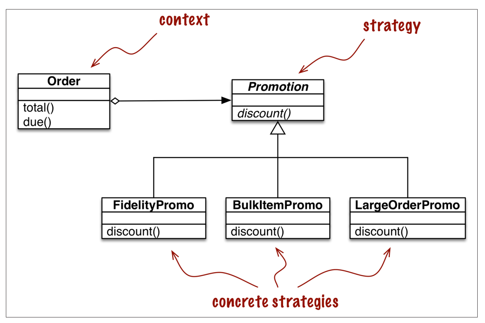
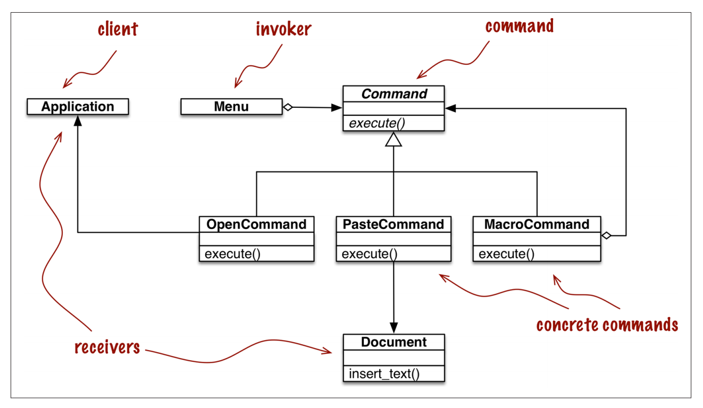
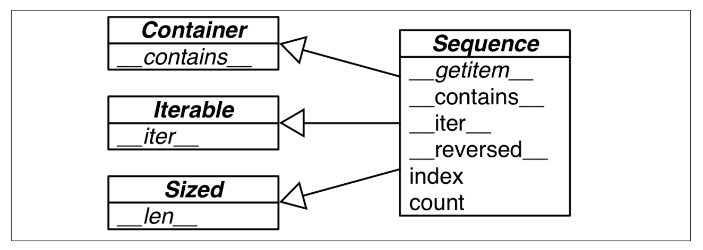
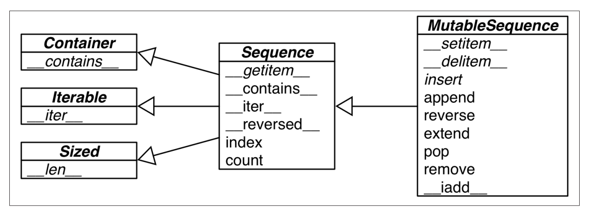
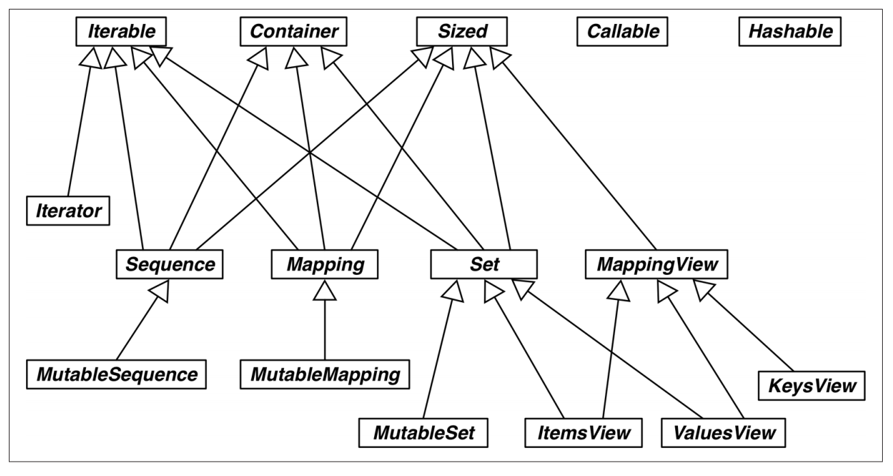
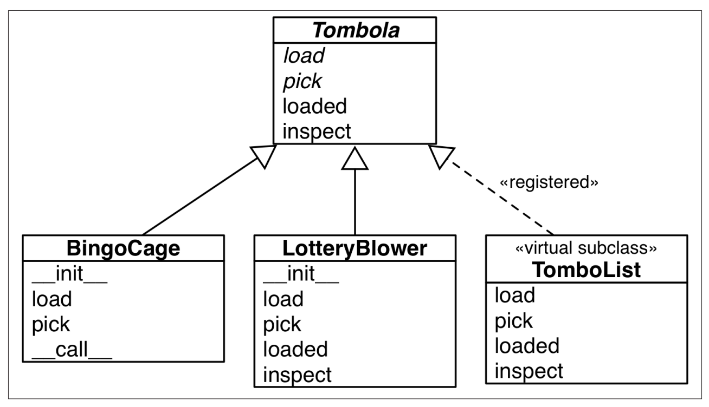
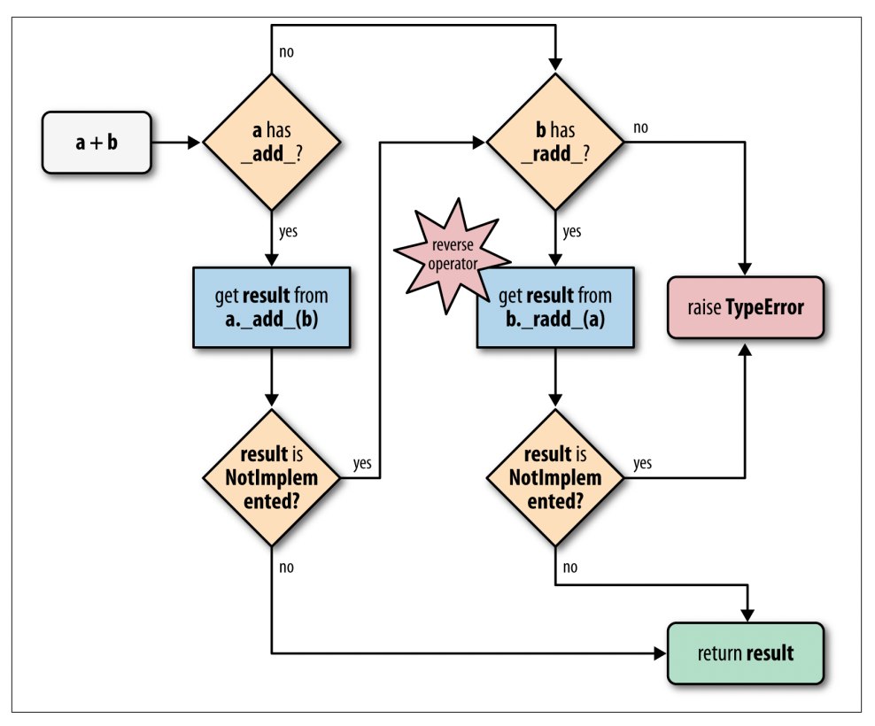
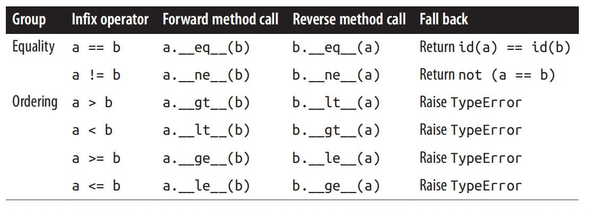

## Fluent Python

### 一 序幕

#### 1. python数据类型

- Python Data model

  - Description of Python as a framework: implementing methods (special methods) that are call by the framework (Python interpreter)

  ```python
  import collections
  
  Card = collections.namedtuple('Card', ['rank', 'suit'])
  
  Class FrenchDeck:
    ranks = [str(n) for n in range(2, 11) + list('JQKA')]
    suits = 'spades diamonds clubs hearts'
    def __init__(self):
      self._cards = [Card(rank, suit) for suit in self.suits
                                      for rank in self.ranks]
    def __len__(self):
      return len(self._cards)
    def __getitem__(self, position):
      return self._cards[position]
  ```

- Special methods: allow your objects to behave like built-in types, Pythonic code style  

  - **Iteration**: \_\_iter\_\_(), \_\_reversed\_\_(),  \_\_next\_\_(),  
  
  - **Collections**: \_\_len\_\_(),  \_\_getitem\_\_(), \_\_setitem\_\_(), \_\_contains\_\_(),    
  
  - **Attribute access**:  \_\_getattr\_\_(),  \_\_getattribute\_\_(),  \_\_setattr\_\_(), \_\_delattr\_\_(),  \_\_dir\_\_()     
  
  - **Operator overloading**: \_\_add\_\_(),  \_\_mul\_\_(),  
  
  - **Function and method invocation**:  \_\_call\_\_() 
  
  - **Object creation and destruction**: \_\_new\_\_(),  \_\_init\_\_(),  \_\_del\_\_(), 
  
  - **String representing and formating**: \_\_repr\_\_(), \_\_str\_\_()
  
  - **Managed contexts with blocks**: \_\_enter\_\_(),  \_\_exit\_\_()  
  
    

### 二 数据结构

- types of sequences:
  - **Container sequences**: hold items of different types, list, tuple, collections.duque 
  - **Flat sequences**: hold items of one type, str, bytes, bytearray, memoryview, array.array  
  
- another way of grouping:
  - **Mutable sequences**: list, bytearray, array.array,  collections.deque, memoryview 
  
  - **Immutable sequences**:  tuple, str, bytes
  
    

#### 2. 序列构成的数组

- List comprehensions and Generator expressions

  - List comprehensions: more readable, but you should keep it short
  - Generator expression: saves memory, yields items one by one using iterator protocol

- Tuples

  - Tuples used as records: the number of items is fixed and their order is vital

  - Tuple unpacking

    ```python
    # swapping variables without using a temp variable
    a, b = b, a
    # using * to unpack as arguments
    t = (20, 8)
    _, mod = divmod(*t)
    # using * to grab excess items
    a, *mid, c = range(5)
    ```

  - **Named tuples**

    - Use the same memory as tuple, and function as regular object (less memory, but immutable)
    - _fields, _make(), _asdict()

    ```python
    from collections import namedtuple
    City = namedtuple('City', ['name', 'country', 'population', 'coordinates'])
    LatLong = namedtuple('LatLong', 'lat long')
    print(City._fields)
    tokyo = City('Tokyo', 'JP', 36.933, (35.689772, 139.691667))
    delhi_tup = delhi_data = ('Delhi NCR', 'IN', 21.935, 
                              LatLong(28.613889, 77.208889))
    delhi = City._make(delhi_data)
    print(delhi._asdict())
    ```

  - Tuples as immutable lists

    - except adding or removing items, tuples supports all list methods

- Slicing

  - Slice object: slice(start, stop, step)
  - Seq[start:stop:step] --> seq.\_\_getitem\_\_(slice(start, stop, step))

- Sorting

  - list.sort: sorts list in place, return None

  - Sorted: create and return a new sorted list

    - Accept any iterable objects including immutable sequences and generators

  - bisect: managing ordered Sequences

    - Searching: bisect.bisect, bisect.bisect_left
    - Inserting: bisect.insort

    ```python
    import bisect
    def grade(score, breakpoints=[60, 70, 80, 90], grades='FDCBA'):
        i = bisect.bisect(breakpoints, score)
        return grade[i]
    grades = [grade(score) for score in 
              [33, 99, 77, 70, 89, 90, 100, 61, 60, 59]]
    ```

- Other types of Sequences

  - Arrays: more efficient if the list only contains numbers
  
  - MemoryViews: shared-memory sequence, handles slices of arrays without copying bytes
  
  - collections.deque: thread-safe, double-ended queue designed for fast inserting and removing from both ends
  
  - queue.Queue: queue.LifoQueue, queue.PriorityQueue: used for safe communication between threads
    - Insertion is blocked when queue is full, instead of discarding items
    
  - multiprocessing queue: designed for iterprocess communication
  
  - asycio queue: Queue, LifoQueue, PriorityQueue, JoinableQueue; manage tasks in asynchronous programming
  
  - heapq: provide functions like heappush, heappop  
  
    

#### 3. 字典和集合

- Generic Mapping Types

  

  - Mapping, Mutable Mapping: interface of dict
  - keys must be **hashable**

- Common Mapping Methods

  - setdefault: handling missing keys
  - defaultdict: another elegant solution of handing missing keys
  - \_\_missing\_\_(): if provide, dict.\_\_getitem\_\_() will call it when key is not found, instead of raising KeyError

  ```python
  import re
  import collections
  
  WORD_RE = re.compile('\w+')
  file_path = './test_word_count.txt'
  
  index_method_1 = {} 
  index_method_2 = {}
  index_method_3 = collections.defaultdict(list)
  
  with open(file_path, encoding='utf-8') as fp:
   	for line_no, line in enumerate(fp):
      for match in WORD_RE.finditer(line):
        word = match.group()
        column_no = match.start() + 1
        location = (line_no, column_no)
        # method 1: get()
        occurences = index.get(word, [])
        occurences.append(location)
        index[word] = occurences
        # method 2: setdefault()
        index.setdefault(word, []).append(location)
        # method 3: use defaultdict
        index[word].append(location)
  ```

  ```python
  #class StrKeyDict(dict):
  class StrKeyDict(collections.UserDict):
  	def __missing__(self, key):
  		if isinstance(key, str):
  			raise KeyError(key)
  		return self[str[key]]
  	def get(self, key, default=None):
  		try:
  			return self[key]
      except KeyError:
        return default
     def __contain__(self, key):
     		return key in self.keys() or str(key) in self.keys()
  d = StrKeyDict([('2', 'two'), ('4', 'four')])
  print(d['2'])
  print(d[4]) # will call __missing__ and return as d['4']
  print(d.get(1, 'NA'))
  ```

- Variations of dict

  - collections.OrderedDict
    - Maintains keys in insertion order, iter items in a predictable order
    - popitem(last=False)
  - collections.Counter
    - Holds an integer count for each key
    - counter.update(), counter.most_common(n)
  - collections.UserDict
    - Pure python implementation, works like a standard dict
    - Easier to create a new mapping type by extending UserDict rather than dict
    - UserDict does not inherit from dict, but has an internal dict instance
  - MappingProxyType: Immutable Mappings
    - builds a read-only mappingproxy instance from a dict

- Set

  

  - Literal set syntax
    - a =  {1, 2, 3}
    - both **faster** and more readable than calling the constructor: a = set([1, 2, 3]) 
  - Set operations
    - Infix operator: &, |, -, ^, require both operations be sets
    - Methods: and, or, sub, xor, arguments can be iterables of any type
    - Predicates: in, <=, <. >=. >

- dict and set under the hood

  - Hash tables:

    - hash table is a sparse array, cells in a hash table are called **buckets**
    - python tries to keep at least 1/3 of the buckets empty, if too crowded, it is copied to a larger place

  - The hash table algorithm

    

    1. calls hash(search_key) to obtain the hash_value of search_key
    2. look up a bucket in the hash table by hash_value
       1. if bucket is empty, raise KeyError
       2. if bucket is not empty, get (found_key, found _value) in the found bucket
          1. if found_key == search_key, return found_value
          2. **hash collision**: lookup a different bucket, (offset giving by the algorithm), repeat 2

  - Hashable: an object is **hashable** if all requirements are met:

    1. Supports the hash() function, and always returns the same value over the lifetime
       - hash() call \_\_hash\_\_() for user-defined types
    2. supports the eq() function
    3. if two objects compares equal, their hash values must be equal
       - i.e. if a == b, then hash(a) == hash(b) must also be True 

  - Notes:

    - User-defined types are hashable by default, use id() as their hash value and they all compare not equal
    
    - All immutable built-in objects are hashable, except tuple
    
    - dicts have significant memory overhead: hash table must be **sparse** to work
    
    - key ordering depends on insertion order
    
    - adding items to a dict may change the order of existing keys
      - it's a bad idea that modifying the contents of dict when iterating through it
      
        

#### 4. 文本和字节序列

- Character

  - Character is **Unicode charactor**, python3 str, python2 unicode object

  - **Code point**: the identity of a character, is a number

  - **Encoding**: str -> bytes; converting code points to byte sequences

    - e.g., code point for A(U+0041) is encoded as \X41 by utf-8 encoding
    - Encode str to bytes for storage or transmission

  - **Decoding**: bytes -> str; converting from bytes to code points

    - Decode bytes to str to get human-readable text 

    ```python
    b = b'caf\xc3\xa9'
    print(len(b))
    s = b.decode('utf8')
    print(s)
    print(len(s))
    ```

- Byte

  - 2 Built-in Byte types:

    - bytes: immutable
    - bytearray: mutable, no literal syntax for bytearray

  - 3 different displays, each item is 0-255 integer

    - ASCII character, is in printable ASCII range
    - Escape sequences: \t, \n, \r, \\
    - Hexadecimal escape sequence for other bytes
      - \x00 -> null

  - bytes and bytearray supports most str methods

    - except formatting and others depends on unicode data

  - Ways of creating bytes or bytearray:

    - bytes.fromhex()
    - call constructor, using different params
      - str and encoding
      - iterable values from 0 to 255
      - single integer as size
      - object of buffer protocol

    ```python
    import array
    b1 = bytes.fromhex('31 4B CE A9')
    print(b1)
    b2 = bytes('abc', 'utf-8')
    print(b2)
    numbers = array.array('h', [-2, 1, 0, 1, 2, 97, 65])
    b3 = bytes(numbers)
    print(b3)
    b4 = bytes(4)
    print(b4)
    ```

  - MemoryvView: shares memory

    - creating bytes or bytearry always copy the bytes
    
      

### 三 把函数视作对象

#### 5. 一等函数

- First-class objects can be:

  - Created at runtime
  - Assigned to a variable or element in a data structure
  - Passed as an argument to a function
  - Returned as the result of a function

- High-order functions

  - High-order function: a function that takes a function as argument of returns a function as the result; e.g., map, sorted
  - Modern replacements for map, reduce and filter
    - listcomp and genexp does the job of map and filter combined, and more readable
    - The most common use case for reduce: summation, is better served (readability and performance) by the **sum** build-in
    - other reduce built-ins: all(iterable), any(iterable)

- Anonymous functions

  - **lambda**: creates an anonymous function within a python expression
  - lambda cannot make assignments or use any other python statement, i.e., while, try, etc.
  - the best use of anonymous functions is in the context of an **argument list**; and rarely  useful in any other places
    - as lambdas are either unreadable or unworkable

- Callable objects

  - Use callable() to determine whether an object is callable

  - 7 callable types:

    1. User-define functions: create with def statements or lambda expressions

    2. Built-in functions: e.g., len()

    3. Built-in methods: e.g., dict.get()

    4. Methods: functions defined in the body of a class

    5. Classes: runs its \_\_new\_\_() method to create an instance; e.g.., c = collections.Counter()

    6. Class instance: if class defines \_\_call\_\_() method, its instance can be invoked as functions 

    7. Generator functions: functions or methods use the yield keyword

- User-Defined Callable Types

  - By implementing a \_\_call\_\_ method, instances of object can behave like functions
  - Function-like objects, have some internal state that can be kept across invocations

- Function Introspection

  - dir(func)

  - function attributes: \_\_dict\__,  \_\_name\_\_, \_\_defaults\_\_, \_\_kwdefaults\_\_, \_\_code\_\_, \_\_annotations\_\_

  - try to find the function arguments

    - the \_\_code\_\_.co_varname includes all the names of arguments and local variables
    - so, the first \_\_code\_\_.co_argcount of the \_\_code\_\_.co_varname are the arguments of the function
    - the default values are stored by position in \_\_defaults\_\_ tuple

  - **inspect** module

    - inspect.signature(func)

    ```python
    from inspect import signature
    sig = signature(clip)
    printn(str(sig))
    for name, param in sig.parameters.items():
      print(param.kind, name, param.default)
    ```

- Positional and keyword-only parameters

  - Example

    ```python
    def tag(nane, *content, cls=None, **attrs):
      pass
    
    tag('br')		
    # name='br', contents=(), cls=None, attrs={}
    tag('p', 'hello', 'world') 		
    # name='p', contents=('hello', 'world'),  cls=None, attrs={}
    tag('p', 'hello', 'world', cls='sidebar') 		
    # name='p', contents=('hello', 'world'), cls='sidebar', attrs={}
    tag('p', 'hello', id=33)
    # name='p', contents=('hello', ), cls=None, attrs={'id': 33}
    tag(content='testing', name='img')
    # name='img', contents=(), cls=None, attrs={'content': 'testing'}
    my_tag = {'name': 'img', 'title': 'sunset boulevard',
             'src': 'sunset.jpg', 'cls': 'framed'}
    tag(**my_tag)
    # name='img', contents=(), cls='frames', attrs={'title': 'sunset boulevard', 'src': 'sunset.jpg'}
    ```

    - Any number of positonal arguments after the first are captured by *content as tuple
    - Keyword arguments are captured by **attrs as a dict
    - cls parameter can only be passed as a keyword argument -- 
    -  The first positional argument can also be passed as a keyword

  - **Keyword-only** arguments:

    - Will never capture unnamed positional arguments
    - to specify keyword-only arguments: name them after the argument prefixed with *, 
      - e.g., def f(a, *, b), b is the keyword-only arguments
    - Keyword-only arguments do not need to have a default value

- Function Annotations

  - Example:

    ```python
    def clip(text:str, max_len:'int > 0'=80) -> str:
      pass
    
    print(clip.__annotations__)
    ```

  - The only thing Python does with annotations is to store them in the \_\_annotations\_\_ attribute, nothing else

- Packages for functional Programming

  - operator
    - operator.mul
    - operator.itemgetter
    - operator.attrgetter
    - operator.methodcaller
    
  - functools.partial: freezing arguments
  
  - functools.partialmethod: freezing method arguments
  
    

#### 6. 使用一等函数实现设计模式

* In the context of languages with first-class functions, some patterns are suggested to rethink 
  * **Strategy**, **Command**, **Template Method**, and **Visitor**
  * Instances of some participant class can be replaced by simple functions in these patterns

- Case study: refactoring Strategy

  

  - Classic Strategy 

    ```python
    from abc import ABC, abstractmethod
    from collections imort namedtuple
    
    Customer = namedtuple('Customer', 'name fidelity')
    
    class LineItem:
      def __init__(self, product, quantity, price)
      	self.product = product
        self.quantity = quantity
        self.price = price
      def total(self):
        return self.price * self.quantity
      
    class Order: # the Context
      def __init__(self, customer, cart, promotion=None):
        self.customer = customer
        self.cart = list(cart)
        self.promotion = promotion
      def total(self):
        if not hasattr(self, '__total'):
          self.__total = sum(item.total() for item in self.cart)
      	return self.__total
      def due(self):
        if self.promotion is None:
          discount = 0
        else:
          discount = self.promotion.discount(self)
     		return self.total - discount
    	def __repr__(self):
        fmt = '<Order total: {:.2f} due: {:.2f}>'
        return fmt.format(self.total(), self.due())
      
    class Promotion(ABC): # the strategy: abstract base class
      @abstractmethod
      def discount(self, order):
        '''Return discount as positive dollar amout'''
      
    class FidelityPromo(Promotion): # first concrete strategy
      def discount(self, order):
        '''5% discount for customers with 1000 or more fidelity points'''
        if order.customer.fidelity >= 1000:
          discount_ratio = 0.05
        else:
          discount_ratio = 0
        return order.total() * discount_ratio
      
    class BulkItemPromo(Promotion): # second concrete strategy
      '''10% discount for each lineitem with 20 or more units'''
      def discount(self, order):
        discount = 0
        for item in order.cart:
          if item.quantity >= 20:
            discount += item.total() * .1
      	return discount
     
    class LargeOrderPromo(Promotion): #third Concrete strategy
      '''7% discount for oders with 10 or more distince items'''
      def discount(self, order):
        distinct_items = {item.product for item in order.cart}
        if len(distinct_items) >= 10:
          return order.total() * .07
        return 0
    ```

  - Function-Oriented Strategy

    ```python
    ......
    
    class Order: # the COntext
     	......
      def due(self):
        if self.promotion is None:
          discount = 0
        else:
          discount = self.promotion(self)
    		return self.total() - discount
      
    def fidelity_promo(order):
      '''5% discount for customer with 1000 or more fidelity points'''
      return order.total() * .05 if order.customer.fidelity >= 1000 else 0
    
    def bulk_item_promo(order):
      '''10% discount for each lineItem with 20 or more units'''
      discount = 0
      for item in order.cart:
        if item.quantity >= 20:
          discount += item.total() * .1
    	return discount
    
    def large_order_promo(order):
      '''7% discount for orders with 10 or more distince items'''
      distinct_items = {item.product for item in order.cart}
      if len(distinct_items) >= 10:
        return order.total() * .07
      return 0
    ```

    ```python
    promos = [fidelity_promo, bulk_item_promo, large_order_promo]
    promos = [globals()[name] for name in globals()
              if name.endwith('_promo') and name != 'best_promo']
    # create a module named promotions and put all 
    # strategy functions there, except best_promo 
    promos = [func for name, func in inspect.getmembers(
              promotions, inspect.isfunction)]
    
    def best_promo(order):
      '''select best discount available'''
      return max(promo(order) for promo in promos)
    ```

- Command strategy

  

  - The goal of Command is to decouple an object that invokes an operation (the Invoker) from the provider object that implements it (the Receiver)
  
  - It is said that Commands are an object-oriented replacement for callbacks
  
  - Instead of giving the Invoker a Command instance, we can simply give it a function
  
    

#### 7. 函数装饰器和闭包 

- Decorators

  - Decorator is a callable that takes another function as argument

    - It performs some processing with the decorated function 
    - and returns it or replaces it with another function

  - When python executes Decorators

    - function decorators are excuted as soon as the module is imported
    - the decorated functions only run when they are explicitly invoked

  - Example: Decorator-enhanced Strategy Pattern

    ```python
    promos = []
    
    def promotion(promo_func):
      promos.append(promo_func)
      return promo_func
    
    @promotion
    def fidelity(order):
      '''5% discount for customers with 1000 or more fidelity points'''
      return order.total() * .05 if order.customer.fidelity >= 1000 else 0
    
    @promotion
    def bulk_item(order):
      '''10% discount for each lineItem with 20 or more units'''
      discount = 0
      for item in order.cart:
        if item.quantity >= 20:
          discount += item.total() * .1
          return discount
    
    @promotion
    	def large_order(order):
      	'''7% discount for orders with 10 or more distinct items'''
      	distinct_items = {item.product for item in order.cart}
        if len(distinct_items) >= 10:
          return order.total() * .07
        return 0
    
    def best_promo(order):
        '''select best discount available'''
        return max(promo(order) for promo in promos)
    ```

- Closures

  - Variable scope rules

    - the **global** declaration

  - Closures

    - closures only matter when you have nested functions
    - it can asscess nonglobal variables that are defined outside of its body

    ```python
    def make_average():
      series = []
      def average(new_value):
        series.append(new_value)
        total = sum(series)
        return total/len(series)
      
    avg = make_average()
    avg(10)		# 10.0
    avg(11)		# 10.5
    avg(12)		# 11.0
    ```

    - series is a **free variable** in average
    - Each item in avg.\_\_closure\_\_  corresponding to a name in avg.\_\_code\_\_.co_freevars\_\_

  - The **nonlocal** declaration

    - Flag a variable as a free variable when it is assigned a new value within the function

    ```python
    def make_average():
      count = 0
      total = 0
      def average(new_value):
        nonlocal count, total
        count += 1
        total += new_value
        return total / count
    ```

- Simple Decorator Examples

  ```python
  import time
  
  def clock(func):
    def clocked(*args):
      t0 = time.perf_counter()
      result = func(*args)
      elapsed = time.perf_counter() - t0
      name = func.__name__
      arg_str = ', '.join(repr(arg) for arg in args)
      print('[%0.8fs] %s(%s) -> %r' % (elapsed, name, arg_str, result))
      return result
  return clocked
  
  @clock
  def factorial(n):
    return 1 if n < 2 else n*factorial(n-1) 
  # factorial == clock(factorial) == clock.clocked
  ```

  - Shortcomings of the decorator implement above:
    - Does not support keyword arguments
    - masks the \_\_name\_\_ and \_\_doc\_\_ of the decorated function
  - Use **functools.wraps** decorator to copy the relevant attributes

  ```python
  import time
  import functools
  
  def clock(func):
    '''An improved clock decorator'''
    @functools.wraps(func)
    def clocked(*args, **kwargs):
      t0 = time.time()
      result = func(*args, **kwargs)
      elapsed = time.time() - t0
      name = func.__name__
      arg_list = []
      if args:
        arg_list.append(', '.join(repr(arg) for arg in args))
      if kwargs:
        pairs = ['%s=%r' % (k, w) for k, w in sorted(kwargs.items())]
        arg_lst.append(', '.join(pairs))
      arg_str = ', '.join(arg_lst)
      print('[%0.8fs] %s(%s) -> %r' % (elapsed, name, arg_str, result))
      return result
    return clocked
  ```

- Decorators in the standard library

  - 3 built-in method decorators: property, classmethod, staticmethod

  - functools.wraps: a helper for building well-behaved decorators 

  - functools.lru_cache: saving results of previous invocations of an expensive function, avoiding repeat computations

    ```python
    import functools
    
    @functools.lru_cache()
    @colck
    def fibonacci(n)
    	if n < 2:
        return n
      return fibonacci(n-2) + fibonacci(n-1)
    
    #fibonacci(6)
    ```

    - optional arguments: functools.lru_cache(maxsize=128, typed=False)

  - functools.singledispatch: makes the decorated function becomes a generic function

    - A group of functions to perform the same operation 

    ```python
    from functools import singledispatch
    from collections import abc
    import numbers
    import html
    
    @singledispatch
    def htmlize(obj):
      content = html.escape(repr(obj))
      return '<pre>{}</pre>'.format(content)
    
    @htmlize.register(str):
    def _(text):
      content = html.escape(text).replace('\n', '<br>\n')
      return '<p>{0}</p>'.format(content)
    
    @htmlize.register(numers.Integral)
    def _(n):
      return '<pre>{0} (0x{0:x})</pre>'.format(n)
    
    @htmlize.register(tuple)
    @htmlize.register(abc.MutableSequence)
    def _(seq):
      inner = '<\li>\n<li>'.join(htmlize(item) for item in seq)
      return '<ul>\n<li>' + inner + '<\li>\n<\ul>'
    
    htmlize({1, 2, 3})
    htmlize(abs)
    htmlize('Heimlich & Co.\n- a game')
    htmlize(42)
    htmlize(['alpha', 66, {3, 2, 1}])
    ```

- Stacked Decorators

  ```python
  @d1
  @d2
  def f():
    print('f')
    
  # is the same as 
  
  def f():
    print('f')
  
  f = d1(d2(f))
  ```

- Parameterized Decorators

  - parameterized decorator factory

  ```python
  import time
  
  DEFAULT_FMT = '[{elapsed:0.8f}s] {name}({args}) -> {result}'
  
  def clock(fmt=DEFAULT_FMT):
    def decorate(func):
      def clocked(*_args):
        t0 = time.time()
        _result = func(*_args)
        elapsed = time.time() - t0
        name = func.__name__
        args = ', '.join(repr(arg) for arg in _args)
        result = repr(_result)
        print(fmt.format(**locals()))
        return _result
      return clocked
    return decorated
  
  @clock()
  def snooze(seconds):
    time.sleep(seconds)
    
  @clock('{name}:{elapsed}s')
  def snooze_1(seconds):
    time.sleep(seconds)
    
  @clock('{name}({args}) dt={elapseed:0.3f}s')
  def snooze_2(seconds):
    time.sleep(seconds)
  ```


### 四 面向对象惯用法

#### 8. 对象引用，可变性和垃圾回收

- Variables, Identity, Equality and Aliases

  - Variables are not Boxes, they are like labels attached to objects
  -  Every object has an **identity**, a **type** and a **value**
    - An object's identity never changes once it has been created
    - is operator compares the identity of two objects
    - id() returns the memory address of the object in CPython
  - == vs is
    - the == operator compares the values of the objects
      - the object compare equal, because of the \_\_eq\_\_ implementation
      - a == b  -->  a.\_\_eq\_\_(b)
    - When a is b, a and b are aliases, id(a) == id(b)
    - The is operator is faster than ==

- The relative Immutablity of Tuples

  - If the referenced items in tuple are mutable, they may change even if the tuple itself does not

- Augmented assignment

  - += or *= creates new objects if the lefthand variable is bound to an immutable object, but may modify a mutable object in place 

- Shallow or Deep Copy

  - copies are shallow by default
  - copy.deepcopy and copy.copy returns deep and shallow copies of arbitrary objects
  - Deep copy problems: cyclic references

- Parameters

  - Function parameters as references
    - The only mode of parameter passing is **call by sharing**
    - The result is that a function may change any mutable object passed as a parameter
  - Mutbale types as parameter defaults: bad idea
    - Avoid mutable objects as default values for parameters
    - default value is evaluated when the function is defined, i.e., when the module is loaded
    - so, if a default value is a mutable object, and you change it, the change will affect every future call of the function
    - **None** is often used as the default value for parameters that may receive mutable values
  - Defensive programming with mutable parameters

- del and Garbage collection

  - The **del** statement deletes names, not objects
  - The object may be gabage collected, if the object becomes unreachable

- Weak References

  - Weak references to an object do not increase its reference count

  - I.e., a weak reference does not prevent the referent from being garbage collect

    ```python
    import weakref
    a_set = {0, 1}
    wref = weakref.ref(a_set)
    wref()
    a_set = {2, 3, 4}
    wref() is None
    ```

  - WeakValueDictionary

    - implements a mutable mapping where the values are weak references to objects
    - When a referred object is garbage collected elsewhere in the program, the corresponding key is automatically removed 
    - This is commonly used for caching

    ```python
    import weakref
    
    class Cheese:
      def __init__(self, kind):
        self.kind = kind
        
      def __repr__(self):
        return 'Cheese(%r)' % self.kind
      
    stock = weakref.WeakValueDictionary()
    catalog = [Cheese('Red Lecicester'), Cheese('Tilsit'), Cheese('Brie'), Cheese('Parmesan')]
    for cheese in catalog:
      stock[cheese.kind] = cheese
    
    sorted(stock.keys())
    del catalog
    sorted(stock.keys())
    del cheese
    sorted(stock.keys())
    ```

  - more in weakref module: WeakKeyDictionary, WeakSet, and finalize function


#### 9. 符合python风格的对象

* Pythonic Object

  * Thanks to the Python data model, your user-defined types can behave as naturally as the build-in types
  * duck typing, just implement the methods needed for your object, without inheritance

* Object representations

  * repr()
    * for developer
    * Implement \_\_repr\_\_() to support 
  * str()
    * for user
    * Implement \_\_str\_\_() to support

* Alternative Constructor

  * @classmethod is most common used for alternative constructors
    * Operates on the class, not on instances
    * Receives the class itself as the first argument
  *  @staticmethod: not very useful
    * Receives no special first argument 
    * just like a plain function, happens to live in a class body

* Formatted Displays

  * format() and str.format() delegate the actual formatting to each type by calling their \_\_format\_\_ method
  * if a class has no \_\_format\_\_, the method inherited from object returns str(my_object) (calls my_object.\_\_str\_\_)

*  Hashable, to make an object hashable, we need:

  * Implement \_\_hash\_\_
    * it's suggested to use the bitwise XOR to mix the hashes of the components  
  * Implement  \_\_eq\_\_
  * make the object instance immutable:  
    * Make the attribute private: using two leading underscore
    * Access by the @property getter method

* Demo Code

  ```python
  from array import array
  import math
  
  class Vector2d:
    typecode = 'd'
    
    def __init__(self, x, y):
      self.__x = float(x)
      self.__y = float(y)
      
    @property
    def x(self):
      return self.__x
    
    @property
    def y(self):
      return self.__y
    
    def __iter__(self):
      return (i for i in (self.x, self.y))
    
    def __repr__(self):
      class_name = type(self).__name__
      return '{}({!r}, {!r})'.format(class_name, *self)
    
    def __str__(self):
      return str(tuple(self))
    
    def __bytes__(self):
      return (bytes([ord(self.typecode)])
              bytes(array(self.typecode, self)))
      
    def __eq__(self, other):
      return tuple(self) == tuple(other)
    
    def __hash__(self):
      return hash(self.x) ^ hash(self.y)
    
    def __abs__(self):
      return math.hypot(self.x, self.y)
    
    def __bool__(self):
      return bool(abs(self))
    
    def angle(self):
      return math.atan2(self.y, self.x)
    
    def __format__(self, fmt_spec=''):
      if fmt_spec.endwith('p'):
        fmt_spec = fmt_spec[:-1]
        coords = (abs(self), self.angle())
        outer_fmt = '<{}, {}>'
      else:
        coords = self
        outer_fmt = '({}, {})'
      components = (fomat(c, fmt_sepc) for c in coords)
      return outer_fmt.format(*components)
    
    @classmethod
    def frombytes(cls, octets):
      typecode = chr(octets[0])
      memv = memoryview(octects[1:]).cast(typecode)
      return cls(*memv)
  ```

* Private and Protected attributes

  * No way to create a private variables in Python
    * **Name mangling**: _\_mood in Dog class, becomes \_Dog\_\_mood in \_\_dict\_\_
  * single-underscore-prefix "protect" arributes
    * has no special meaning to Python interpreter 
    * a very strong conversion

* Saving Space with the \_\_slots\_\_ Class Attribute

  * \_\_dict\_\_: Python stores instance attributes in a per-instance dict

    * significant memory overhead because of the underlying hash table

  * \_\_slots\_\_ can save a lot of memory, when dealing with millions of instances with few attributes

    * Store the instance attributes in a tuple instead of a dict
    * By defining \_\_slots\_\_ in the class, python stores the attributes in a tulpe-like structure in each instsance, instead of a dict
    * \_\_slots\_\_ attribute inherited from superclass has no effect

    ```python
    class Vector2d:
      __slots__ = ('__x', '__y')
      typecode = 'd'
      # methods follow ... ...
    ```

* Overring Class Attributes

  * Class attributes can be used as default values for instance attributes
    * For example in above codes: because Vector2d instances do not have typecode attribute, self.typdecode will get Vector2d.typecode class attribute by default
    * But, if you write to an instance attribute that does not exist, you create a new instance attribute   


#### 10. 序列的修改，散列和切片

* Basic sequence protocol
  * \_\_len\_\_ and \_\_getitem\_\_ methods
  * **duck typing**
  
* Slicable sequence
  * slice(start, stop, stride)
  * Slice.indices(len) -> (start, stop, stride)
  * Slice-Aware \_\_getitem\_\_

* Dynamic Attribute Access

  * \_\_getattr\_\_ method is invoked by the interpreter when attribute lookup fails 
  * When you implement \_\_getattr\_\_ you need to code \_\_setattr\_\_ as well, to avoid inconsistent behavior 

* Code Example

  ```python
  from array import array
  import reprlib
  import math
  import numbers
  import functools
  import operator
  import itertools
  
  class Vector:
    typecode = 'd'
    
    def __init__(self, components):
      self._components = array(self.typecode, components)
      
    def __iter__(self):
      return iter(self._components)
    
    def __repr__(self):
      components = reprlib.repr(self._components)
      components = components[components.find('['):-1]
      return 'Vector({})'.format(components)
    
    def __str__(self):
      return str(tuple(self))
    
    def __bytes(self):
      return (bytes([ord(self.typecode)]) +
              bytes(self._components))
      
    def __eq__(self):
      return (len(self) == len(other) and 
              all(a == b for a, b in zip(self, other))) 
        
    def __hash__(self):
      hashes = (hash(x) for x in self)
      return functools.reduce(operator.xor, hashes, 0)
    
    def __abs__(self):
      return math.sqrt(sum(x * x for x in self))
    
    def __bool__(self):
      return bool(abs(self))
    
    def __len__(self):
      return len(self._components)
    
    def __getitem__(self, index):
      cls = type(self)
      if isinstance(index, slice):
        return cls(self._components[index])
      elif isinstance(index, numbers.Integral):
        return self._components[index]
      else:
        msg = '{.__name__} indices must be integers'
        raise TypeError(msg.format(cls))
        
    shortcut_names = 'xyzt'
    
    def __getattr__(self, name):
      cls = type(self)
      if len(name) == 1:
        pos = cls.shortcut_names.find(name)
        if 0 <= pos < len(self._components):
          return self._components[pos]
      msg = '{.__name__!r} object has no attribute {!r}'
      raise AttributeError(msg.format(cls, name))
      
    def __setattr__(self, name, value):
      cls = type(self)
      if len(name) == 1:
        if name in cls.shortcut_names:
          err = 'readonly attribute {attr_name!r}'
        elif name.islower():
          error = "can't set attributes 'a' to 'z' in {cls_name!r}"
        else:
          error = ''
      	if error:
          msg = error.format(cls_name=cls.__name__, 
                             attr_name=name)
          raise AttributeError(msg)
      super().__setattr__(name, value)
      
    def angle(self, n):
      return (self.angle(n) for n in range(1, len(self)))
    
    def __format__(self, fmt_spec=''):
      if fmt_spec.endwith('h'):
        fmt_spec = fmt_spec[:-1]
        coords = itertools.chain([abs(self)], self.angles())
        outer_fmt = '<{}>'
      else:
        coords = self
        outer_fmt = '({})'
      components = (format(c, fmt_spec) for c in coords)
      return outer_fmt.format(', '.join(components))
    
    @classmethod
    def frombytes(cls, octets):
      typecode = chr(octets[0])
      memv = memoryview(octets[1:]).cast(typecode)
      return cls(memv)
  ```

  - map-reduce
    - map()  ==  genexp
    - functools.reduce()
    - all(), any()
    
  - zip
  
  - reprlib
    - reprlib.repr produces safe representations of large or recursive structures by limiting the length of the outputs string
    
  - itertools
    - itertools.chain
    
      

#### 11. 接口：从协议到抽象基类

- Interfaces and Protocols

  - Protocols are defined as the **informal interfaces** that make polymorphism work in dynamic type languages

    - An interface (protocol) seen as a set of methods to fulfill a role
    - Protocols are independent of inheritance
    - Protocols cannot be enforced like formal interfaces can. A protocol may be partially implemented in a particular class
    - **Duck typing**: operating with objects regardless of their types, as long as they implement certain protocols

  - Example: the Sequence Protocol

    - The formal sequence interface defined as an ABC

      

    -  Partial sequence protocol implementation: only implement \_\_getitem\_\_

      - In the absence of \_\_iter\_\_, and \_\_contains\_\_, Python still manages to make iteration and the in operation work by invoking \_\_getitem\_\_

  - Implement a Protocol at Runtime: Monkey-Patching

    - Implement \_\_setitem\_\_ method at runtime, to support Mutable Sequence Protocol

      ```python
      def set_card(deck, position, card):
        deck._cards[position] = card
      
      FrenchDeck.__setitem__ = set_card
      
      random.shuffle(deck)
      ```

    - **Monkey patching**: changing a class or module at runtime, without touching the source code

    - Protocols are dynamic: random.shuffle does not care what argument it gets, it only need the object to implement part of the mutable sequence protocol

- ABC: Abstract Base Class

  - ABCs are meant to encapsulate very general concepts, abstractions, introduced by a framework
    - Readers most likely don't need to write any new ABCs
  - The use of isinstance(obj, cls) is just fine, when cls is an abstract base class. i.e., cls's metaclass is abc.ABCMeta
  - Sometimes you don't need to register a class for an ABC to recognize it as a subclass, 
    - e.g., abc.sized is recognized if \_\_len\_\_ is implemented 
  - It is recommanded that when you're implementing a class embodying any of the concepts represented in the ABCs, be sure to subclass it from, or register it into, the corresponding ABC

- Subclassing an ABC

  

  ```python
  import collections
  
  Card = collections.namedtuple('Card', ['rank', 'suit'])
  
  class FrenchDeck2(collections.MutableSequence):
    ranks = [str(n) for n in range(2, 11) + list('JQKA')]
    suits = 'spades diamonds clubs hearts'.split()
    def __init__(self):
      self._card = [Card(rank, suit) for suit in self.suits
                                     for rank in self.ranks]
  	def __len__(self):
      return len(self._cards)
    def __getitem__(self, position):
      return self._cards[position]
    def __setitem__(self, position, value):
      self._cards[position] = value
    def __delitem__(self, position):
      del self._cards[position]
    def insert(self, position, value):
      self._cards.insert(position, value)
  ```

  - Subclassing ABC forces us to implement all the abstract method of that ABC
    - Python does not check for the implementation of abstract methods at import time
    - It will raise a TypeError exception at runtime when try to instantiate it, if abstract methods are not implement 

- ABCs in the Standard Library

  - Defined in **collections.abc** module, **numbers** and **io** packages

  - ABCs in collections.abc

    

    - Iterable, Container, Sized
      - Every collection should either inherit from these ABCs or at least implement compatible protocols
    - Sequence, Mapping, Set
      - Main immutable types
    - MutableSquence, MutableMapping, MutableSet
      - Mutable subclasses
    - MappingView, ItemsView, ValuesView, KeysView
      - objects returned from the mapping methods
    - Iterator
      - subclass of Iterable
    - Callable, Hashable

  - The numbers Tower of ABCs

    - linear hierarchy of ABCs
      - Number
      - Complex
      - Real
      - Rational
      - Intergal
    - isInstance(x, numbers.Integral) is True when x is int, bool
    - isinstance(x, numbers.Real) is True when x is bool, int, float, fractions.Fraction

- Defining and Using an ABC

  

  ```python
  import abc
  
  class Tombola(abc.ABC):
    @abc.abstractmethod
    def load(self, iterable):
      '''Add items from an iterable'''
    @abc.abstractmethod
    def pick(self):
      '''Remove item at random, returning it.
      This method should raise 'lookupError' when the instance is empty
      '''
    def loaded(self):
      '''Return True if there is at least 1 items, False otherwise.'''
      return bool(self.inspect())
    def inspect(self):
      '''Return a sorted tuple with the items currently inside.'''
      items = []
      while True:
        try:
          items.append(self.pick())
        except LookupError:
          break
    	self.load(items)
      return tuples(sorted(items))
  ```

  ```python
  # before python 3.4
  class Tombola(metaclass=abc.ABCMeta):
    # ...
    
  # python 2
  class Tombola(object):
    __metaclass__ = abc.ABCMeta
  ```

  ```python
  import random
  from tombola import Tombola
  
  class BingoCage(Tombola):
    def __init__(self, items):
      self._randomizer = random.SystemRandom()
      self._items = []
      self.load(items)
    def load(self, items):
      self._items.extends(items)
      self._randomizer.shuffle(self._items)
    def pick(self):
      try:
        return self._items.pop()
      except IndexError:
        raise LookupError('pick from empty BingoCage')	
   	def __call__(self):
      self.pick()
  ```

  ```python
  import random
  from tombola import Tombola
  
  class LotteryBlower(Tomola):
    def __init__(self, iterable):
      self._balls = list(iterable)
  	def load(self, iterable):
      self._balls.extend(iterable)
    def pick(self):
      try:
        position = random.randrange(len(self._balls))
      except ValueError:
        raise LookupError('pick from empty BingoCage')
   		return self._balls.pop(position)
    def loaded(self):
      return bool(self._balls)
    def inspect(self):
      return tuple(sorted(self._balls))
  ```

  ```python
  from random import randrange
  from tombola import Tombola
  
  @Tombola.register # Tombolist is registered as a virtual subclass of Tombola
  class TomboList(list):
    def pick(self):
      if self:
        position = randrange(len(self))
        return self.pop(position)
      else:
        raise LookupError('pop from empty TomboList')
  	load = list.extend
    def loaded(self):
      return bool(self)
    def inspect(self):
      return tuple(sorted(self))
  ```

  ```python
  real_subclasses = Tombola.__subclasses__()
  virtual_classes = list(Tombola._abc_registery)
  ```

  - Notes:
    - @abc.abstractmethod should be applied as the inner-most decorator

- Virtual Subclass

  - we can **register** a class as a **virtual subclass** of an ABC

    - Virtual subclasses do not inherit from their registered ABCs, and are not checked for conformance to the ABC interface at any time
    -  It's up to the subclass to implement all the methods to avoid runtime errors

  - Virtual subclass does not inherit any methods from the registered class

    - so, the registered class does not show in the virtual subclass's \_\_mro\_\_

  - A class can be recognized as a virtual subclass of an ABC even without registration

    - \_\_subclasshook\_\_

    ```python
    # source code of Sized, python 3.4
    class Sized(metaclass=ABCMeta):
      __slots__ = ()
      
      @abstractmethod
      def __len__(self):
        return 0
      
      @classmethod
      def __subclasshook__(cls, C):
        if cls is Sized:
          if any('__len__' in B.__dict__ for B in C.__mro__):
            return True
      	return NotImplemented
    ```

  - register is more widely deployed as a function to register classes defined elsewhere

    - the build-in types are registered as virtual subclasses of Sequence:

    ```python
    Sequence.register(tuple)
    Sequence.register(str)
    Sequence.register(range)
    Sequence.register(memoryview)
    ```


#### 12. 继承的优缺点

- Subclassing built-in types
  - Problems of subclassing built-in types:
    - build-in methods mostly ignore user-defined overrides
    - e.g., an overriden \_\_getitem\_\_ in a subclass of dict will not be called by the build-in get() method 
  - Subclass from a class coded in Python, such as, UserList, UserDict, UserString, or MutableMapping 
  
- MultiInheritance and Method Resolution Order (**MRO**)
  - Multi-inheritance would import **name conflicts** when unrelated ancestor classes implement a method by the same name
  - MRO
    - Python follows a specific order when traversing the inheritance graph
    - Classes have an arrtibute \_\_mro\_\_ holding a tuple of references to the **superclass MRO order**
    - You can bypass the MRO order and invoke a method on a super class directly
      - when calling an instance method directly on a class, you must pass self explicitly
  
- MultiInheritance tips
  1. Distinguish interface inheritance from implementation inheritance
  
     - Inheritance of interface: creates a subtype, implying an "is-a" relationship
     - Inheritance of implementation: avoid code duplication by reuse
       - can be replaced by composition and delegation
  2. Make Interfaces explicit with ABCs
  
     - if define an interface, it should subclass from ABC
  3. Use Mixins for code reuse
  
     - Mixin does not define a new type, it merely bundles methods for reuse
     - A mixin should never be instantiated 
     - Each mixin should provide a single specific behavior, implementing few closely related methods
  4. Make Mixins explicit by naming
  
     - It's highly recommended that they are named with a ...Mixin suffix
  5. An ABC may also be a mixin, the reverse is not True
  
     - ABC can implement concrete methods, is works as a mixin
     - ABC also defines a type, which mixin does not
  6. Don't subclass from more than one concrete class
  7. Provide aggregate classes to users
  
     ```python
     class Widget(BaseWidget, Pack, Place, Grid):
       	pass
     ```
  
  8. Favor object composition over class inheritance
  
     - subclassing is a form of tight coupling
  
     - Composition and delegation can replace the use of mixins to make behaviors available to different classes
  
       

#### 13. 正确重载运算符

- Operator overloading

  - Limitations: for the balance between flexibility, usability, and safety
    - Can not overload operators for the built-in types
    - Can not create new operators, only overloading existing ones
    - A few operators can not be overloaded: is, and, or, not
  - Fundamental rule of operators: always return a new object
    - Do not modify self, but create and return a new instance of suitable type
    - Only augmented assignment operators may change the first operand (self)

- Unary operators

  - associated special methods:
    - \- \_\_neg\_\_
    - \+ \_\_pos\_\_
    - ~ \_\_invert\_\_

- Infix operators

  - Dispatching mechanism for handling operations of different types

    

  - Reversed special methods: called on the righthand operand

  - Returns **NotImplemented** to signal that it doesn't know how to handle the right operand

    - Then, python tries to reversed the method call, or raise TypeError
    - Do not raise **TypeError** yourself in the operator method 
    - NotImplemented is a special singleton value
    - **NotImplementedError** is an exception, to warn that the abstract method must be overwritted by subclasses

  - Two ways to detect that the operand we can't handle

    - Duck typing way: just try the operation and catching the TypeError exception
      - more flexible
    - Goose typing way: do explicit instance test beforehand
      - more predictable

  - Code Demo

    ```python
    # Demo of infix operator 
    # inside the Vector class
    
    def __add__(self, other):
      try:
    		pairs = itertools.zip_longest(self, other, fillvalue=0.0)
      	return Vector(a + b for a, b in pairs)
      except TypeError:
        return NotImplemented
      
    def __radd__(self, other):
      return self + other
    
    def __mul__(self, scalar):
      if isinstance(scalar, numbers.Real):
        return Vector(n * scalar for n in self)
      else:
        return NotImplement
      
    def __rmul__(self, scalar):
      return self * scalar
    ```

- Comparison operators

  - Rules:

    

    - A forword call to \_\_gt\_\_ is followed by a reverse call to \_\_lt\_\_ with the swapped arguments
    - == both forword and reverse call to \_\_eq\_\_, only swap arguments
      - if the reverse call fails, python **compares the object IDs** instead of raising TypeError
    - The fallback behavior of \_\_ne\_\_ returns the negated results of \_\_eq\_\_ if it does not return NotImplemented  
      - It's rarely necessary to override \_\_ne\_\_, a usefull default implementation is inherited from the object class

  - Code Demo

    ```python
    def __eq__(self, other):
      if isinstance(other, vector):
        return (len(self) == len(other) and 
               all(a == b for a, b in zip(self, other)))
      else:
        return NotImplemented
    ```

- Augmented assignment operators

  - If class does not implement the in-place operators, a += b is evaluated as a = a + b
    - That's the expected behavior for **immutable types**, implement \_\_add\_\_ is enough
  - If implement in-place opertaors, \_\_iadd\_\_ is called to compute the result of a += b
    - These operators are expected to change the lefthand operand in place, not create new object

  -  Code Demo

    ```python
    import itertools
    
    class AddableBingoCage(BingoCage):
      
      def __add__(self, other):
        if isinstance(other, Tombola):
          return AddableBingoCage(self.inspect() + other.inspect())
        else:
          return NotImplemented
      
      def __iadd__(self, other):
        if isinstance(other, Tombola):
          other_iterable = other.inspect()
        else:
          try:
            other_iterable = iter(other)
        	except:
            self_cls = type(self).__name__
            msg = 'right operand in += must be {!r} or an iterable'
            raise TypeError(msg.format(self_cls))
      		self.load(other_iterable)
     		return self
    ```

    - if a forward infix operator method is designed to work only with operands of the same type as self, it's useless to implement the corresponding reverse method

  - \+ tends to be more stricter than \+= 

    - \+ usually requires both operands are of the same type
    - += often accept any iterables as the righthand operand


### 五 控制流程

#### 14. 可迭代的对象，迭代器和生成器

- Generator vs. Iterator

  - Every generator is an iterator, generator fully implement the iterator interface
  - Iterator, by definition, retrieves items from a collection
  - Generator can produce items

- The iter() built-in function: python calls iter(x) when needs to iterator over an object x

  -  it first checks whether the object implements \_\_iter\_\_, and calls to obtain an iterator
  - if \_\_iter\_\_ is not implemented, but \_\_getitem\_\_ is implemented, python creates an iterator that fech items in order
  - if fails, raise TypeError

- Iterable

  - Duck typing: an object is considered iterable not only when it implements the special method \_\_iter\_\_, but also when it implements \_\_getitem\_\_
    - call iter(x) and handle a TypeError exception
  - Goose typing: an object is considerd iterable if it implements the \_\_iter\_\_ method, No subclassing or registration is required
    - abc.Iterable implements the \_\_subclasshook\_\_
    - isinstance(f, abc.Iterable)

- Iterator

  - Python obtains iterators from iterables
  - The standard interface for an iterator has two methods:
    - \_\_next\_\_: returns the next available item, raising StopIteration when there are no more items
    - \_\_iter\_\_: Return self
  - Collections.abc.Iterator defines the \_\_next\_\_ abstract method, and subclasses Iterable, where the abstract \_\_iter\_\_ method is defined

- Generator

  - Any python function that has the **yield** keyword is a generator function
  - It returns a genreator object, so a generator function is a generator factory  
  - The return statement in the generator function causes **StopIteration** raised by the generator object

- Generator Expression 

  - can be seen as a lazy version of list comprehension; 
  - it returns a generator which will lazily produce items on demand 
  - so it also is a factory of generators

- Implements of iterables, iterator and generator

  - sequence implementation
    - Sequences are iterable, it implements \_\_getitem\_\_

  ```python
  import re
  import reprlib
  
  RE_WORD = re.compile('\w+')
  
  class Sentence:
    
    def __init__(self, text):
      self.text = text
      self.words = RE_WORD.findall(text)
      
    def __getitem__(self, index):
      return self.word[index]
    
    def __len__(self):
      return len(self.words)
    
    def __repr__(self):
      return "Sentence(%s)" % reprlib.repr(self.text)
  ```

  - Classic Iterator pattern
    - Iterables have an \_\_iter\_\_ method that instantiate a new iterator every time
    - Iterators implement a \_\_next\_\_ method that returns individual items, and an \_\_iter\_\_ method that returns self

  ```python
  import re
  import reprlib
  
  RE_WORD = re.compile('\w+')
  
  
  class Sentence:
    
    def __init__(self, text):
      self.text = text
      self.words = RE_WORD.findall(text)
  
   	def __repr__(self):
      return 'Sentence(%s)' % reprlib.repr(self.text)
    
    def __iter__(self):
      return SentenceIterator(self.words)
    
  
  class SentenceIterator:
    
    def __init__(self, words):
      self.words = words
      self.index = 0
      
    def __next__(self):
      try:
        word = self.words[self.index]
      except IndexError:
        raise StopIteration()
    	self.index += 1
      return word
    
    def __iter__(self):
      return self
  ```

  - Generator function
    - generators are iterators, that produce values of the expressions passed to yield

  ```python
  import re
  import reprlib
  
  RE_WORD = re.compile('\w+')
  
  class Sentence:
    def __init__(self, text):
      self.text = text
      self.words = RE_WORD.findall(text)
    def __repr__(self):
      return 'Sentence(%s)' % reprlib.repr(self.text)
    def __iter__(self):
      for word in self.words:
        yield word
  ```

  - Lazy implementation
    - re.finditer function is a lazy version of re.findall, it returns a generator instead of a list

  ```python
  import re
  import reprlib
  
  RE_WORD = re.compile('\w+')
  
  class Sentence:
    def __init__(self, text):
      self.text = text
    def __repr__(self):
      return 'Sentence(%s)' % reprlib.repr(self.text)
    def __iter__(self):
      for match in RE_WORD.finditer(self.text):
        yield match.group()
  ```

  - Generator expression

  ```python
  #...
  class Sentence:
    #...
    def __iter__(self):
      return (match.group() for match in RE_WORD.finditer(self.text))
  ```

- Generator functions in the Standard Library

  - os.walk: yield filenames while traversing a directory tree
  - group of **filtering** generator functions: they yield a subset of items produced by the input iterable
    - filter(predicate, it)
    - itertools.filterfalse(predicate, it)
    - itertools.takewhile(predicate, it)
    - itertools.dropwhile(predicate, it)
    - itertools.compress(it, selector_it)
    - itertools.islice(it, start, stop, step)
  - group of **mapping** generators: yield items computed from item in the input itertables
    - map(func, it1, [it2, ..., itN])
    - enumerate(iterable, statr=0)
    - itertools.accumulate(it, [[func]])
    - itertools.starmap(func, it)
  - group of **merging** generators: yield items from multiple input iterables 
    - zip(it1, ..., itN)
    - itertools.zip_longest(it1, ..., itN, fillvalue=None)
    - itertools.chain(it1, ..., itN)
    - itertools.chain.from_iterable(it)
    - itertools.product(it1, itN, repeat=1)
  - group of **expanding** generators: expand the input by yielding more than one value per input item
    - itertools.count(start=0, step=1)
    - itertools.cycle(it)
    - itertools.repeat(item, [items])
    - itertools.combination(it, out_len)
    - itertools.combination_with_replacement(it, out_len)
    - itertools.permutation(it, out_len=None)
  - group of **rearrange** generators: yield all items rearranged from the input generator
    - reversed(seq)
    - itertools.groupby(it, key=None)
    - itertools.tee(it, n=2)

- Iterable **Reducing** Functions

  - functions take an iterable and return a single result, known as reducing, folding, or accumulating
    - all(it)
    - any(it)
    - max(it, [key=,], [default=])
    - min(it, [key=,], [default=])
    - sum(it, start=0)
    - functools.reduce(func, it, [initial])

- Another usage of iter() function

  - iter(callable, sentinel)
    - callable with no argument, which is repeatedly invoked to yield values
    - stop iteration when returned value from callable is equal to the sentinel

  ```python
  with open('mydata.txt') as fp:
    for line in iter(fp.readline, ''):
      process_line(line) 
  ```


#### 15. 上下文管理器和else块

- else blocks beyond if

  - The **else** clause can be used not only in if statements but also in for, while, and try statements
  - for / else
    - else block will run if for loops runs to completion
    - i.e., not if the for is aborted with a break
  - while / else
    - else block will run only if while loop exists exits because the condition became false
    - i.e., not when the while is aborted with a break 
  - try / except / else
    - else block will only run if no exception is raised in the try block
    - NOTE: exceptions in the else clause are not handled by the preceding except clauses

  ```python
  for item in my_list:
    if item.flavor == 'banana':
      break
    else:
      raise ValueError('No banana flavor found!')
  ```

   ```python
   try:
     dangerous_call()
   except OSError:
     log('OSError ...')
   else:
     after_all()
   ```

- Context Managers and with Blocks

  - **Context manager objects** exist to control a **with** statement, like iterators exist to control a for statement
  - The **context manager protocol** consists of the \_\_enter\_\_ and \_\_exit\_\_ methods
  - The **with** statement was designed to simplify the try/finally pattern
    - the context manager object is the result of evaluating the expression after with
    - the value bound to the target variable in the as clause is the result of \_\_enter\_\_ method
  - \_\_enter\_\_ method usually returns self, but may return some other object instead of the context manager
  - Three arguments of \_\_exit\_\_:
    - exc_type: exception class, e.g., ZeroDivisionError
    - exc_value: exception instance, exc_value.args
    - traceback: traceback object

  ```python
  class LookingGlass
  
  	def __enter__(self):
      import sys
      self.original_write = sys.stdout.write
      sys.stdout.write = self.reverse_write
      return 'JABBERWOCKY'
    
    def reverse_write(self, text):
      self.original_write(text[::-1])
      	
    def __exit__(self, exc_type, exc_value, traceback):
      import sys
      sys.stdout.write = self.original_write
      if exc_type is ZeroDivisionError:
        print('Please DO NOT divide by zero!')
        return True
  ```

- Context manager examples from the standard library

  - Managing transactions in the sqlite3
  - Holding locks, conditions, and semaphores 
  - Setting up environments for arithmetic operations whith Decimal objects
  - Applying temporary patches to objects for testing, e.g., unittest.mock.patch

- The **contextlib** Utilities

  - closing
    - Build context manager for objects, that provide a close() method, but don't implement \_\_enter\_\_ and \_\_exit\_\_ protocol
  - suppress
    - context manager to temporarily ignore specific exceptions
  - @contextmanager
    - decorator that build context manager from a simple **generator** function
    - a single **yield** produce what the \_\_enter\_\_ method shoud return
    - codes before yield will be executed at the begining, as \_\_enter\_\_
    - code after yield will run as \_\_exit\_\_ at the end
  - ContextDecorator
    - base class for defining class-based context managers
  - ExitStack
    - context manager, ...

  ```python
  @contextlib.contextmanager
  def looking_glass():
    import sys
    origin_write = sys.stdout.write
    
    def reverse_write(text):
      original_write(text[::-1])
    
    sys.stdout.write = reverse_write
    try:
    	yield 'JABBERWOCKY'
    except ZeroDivisionError:
      msg = 'Please DO NOT divide by zero'
    finally:
    	sys.stdout.write = original_write
    	if msg:
        print(msg)
    
  with looking_glass() as what:
    print('Alice, Kitty and Snowdrop')
    print(what)
  ```


#### 16. 协程 

- Coroutine

  - syntactically like a generator, a function with yield keyword in its body
  - but, yield appears on the right side of an expression, e.g., data = yeild 
  - if there is no expression after the yield keyword, the generator just yield None
  - It may receive data from the caller, which uses .send(data) instead of next()
  - yield is a **control flow** device that can be used to implement cooperative multitasking
    - Each coroutine yields control to a central scheduler so that other coroutines can be activated 

- Coroutines evolved from Generators

  - .send(value) method
    - allows a generator to be used as a coroutine: a procedure that collaborates with the caller, yielding and receiving values from the caller
  - .throw(...) method
    - allow the caller to throw an exception to be handled inside the generator
  - .close() method
    - terminate the generator
  - return
    - generator can return a value
  - yield from
    - enables a complex generator to be refactored into smaller, nested generators

- Basic behavior of a Coroutine

  - four states of a coroutine
    - GEN_CREATED: waiting to start execution
    - GEN_RUNNING: currently being executed by the interpreter
    - GEN_SUSPENDED: currently suspended at a yield expression
    - GEN_CLOSED: execution has completed
  - The initial call next(my_coro) is described as **priming** the coroutine, i.e., advancing it to the first yield to make it ready for use as a live coroutine
  - The execution of the coroutine is suspended exactly at the yield keyword

  ```python
  from inspect import getgeneratorstate
  def simple_coro2(a):
    print('-> started: a =', a)
    b = yield a
    print('-> Received: b =', b)
    c = yield a + b
    print('-> Received: c = ', c)
    
  >>> my_coro2 = simple_coro2(14)
  >>> getgeneratorstate(my_coro2)
  'GEN_CREATED'
  >>> next(my_coro2)
  -> Started: a = 14
  14
  >>> getgeneratorstate(my_coro2)
  'GEN_SUSPENED'
  >>> my_coro2.send(28)
  -> Received: b = 28
  42
  >>> my_coro2.send(99)
  -> Received: c = 99
  ......
  StopIteration
  >>> getgenetatorstate(my_coro2)
  'GEN_CLOSED'
  ```

  ```python
  def averager():
    total = 0.0
    count = 0
    average = None
    while True:
      term = yield average
      total += term
      count += 1
      average = total / count
      
  >>> coro_avg = averager()
  >>> next(coro_avg)
  >>> coro_avg.send(10)
  10.0
  >>> coro_avg.send(30)
  20.0
  >>> coro_avg.send(5)
  15.0
  ```

  - Decorators for coroutine priming
    - Priming a coroutine before use is a necessary but easy-to-forget chore

  ```python
  from functools import wraps
  
  def coroutine(func):
    '''Decorator: primes func by advancing to first yield'''
    @wraps(func)
    def primer(*args, **kwargs):
      gen = func(*args, **kwargs)
      next(gen)
      return gen
    return primer
  
  @coroutine
  def averager():
    ...
  ```

- Coroutine termination and exception handling

  - Unhandled exception within a coroutine propagates to the caller
  - You can send with some sentinel value that tells the coroutine to exit
    - constant built-in signleton like **None** and **Ellipsis** are convenient sentinel values
    - **StopIteration** class (not an instance) is also seen used as sentinel value 
  - generator.throw(exc_type[, exc_value[, traceback]])
    - if the exception is handled by the generator, flow advances to the next yield, and the value yield becomes the value of the generator.throw call
    - if the exception is not handled by the generator, it propagates to the context of the caller
  - generator.close()
    - Causes the generator to raise a **GeneratorExit** exception

- Returning a value from a Coroutine

  - The value of the return expression is smuggled to the caller as an attribute of the **StopIteration** exception
    - it preserves the existing behavior of generator objects: raising StopIteration when exhausted
  - The interpreter consumes the StopIteration, and assign its value to the **yield from** expression

  ```python
  from collections import namedtuple
  
  Result = namedtuple('Result', 'count average')
  
  def averager():
    total = 0.0
    count = 0
    average = None
    while True:
      term = yield
      if term in None:
        break
      total += term
      count += 1
      average = total / count
    return Result(count, average)
  
  >>> coro_avg = averager()
  >>> next(coro_avg)
  >>> coro_avg.send(10)
  >>> coro_avg.send(30)
  >>> coro_avg.send(None)
  Traceback...
  ...
  StopIteration: Result(count=2, average=20)
  ```

- Using yield from

  - Syntax for delegating to as subgenerator
    - Similar constructs in other languages are called **await**
    - Open a **bidirectional channel** from the outermost caller to the innermost subgenerator, the values can be sent and yeild back and forth directly 
  - Required parts:
    - Delegating generator
      - The generator function that contains the **yield from** \<iterable\> expression
    - Subgenerator
    - Caller
      - Client code that calls the delegating generator

  ```python
  from collections import namedtuple
  
  Result = namedtuple('Result', 'count average')
  
  # the subgenerator
  def averager():
    total = 0.0
    count = 0
    average = None
    while True:
      term = yield
      if term is None:
        break
      total += term
      count += 1
      average = total / count
    return Result(count, average)
  
  # the delegating generator
  def grouper(results, key):
    while True:
      results[key] = yield from averager()
  
  # the client code, a.k.a. the caller
  def main(data):
    results = {}
    for key, values in data.items():
      group = grouper(results, key)
      next(group)
      for value in values:
        group.send(value)
    	group.send(None)
    
    report(results)
  ```

  - Meanings of yield from
    - Any values subgenerator **yields** are passed directly to the caller (of the delegating generator)
    - Any values sent to the delegating generator using **send**() are passed directly to the subgenerator
      - if the call raises StopIteration, the delegating generator is resumed
      - Any other exception is propagated to the delegating generator
    - return expr in a generator causes StopIteration(expr) to be raised upon exit from the generator
    - The value for the yield from expression is the first argument to the StopIteration exception

  ```python
  # simplified pseudocode equivalent to the statement:  
  # RESULT = yield from EXPR in the delegating generator
  
  _i = iter(EXPR)
  try:
    _y = next(_i)
  except StopIteration as _e:
    _r = _e.value
  else:
    while 1:
      _s = yield _y
      try:
        _y = _i.send(_s)
      except:
        _r = _e.value
        break
  RESULT = _r
  ```

- Use case: coroutine for discrete event simulation

  ```python
  Event = collections.namedtuple('Event', 'time proc action')
  
  def taxi_process(ident, trips, start_time=0):
    '''Yield to simulator issuing event at each state change'''
    time = yield Event(start_time, ident, 'leave garage')
    for i in range(trips):
      time = yield Event(time, ident, 'pick up passenger')
      time = yield Event(time, ident, 'drop off passenger')
    yield Event(time, ident, 'going home')
  
    
  class Simulator:
    
    def __init__(self, procs_map):
      self.events = queue.PriorityQueue()
      self.procs = dict(procs_map)
      
    def run(self, end_time):
      '''Schedule and display events until time is up'''
    	for _, proc in sorted(self.proc.items()):
        first_event = next(proc)
        self.events.put(first_event)
      sim_time = 0
      while sim_time < end_time:
        if self.events.empty():
          print('*** end of events ***')
          break
        current_event = self.events.get()
        sim_time, proc_id, previous_action = current_event
        print('taxi:', proc_id, proc_id * ' ', current_event)
  			active_proc = self.procs[proc_id]
        next_time = sim_time + compute_duration(previous_action)
        try:
          next_event = active_proc.send(next_time)
        except StopIteration:
          del self.procs[proc_id]
        else:
          self.events.put(next_event)
      else:
      	msg = '*** end of simulation time: {} events pending ***'
        print(msg.format(self.events.qsize()))
        
        
  DEPARTURE_INTERVAL = 5
  
  taxis = {i: taxi_process(i, (i+1)*2, i*DEPARTURE_INTERVAL)
           for i in range(num_taxis)}
  sim = Simulator(taxis)
  sim.run(end_time)
  ```


#### 17. 使用future处理并发

- concurrent.futures 

  - Encapsulate the pattern of spawning a bunch of independent threads and collecting the results in a queue
  - futures: objects representing the asychronous excution of an operation

- Example: web downloads in three styles

  - Method 1: sequential download

  ```python
  def save_flag(img, filename):
    path = os.path.join(DEST_DIR, filename)
    with open(path, 'wb') as fp:
      fp.write(img)
      
  def get_flag(cc):
    url = '{}/{cc}/{cc}.gif'.format(BASE_URL, cc=cc.lower())
    resp = requests.get(url)
    return resp.content
  
  def show(text):
    print(text, end=' ')
    sys.stdout.flush()
    
  def download_many(cc_list):
    for cc in sorted(cc_list):
      image = get_flag(cc)
      show(cc)
      save_flag(image, cc.lower() + '.gif')
    return len(cc_list)
  
  def main(download_many):
    t0 = time.time()
    count = download_mamy(POP20_CC)
    elapsed = time.time() - t0
    msg = '\n{} flags downloaded in {:.2f}s'
    print(msg.format(count, elapsed))
  ```

  - Method 2: futures.ThreadPoolExecutor
    - executor.map mehtod
      - param function will be called concurrently from multiple threads  
      - returns a generator to retrieve the value returned by each function 
      - results would be exactly in the same order as the calls are started
      - the \_\_next\_\_ method of the results generator must wait until the future is complete
    - executor.submit and futures.as_completed
      - You can submit different callable and arguments
      - the set of futures for futures.as_complete may come from more than one excutor
      - futures.as_completed returns an iterator that yields futures as they are done

  ```python
  def download_one(cc):
    image = get_flag(cc)
    show(cc)
    save_flag(image, cc.lower() + '.gif')
    return cc
  
  def download_many(cc_list):
    workers = min(MAX_WORKER, len(cc_list))
    with futures.ThreadPoolExecutor(workers) as executor:
      res = executor.map(download_one, sorted(cc_list))
  	return len(list(res)
  ```

  ```python
  def download_many(cc_list):
    cc_list = cc_list[:5]
    with futures.ThreadPoolExecutor(max_workers=3) as executor:
      to_do = []
      for cc in sorted(cc_list):
        future = executor.submit(download_one, cc)
        to_do.append(future)
        msg = 'Scheduled for {}: {}'
        print(msg.format(cc, future))
      result = []
      for future in futures.as_completed(to_do):
        res = future.result()
        msg = '{} result: {!r}'
        print(msg.format(future, res))
        results.append(res)
    return len(results)
  ```

- Futures

  - Two clases named Future: concurrent.futures.Future, aysncio.Future

    - They server the same purpose

    - Represents a deferred computation that may or may not have completed  

  - Futures encapsulate pending operations 

    - So that they can be put in queues
    - Their state of completion can be quried
    - Their results (or exceptions) can be retrieved when available

  - Methods:

    - done() 
      - nonblocking and returens a boolean
      - whether the future has executed or not
    - add_done_callback(callable)
      - the callable will be invoked with the future as the single argument when the future is done
    - result()
      - will block until the result is ready, 
      - optional timeout parameter can be passed, will raise TimeoutError except if the future is not done 
      - returns the result of callable, or raise the exception the callable throws

- GIL： Global Interpreter Lock
  - Global Interpreter Lock allows only one thread to execute python bytecode at a time
    - CPython interpreter is not thread-safe internally
    - A single Python process usually cannot use multiple CPU cores at the same time
  - Blocking I/O function in the Python standard library releases the GIL, allowing other threads to run
    - Therefore, despite the GIL, python threads are usable in I/O-bound applications 

- Multi-processes
  - ProcessPoolExecutor
    - bypassing the GIL and leveraging all available CPU cores
    - Suitable for CPU-bound processing, CPU-intensive jobs, e.g., cryptographic algorithms
    - No advantage in I/O-bound job
  - Both ProcessPoolExecutor and ThreadPoolExecutor implement the generic Executor interface~ 

- Threading and Multiprocessing Alternatives
  - Low-level, but more flexible threading and multiprocessing modules
  - threading module
    - such as Thread, Lock, Semaphore, and thread-safe queues in the queue module
    - if futures.ThreadPoolExecutor does not meet your needs
  - multiprocessing package
    - CPU-bound work and futures.PorcessPoolExecutor can not do
    - mulitprocessing package emulates the threading API but delegates jobs to multiple processes


#### 18. 使用asycio处理并发

-  Concurrency vs. Parallelism
  - Concurrency provides a way to structure a solution to solve a problem that may (but not necessarily) be parallelizable
  - Coucurrency is Not parallelism, it's better

- asyncio

  - a package that implements concurrency with coroutines driven by an event loop

- Thread vs. Coroutine

  - Code demo

  ```python
  # animating a text spinner with a thread
  
  class Signal:
    go = True
    
  def spin(msg, signal):
    write, flush = sys.stdout.write, sys.stdout.flush
    for char in itertools.cycle('|/-\\'):
      status = char + ' ' + msg
      write(status)
      flush()
      write('\x08' * len(status))
      time.sleep(.1)
      if not signal.go:
        break
    write(' ' * len(status) + '\x08' * len(status))
    
  def slow_function():
    '''pretend waiting a long time for I/O'''
    time.sleep(3)
    return 42
  
  def supervisor():
    signal = Signal()
    spinner = threading.Thread(target=spin, args='thinking', signal)
    print('spinner object:', spinner)
    spinner.start()
    result = slow_function()
    signal.go = False
    spinner.join()
    return result
  
  def main():
    result = superivor()
    print('Answer: ', result)
  ```

  ```python
  # Animating a text spinner with a coroutine
  
  @asyncio.coroutine
  def spin(msg):
    write, flush = sys.stdout.write, sys.stdout.flush
    for char in itertools.cycle('|/-\\'):
      status = char + ' ' + msg
      write(status)
      flush()
      write('\x08' * len(status))
      try:
        yield from asyncio.sleep(1)
      except asyncio.CanceledError:
        break
    write(' ' * len(status) + '\x08' * len(status))
    
  @asyncio.coroutine
  def slow_function():
    yield from asyncio.sleep(3)
    return 42
  
  @asyncio.coroutine
  def supervisor():
    spinner = asyncio.async(spin('thinking'))
    print('spinner object: ', spinner)
    result = yield from slow_function()
    spinner.cancel()
    return result
  
  def main():
    loop = asyncio.get_event_loop()
    result = loop.run_until_complete(supervisor())
    loop.close()
    print('Answer: ', result)
  ```

  - There is no API for terminating a thread in Python, You must send it a message to shut down
    - because a thread could be interrupt at any point, leaving the system in an invalid state
  - asyncio.async() schedules the coroutine to run, wrapping it in a Task object
    - **asyncio.Task** is roughly the equivalent of a threading
    - A Task drives a coroutine 
    - Task.cancel() raises CancelledError inside the corroutine
  - Corroutines are "synchronized" by definition
    - Thread: because the scheduler can interrupt a thread at any time, you must remember to hold locks to protect the critical sections of your program
    - Coroutine: only one of them is running at any time, you must explicitly use yield or yield from to give control back to the scheduler
      - That's why it is possible to safely cancel a coroutine 

  - Notes:
    - Never use time.sleep in asyncio coroutines, unless you want to freeze the event loop and block the main thread
    - @asyncio.coroutine decorator is not mandatory, but highly recommended

- Futures, Tasks, and Coroutines

  - asyncio.Future
    - asyncio.Task is a **subclass** of asyncio.Future, designed to wrap a coroutine
    - result() method does not block waiting for the result, if the future is not done, asyncio.InvalidStateError will be raised
    - Using **yield from** with a Future automatically takes care of waiting for it to finish without blocking the event loop
    - my_future.result()  =>  result = yield from my_future
  - **coroutines** and **futures** are interchangeable in many parts of the asyncio API
    - res = yield from my_future  <==>  res = yield from my_coro()
  - In order to execute, a coroutine must be wrapped in an asyncio.Task, there are two ways:
    - asyncio.async(coro_or_future, *, loop=None)
    - BaseEventLoop.create_task(coro)
  - Several asyncio functions accept coroutines and wrap them in asyncio.Task objects automatically
    - e.g., BaseEventLoop.run_until_complete()

  ```python
  import asyncio
  def run_sync(coro_or_future):
    loop = asyncio.get_event_loop()
    return loop.run_until_complete(coro_or_future)
  ```

- Downloading with asyncio and aiohttp

  - Code demo

  ```python
  @asyncio.coroutine
  def get_flag(cc):
    url = '{}/{cc}/{cc}.gif'.format(BASE_URL, cc=cc.lower())
    resp = yield from aiohttp.request('GET', url)
    image = yield from resp.read()
    return image
  
  @asyncio.coroutine
  def download_one(cc):
    image = yield from get_flag(cc)
    show(cc)
    save_flag(image, cc.lower() + '.gif')
    return cc
  
  def download_many(cc_list):
    loop = asyncio.get_event_loop()
    to_do = [download_one(cc) for cc in sorted(cc_list)]
    wait_coro = asyncio.wait(to_do)
    res, _ = loop.run_until_complete(wait_coro)
    loop.close()
    return len(res)
  ```

  - asyncio.wait() wraps each coroutine in a Task, returns a coroutine/generator object

  - requests library, which performs blocking I/O, can not be used here

  - Usage of yield from when using asyncio

    - the outermost delegating generator will be passed to an asyncio API call, such as loop.run_until_complete	
      - we don't drive a coroutine chain by calling next(), or send(); the asyncio event loop does that
    - The coroutine chains we write always end by delegating to some asyncio coroutine function, such as, asyncio.sleep(), aiohttp.request()
      - i.e., the inner-most sub generator will be a library function that does the actual I/O

    - yield from coroutines and asyncio.Future instance 

  - Using an Executor to avoid blocking the event loop
    - loop.run_in_executor()

  ```python
  @asyncio.coroutine
  def download_one(cc, base_url, semaphore, verbose):
    try:
      with (yield from semaphore):
        image = yield from get_flag(base_url, cc)
    except web.HTTPNotFound:
      status = HTTPStatus.not_found
      msg = 'not found'
    except Exception as exc:
      raise FetchError(cc) from exc
    else:
      loop = asyncio.get_event_loop()
      loop.run_in_executor(None, save_flag, image, cc.lower() + '.gif')
      status = HTTPStatus.ok
      msg = 'OK'
    if verbose and msg:
      print(cc, msg)
    return Result(status, cc)
  ```

  - asyncio.as_complete

  ```python
  @asyncio.coroutine
  def download_coro(cc_list, base_url, verbose, concur_req):
    counter = collections.Counter()
    semaphore = asyncio.Semaphore(concur_req)
    to_do = [download_one(cc, base_url, semaphore, verbose)
             for cc in sorted(cc_list)]
    to_do_iter = asyncio.as_complete(to_do)
    for future in to_do_iter:
      try:
        res = yield from future
      except FetchError as exc:
        status = HTTPStatus.error
        country_code = exc.country_code
        error_msg = exc.__cause__.args[0]
        if verbose and error_msg:
          msg = '*** Error for {}: {}'
          print(msg.format(country_code, error_msg))
      else:
        status = res.status
      counter[status] += 1
    return counter
  ```

- I/O lantency and prevent blocking calls: threads, callbacks, coroutines

  - Two ways to prevent blocking calls that halt the progress of the entire application
    - Run each blocking operation in a separate **thread**
    - Turn every blocking operation into a **nonblocking asynchronous** call
  - The **memory overhead** for each OS thread is on the order of Megabytes, we cannot afford one thread per connection
  - **Callbacks** are the traditional way to implement asynchronous calls with low memory overhead
  - Coroutines provide an alternative way to do asynchronous programming
    - Invoking a callback or calling .send() on a suspend coroutine is pretty much the same
    - There is a memory overhead for each suspended coroutine, but is much smaller than the thread
  - Callback hell
    - The nesting of callbacks when one operation depends on the result of thre previous operation
    - Code is hard to read and write
    - Local context is lost, have to rely on colsure or external data structures
    - Need register two callbacks for each asynchronous call: one for handling the result of successful operations, another for handling errors
  - within a coroutine, you can perform multiple asynchronous actions in succesion
    - the entire sequence of operations is in one function body
    - can use previous results in follow-up processing
    - also provides a context for error reporting through exceptions 

### 六 元编程


#### 19. 动态属性和特性


#### 20. 属性描述符


#### 21. 类元编程